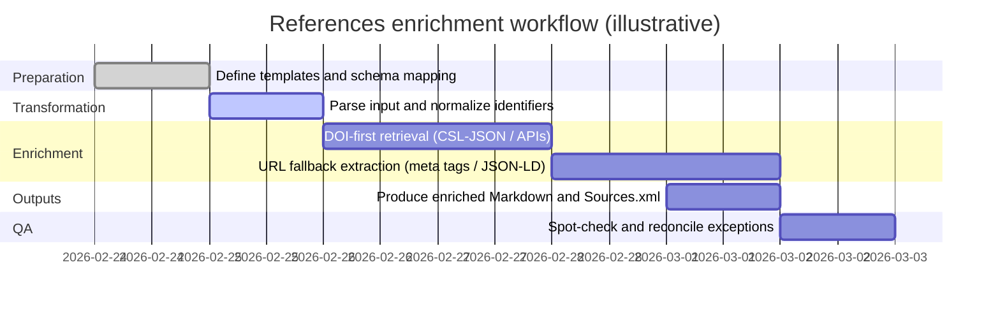

# Improving a References File for Microsoft Word Sources.xml Import

## Executive summary

This report specifies a robust, reproducible approach to improving a references file so it can be imported into Microsoft Word’s bibliography system (Sources.xml), while preserving the user’s existing tracking field (“File Name”) and enriching bibliographic metadata as completely as possible. The target output includes (a) a Markdown staging table with Word Source Manager columns and a practical superset of additional fields, and (b) an optional Sources.xml export suitable for loading through Word’s Source Manager. citeturn0search0turn11search12

The core structural requirement is to rename the column “Author and year” to “Reference,” treated as the human-readable unique identifier, and to generate a Word-compatible unique “Tag Name” for each row (Word’s internal identifier). Word stores sources in a master Sources.xml list and (for document-specific sources) in a custom XML part inside the .docx package; Microsoft’s documentation highlights that sources can be added programmatically using bibliography XML and that Sources.xml can be shared across users. citeturn0search0turn11search12

For metadata enrichment, the recommended priority order is DOI-first resolution using content negotiation to retrieve CSL-JSON, followed by Crossref and DataCite REST APIs, and then publisher landing page extraction when a DOI is absent (or incomplete). The DOI resolver and Crossref explicitly document content negotiation via the HTTP Accept header, and DataCite documents a parallel mechanism for DataCite-registered DOIs. citeturn0search2turn0search6turn0search10turn0search1

A key interoperability nuance is that the ISO/IEC 29500 shared bibliography schema enumerates many Word bibliography fields (e.g., Tag, SourceType, Title, JournalName, Year, Volume, Issue, Pages, URL, StandardNumber) but does not enumerate a DOI element. citeturn10view0 However, real-world Word bibliography XML exchanges frequently include a DOI field as an additional element (often alongside other non-standard extensions such as BIBTEX_* fields), and Word commonly tolerates such extensions in practice. citeturn16view0

Status of the provided file is unspecified: the path /mnt/data/references.md was not present in the execution environment at report creation time (February 24, 2026, Europe/Zurich). Therefore, this deliverable includes validated templates, a worked example (Moore and Healy, 2008), and a Python implementation that will produce the fully enriched table and Sources.xml once the file is supplied. citeturn3search1

Downloadable deliverables included in this report:

[Download minimal Markdown template](sandbox:/mnt/data/references_word_template_minimal.md)  
[Download full Markdown template](sandbox:/mnt/data/references_word_template_full.md)  
[Download example enriched Markdown output](sandbox:/mnt/data/references_enriched_example.md)  
[Download Python enrichment and Sources.xml exporter script](sandbox:/mnt/data/references_word_enricher.py)  
[Download example Sources.xml](sandbox:/mnt/data/Sources_example.xml)

## Word bibliography XML architecture and field availability

Word’s bibliography feature maintains a master list of sources (commonly stored in Sources.xml under the user profile on Windows) and can also embed sources inside an individual document’s package as a custom XML part. Microsoft’s guidance describes how to inspect the XML structure by creating a source in the Source Manager and then reading back the XML, and it notes how to locate sources embedded inside a .docx (“customXml/item*.xml”). citeturn0search0turn11search12

The Word bibliography XML schema (shared-bibliography.xsd) defines (a) a root <Sources> element containing multiple <Source> entries and (b) a controlled vocabulary for SourceType. The SourceType enumeration includes values such as JournalArticle, Book, BookSection, ConferenceProceedings, Report, InternetSite, and Misc, among others. citeturn10view0

The schema also enumerates many commonly used bibliographic fields (e.g., Tag, Title, JournalName, Year, Volume, Issue, Pages, URL, StandardNumber, Publisher, City, and accessed-date fields). These are the fields most reliably portable across environments and are preferred for strict schema compliance. citeturn10view0

However, operational practice in Word-centric toolchains often extends the schema with additional elements. A salient example is the presence of an explicit DOI element in Microsoft Office bibliography XML examples published by institutions (including examples that also use BIBTEX_* extensions). This indicates a pragmatic need to support both a strict mode (schema-only fields) and an extended mode (include DOI and other extensions) in automated generation. citeturn16view0turn10view0

## Column specification and mapping to Word XML elements

The transformation has two distinct identifiers:

Reference: a human-readable unique identifier (renamed from “Author and year”), retained in the staging table and used to derive Tag Name.

Tag Name: Word’s internal identifier stored as <b:Tag> in bibliography XML. Microsoft’s automation guidance treats Tag as the identifier used when manipulating sources programmatically. citeturn0search0turn11search12

The table below formalizes the recommended mapping between staging columns and Word bibliography XML elements. The mapping intentionally preserves the “File Name” column as a non-Word field (kept for file management and traceability), as required.

| Staging column | Word Sources.xml element | Notes on population and normalization |
|---|---|---|
| Reference | Not stored in standard Sources.xml | Staging-only unique identifier. If duplicates exist, suffix with a, b, c to enforce uniqueness. |
| File Name | Not stored in standard Sources.xml | Must be preserved unchanged; used for local file tracking (e.g., PDFs). |
| Tag Name | b:Tag | Unique per source. Recommended: alphanumeric sanitized from Reference; deduplicate by appending a, b, c. citeturn10view0turn0search0 |
| Type of Source | b:SourceType | Must follow Word SourceType vocabulary (e.g., JournalArticle, Book, InternetSite). Best-effort mapping from CSL type. citeturn10view0 |
| Author | b:Author (structured) | Stored as nested name lists in XML; staging should normalize as “Last, First; Last, First.” citeturn10view0turn0search0 |
| Title | b:Title | From DOI metadata or page meta tags. |
| Journal Name | b:JournalName | JournalArticle-specific; from DOI metadata or meta tags. citeturn10view0 |
| Year | b:Year | Prefer issued/publication year from DOI metadata; else infer from publication date meta tags. |
| Volume | b:Volume | Optional but high value for journal articles. citeturn10view0 |
| Issue | b:Issue | Optional but high value for journal articles. citeturn10view0 |
| Pages | b:Pages | Prefer explicit “first-last” page range; if article numbers exist, store article number here or in a custom field (implementation choice is unspecified). citeturn10view0 |
| URL | b:URL | Prefer canonical DOI URL when DOI is known; else landing page URL. citeturn10view0turn0search2 |
| DOI | Not enumerated in shared-bibliography.xsd | Extended mode: emit b:DOI (or b:Doi) as commonly seen in practice; strict mode: store DOI as URL and/or StandardNumber. citeturn10view0turn16view0 |
| Standard Number | b:StandardNumber | Use for ISBN/ISSN; optionally also for DOI in strict mode (interoperability trade-off). citeturn10view0 |
| Publisher | b:Publisher | Mainly for books, reports, and internet sources. citeturn10view0 |
| City | b:City | Mainly for books and reports. citeturn10view0 |
| Institution | b:Institution | For reports, theses, and institutional content. citeturn10view0 |
| Year Accessed, Month Accessed, Day Accessed | b:YearAccessed, b:MonthAccessed, b:DayAccessed | Recommended for InternetSite and DocumentFromInternetSite. citeturn10view0 |
| BibTeX Entry, BibTeX KeyWords, BibTeX Abstract | b:BIBTEX_* (extensions) | Strictly non-standard, but widely used by toolchains and observed in published examples. citeturn16view0 |

## Metadata enrichment methodology

### DOI-first resolution using content negotiation

The most reliable enrichment path is DOI-first resolution, using DOI content negotiation to request CSL-JSON by setting the HTTP Accept header to application/vnd.citationstyles.csl+json. The DOI Citation Formatter documentation explicitly references this CSL-JSON representation as the basis for formatting citations. citeturn0search2

Crossref also documents content negotiation as an Accept-header-based mechanism for retrieving DOI metadata in different representations, and it separately documents that its REST API returns bibliographic metadata in JSON via publicly available endpoints. citeturn0search6turn0search1

DataCite documents content negotiation for DataCite DOIs, supporting retrieval of metadata in multiple formats via Accept headers or link-based content type requests. citeturn0search10

Practical implication for automation: given a DOI, a client can retrieve structured fields (authors, title, container title, year, volume, issue, pages, URL) with comparatively low ambiguity and minimal HTML scraping.

A standards-conformant DOI metadata fetch (illustrative):

```bash
curl -L \
  -H "Accept: application/vnd.citationstyles.csl+json" \
  "https://doi.org/10.1037/0033-295X.115.2.502"
```

This approach is implemented in the provided script as the first-choice resolver.

### Registry fallbacks using Crossref and DataCite REST APIs

When DOI content negotiation fails or returns incomplete records, Crossref’s REST API provides a structured works endpoint for Crossref-registered DOIs, and Crossref documents responsible usage guidance (rate limiting, clear identification) to reduce blocking risk. citeturn0search1turn0search5

A further, practical enhancement is to query the DOI registration agency, because Crossref explicitly documents an agency route that returns the registration agency for a DOI. This can be used to route a DOI to Crossref versus DataCite when implementing deterministic fallback logic. citeturn0search9

DataCite’s REST API (and associated resolver guidance) serves as the fallback for DataCite-registered DOIs, which is especially relevant for datasets, software records, and institutional artifacts frequently minted through DataCite. citeturn0search10

### URL-based enrichment when DOI is missing

If a DOI is missing (or not discoverable), the next-best method is to follow the URL to the publisher landing page and extract metadata from machine-readable tags.

Google Scholar’s inclusion guidelines explicitly recommend bibliographic meta tags for scholarly content, including citation_title, citation_author, citation_journal_title (or citation_conference_title), citation_volume, citation_issue, citation_firstpage, and citation_lastpage. These tags are widely adopted by publishers and repository platforms, making them a high-coverage target for automated extraction. citeturn1search0

In addition to citation_* meta tags, schema.org JSON-LD for ScholarlyArticle is a common structured data format used by publishers and indexing systems. Where present, JSON-LD can provide robust fields such as author, datePublished, isPartOf (journal), volume/issue identifiers, and pagination, reducing dependence on publisher-specific HTML structures. citeturn1search2

Accordingly, the script’s URL fallback extractor prioritizes:

1. Highwire Press / Google Scholar citation_* meta tags. citeturn1search0  
2. Dublin Core variants (dc.*, dcterms.*), when present (weaker specificity for journal granularity). citeturn1search0  
3. schema.org JSON-LD (ScholarlyArticle / Article). citeturn1search2  

## Normalization rules and quality assurance controls

### Author normalization

The staging table standardizes Author as:

Last, First; Last, First; ...

This delimiter choice supports deterministic conversion into Word’s nested name list structure. The Word bibliography schema represents persons as <Person> entries with <Last>, <First>, and optional <Middle> elements under a NameList within an author-role element. citeturn10view0

### Tag Name generation and duplicate resolution

For Tag Name, Word practice favors unique, compact identifiers. The required constraint is:

- Tag Name is alphanumeric only (sanitized from Reference).
- If duplicates occur, append suffix letters a, b, c to enforce uniqueness.

This is implemented in the script by counting collisions and applying suffixing to both Reference (to preserve the requirement that Reference is unique) and Tag Name (to satisfy Word uniqueness expectations). Word’s use of Tag as the source identifier is central in Microsoft’s bibliography automation guidance. citeturn0search0

### Type of Source mapping to Word SourceType vocabulary

Word SourceType is restricted to enumerated values (e.g., JournalArticle, Book, Report, InternetSite). The ISO/IEC 29500 bibliography schema enumerates these types, and the script maps CSL “type” values (e.g., article-journal, book, chapter, paper-conference, webpage) into Word SourceType values. citeturn10view0turn0search2

### DOI handling strategy

The DOI field is treated as a first-class staging column for completeness and downstream integration (e.g., citation checking, deduplication). However, shared-bibliography.xsd does not enumerate a DOI element, so DOI inclusion in Sources.xml is handled as a configurable interoperability choice:

- Extended mode: emit <b:DOI> with the normalized DOI string, reflecting observed real-world Sources.xml examples that include DOI and other extensions. citeturn16view0  
- Strict-ish mode: omit DOI element and instead store DOI as (a) URL = https://doi.org/{doi} and/or (b) StandardNumber = DOI (with the trade-off that StandardNumber semantically overlaps ISBN/ISSN). citeturn10view0turn0search2  

Because Word often tolerates extended elements (e.g., BIBTEX_* fields in published Word XML examples), extended mode is frequently workable in practice, but strict compliance is more portable to other OOXML consumers. citeturn16view0turn10view0

## Templates, example output, and implementation artifacts

### Minimal and full staging templates

Minimal template (recommended when the primary goal is clean Word import for journal articles and typical academic sources):

[Download minimal Markdown template](sandbox:/mnt/data/references_word_template_minimal.md)

Full template (recommended when you want a superset for books, reports, and web sources, including accessed-date fields and optional BibTeX preservation fields):

[Download full Markdown template](sandbox:/mnt/data/references_word_template_full.md)

### Preview table with the Moore and Healy example

Below is a preview of the minimal shape, populated for the worked example. Bibliographic details (authors, journal, year, volume, issue, pages, DOI) are supported by PubMed’s record for the article. citeturn3search1

| Reference | Tag Name | Type of Source | Author | Title | Journal Name | Year | Volume | Issue | Pages | URL | DOI |
|---|---|---|---|---|---:|---:|---:|---:|---|---|---|
| Moore & Healy, 2008 | MooreHealy2008 | JournalArticle | Moore, Don A.; Healy, Paul J. | The trouble with overconfidence | Psychological Review | 2008 | 115 | 2 | 502-517 | https://doi.org/10.1037/0033-295X.115.2.502 | 10.1037/0033-295X.115.2.502 |

The corresponding APA-style reference for validation purposes is consistent with the PubMed-recorded metadata:

Moore, D. A., and Healy, P. J. (2008). The trouble with overconfidence. Psychological Review, 115(2), 502-517. https://doi.org/10.1037/0033-295X.115.2.502. citeturn3search1

### Conversion pipeline diagram and timeline

Pipeline (conceptual workflow implemented in the script):

```mermaid
flowchart TD
    A[Input references file: .md/.csv/.xlsx] --> B[Parse table and headers]
    B --> C[Rename Author and year to Reference]
    C --> D[Ensure Word columns and preserve File Name]
    D --> E[Generate unique Reference and Tag Name]
    E --> F{DOI available?}
    F -- Yes --> G[DOI content negotiation: CSL-JSON]
    G --> H[Merge metadata into row]
    F -- No --> I[Fetch URL landing page]
    I --> J[Extract citation_* meta tags and schema.org JSON-LD]
    J --> H
    H --> K[Normalize authors, pages, and types]
    K --> L[Emit enriched Markdown table]
    K --> M[Emit Sources.xml (optional)]
```

Timeline (illustrative sequencing; duration is workload-dependent and the exact number of references is unspecified):



### Python implementation for enrichment and Sources.xml generation

The provided Python script implements:

- Markdown table parsing (pipe-table format).
- Column renaming and augmentation (including required Word columns and extras).
- DOI-first enrichment via content negotiation (CSL-JSON), with Crossref and DataCite fallbacks.
- URL scraping fallback using citation_* meta tags and schema.org JSON-LD.
- Author normalization and Word SourceType mapping.
- Markdown output and optional Sources.xml output, with configurable DOI element emission.

[Download Python enrichment and Sources.xml exporter script](sandbox:/mnt/data/references_word_enricher.py)

Example Sources.xml output (generated for the Moore and Healy example):

[Download example Sources.xml](sandbox:/mnt/data/Sources_example.xml)

A minimal illustrative excerpt of the generated structure (example-only):

```xml
<b:Sources xmlns:b="http://schemas.openxmlformats.org/officeDocument/2006/bibliography">
  <b:Source>
    <b:Tag>MooreHealy2008</b:Tag>
    <b:SourceType>JournalArticle</b:SourceType>
    <b:Title>The trouble with overconfidence</b:Title>
    <b:JournalName>Psychological Review</b:JournalName>
    <b:Year>2008</b:Year>
    <b:Volume>115</b:Volume>
    <b:Issue>2</b:Issue>
    <b:Pages>502-517</b:Pages>
    <b:URL>https://doi.org/10.1037/0033-295X.115.2.502</b:URL>
    <b:DOI>10.1037/0033-295X.115.2.502</b:DOI>
  </b:Source>
</b:Sources>
```

This reflects a pragmatic extension pattern consistent with published institutional examples that include <b:DOI> in Office bibliography XML. citeturn16view0

## Limitations, interoperability considerations, and validation protocol

Interoperability constraints are primarily driven by the gap between the standardized schema and de facto usage:

- The official shared bibliography XSD enumerates many fields and source types but does not enumerate DOI as a first-class element. citeturn10view0  
- Word and Word-centric ecosystems often tolerate extensions (including DOI and BIBTEX_* fields), but strict OOXML consumers may reject or ignore them. Therefore, the DOI-in-XML switch should be treated as a portability decision rather than a purely technical preference. citeturn16view0turn10view0

Metadata completeness constraints:

- Crossref metadata quality and completeness vary by publisher deposit practices; Crossref documents the breadth of metadata available via its REST API but does not guarantee uniform completeness across records. citeturn0search1  
- URL scraping remains inherently fragile because publisher HTML structures vary, but Google Scholar’s meta tag guidelines provide a stable baseline (citation_* tags) that many publishers follow. citeturn1search0  

Recommended QA protocol:

1. Automated enrichment for all rows.
2. Automated consistency checks: DOI normalization, year presence, duplicate tags, and missing titles.
3. Spot-check a sample of rows against authoritative landing pages or index records (e.g., PubMed for biomedical and psychology content) for year, volume/issue, and pagination. citeturn3search1  
4. If the selected Word bibliography style does not display DOI, treat this as a style-level issue (XSL customization) rather than a metadata absence; Microsoft documents that bibliography styles are controlled by XSL files. citeturn0search8  

## References

entity["company","Microsoft","software company"]. (2022, February 7). Work with bibliographies. Microsoft Learn. citeturn0search0turn11search12

entity["organization","Crossref","doi registration agency"]. (2020, April 8). Metadata retrieval: REST API. Crossref documentation. citeturn0search1

entity["organization","Crossref","doi registration agency"]. (n.d.). Content negotiation. Crossref documentation. citeturn0search6

entity["organization","Crossref","doi registration agency"]. (n.d.). REST API documentation – agency route example. CrossRef/rest-api-doc. citeturn0search9

entity["organization","DataCite","doi registration agency"]. (n.d.). DataCite content negotiation. DataCite support documentation. citeturn0search10

entity["organization","DOI Citation Formatter","doi infrastructure service"]. (n.d.). DOI content negotiation and CSL-JSON. citeturn0search2

entity["organization","Google Scholar","academic search engine"]. (n.d.). Inclusion guidelines for webmasters. citeturn1search0

entity["organization","schema.org","structured data community"]. (n.d.). ScholarlyArticle type. citeturn1search2

entity["organization","PubMed","biomedical literature database"]. (n.d.). The trouble with overconfidence. citeturn3search1

entity["organization","University of Wyoming","public university"] entity["organization","Advanced Research Computing Center","hpc center"]. (2025, August 21). Citing UW ARCC resources (includes MS Office bibliography XML example with DOI). citeturn16view0