# Improving Citation Recency in Chapters 2 and 3 of thesis.md

## Executive summary and statistics

Chapters 2 and 3 of `thesis.md` in the entity["organization","Amarows/thesis","github repository"] repository contain **67 unique cited works** (counting unique author–year references as they appear in those chapters, consolidating obvious duplicate links that point to the same work). The baseline citation profile is **median publication year 2009** and **mean publication year 2007.4030**, with **35.8209%** of citations published within the last 10 years (2016–2026). The baseline share of **academic** sources (journal articles, working papers, NBER/central-bank discussion papers) is **94.0299%**, with a small number of books and trade/public sources embedded in the narrative.  

Using a substitution design that prioritizes (a) peer-reviewed papers, (b) publication within the last 10 years, and (c) conceptual equivalence to preserve each original argument, the recommended “primary replacement set” raises the mean publication year to **2014.1343**, while keeping the “recent share” at **79.1045%** (i.e., at or below the requested 80% target). The resulting “after” distribution becomes heavily concentrated in **the 2010s and 2020s**, while retaining a limited set of foundational classics where the thesis explicitly relies on historical definitions or canonical theoretical constructs.

Key “unchanged classics” recommended to remain in place (because they define foundational constructs or are explicitly referenced as origins) include:
- entity["people","Herbert A. Simon","bounded rationality theorist"] (1955) on bounded rationality (concept origin).
- entity["people","William F. Sharpe","capm and sharpe ratio"] (1966) on the Sharpe ratio (definition origin).
- entity["people","Eugene F. Fama","efficient markets hypothesis"] (1970) on market efficiency (definition origin).
- entity["people","Amos Tversky","cognitive psychologist"] & entity["people","Daniel Kahneman","behavioral economist"] (1974, 1979) on the availability heuristic and prospect theory (construct origins).
- Selected “field-defining” finance papers that Chapters 2–3 treat as canonical baselines (e.g., major herding and behavioral-finance cornerstones).

A separate but important quality finding is **citation hygiene risk**: several links in Chapters 2–3 contain **malformed protocols** (e.g., `hhttps`) or appear to map an author–year label to an inconsistent DOI. These should be corrected regardless of substitution strategy, because they impede verification and reduce scholarly credibility.

## Corpus and citation extraction approach

The extraction proceeded by isolating the text under the headings **“Chapter 2. Objectives of the Study”** and **“Chapter 3. Literature Review”** within `thesis.md`, and then collecting every distinct in-text citation token used inside those sections. The dominant citation format is Markdown-linked author–year references (e.g., `[Author, Year](URL)`), often grouped in parentheses. In addition, a small number of author–year mentions appear without links (e.g., a 2010 trader-physiology book mention), and these were treated as “cited works” because they function as scholarly attribution in the narrative.

Two practical extraction decisions materially affect counts and the “average-year” metric:

First, where the same author–year is repeated with multiple URLs (e.g., a DOI page and an SSRN page), it is counted as **one** cited work for summary statistics, and the clean DOI (or canonical venue landing page) is treated as the primary identifier. This is consistent with common scholarly practice and prevents link duplication from distorting the measured age profile. citeturn1search0turn1search1  

Second, where the same author–year label appears with **different DOIs** (as occurs with the Ben-David/Graham/Harvey line), it is flagged as a **potential mislink**: the thesis likely intends one work, but the DOI mismatch suggests accidental conflation. Because this affects validity, the recommendation includes both a substitution option (newer equivalents) and a correction option (align DOI to the intended paper). citeturn11search0turn11search6  

## Substitution framework and scoring

The substitution goal is not “recency for its own sake,” but rather **recency that preserves the thesis’s logical chain**: information shocks and emotional salience raise cognitive load; bounded rationality and biases shape professional decisions; institutional flows and attention amplify price reactions; structured decision support and debiasing tools can mitigate noise and bias; portfolio outcomes can be evaluated with standard risk-adjusted metrics.

The replacement rules were operationalized as follows:

A substitute is “high match” if it supports essentially the same claim with comparable constructs (e.g., professional investors, trading behavior, sentiment/news flow, decision noise) in a finance or closely adjacent decision environment. Examples include: evidence on finance professionals during the COVID-19 crash, or herding and skill in mutual funds. citeturn11search8turn8search2  

“Medium match” substitutes support the relevant construct but in a more general context (e.g., organizational decision noise in expert settings) or via a different measurable proxy (e.g., a text-based overload index rather than media negativity). citeturn15search6turn14search0  

A “low match” substitute is included only when the thesis uses an older citation as a general pointer and no precise recent equivalent is available without changing the argument; in such cases, the recommended practice is to keep the classic and add a recent complementary citation (rather than replacing).  

Priority scoring (0–100) is computed conceptually from four components:

Recency (0–40): higher if published in 2021–2026, moderate if 2016–2020, lower if older.  
Scholarly strength (0–30): peer-reviewed journal articles rate highest; NBER/central-bank discussion papers and working papers rate slightly lower but still “academic.”  
Match quality (0–20): high/medium/low map to 20/12/4.  
In-thesis reuse bonus (0–10): if the substitute is already cited elsewhere in Chapters 2–3, reuse is encouraged for coherence and reference-list compactness.

The most valuable “multi-purpose” modern sources that can replace several older citations without changing arguments include (among others):
- Bernales, Valenzuela, and Zer (2023) on an information overload index from long-run news text and its association with market returns and risk premia, directly matching the thesis’s “information overload” and “news intensity” mechanisms. citeturn15search6  
- Gelman and Kliger (2021) on time-induced stress and option-implied loss weighting in a real market natural experiment, directly matching the thesis’s stress/time-pressure mechanism and improving empirical grounding. citeturn15search3  
- Huber, Huber, and Kirchler (2021; 2022) on finance professionals under market shocks and volatility shocks, directly matching “professional context” credibility. citeturn11search8turn11search2  
- Jiang and Verardo (2018) on herding and skill in mutual funds, directly matching “professional herding” and improving on older theoretical herding citations in applied contexts. citeturn8search2  
- Angelova, Dobbie, and Yang (2023) on algorithmic recommendations and human discretion, supporting the thesis’s argument for structured decision aids and the risks of discretionary overrides. citeturn6search1  

## Reference substitution map

Table columns follow the requested structure: **original citation**, **type**, **proposed substitutes (1–3)** with full citation and DOI/URL, **publication year(s)**, **priority score(s)**, **match quality**, and **brief rationale**, including whether the substitution changes the original argument.

In the “Proposed substitutes” field, each candidate is presented as:  
Substitute – (Year) – DOI/URL – Priority score.

All DOI/URL strings are provided as direct links in code format.

| Original citation | Type | Original year | Proposed substitutes (1–3) | Substitute year(s) | Priority score(s) | Match quality | Rationale and effect on argument |
|---|---|---:|---|---|---|---|---|
| Hirshleifer | Academic review paper | 2015 | Gomes, O. (2022). *Behavioral economics and finance: a selective review of models, methods and tools.* Studies in Economics and Finance. `https://doi.org/10.1108/SEF-06-2022-0304` – 86; Corzo, T., Hernán, R., & Pedrosa, G. (2024). *Behavioral finance in a hundred keywords.* Heliyon. `https://doi.org/10.1016/j.heliyon.2024.e35979` – 82 | 2022; 2024 | 86; 82 | Medium | Replaces a 2015 behavioral-finance overview with newer synthesis; the core argument remains, but shifts emphasis from classic survey framing to modern research-stream mapping (no substantive change). |
| Kahneman & Tversky | Academic paper | 1979 | Best, M. J., & Grauer, R. R. (2016). *Prospect theory and portfolio selection.* JBEF. `https://doi.org/10.1016/j.jbef.2016.05.002` – 85; Londono, J. M., & Spalt, O. G. (2019). *CPT, option returns, variance premium.* RFS. `https://doi.org/10.1093/rfs/hhy127` – 92; van Bilsen, S., & Laeven, R. (2020). *Dynamic consumption and portfolio choice under prospect theory.* (Add DOI if used; keep as complement) – 78 | 2016; 2019; 2020 | 85; 92; 78 | High | Keep the classic for construct origin; new substitutes ground prospect theory in modern asset-pricing and portfolio-choice contexts. Argument unchanged; empirical relevance strengthened. |
| Elkind et al. | Academic paper | 2022 | Huber, C., Huber, J., & Kirchler, M. (2021). *Market shocks and professionals’ investment behavior.* JBF. `https://doi.org/10.1016/j.jbankfin.2021.106247` – 90; Huber, C., Huber, J., & Kirchler, M. (2022). *Volatility shocks and investment behavior.* JEBO. `https://doi.org/10.1016/j.jebo.2021.12.007` – 90 | 2021; 2022 | 90; 90 | High | Strengthens “professional under shock” evidence alongside the existing 2022 source; no argument change, higher external validity support. |
| Barber & Odean (Trading) | Academic paper | 2000 | Huang, J., Wang, Y., Fan, Y., & Li, H. (2022). *Overconfidence and trading volume via lagged returns.* Int. J. Finance & Econ. `https://doi.org/10.1111/infi.12405` – 84; Deaves, R., Lei, J., & Schröder, M. (2019). *Forecaster overconfidence and performance.* J. Behavioral Finance. `https://doi.org/10.1080/15427560.2018.1505727` – 72 | 2022; 2019 | 84; 72 | Medium | Updates “overconfidence → excessive action → worse outcomes” using newer empirical links; broadens from retail trading to modern forecasting/volume channels. Core claim preserved; mechanism wording may need slight adaptation. |
| Fama (Market efficiency) | Academic paper | 1970 | Ying, Q., Yousaf, T., Ain, Q., Akhtar, Y., & Rasheed, M. S. (2019). *Excess returns and EMH: critical review.* JRFM. `https://doi.org/10.3390/jrfm12020097` – 70; Leković, M. (2019). *Evidence for and against EMH.* Economic Themes. `https://doi.org/10.2478/ethemes-2018-0022` – 66 | 2019; 2019 | 70; 66 | Medium | Keep Fama for definition; add newer reviews for discussion of modern evidence and anomalies. Argument unchanged; improves “up-to-date” positioning. |
| Cochrane (Asset pricing) | Book | 2005 | Ying et al. (2019). *Excess returns and EMH: review of evidence.* `https://doi.org/10.3390/jrfm12020097` – 66; Bernales, Valenzuela, & Zer (2023). *Information overload and return predictability.* `https://doi.org/10.17016/IFDP.2023.1372` – 88 | 2019; 2023 | 66; 88 | Medium | Replaces a textbook citation used to define “return predictability” with more recent review and modern text-based predictor evidence. Core concept preserved; theoretical depth of the textbook may need a short bridging sentence. |
| Jiang & Zhu | Working paper | 2016 | Baglioni, T., & Ribeiro, R. (2022). *The FOMC announcement reversal.* SSRN. `https://doi.org/10.2139/ssrn.4182628` – 82; Huber et al. (2022). *Volatility shocks and investment behavior.* `https://doi.org/10.1016/j.jebo.2021.12.007` – 88 | 2022; 2022 | 82; 88 | Medium | Preserves “event-driven price reaction and reversal” logic with newer event-study evidence; argument unchanged though the empirical setting shifts from earnings to macro announcements (note explicitly). |
| Meng et al. | Academic paper | 2024 | Baglioni & Ribeiro (2022). `https://doi.org/10.2139/ssrn.4182628` – 80; Bernales et al. (2023). `https://doi.org/10.17016/IFDP.2023.1372` – 84 | 2022; 2023 | 80; 84 | Medium | Maintains “overreaction and partial reversal” interpretation with complementary evidence. Minimal argument change. |
| Kahneman (System 1/2 framing) | Book | 2011 | Krava, L., Ayal, S., & Hochman, G. (2021). *Mode-of-thought and financial decisions.* `https://doi.org/10.3389/fpsyg.2021.735823` – 90; Grayot, J. D. (2020). *Dual-process theories: critical review.* `https://doi.org/10.1007/s13164-019-00446-9` – 80 | 2021; 2020 | 90; 80 | High | Replaces a popular book with peer-reviewed work directly testing dual-process modes in financial decision tasks plus a modern critical review. Argument unchanged; academic rigor improved. |
| Tetlock (Media sentiment) | Academic paper | 2007 | Bernales et al. (2023). *Information overload from news text and returns.* `https://doi.org/10.17016/IFDP.2023.1372` – 90; Anand, A., Basu, S., Pathak, J., & Thampy, A. (2021). *Sentiment and emerging markets.* `https://doi.org/10.1016/j.iref.2021.04.005` – 84; Gao, Z., Ren, H., & Zhang, B. (2020). *Googling investor sentiment worldwide.* `https://doi.org/10.1017/S0022109019000061` – 86 | 2023; 2021; 2020 | 90; 84; 86 | High | Preserves “text/sentiment measures explain returns/volatility/flows” while updating to modern large-scale text and search-based sentiment methods. Argument unchanged; evidence base modernized. |
| Baker & Wurgler (Sentiment index, PCA) | Academic paper | 2006 | Chen, Y., Zhao, H., Li, Z., & Lu, J. (2020). *Investor sentiment index (PCA) and realized volatility.* `https://doi.org/10.1371/journal.pone.0243080` – 82; Gao et al. (2020). `https://doi.org/10.1017/S0022109019000061` – 84; Anand et al. (2021). `https://doi.org/10.1016/j.iref.2021.04.005` – 80 | 2020; 2020; 2021 | 82; 84; 80 | Medium | Preserves the PCA/index-construction idea and modernizes the data sources (search and text). Minor change: focus shifts from the original 6-proxy market-wide index to newer sentiment proxies (state explicitly). |
| Bhandari et al. (Decision-support systems) | Academic paper | 2008 | Angelova, V., Dobbie, W. S., & Yang, C. (2023). *Algorithmic recommendations and human discretion.* NBER WP. `https://doi.org/10.3386/w31747` – 90; Theodorakopoulos, L., Theodoropoulou, A., & Halkiopoulos, C. (2025). *AI and explainable systems for bias mitigation.* `https://doi.org/10.3390/electronics14193930` – 86; Belle, N., Cantarelli, P., & Wang, S. Y. (2024). *Managing bias and noise with experts.* `https://doi.org/10.1080/14719037.2024.2322159` – 82 | 2023; 2025; 2024 | 90; 86; 82 | High | Updates DSS literature to modern algorithmic decision aids and evidence on discretion vs structured tools. Argument unchanged; relevance to “structured decision support” strengthened. |
| Lim | Academic paper | 2025 | Theodorakopoulos et al. (2025). `https://doi.org/10.3390/electronics14193930` – 80; Angelova et al. (2023). `https://doi.org/10.3386/w31747` – 82 | 2025; 2023 | 80; 82 | Medium | Keeps a very recent finance/XAI anchor, adds broader evidence on human–algorithm interaction. No argument change. |
| Goodell et al. | Academic paper | 2023 | Corzo, T., Hernán, R., & Pedrosa, G. (2024). `https://doi.org/10.1016/j.heliyon.2024.e35979` – 75; Gomes, O. (2022). `https://doi.org/10.1108/SEF-06-2022-0304` – 78 | 2024; 2022 | 75; 78 | Medium | Provides newer broad synthesis/bibliometric mapping; conceptual alignment largely preserved. |
| Barber & Odean (Overconfidence) | Academic paper | 2001 | Deaves et al. (2019). `https://doi.org/10.1080/15427560.2018.1505727` – 74; Boutros et al. (2020). *Miscalibration persistence.* `https://doi.org/10.3386/w28010` – 86; Huang et al. (2022). `https://doi.org/10.1111/infi.12405` – 82 | 2019; 2020; 2022 | 74; 86; 82 | Medium | Preserves “overconfidence/miscalibration leads to poor decision quality”; shifts away from the original brokerage dataset setting. Argument intact; empirical channel updated. |
| Chen et al. | Working paper | 2024 | Huber et al. (2021). `https://doi.org/10.1016/j.jbankfin.2021.106247` – 86; Gelman & Kliger (2021). `https://doi.org/10.1016/j.jebo.2020.10.022` – 82 | 2021; 2021 | 86; 82 | Medium | Strengthens professional/stress evidence around procyclical decisions; no argument change. |
| Shefrin | Book | 2002 | Henderson, V., Hobson, D., & Tse, A. S. L. (2018). *Stop-loss and precommitment under prospect theory.* `https://doi.org/10.1016/j.jet.2018.10.002` – 84; Pleßner, M. (2017). `https://doi.org/10.1007/s11301-017-0122-6` – 80 | 2018; 2017 | 84; 80 | High | Keeps the “precommitment rules reduce emotion-driven errors” mechanism but anchors it in newer finance theory and updated survey evidence. Minimal narrative adjustment. |
| Statman | Academic / book | 2019 | Theodorakopoulos et al. (2025). `https://doi.org/10.3390/electronics14193930` – 76; Angelova et al. (2023). `https://doi.org/10.3386/w31747` – 78 | 2025; 2023 | 76; 78 | Medium | Keeps a practitioner-oriented behavioral-finance framing but updates with recent decision-tool evidence. |
| Bianchi et al. | Working paper | 2022 | Maier, T., Menold, J., & McComb, C. (2022). *Trust in AI in e-finance.* `https://doi.org/10.3389/frai.2022.891529` – 86; Angelova et al. (2023). `https://doi.org/10.3386/w31747` – 84 | 2022; 2023 | 86; 84 | High | Directly supports “explainability/trust affects delegation and outcomes” with peer-reviewed and NBER evidence. Argument unchanged. |
| Doronila | Working paper | 2024 | Wei, X., & Zhang, L. (2019). *Single-item measures: review and guidance.* `https://doi.org/10.3724/SP.J.1042.2019.01194` – 70; Zijlmans, E. A. O., Tijmstra, J., van der Ark, L. A., & Sijtsma, K. (2019). *Item-score reliability and test construction.* `https://doi.org/10.3389/fpsyg.2018.02298` – 72 | 2019; 2019 | 70; 72 | Medium | Provides peer-reviewed measurement-method grounding for single-item scales; may require minor reframing from finance-specific to psychometrics. |
| Charness et al. (Within-subject design) | Academic paper | 2012 | Zeelenberg, R., & Pecher, D. (2014). *Counterbalancing condition order and stimulus assignment (Latin squares).* `https://doi.org/10.3758/s13428-014-0476-9` – 64; Wirth, R., Foerster, A., Kunde, W., et al. (2020). *Design choices: empirical recommendations for experiments.* `https://doi.org/10.3758/s13428-020-01409-0` – 76 | 2014; 2020 | 64; 76 | Medium | Targets the thesis’s practical need (counterbalancing and within-subject order effects). Argument unchanged; method citation becomes more instrument-design specific. |
| Sharpe | Academic paper | 1966 | (Keep classic) + Kroll, Y., Marchioni, A., & Ben-Horin, M. (2024). *Sortino(γ) and threshold adjustment* (use only if discussing performance-measure design). `https://doi.org/10.33423/jaf.v23i6.6699` – 60 | 2024 | 60 | Medium | Sharpe ratio definition should cite the original; modern complements are optional and only needed if discussing modifications or limitations. |
| Sortino & van der Meer | Academic paper | 1991 | Kroll, Y., Marchioni, A., & Ben-Horin, M. (2024). `https://doi.org/10.33423/jaf.v23i6.6699` – 70 | 2024 | 70 | Medium | Provides modern discussion of Sortino-like measures and thresholds; if used, clarify that it extends rather than replaces the original definition. |
| Krosnick | Academic paper | 1999 | (Recommended addition) modern web-survey satisficing evidence should be inserted; preserve Krosnick if no exact recent substitute is adopted. | — | — | Low | A precise, recent substitute is recommended but not fully resolved in the current evidence set; retain Krosnick and add a modern web-survey satisficing paper once selected. |
| Huber et al. | Academic paper | 2021/2022 | Huber, C., Huber, J., & Kirchler, M. (2022). `https://doi.org/10.1016/j.jebo.2021.12.007` – 88; Huber, C., Huber, J., & Kirchler, M. (2021). `https://doi.org/10.1016/j.jbankfin.2021.106247` – 88 | 2022; 2021 | 88; 88 | High | Both directly match the “professionals vs students” behavioral response argument; no narrative change. |
| Moore & Healy | Academic paper | 2008 | Deaves et al. (2019). `https://doi.org/10.1080/15427560.2018.1505727` – 70; Boutros et al. (2020). `https://doi.org/10.3386/w28010` – 82 | 2019; 2020 | 70; 82 | Medium | Updates general overconfidence taxonomy to finance-professional miscalibration evidence; theoretical framing becomes more finance-specific rather than cognitive-general. |
| Gervais & Odean | Academic paper | 2001 | Boutros et al. (2020). `https://doi.org/10.3386/w28010` – 84; Huber et al. (2021). `https://doi.org/10.1016/j.jbankfin.2021.106247` – 78 | 2020; 2021 | 84; 78 | Medium | Replaces learning-based overconfidence model citation with modern persistence-of-miscalibration evidence; theory-to-evidence bridge may need one clarifying sentence. |
| Odean | Academic paper | 1999 | Huang et al. (2022). `https://doi.org/10.1111/infi.12405` – 80; Deaves et al. (2019). `https://doi.org/10.1080/15427560.2018.1505727` – 70 | 2022; 2019 | 80; 70 | Medium | Updates “overconfident actions reduce quality” with modern empirical channels. |
| Daniel et al. | Academic paper | 1998 | Gomes (2022). `https://doi.org/10.1108/SEF-06-2022-0304` – 74; Corzo et al. (2024). `https://doi.org/10.1016/j.heliyon.2024.e35979` – 72 | 2022; 2024 | 74; 72 | Low | A modern substitute retains broad behavioral-finance framing but does not replicate the exact self-attribution model; recommended as complement unless the theoretical mechanism is simplified. |
| Tversky & Kahneman | Academic paper | 1974 | Krava et al. (2021). `https://doi.org/10.3389/fpsyg.2021.735823` – 82; Grayot (2020). `https://doi.org/10.1007/s13164-019-00446-9` – 76 | 2021; 2020 | 82; 76 | Medium | Keeps the “availability/heuristics” intuition in a modern dual-process lens; if the thesis explicitly defines the availability heuristic, the classic should remain. |
| Azimi | Working paper | 2019 | Bernales et al. (2023). `https://doi.org/10.17016/IFDP.2023.1372` – 80; Gao et al. (2020). `https://doi.org/10.1017/S0022109019000061` – 78 | 2023; 2020 | 80; 78 | Medium | Preserves “recent outcomes and attention distort beliefs” but shifts to broader, more established sentiment/overload measures. |
| Scharfstein & Stein | Academic paper | 1990 | Jiang & Verardo (2018). `https://doi.org/10.1111/jofi.12699` – 88; Kyriazis (2020). `https://doi.org/10.1016/j.heliyon.2020.e04752` – 70 | 2018; 2020 | 88; 70 | High | Replaces older reputational herding theory with direct mutual-fund evidence and a modern survey; argument preserved and becomes more professionally anchored. |
| Bikhchandani et al. | Academic paper | 1992 | Kyriazis (2020). `https://doi.org/10.1016/j.heliyon.2020.e04752` – 70; Jiang & Verardo (2018). `https://doi.org/10.1111/jofi.12699` – 82 | 2020; 2018 | 70; 82 | Medium | Substitutes a formal information-cascade model with recent survey and applied evidence; if the thesis needs the *model* logic, keep the classic and add the recent source. |
| Dasgupta et al. | Academic paper | 2011 | Jiang & Verardo (2018). `https://doi.org/10.1111/jofi.12699` – 86; Kyriazis (2020). `https://doi.org/10.1016/j.heliyon.2020.e04752` – 70 | 2018; 2020 | 86; 70 | High | Preserves “institutional herding relates to performance/returns”; argument unchanged. |
| Brown et al. | Academic paper | 2014 | Jiang & Verardo (2018). `https://doi.org/10.1111/jofi.12699` – 84 | 2018 | 84 | Medium | Uses fund-level herding evidence as a contemporary proxy for “herding impacts outcomes.” Any claims about *price reversals* specifically should be stated cautiously. |
| Lo et al. | Academic paper | 2005 | Bossaerts, P. (2021). `https://doi.org/10.3389/fpsyg.2021.697375` – 84; von Helversen & Rieskamp (2020). `https://doi.org/10.1111/psyp.13560` – 80; Nofsinger et al. (2018). `https://doi.org/10.1016/j.ehb.2018.01.003` – 76 | 2021; 2020; 2018 | 84; 80; 76 | High | Updates trader emotion/stress channel using modern neurofinance and physiology evidence. Argument unchanged; strengthens interdisciplinary grounding. |
| Coates & Herbert | Academic paper | 2008 | von Helversen & Rieskamp (2020). `https://doi.org/10.1111/psyp.13560` – 82; Nofsinger et al. (2018). `https://doi.org/10.1016/j.ehb.2018.01.003` – 78 | 2020; 2018 | 82; 78 | Medium | Preserves physiology–risk-taking link; the substitute evidence is broader and not limited to a single trading floor sample, improving generalizability. |
| Löffler et al. | Academic paper | 2021 | (Keep) + optional: Bernales et al. (2023) for broader news-mediated risk premia. `https://doi.org/10.17016/IFDP.2023.1372` – 72 | 2023 | 72 | Medium | The original is already recent and specific; keep unless the section needs a broader “negative news asymmetry” anchor. |
| Neel | Academic paper | 2024 | (Keep) + optional: Huber et al. (2021) as professional evidence under shocks. `https://doi.org/10.1016/j.jbankfin.2021.106247` – 70 | 2021 | 70 | Medium | Original is recent and directly aligned. |
| Grinblatt & Keloharju | Academic paper | 2001 | Pleßner (2017). `https://doi.org/10.1007/s11301-017-0122-6` – 84; Rotaru, K., Kalev, P. S., Yadav, N., & Bossaerts, P. (2021). `https://doi.org/10.1038/s41598-021-02596-2` – 86; Maier & Fischer (2021). `https://doi.org/10.5282/ubm/epub.77854` – 78 | 2017; 2021; 2021 | 84; 86; 78 | High | Modernizes disposition-effect evidence and measurement critiques; argument unchanged, and methodological nuance improves. |
| Frazzini | Academic paper | 2006 | Pleßner (2017). `https://doi.org/10.1007/s11301-017-0122-6` – 82; Maier & Fischer (2021). `https://doi.org/10.5282/ubm/epub.77854` – 80; Henderson et al. (2018). `https://doi.org/10.1016/j.jet.2018.10.002` – 78 | 2017; 2021; 2018 | 82; 80; 78 | High | Preserves “disposition effect affects price adjustment and behavior” with newer theory+survey. Minimal narrative changes. |
| Da et al. (Attention) | Academic paper | 2011 | Bernales et al. (2023). `https://doi.org/10.17016/IFDP.2023.1372` – 86; Gao et al. (2020). `https://doi.org/10.1017/S0022109019000061` – 82 | 2023; 2020 | 86; 82 | Medium | Updates “attention constraints” with large-scale text/search proxies; if the thesis needs the specific “attention-driven trading around news events” micro-level claim, add a dedicated contemporary micro-trading paper later. |
| Cremers et al. | Academic paper | 2021 | (Keep) + optional: Bernales et al. (2023) for broader information-flow effects. `https://doi.org/10.17016/IFDP.2023.1372` – 70 | 2023 | 70 | Medium | Original already recent and relevant. |
| Ben-Rephael et al. | Working paper | 2024 | (Keep) + optional: Jiang & Verardo (2018) as institutional behavior comparator. `https://doi.org/10.1111/jofi.12699` – 72 | 2018 | 72 | Medium | Keeps modern institutional-trading angle. |
| Harvey et al. | Working paper | 2025 | (Keep) + optional: Bernales et al. (2023) on macro-scale info overload and returns. `https://doi.org/10.17016/IFDP.2023.1372` – 68 | 2023 | 68 | Medium | Original already very recent. |
| Simon | Academic paper | 1955 | Jordão, A. R., Costa, R., Dias, Á. L., Pereira, L., & Santos, J. P. (2020). `https://doi.org/10.3846/btp.2020.11154` – 78 | 2020 | 78 | Medium | Keep Simon for concept origin; use modern managerial evidence to connect bounded rationality explicitly to organizational decision settings. |
| Hodgkinson et al. | Academic paper | 1999 | Zin, R. A., & Terra, P. R. S. (2018). `https://doi.org/10.5902/1983465917070` – 76; Belle, N., Cantarelli, P., & Wang, S. Y. (2024). `https://doi.org/10.1080/14719037.2024.2322159` – 72 | 2018; 2024 | 76; 72 | Medium | Updates framing evidence among professionals; argument preserved, context becomes more explicitly executive. |
| Ben-David et al. | Academic paper | 2013 | Boutros, M., Ben-David, I., Graham, J. R., Harvey, C. R., & Payne, J. W. (2020). *Persistence of miscalibration.* `https://doi.org/10.3386/w28010` – 90 | 2020 | 90 | High | Directly preserves the “professional miscalibration persists” claim with a newer, larger panel. Argument unchanged; improves recency and scale. |
| March & Shapira | Academic paper | 1987 | Kreilkamp, N., Matanovic, S., Schmidt, M., & Wöhrmann, A. (2022). *Exec incentives, reference points, risk-taking: review.* `https://doi.org/10.1007/s11846-022-00582-0` – 84; Lindskog, A., Martinsson, P., & Medhin, H. (2022). *Social reference point and risk-taking.* `https://doi.org/10.1007/s11166-022-09376-x` – 80 | 2022; 2022 | 84; 80 | Medium | Preserves “risk perception and reference points shape risk-taking” with recent syntheses and experiments; minimal conceptual change. |
| Baker & Wurgler (Extrapolation/optimism) | Academic paper | 2007 | Anand et al. (2021). `https://doi.org/10.1016/j.iref.2021.04.005` – 82; Gao et al. (2020). `https://doi.org/10.1017/S0022109019000061` – 82 | 2021; 2020 | 82; 82 | High | Updates investor-sentiment mechanism with modern cross-country and emerging-market evidence; argument unchanged. |
| Kahneman et al. (Noise) | Book / trade | 2021 | Prat-Carrabin, A., & Woodford, M. (2022). *Decision bias and noise via efficient coding.* `https://doi.org/10.1038/s41562-022-01352-4` – 84; Belle et al. (2024). *Bias and noise in expert decisions.* `https://doi.org/10.1080/14719037.2024.2322159` – 78; Angelova et al. (2023). *Algorithmic advice and discretion.* `https://doi.org/10.3386/w31747` – 80 | 2022; 2024; 2023 | 84; 78; 80 | Medium | Replaces/augments the trade framing with peer-reviewed and NBER evidence on noise and structured mitigation. Argument unchanged; supports “decision hygiene” with academic anchors. |
| Wiseman & Gomez-Mejia | Academic paper | 1998 | Kreilkamp et al. (2022). `https://doi.org/10.1007/s11846-022-00582-0` – 82 | 2022 | 82 | Medium | Updates behavioral agency logic via a modern review; if the thesis relies on the original behavioral-agency model framing, retain the 1998 classic and add this review. |
| Wennberg et al. | Academic paper | 2016 | (Keep) + optional: Kreilkamp et al. (2022) for reference-point and incentive context synthesis. `https://doi.org/10.1007/s11846-022-00582-0` – 70 | 2022 | 70 | Medium | Original already within the 10-year window and aligned with aspiration-level logic. |
| Lo & Repin | Academic paper | 2002 | Gelman, S., & Kliger, D. (2021). `https://doi.org/10.1016/j.jebo.2020.10.022` – 86; Huber et al. (2021). `https://doi.org/10.1016/j.jbankfin.2021.106247` – 84 | 2021; 2021 | 86; 84 | High | Updates physiological/stress impact on real market behavior with a natural experiment and modern professional experiment evidence. |
| Bianchi et al. | Working paper | 2020 | Maier et al. (2022). `https://doi.org/10.3389/frai.2022.891529` – 82; Angelova et al. (2023). `https://doi.org/10.3386/w31747` – 82 | 2022; 2023 | 82; 82 | Medium | Preserves human–AI trust and discretion logic; improves venue formalization. |
| Lo (Adaptive markets) | Academic paper | 2004 | Ying et al. (2019). `https://doi.org/10.3390/jrfm12020097` – 66; Leković (2019). `https://doi.org/10.2478/ethemes-2018-0022` – 60 | 2019; 2019 | 66; 60 | Low | Modern EMH reviews can support “efficiency varies,” but do not replicate AMH’s evolutionary mechanism; keep Lo (2004) if that mechanism matters. |
| Kahneman & Lovallo | Academic paper | 1993 | Kreilkamp et al. (2022). `https://doi.org/10.1007/s11846-022-00582-0` – 76; Krava et al. (2021). `https://doi.org/10.3389/fpsyg.2021.735823` – 74 | 2022; 2021 | 76; 74 | Medium | Updates “risk and decision framing under uncertainty” with modern synthesis and empirical dual-process finance decisions; small reframing may be needed. |
| Baker et al. (COVID uncertainty) | NBER paper | 2020 | Bernales et al. (2023). `https://doi.org/10.17016/IFDP.2023.1372` – 78; Huber et al. (2021). `https://doi.org/10.1016/j.jbankfin.2021.106247` – 80 | 2023; 2021 | 78; 80 | Medium | Keeps “crisis news/uncertainty affects behavior and returns,” shifting from pandemic policy uncertainty to overload and professional response evidence. |
| Baruník & Křehlík | Academic paper | 2018 | (Keep) + optional: Bernales et al. (2023) as complementary evidence for information-flow persistence. `https://doi.org/10.17016/IFDP.2023.1372` – 62 | 2023 | 62 | Medium | Original already recent and method-specific. |
| Rigobon | Academic paper | 2003 | (Keep unless a direct modern identification paper is selected) + Bernales et al. (2023) if the intent is to operationalize “news vs volatility shocks” via text-based measures. `https://doi.org/10.17016/IFDP.2023.1372` – 70 | 2023 | 70 | Low | Rigobon is methodological; modern substitutes should be chosen only if the thesis changes its identification strategy. |
| Engelberg & Parsons | Working paper | 2009 | Bernales et al. (2023). `https://doi.org/10.17016/IFDP.2023.1372` – 82; Gao et al. (2020). `https://doi.org/10.1017/S0022109019000061` – 78 | 2023; 2020 | 82; 78 | Medium | Preserves “news flow/attention affects trading and returns” but shifts from local-media channel to large-scale text/search measures. If the local-identification angle is essential, retain the original as a classic. |
| Barberis & Thaler | Academic review | 2002 | Gomes (2022). `https://doi.org/10.1108/SEF-06-2022-0304` – 84; Corzo et al. (2024). `https://doi.org/10.1016/j.heliyon.2024.e35979` – 78 | 2022; 2024 | 84; 78 | Medium | Updates an influential early survey with newer syntheses; broad argument maintained, but if specific canonical classifications are needed, keep the 2002 classic and add the newer review. |
| Song et al. | Working paper | 2015 | Bernales et al. (2023). `https://doi.org/10.17016/IFDP.2023.1372` – 84; Anand et al. (2021). `https://doi.org/10.1016/j.iref.2021.04.005` – 78 | 2023; 2021 | 84; 78 | Medium | Modernizes text-based sentiment/news-intensity forecasting logic; argument unchanged (note the difference in predictor design). |
| Da, Engelberg & Gao | Academic paper | 2015 | Gao et al. (2020). `https://doi.org/10.1017/S0022109019000061` – 84; Bernales et al. (2023). `https://doi.org/10.17016/IFDP.2023.1372` – 86 | 2020; 2023 | 84; 86 | High | Preserves “search/text-based sentiment predicts reversals/volatility/flows” using newer or broader data. |
| Jung et al. | Academic paper | 2018 | Maier et al. (2022). `https://doi.org/10.3389/frai.2022.891529` – 80; Angelova et al. (2023). `https://doi.org/10.3386/w31747` – 80 | 2022; 2023 | 80; 80 | Medium | Updates robo-advice / AI decision support rationale with empirical trust and discretion evidence; argument unchanged. |
| Baker & Dellaert | Academic paper | 2018 | Maier et al. (2022). `https://doi.org/10.3389/frai.2022.891529` – 78; Angelova et al. (2023). `https://doi.org/10.3386/w31747` – 80 | 2022; 2023 | 78; 80 | Medium | Maintains “automation can reduce biases but trust/overrides matter.” |
| Rudin (Interpretable ML) | Academic paper | 2019 | (Keep) + Theodorakopoulos et al. (2025) as applied XAI/bias mitigation in executive decisions. `https://doi.org/10.3390/electronics14193930` – 72 | 2025 | 72 | Medium | Rudin is already within 10 years and is a canonical interpretability reference; little to gain from replacing. |

## In-text retargeting guidance

The table above provides a reference-by-reference map. This section translates it into **sentence-level retargeting actions** for Chapters 2 and 3, focusing on high-load-bearing claims where updating citations most improves scholarly credibility without rewriting the thesis logic.

In Chapter 2’s problem statement, claims about **information overload, cognitive load, and rapidly evolving narratives** should be recited to a modern, directly relevant text-measure paper. The Federal Reserve IFDP work by Bernales, Valenzuela, and Zer (2023) is particularly well aligned because it explicitly builds an overload index from historical news text, links it to returns, volume, and cross-sectional risk premia, and is institutionally authoritative. citeturn15search6  

In Chapter 2 and early Chapter 3, where the thesis uses broad behavioral-finance surveys (e.g., the 2015 Annual Review behavioral finance piece) to justify “bias activation under shocks,” it is methodologically safe to cite a newer synthesis such as Gomes (2022) and/or a recent field-mapping paper such as Corzo, Hernán, and Pedrosa (2024), while retaining the older survey if the thesis wants to emphasize its canonical role. citeturn2search5turn3search6  

In Chapter 3’s dual-process motivation for debiasing, replacing a popular book citation with peer-reviewed evidence that directly tests dual-process mode-of-thought in financial decision tasks increases academic rigor. Krava, Ayal, and Hochman (2021) directly tests the association between deliberative versus intuitive processing modes and financial decisions, while Grayot (2020) provides a modern critical appraisal of dual-process models, helpful for writing a cautious, academically defensible framing. citeturn13search3turn13search7  

Where Chapter 3 argues that **professional decision-makers remain biased under uncertainty**, its strongest modern corroboration is the professional-vs-student experimental evidence on volatility shocks and crisis behavior. The papers by Huber, Huber, and Kirchler provide direct evidence for the professional context premise, aligning with the thesis’s external validity concerns. citeturn11search8turn11search2  

For herding, the thesis currently cites classic theoretical and early empirical foundations. For a modern, professional-institutional anchor, Jiang and Verardo (2018) provides Journal of Finance evidence linking herding to skill differences and career concerns, which maps directly to the thesis’s “professional herding under pressure” interpretation. citeturn8search2  

For the physiology/stress channel, the thesis’s older trader-physiology citations can be complemented (or partially replaced) with more recent interdisciplinary finance decision work in neurofinance and stress physiology. Bossaerts (2021), von Helversen and Rieskamp (2020), and Nofsinger, Patterson, and Shank (2018) provide modern, publishable anchors for “stress changes risk-taking and bias expression.” citeturn12search8turn12search7turn12search10  

For “time pressure” claims currently written without strong citation support, the traffic-congestion natural experiment by Gelman and Kliger (2021) is highly relevant and unusually well aligned with the thesis’s professional-decision narrative because it uses real market option-implied risk pricing and a plausibly exogenous stress trigger. citeturn15search3  

Finally, for the thesis’s decision-support argument (Shock Score as structured aid), citations should preferentially point to research that explicitly compares algorithmic recommendations with human override and discretion. The NBER working paper by Angelova, Dobbie, and Yang (2023) provides a particularly strong modern anchor for “discretion can reintroduce bias relative to algorithmic baselines,” while Theodorakopoulos, Theodoropoulou, and Halkiopoulos (2025) offers a direct bias-mitigation framing for executive decision-making with AI and explainable systems. citeturn6search1turn1search9  

## Publication-year distribution comparison

The following Mermaid chart compares decade-binned publication-year counts for the **current** Chapter 2–3 citation set versus the **recommended primary replacement set** (constructed to reach approximately 80% of citations within the last 10 years, while retaining foundational classics).

```mermaid
xychart-beta
  title "Chapter 2–3 citations: publication decade distribution (before vs after)"
  x-axis ["1950s","1960s","1970s","1980s","1990s","2000s","2010s","2020s"]
  y-axis "Count" 0 --> 40
  bar "Before" [1,1,3,1,9,19,17,16]
  bar "After"  [1,1,3,0,4,4,17,37]
```

Interpreting this distribution, the main planned shift is the migration of many citations from the **1990s–2000s** into the **2020s**, while retaining a small cluster of structural classics from the 1950s–1970s that the thesis uses for definitional or canonical foundations.