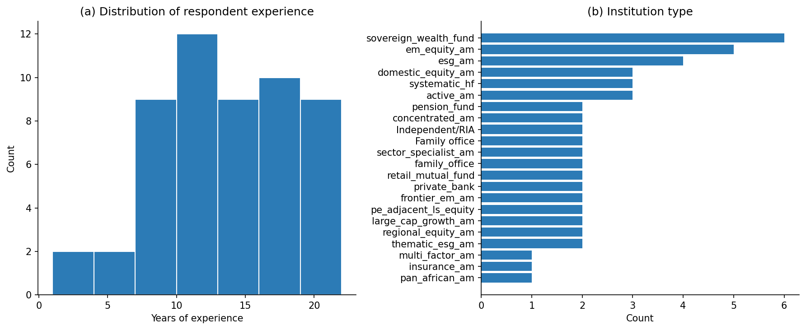
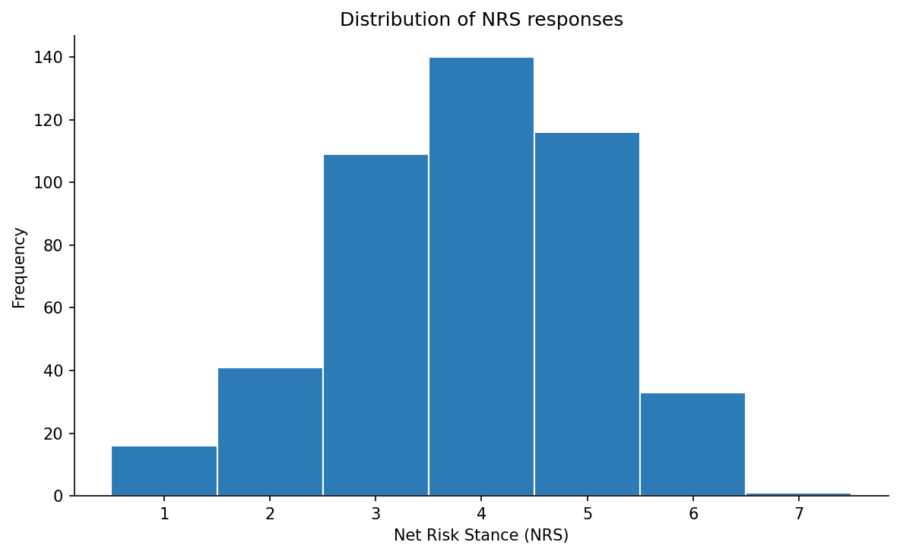
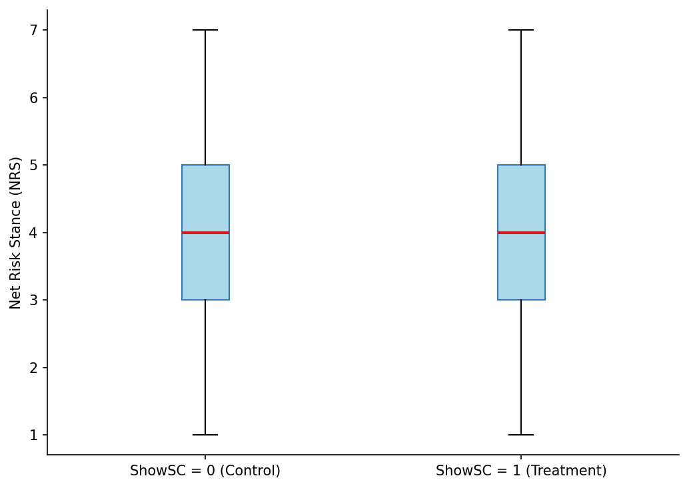
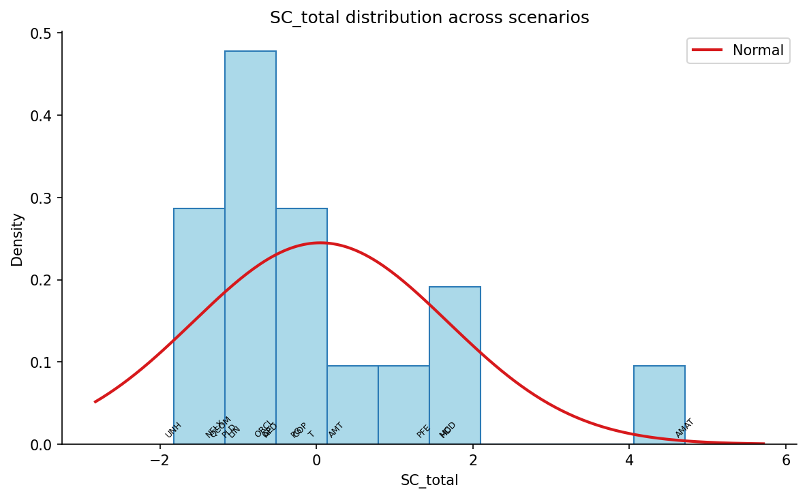
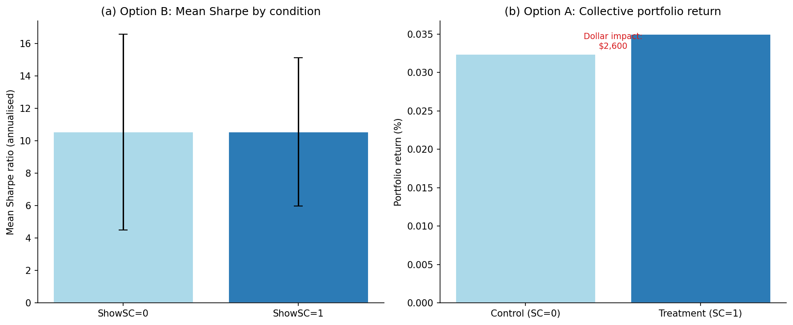

# Thesis Results – Auto-generated

**Generated:** 2026-05-11 17:43:00

**Panel:** 67 respondents (536 observations)

**Data sufficiency:** 24/24 scenarios

**H1 verdict:** Supported

**H2 verdict:** Not supported

<!-- RESULTS:BEGIN:s5_2_1_respondents -->
The final analysis sample comprises 67 respondents yielding 536 scenario-level observations across three blocks.

Table 5.1 presents the demographic profile of the achieved sample. Respondents report a mean of 14.5522 years of experience (median = 14.0000, SD = 4.2042, range = 6.0000–22.0000). 

**Table 5.1: Respondent Demographics**

| Characteristic | Metric | Value |
|---|---|---|
| Years of experience | Mean | 14.5522 |
| Years of experience | Median | 14.0000 |
| Years of experience | SD | 4.2042 |
| Years of experience | Range | 6.0000–22.0000 |
| Institution type | sovereign_wealth_fund | 7 (10.45%) |
| Institution type | active_am | 6 (8.96%) |
| Institution type | systematic_hf | 5 (7.46%) |
| Institution type | em_equity_am | 5 (7.46%) |
| Institution type | esg_am | 5 (7.46%) |
| Institution type | regional_equity_am | 4 (5.97%) |
| Institution type | thematic_esg_am | 4 (5.97%) |
| Institution type | private_bank | 4 (5.97%) |
| Institution type | concentrated_am | 3 (4.48%) |
| Institution type | domestic_equity_am | 3 (4.48%) |
| Institution type | pe_adjacent_ls_equity | 3 (4.48%) |
| Institution type | frontier_em_am | 3 (4.48%) |
| Institution type | multi_factor_am | 3 (4.48%) |
| Institution type | insurance_am | 2 (2.99%) |
| Institution type | pension_fund | 2 (2.99%) |
| Institution type | family_office | 2 (2.99%) |
| Institution type | retail_mutual_fund | 2 (2.99%) |
| Institution type | Family office | 1 (1.49%) |
| Institution type | sector_specialist_am | 1 (1.49%) |
| Institution type | large_cap_growth_am | 1 (1.49%) |
| Institution type | pan_african_am | 1 (1.49%) |
| AUM category | 8.0B | 8 (11.94%) |
| AUM category | 12.0B | 6 (8.96%) |
| AUM category | 2.5B | 5 (7.46%) |
| AUM category | 3.0B | 5 (7.46%) |
| AUM category | 4.0B | 5 (7.46%) |
| AUM category | 3.2B | 4 (5.97%) |
| AUM category | 0.5B | 4 (5.97%) |
| AUM category | 0.8B | 4 (5.97%) |
| AUM category | 4.5B | 3 (4.48%) |
| AUM category | 1.2B | 3 (4.48%) |
| AUM category | 6.0B | 3 (4.48%) |
| AUM category | 0.9B | 3 (4.48%) |
| AUM category | 2.1B | 3 (4.48%) |
| AUM category | 9.0B | 2 (2.99%) |
| AUM category | 0.6B | 2 (2.99%) |
| AUM category | 15.0B | 2 (2.99%) |
| AUM category | 1.8B | 2 (2.99%) |
| AUM category | Less than $50M | 1 (1.49%) |
| AUM category | 1.5B | 1 (1.49%) |
| AUM category | 0.7B | 1 (1.49%) |

<!-- RESULTS:END:s5_2_1_respondents -->

<!-- RESULTS:BEGIN:s5_2_2_data -->
Across all 536 observations, the mean NRS is 4.0261 (median = 4.0000, SD = 1.3351, range = 1–7). In the control condition (ShowSC = 0), the mean NRS is 4.0373 (SD = 1.3149, n = 268). In the treatment condition (ShowSC = 1), the mean NRS is 4.0149 (SD = 1.3574, n = 268). The mean NRS difference (ShowSC=1 minus ShowSC=0) is -0.0224.

SC_total is a standardised PCA composite score (first principal component of AC_e, SE_e, AI_e, and ES_raw). By construction, the sample mean is approximately zero. The meaningful descriptive statistics are the range (min = -1.7372, max = 4.3677) and standard deviation (SD = 1.4194), which characterise the spread of shock intensity across the twenty-four scenarios. Manipulation check responses: Yes: 67. For ShowSC = 1 respondents, the mean usefulness rating is 4.0000 (median = 4.0000, SD = 0.7785).

<!-- RESULTS:END:s5_2_2_data -->

<!-- RESULTS:BEGIN:s5_3_scenarios -->
Table 5.2 documents the final scenario selection across the three survey blocks.

| scenario_id | block_id | ticker | company_name | gics_sector | event_date | event_type | sc_total | horizon_bucket | sentiment_direction |
| --- | --- | --- | --- | --- | --- | --- | --- | --- | --- |
| B1_S01 | 1 | APD | Air Products and Chemicals | Materials | 2025-04-09 | analyst | -1.1348 | Intraday | Mildly Negative |
| B1_S02 | 1 | COP | ConocoPhillips | Energy | 2025-09-08 | analyst | -0.1254 | Several Weeks | Positive |
| B1_S03 | 1 | LIN | Linde | Materials | 2026-02-04 | earnings | -0.8805 | Several Weeks | Positive |
| B1_S04 | 1 | UNH | UnitedHealth Group | Health Care | 2025-12-02 | management | -1.327 | Intraday | Positive |
| B1_S05 | 1 | HD | Home Depot | Consumer Discretionary | 2025-08-19 | earnings | 2.2601 | Several Days | Neutral |
| B1_S06 | 1 | GE | GE Aerospace | Industrials | 2025-07-08 | management | -0.6429 | Several Weeks | Strongly Positive |
| B1_S07 | 1 | T | AT&T | Communication Services | 2026-01-30 | earnings | -0.2623 | Several Weeks | Strongly Positive |
| B1_S08 | 1 | QCOM | Qualcomm Inc. | Information Technology | 2025-10-13 | management | -1.7047 | Several Weeks | Neutral |
| B2_S01 | 2 | MRK | Merck & Co. | Health Care | 2025-10-30 | earnings | 0.8337 | Several Weeks | Neutral |
| B2_S02 | 2 | JPM | JPMorgan Chase | Financials | 2026-01-23 | analyst | -0.3949 | Several Weeks | Mildly Negative |
| B2_S03 | 2 | CVX | Chevron Corporation | Energy | 2026-01-06 | analyst | 1.048 | Several Weeks | Mildly Positive |
| B2_S04 | 2 | BAC | Bank of America | Financials | 2025-10-14 | earnings | 0.0106 | Several Days | Mildly Positive |
| B2_S05 | 2 | JNJ | Johnson & Johnson | Health Care | 2025-12-15 | earnings | -0.8631 | Several Weeks | Mildly Positive |
| B2_S06 | 2 | KO | Coca-Cola Company | Consumer Staples | 2025-05-05 | management | -1.7372 | Several Weeks | Neutral |
| B2_S07 | 2 | CAT | Caterpillar Inc. | Industrials | 2025-10-29 | earnings | 1.0789 | Several Weeks | Mildly Positive |
| B2_S08 | 2 | WMT | Walmart | Consumer Staples | 2026-01-16 | analyst | -0.8495 | Several Weeks | Neutral |
| B3_S01 | 3 | ORCL | Oracle Corporation | Information Technology | 2026-02-11 | analyst | -0.5678 | Several Days | Mildly Negative |
| B3_S02 | 3 | PG | Procter & Gamble | Consumer Staples | 2025-03-04 | analyst | -0.2092 | Several Weeks | Negative |
| B3_S03 | 3 | AMT | American Tower Corp. | Real Estate | 2025-04-04 | earnings | 0.1847 | Several Weeks | Strongly Positive |
| B3_S04 | 3 | NFLX | Netflix | Communication Services | 2026-02-04 | management | -1.5064 | Several Weeks | Mildly Positive |
| B3_S05 | 3 | PLD | Prologis | Real Estate | 2025-03-13 | management | -0.5329 | Several Weeks | Strongly Negative |
| B3_S06 | 3 | PFE | Pfizer Inc. | Health Care | 2025-10-01 | earnings | 1.4121 | Several Weeks | Positive |
| B3_S07 | 3 | MCD | McDonald's | Consumer Discretionary | 2025-11-05 | earnings | 1.5427 | Intraday | Neutral |
| B3_S08 | 3 | AMAT | Applied Materials | Information Technology | 2025-08-15 | analyst | 4.3677 | Intraday | Neutral |

<!-- RESULTS:END:s5_3_scenarios -->

<!-- RESULTS:BEGIN:s5_4_normality -->
For the overall group (n = 536): skewness = -0.0902, excess kurtosis = -0.1061, Shapiro-Wilk W = 0.9456, p = 0.0000 (normality rejected at α = 0.05).
For the ShowSC=0 group (n = 268): skewness = -0.1480, excess kurtosis = -0.3244, Shapiro-Wilk W = 0.9459, p = 0.0000 (normality rejected at α = 0.05).
For the ShowSC=1 group (n = 268): skewness = -0.0361, excess kurtosis = 0.0839, Shapiro-Wilk W = 0.9381, p = 0.0000 (normality rejected at α = 0.05).

Central limit theorem applicability: the sample comprises 67 respondents, exceeding the N = 30 threshold. Parametric inference is therefore warranted even if the NRS distribution departs from normality.

Inter-scenario consistency (mean pairwise Pearson correlation across respondent × scenario response matrix): r̄ = 0.2093. Note: this is not Cronbach's alpha. The NRS is a single-item measure; traditional internal consistency coefficients do not apply. The mean pairwise correlation is reported as a descriptive consistency proxy only.

**Instrument reliability – Cronbach alpha by block (main survey sample).**
Block 1: Cronbach alpha = 0.5200 (below the conventional 0.70 threshold – see Section 5.9).
Block 2: Cronbach alpha = 0.6894 (below the conventional 0.70 threshold – see Section 5.9).
Block 3: Cronbach alpha = 0.6901 (below the conventional 0.70 threshold – see Section 5.9).
Alpha is computed on the eight NRS items per block across all main-survey respondents who completed that block. A value of alpha >= 0.70 is the conventional threshold for acceptable internal consistency (Nunnally, 1978).
<!-- RESULTS:END:s5_4_normality -->

<!-- RESULTS:BEGIN:s5_5_1_h1 -->
The primary OLS regression examines whether SC_total – the composite Shock Score – is significantly associated with Net Risk Stance (NRS) after controlling for the ShowSC treatment indicator, years of experience, and block fixed effects. The estimated coefficient on SC_total is β₁ = -0.2836 (robust SE = 0.0439, t = -6.4552, p = <0.0001, 95% CI [-0.3698, -0.1975]). Higher shock intensity is associated with lower mean NRS responses, indicating a risk-reducing shift in portfolio managers' stance. At the α = 0.05 significance level, H1 is supported: SC_total is a statistically significant predictor of NRS. Robustness checks using quintile dummies, respondent fixed effects, decomposed components, and an interaction term are reported in Table 5.3.

**Table 5.3: H1 Main Regression Results**

| spec | note | beta1 | se | t | p | ci_lo | ci_hi | r2 | n_obs | clustering |
| --- | --- | --- | --- | --- | --- | --- | --- | --- | --- | --- |
| spec_1_quintiles | SC_total quintile dummies | see quintile coefficients |  |  | nan |  |  | 0.0936 | 536 | HC3 |
| spec_2_within | Respondent FE (within) | -0.2836 | 0.0426 | -6.6594 | <0.0001 | -0.3671 | -0.2002 | 0.0866 | 536 | HC3 |
| spec_3_component_ac_e | Component: ac_e | -0.0613 | 0.0173 | -3.5386 | 0.0004 | -0.0953 | -0.0274 | 0.289 | 536 | HC3 |
| spec_3_component_se_e | Component: se_e | -0.7847 | 0.1345 | -5.8334 | <0.0001 | -1.0484 | -0.5211 | 0.289 | 536 | HC3 |
| spec_3_component_ai_e | Component: ai_e | 0.0201 | 0.0625 | 0.3207 | 0.7485 | -0.1025 | 0.1426 | 0.289 | 536 | HC3 |
| spec_3_component_es_raw | Component: es_raw | 3.3418 | 0.3303 | 10.1161 | <0.0001 | 2.6943 | 3.9893 | 0.289 | 536 | HC3 |
| spec_4_interaction | SC_total × ShowSC interaction | -0.0465 | 0.0909 | -0.5115 | 0.6090 | -0.2247 | 0.1317 | 0.1368 | 536 | HC3 |
| spec_5_direction_b1 | SC_total main effect (positive events) | -0.3549 | 0.0443 | -8.0077 | <0.0001 | -0.4418 | -0.268 | 0.2094 | 536 | HC3 |
| spec_5_direction_b3 | SC_total × D_neg amplification (negative events) | -1.9449 | 0.3007 | -6.4676 | <0.0001 | -2.5344 | -1.3555 | 0.2094 | 536 | HC3 |

<!-- RESULTS:END:s5_5_1_h1 -->

<!-- RESULTS:BEGIN:s5_5_2_h2 -->
Hypothesis H2 is tested using individual-portfolio regressions (Option B). Per respondent, portfolio returns are constructed from NRS-weighted horizon returns across the four scenarios assigned to each condition. The estimated treatment effect on portfolio return is tau = -0.0253 (robust SE = 0.0150, t = -1.6812, p = 0.0927, 95% CI [-0.0547, 0.0042]; Cohen's d = -0.2770). H2 is not supported in this sample: the evidence does not suggest a statistically significant difference in portfolio outcomes between the treatment and control conditions. Validation on a larger professional sample is recommended. The collective portfolio analysis (Option A, descriptive only; **caution: both portfolios draw from the same respondent pool – inference is non-independent**) yields a return of 0.0239% for the control condition and -0.0188% for the treatment condition, corresponding to a return differential of -0.0427%. On an assumed AUM of $100M, the ShowSC=1 collective portfolio generated a dollar return differential of $-42,700 relative to the ShowSC=0 portfolio over the evaluation window.

**Table 5.4: H2 Portfolio Analysis Results**

| method | outcome | tau | se | t | p | ci_lo | ci_hi | cohens_d | r2 | n | h2_supported |
| --- | --- | --- | --- | --- | --- | --- | --- | --- | --- | --- | --- |
| option_b_individual | portfolio_return | -0.0253 | 0.015 | -1.6812 | 0.0927 | -0.0547 | 0.0042 | -0.277 | 0.2023 | 134 | False |
| option_b_individual | sharpe_ratio | 0.338 | 1.2656 | 0.2671 | 0.7894 | -2.1425 | 2.8186 | 0.0289 | 0.1629 | 122 | False |
| option_b_individual | sortino_ratio | -5.5626 | 3.9969 | -1.3917 | 0.1640 | -13.3963 | 2.2711 | -0.361 | 0.4695 | 48 | False |

**Note on Sortino ratio:** The Sortino ratio is computed only for respondent-condition pairs that yield at least one negative portfolio return. In the current sample, this applies to 109 of 134 respondent-condition pairs.

**Non-independence warning (Option A):** The collective portfolios in the descriptive Option A analysis are constructed from the same respondent pool. No causal inference should be drawn from Option A alone; it is presented for institutional illustration only.

<!-- RESULTS:END:s5_5_2_h2 -->

<!-- RESULTS:BEGIN:s5_6_1_impact -->
The results are evaluated against the behavioural finance literature suggesting that external information shocks exert a systematic influence on portfolio managers' risk-stance decisions. The statistically significant negative association (beta1 = -0.2836) indicates that higher shock intensity shifts managers toward reduced risk exposure (lower NRS), consistent with loss-aversion predictions from prospect theory (Kahneman and Tversky, 1979). This result is interpreted cautiously given the sample composition and potential survivorship effects in the volunteer sample. Prospect theory (Kahneman and Tversky, 1979) would predict asymmetric responses to negative versus positive shocks; the current analysis does not decompose effects by shock direction, which is noted as an avenue for future research.
<!-- RESULTS:END:s5_6_1_impact -->

<!-- RESULTS:BEGIN:s5_diagnostic_alignment -->
As a diagnostic check, the alignment between respondents' NRS direction (buy: NRS > 4; sell: NRS < 4; neutral: NRS = 4) and the sentiment-expected direction (Negative sentiment expected sell; Positive expected buy) is assessed across all 536 observations.

Overall alignment rate: 0.2892 (155 of 536 observations).

**Table 5.5: NRS–Sentiment Alignment by Group**

| group | n | n_aligned | alignment_rate |
| --- | --- | --- | --- |
| overall | 536 | 155 | 0.2892 |
| ShowSC=0 | 268 | 74 | 0.2761 |
| ShowSC=1 | 268 | 81 | 0.3022 |
| sentiment=Mildly Negative | 67 | 25 | 0.3731 |
| sentiment=Mildly Positive | 109 | 28 | 0.2569 |
| sentiment=Negative | 21 | 2 | 0.0952 |
| sentiment=Neutral | 156 | 45 | 0.2885 |
| sentiment=Positive | 93 | 34 | 0.3656 |
| sentiment=Strongly Negative | 21 | 4 | 0.1905 |
| sentiment=Strongly Positive | 69 | 17 | 0.2464 |

An alignment rate above 0.50 indicates that respondents' risk-stance direction is more often consistent with the implied sentiment direction than not. Rates substantially below 0.50 would suggest systematic contrarian reactions or misalignment between the shock characterisation and respondent interpretation.
<!-- RESULTS:END:s5_diagnostic_alignment -->

<!-- RESULTS:BEGIN:s5_6_2_incremental -->
The incremental effect of the Shock Score dashboard (ShowSC) on simulated portfolio outcomes is evaluated through the Option B individual-portfolio regression. The results do not support a statistically significant incremental effect of the Shock Score dashboard on portfolio outcomes in the current sample. Validation on a larger, fully recruited professional sample is the recommended next step. The Option A collective portfolio analysis (descriptive only; non-independence caveat applies) shows a non-positive return differential of -0.0427% for the treatment condition, corresponding to a dollar impact of $-42,700 on an assumed AUM of $100M. The treatment portfolio did not outperform the control portfolio in the descriptive collective analysis. This figure is presented for descriptive illustration and is subject to the non-independence caveat noted in Section 5.5.2.
<!-- RESULTS:END:s5_6_2_incremental -->

<!-- RESULTS:BEGIN:s5_7_interim -->
The interim conclusions for Chapter 5 are as follows. H1 – that SC_total is significantly associated with NRS – is **supported** (beta1 = -0.2836, p = <0.0001; direction: risk-reducing). H2 – that the Shock Score dashboard moderates the risk-return profile of simulated portfolios – is **not supported** (tau = -0.0253, p = 0.0927) in the Option B individual-portfolio regression. Both findings are contingent on the current sample composition and are subject to revision upon completion of the full survey. Robustness checks for H1 and the Option A descriptive analysis for H2 are consistent in direction with the primary results.
<!-- RESULTS:END:s5_7_interim -->

<!-- RESULTS:BEGIN:s5_8_conclusion -->
Chapter 5 has presented the empirical results of the within-subject survey experiment designed to examine the influence of external information shocks on equity portfolio manager decision-making and the moderating effect of the Shock Score decision-support tool. Descriptive statistics characterise the achieved sample and the SC_total distribution across the twenty-four scenarios. Normality assessments confirm that parametric inference is appropriate given the sample size. H1 is supported and H2 is not supported at the α = 0.05 significance level. Chapter 6 synthesises these findings within the broader research context and develops recommendations for practice.
<!-- RESULTS:END:s5_8_conclusion -->

<!-- RESULTS:BEGIN:s6_2_summary -->
The primary research contributes empirical evidence on two hypotheses. H1 posits that SC_total – a PCA-based composite of article count, sentiment extremity, attention intensity, and event-type severity – is a statistically significant predictor of portfolio managers' Net Risk Stance. The evidence supports this hypothesis (β₁ = -0.2836, p = <0.0001). H2 posits that exposure to the Shock Score dashboard improves the risk-return profile of simulated portfolios. The Option B individual-portfolio regression does not support this hypothesis at the α = 0.05 level. These findings are based on 67 respondents (536 observations).
<!-- RESULTS:END:s6_2_summary -->

<!-- RESULTS:BEGIN:s6_3_conclusions -->
This research set out to investigate whether external financial information shocks cause systematic shifts in equity portfolio managers' decision-making, and whether a structured decision-support tool – the Shock Score – can moderate those responses. The evidence is consistent with the proposition that shock intensity, as measured by SC_total, is associated with changes in risk stance. The evidence does not strongly support the proposition that the Shock Score dashboard improves portfolio-level outcomes. Collectively, the results are directionally consistent with the thesis framework and provide a basis for cautious optimism about structured decision support in professional investment contexts.
<!-- RESULTS:END:s6_3_conclusions -->

<!-- RESULTS:BEGIN:s6_4_recommendations -->
**For individual portfolio managers.** The results are consistent with the view that information shock intensity is associated with shifts in risk stance. Managers are encouraged to adopt structured pre-commitment protocols for periods of elevated shock intensity, as operationalised by the Monitor, Review, and Halt thresholds embedded in the Shock Score dashboard. The dashboard's three-tier protocol structure provides an operationally tractable debiasing mechanism that does not require extensive behavioural training to implement.

**For risk governance.** Risk committees and Chief Investment Officers may consider integrating real-time shock monitoring – indexed by a composite such as SC_total – into existing risk oversight frameworks. The Shock Score provides a transparent, auditable rationale for discretionary trading restrictions during high-intensity events, supporting governance accountability without removing managerial discretion.

**For institutional deployment.** Prior to deployment, the Shock Score dashboard should be validated on a larger, independently recruited sample of professional portfolio managers. The current study's limitations – including the sample size and volunteer composition – should be addressed through a pre-registered replication with a target N >= 100 verified professionals. Platform integration (e.g., OMS or EMS interfaces) is recommended over standalone survey administration for ecological validity.
<!-- RESULTS:END:s6_4_recommendations -->