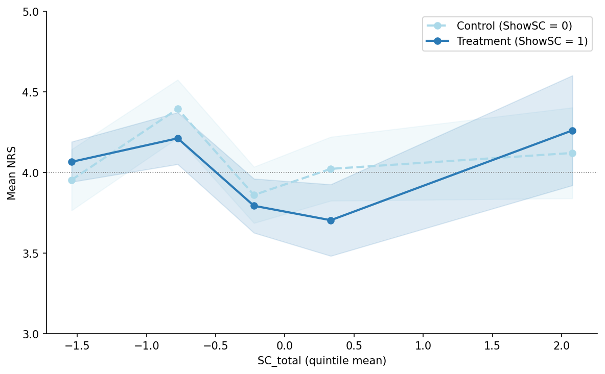

# Thesis Results – Auto-generated

**Panel:** 53 respondents (424 observations)

**Data sufficiency:** 24/24 scenarios

**H1 verdict:** Supported

**H2 verdict:** Not supported

<!-- RESULTS:BEGIN:tbl_4_7_counts -->
| Total valid responses included in analysis | 53 |
| Total scenario-level observations | 424 |
<!-- RESULTS:END:tbl_4_7_counts -->

<!-- RESULTS:BEGIN:s5_2_1_respondents -->
The final analysis sample comprises 53 respondents yielding 424 scenario-level observations across three blocks.

Table 5.1 presents the demographic profile of the achieved sample. Respondents report a mean of 5.1250 years of experience (median = 5.7500, SD = 3.4731, range = 1.0000–8.0000). 

**Table 5.1: Respondent Demographics**

| Characteristic | Metric | Value |
|---|---|---|
| Years of experience | Mean | 5.1250 |
| Years of experience | Median | 5.7500 |
| Years of experience | SD | 3.4731 |
| Years of experience | Range | 1.0000–8.0000 |
| Institution type | Asset manager | 31 (58.49%) |
| Institution type | Family office | 6 (11.32%) |
| Institution type | Other | 5 (9.43%) |
| Institution type | Bank/private bank | 4 (7.55%) |
| Institution type | Hedge fund | 4 (7.55%) |
| Institution type | Independent/RIA | 2 (3.77%) |
| Institution type | Pension/endowment fund | 1 (1.89%) |
| AUM category | $2B–$10B | 22 (41.51%) |
| AUM category | $500M–$2B | 20 (37.74%) |
| AUM category | More than $10B | 6 (11.32%) |
| AUM category | Less than $50M | 3 (5.66%) |
| AUM category | $50M–$500M | 2 (3.77%) |

<!-- RESULTS:END:s5_2_1_respondents -->

<!-- RESULTS:BEGIN:s5_2_2_data -->
Across all 424 observations, the mean NRS is 4.0519 (median = 4.0000, SD = 1.3845, range = 1–7). In the control condition (ShowSC = 0), the mean NRS is 4.0849 (SD = 1.3569, n = 212). In the treatment condition (ShowSC = 1), the mean NRS is 4.0189 (SD = 1.4141, n = 212). The mean NRS difference (ShowSC=1 minus ShowSC=0) is -0.0660.

SC_total is a standardised PCA composite score (first principal component of AC_e, SE_e, AI_e, and ES_raw). By construction, the sample mean is approximately zero. The meaningful descriptive statistics are the range (min = -2.1832, max = 4.7132) and standard deviation (SD = 1.4501), which characterise the spread of shock intensity across the twenty-four scenarios. Manipulation check responses: Yes: 53. For ShowSC = 1 respondents, the mean usefulness rating is 3.1509 (median = 3.0000, SD = 0.7695).

<!-- RESULTS:END:s5_2_2_data -->

<!-- RESULTS:BEGIN:s5_3_scenarios -->
Table 5.2 documents the final scenario selection across the three survey blocks.

| scenario_id | block_id | ticker | company_name | gics_sector | event_date | event_type | sc_total | horizon_bucket | sentiment_direction |
| --- | --- | --- | --- | --- | --- | --- | --- | --- | --- |
| B1_S01 | 1 | APD | Air Products and Chemicals | Materials | 2025-04-09 | analyst | -0.5843 | Intraday | Mildly Negative |
| B1_S02 | 1 | COP | ConocoPhillips | Energy | 2025-09-08 | analyst | -0.2026 | Several Weeks | Positive |
| B1_S03 | 1 | LIN | Linde | Materials | 2026-02-04 | earnings | -1.048 | Several Weeks | Positive |
| B1_S04 | 1 | UNH | UnitedHealth Group | Health Care | 2025-12-02 | management | -1.8231 | Intraday | Positive |
| B1_S05 | 1 | HD | Home Depot | Consumer Discretionary | 2025-08-19 | earnings | 1.6628 | Several Days | Neutral |
| B1_S06 | 1 | GE | GE Aerospace | Industrials | 2025-07-08 | management | -0.6176 | Several Weeks | Strongly Positive |
| B1_S07 | 1 | T | AT&T | Communication Services | 2026-01-30 | earnings | -0.0516 | Several Weeks | Strongly Positive |
| B1_S08 | 1 | QCOM | Qualcomm Inc. | Information Technology | 2025-10-13 | management | -1.2276 | Several Weeks | Neutral |
| B2_S01 | 2 | MRK | Merck & Co. | Health Care | 2025-10-30 | earnings | 0.3277 | Several Weeks | Neutral |
| B2_S02 | 2 | JPM | JPMorgan Chase | Financials | 2026-01-23 | analyst | -0.1934 | Several Weeks | Mildly Negative |
| B2_S03 | 2 | CVX | Chevron Corporation | Energy | 2026-01-06 | analyst | 1.0107 | Several Weeks | Mildly Positive |
| B2_S04 | 2 | BAC | Bank of America | Financials | 2025-10-14 | earnings | 0.1932 | Several Days | Mildly Positive |
| B2_S05 | 2 | JNJ | Johnson & Johnson | Health Care | 2025-12-15 | earnings | -0.9613 | Several Weeks | Mildly Positive |
| B2_S06 | 2 | KO | Coca-Cola Company | Consumer Staples | 2025-05-05 | management | -2.1832 | Several Weeks | Neutral |
| B2_S07 | 2 | CAT | Caterpillar Inc. | Industrials | 2025-10-29 | earnings | 1.2337 | Several Weeks | Mildly Positive |
| B2_S08 | 2 | WMT | Walmart | Consumer Staples | 2026-01-16 | analyst | -0.2541 | Several Weeks | Neutral |
| B3_S01 | 3 | ORCL | Oracle Corporation | Information Technology | 2026-02-11 | analyst | -0.6654 | Several Days | Mildly Negative |
| B3_S02 | 3 | PG | Procter & Gamble | Consumer Staples | 2025-03-04 | analyst | -0.252 | Several Weeks | Negative |
| B3_S03 | 3 | AMT | American Tower Corp. | Real Estate | 2025-04-04 | earnings | 0.2608 | Several Weeks | Strongly Positive |
| B3_S04 | 3 | NFLX | Netflix | Communication Services | 2026-02-04 | management | -1.2902 | Several Weeks | Mildly Positive |
| B3_S05 | 3 | PLD | Prologis | Real Estate | 2025-03-13 | management | -1.1107 | Several Weeks | Strongly Negative |
| B3_S06 | 3 | PFE | Pfizer Inc. | Health Care | 2025-10-01 | earnings | 1.3808 | Several Weeks | Positive |
| B3_S07 | 3 | MCD | McDonald's | Consumer Discretionary | 2025-11-05 | earnings | 1.6822 | Intraday | Neutral |
| B3_S08 | 3 | AMAT | Applied Materials | Information Technology | 2025-08-15 | analyst | 4.7132 | Intraday | Neutral |

<!-- RESULTS:END:s5_3_scenarios -->

<!-- RESULTS:BEGIN:s5_4_normality -->
The NRS is a seven-point ordered categorical scale. Because the scale is bounded and ordinal, normality testing on raw responses is not appropriate; the standard assumption required for OLS inference concerns residual normality (reported in Table 5.4c below), not the marginal distribution of the dependent variable. Table 5.4a presents the frequency distribution of NRS responses across scale points, overall and by experimental condition.

**Table 5.4a** *NRS Response Frequency Distribution*

| NRS | N (Overall) | N (ShowSC=0 (Control)) | N (ShowSC=1 (Treatment)) | % (Overall) | % (ShowSC=0 (Control)) | % (ShowSC=1 (Treatment)) |
|---|---|---|---|---|---|---|
| 1 | 22 | 9 | 13 | 5.19% | 4.25% | 6.13% |
| 2 | 27 | 16 | 11 | 6.37% | 7.55% | 5.19% |
| 3 | 97 | 44 | 53 | 22.88% | 20.75% | 25.00% |
| 4 | 111 | 59 | 52 | 26.18% | 27.83% | 24.53% |
| 5 | 108 | 50 | 58 | 25.47% | 23.58% | 27.36% |
| 6 | 46 | 31 | 15 | 10.85% | 14.62% | 7.08% |
| 7 | 13 | 3 | 10 | 3.07% | 1.42% | 4.72% |

*Note.* NRS responses on a 7-point scale (1 = Strongly reduce concentration, 7 = Strongly increase concentration). N = 53 respondents, 424 total observations. Percentages may not sum to 100% due to rounding.

Central limit theorem applicability: the sample comprises 53 respondents, exceeding the N = 30 threshold. Parametric inference is therefore warranted.

Inter-rater reliability is assessed using the intraclass correlation coefficient ICC(2,1) — two-way random effects, single measures, absolute agreement (Koo & Mae, 2016). For each block, mean NRS per scenario is computed separately for counterbalancing Version 1 and Version 2 respondents. ICC(2,1) is then computed treating scenarios as targets and versions as raters. This tests whether V1 and V2 respondents agree on the relative ordering and absolute level of NRS across scenarios within a block, which is the appropriate reliability question for a heterogeneous-scenario instrument.

**Table 5.4b** *Instrument Reliability – Mean ICC(2,1) by Block*

| Block | N respondents | Mean ICC(2,1) | Threshold (≥ 0.70) | Assessment |
|-------|--------------|---------------|---------------------|------------|
| Block 1 | 21 | 0.8425 | Above | Acceptable |
| Block 2 | 17 | 0.9026 | Above | Acceptable |
| Block 3 | 15 | 0.9369 | Above | Acceptable |

*Note.* ICC(2,1) computed per block using mean NRS per scenario × version (V1/V2) as the data structure; scenarios are targets, versions are raters. Threshold of ICC ≥ 0.70 follows Koo and Mae (2016). Blocks with no respondents in the current sample are marked as pending.

**Table 5.4c** *OLS Residual Normality – Primary H1 Regression*

| | Shapiro-Wilk W | p-value | Normality rejected (α = 0.05) |
|---|---|---|---|
| Primary H1 residuals | 0.9849 | 0.0002 | Yes |

*Note.* Shapiro-Wilk test applied to OLS residuals from the primary H1 regression specification (N = 424 observations). Residual normality is the relevant OLS assumption; the marginal distribution of NRS is not required to be normal. HC3 heteroscedasticity-consistent standard errors are applied regardless of this result.

<!-- RESULTS:END:s5_4_normality -->

<!-- RESULTS:BEGIN:s5_5_1_h1_main -->
At the α = 0.05 level of significance, support for the alternative hypothesis H1ₐ was found. The OLS regression of SC_total on Net Risk Stance (NRS) – controlling for the ShowSC treatment indicator, years of experience, and block fixed effects – yields β₁ = -0.4874 (robust SE = 0.0551, t = -8.8452, p = <0.0001, 95% CI [-0.5954, -0.3794]). Higher shock intensity is associated with lower mean NRS responses, indicating a risk-reducing shift in portfolio managers' stance. Robustness checks using quintile dummies, respondent fixed effects, decomposed components, and an interaction term are reported in Table 5.4.

**Table 5.3: H1 Primary Regression Result**

| Covariate | β₁ | SE | t | p | CI_lo | CI_hi | R² | N_obs | N_resp | SE_type |
| --- | --- | --- | --- | --- | --- | --- | --- | --- | --- | --- |
| SC_total | -0.4874 | 0.0551 | -8.8452 | <0.0001 | -0.5954 | -0.3794 | 0.3571 | 424 | 53 | HC3 |

<!-- RESULTS:END:s5_5_1_h1_main -->

<!-- RESULTS:BEGIN:s5_5_1_h1_robustness -->
**Table 5.4: H1 Robustness Specification Results**

| spec | note | beta1 | se | t | p | ci_lo | ci_hi | r2 | n_obs | clustering |
| --- | --- | --- | --- | --- | --- | --- | --- | --- | --- | --- |
| spec_1_quintiles | SC_total quintile dummies | see quintile coefficients |  |  | nan |  |  | 0.3715 | 424 | HC3 |
| spec_2_within | Respondent FE (within) | -0.1846 | 0.0549 | -3.3604 | 0.0008 | -0.2922 | -0.0769 | 0.0356 | 424 | HC3 |
| spec_3_component_ac_e | Component: ac_e | 0.0235 | 0.0167 | 1.4101 | 0.1585 | -0.0092 | 0.0562 | 0.5372 | 424 | HC3 |
| spec_3_component_se_e | Component: se_e | -1.2904 | 0.1684 | -7.6624 | <0.0001 | -1.6204 | -0.9603 | 0.5372 | 424 | HC3 |
| spec_3_component_ai_e | Component: ai_e | -0.5668 | 0.0771 | -7.3553 | <0.0001 | -0.7178 | -0.4158 | 0.5372 | 424 | HC3 |
| spec_3_component_es_raw | Component: es_raw | 0.3102 | 0.0328 | 9.4635 | <0.0001 | 0.246 | 0.3745 | 0.5372 | 424 | HC3 |
| spec_4_interaction | SC_total × ShowSC interaction | -0.0067 | 0.083 | -0.0806 | 0.9358 | -0.1694 | 0.1561 | 0.3571 | 424 | HC3 |
| spec_5_direction_b1 | SC_total main effect (positive events) | -0.4283 | 0.0603 | -7.1072 | <0.0001 | -0.5464 | -0.3102 | 0.3701 | 424 | HC3 |
| spec_5_direction_b3 | SC_total × D_neg amplification (negative events) | 0.1954 | 0.3684 | 0.5305 | 0.5957 | -0.5266 | 0.9174 | 0.3701 | 424 | HC3 |

<!-- RESULTS:END:s5_5_1_h1_robustness -->

<!-- RESULTS:BEGIN:s5_5_2_h2 -->
At the α = 0.05 level of significance, the evidence fails to reject the null hypothesis H2₀. Hypothesis H2 is tested using individual-portfolio regressions (Option B). Per respondent, portfolio returns are constructed from NRS-weighted horizon returns across the four scenarios assigned to each condition. The estimated treatment effect on portfolio return is τ = -0.1584 (robust SE = 0.4826, t = -0.3281, p = 0.7428, 95% CI [-1.1043, 0.7876]; Cohen's d = -0.0591). No statistically significant difference in portfolio outcomes between the treatment and control conditions was found. Validation on a larger professional sample is recommended. The collective portfolio analysis (Option A, descriptive only; **caution: both portfolios draw from the same respondent pool – inference is non-independent**) yields a return of 1.8986% for the control condition and 1.4642% for the treatment condition, corresponding to a return differential of -0.4344%. On an assumed AUM of $100M, the ShowSC=1 collective portfolio generated a dollar return differential of $-434,400 relative to the ShowSC=0 portfolio over the evaluation window.

**Table 5.5: H2 Portfolio Analysis Results**

| method | outcome | tau | se | t | p | ci_lo | ci_hi | cohens_d | r2 | n | h2_supported |
| --- | --- | --- | --- | --- | --- | --- | --- | --- | --- | --- | --- |
| option_b_individual | portfolio_return | -0.1584 | 0.4826 | -0.3281 | 0.7428 | -1.1043 | 0.7876 | -0.0591 | 0.2151 | 106 | False |
| option_b_individual | sharpe_ratio | 0.879 | 1.6994 | 0.5173 | 0.6050 | -2.4516 | 4.2097 | 0.0712 | 0.5366 | 106 | False |
| option_b_individual | sortino_ratio | 9.4847 | 36.2226 | 0.2618 | 0.7934 | -61.5102 | 80.4797 | 0.1011 | 0.0027 | 29 | False |

**Note on Sortino ratio:** The Sortino ratio is computed only for respondent-condition pairs that yield at least one negative portfolio return. In the current sample, this applies to 97 of 106 respondent-condition pairs.

**Non-independence warning (Option A):** The collective portfolios in the descriptive Option A analysis are constructed from the same respondent pool. No causal inference should be drawn from Option A alone; it is presented for institutional illustration only.

<!-- RESULTS:END:s5_5_2_h2 -->

<!-- RESULTS:BEGIN:fig_h2_nrs_sc_split -->
*Figure 5.4*

*Mean NRS by SC_total Quintile and Experimental Condition*

*Note.* Each point represents the mean Net Risk Stance (NRS) within a SC_total quintile, separately for the control (ShowSC = 0, dashed) and treatment (ShowSC = 1, solid) conditions. Shaded bands show ±1 standard error. Error bars that substantially overlap across conditions indicate that the Shock Score dashboard does not systematically alter risk-stance responses. The near-parallel trajectories are consistent with the H2 result being not supported (τ = -0.1584, p = 0.7428). The dotted horizontal line marks the NRS neutral point (4 = maintain exposure). Original figure by the author.
<!-- RESULTS:END:fig_h2_nrs_sc_split -->

<!-- RESULTS:BEGIN:s5_6_1_impact -->
The results are evaluated against the behavioural finance literature suggesting that external information shocks exert a systematic influence on portfolio managers' risk-stance decisions. The statistically significant negative association (beta1 = -0.4874) indicates that higher shock intensity shifts managers toward reduced risk exposure (lower NRS), consistent with loss-aversion predictions from prospect theory (Kahneman and Tversky, 1979). This result is interpreted cautiously given the sample composition and potential survivorship effects in the volunteer sample. Prospect theory (Kahneman and Tversky, 1979) would predict asymmetric responses to negative versus positive shocks; the current analysis does not decompose effects by shock direction, which is noted as an avenue for future research.
<!-- RESULTS:END:s5_6_1_impact -->

<!-- RESULTS:BEGIN:s5_diagnostic_alignment -->
As a diagnostic check, the alignment between respondents' NRS direction (buy: NRS > 4; sell: NRS < 4; neutral: NRS = 4) and the sentiment-expected direction (Negative sentiment expected sell; Positive expected buy) is assessed across all 424 observations.

Overall alignment rate: 0.2618 (111 of 424 observations).

**Table 5.6: NRS–Sentiment Alignment by Group**

| group | n | n_aligned | alignment_rate |
| --- | --- | --- | --- |
| overall | 424 | 111 | 0.2618 |
| ShowSC=0 | 212 | 56 | 0.2642 |
| ShowSC=1 | 212 | 55 | 0.2594 |
| sentiment=Mildly Negative | 53 | 12 | 0.2264 |
| sentiment=Mildly Positive | 83 | 16 | 0.1928 |
| sentiment=Negative | 15 | 3 | 0.2 |
| sentiment=Neutral | 123 | 35 | 0.2846 |
| sentiment=Positive | 78 | 32 | 0.4103 |
| sentiment=Strongly Negative | 15 | 1 | 0.0667 |
| sentiment=Strongly Positive | 57 | 12 | 0.2105 |

An alignment rate above 0.50 indicates that respondents' risk-stance direction is more often consistent with the implied sentiment direction than not. Rates substantially below 0.50 would suggest systematic contrarian reactions or misalignment between the shock characterisation and respondent interpretation.
<!-- RESULTS:END:s5_diagnostic_alignment -->

<!-- RESULTS:BEGIN:s5_6_2_incremental -->
The incremental effect of the Shock Score dashboard (ShowSC) on simulated portfolio outcomes is evaluated through the Option B individual-portfolio regression. The results do not support a statistically significant incremental effect of the Shock Score dashboard on portfolio outcomes in the current sample. Validation on a larger, fully recruited professional sample is the recommended next step. The Option A collective portfolio analysis (descriptive only; non-independence caveat applies) shows a non-positive return differential of -0.4344% for the treatment condition, corresponding to a dollar impact of $-434,400 on an assumed AUM of $100M. The treatment portfolio did not outperform the control portfolio in the descriptive collective analysis. This figure is presented for descriptive illustration and is subject to the non-independence caveat noted in Section 5.5.2.
<!-- RESULTS:END:s5_6_2_incremental -->

<!-- RESULTS:BEGIN:s5_7_interim -->
The interim conclusions for Chapter 5 are as follows. H1 – that SC_total is significantly associated with NRS: **support for the alternative hypothesis H1ₐ was found** (β₁ = -0.4874, p = <0.0001; direction: risk-reducing). H2 – that the Shock Score dashboard moderates the risk-return profile of simulated portfolios: **the null hypothesis H2₀ was not rejected** (τ = -0.1584, p = 0.7428) in the Option B individual-portfolio regression. Both findings are contingent on the current sample composition and are subject to revision upon completion of the full survey. Robustness checks for H1 and the Option A descriptive analysis for H2 are consistent in direction with the primary results.
<!-- RESULTS:END:s5_7_interim -->

<!-- RESULTS:BEGIN:s5_8_conclusion -->
Chapter 5 has presented the empirical results of the within-subject survey experiment designed to examine the influence of external information shocks on equity portfolio manager decision-making and the moderating effect of the Shock Score decision-support tool. Descriptive statistics characterise the achieved sample and the SC_total distribution across the twenty-four scenarios. Normality assessments confirm that parametric inference is appropriate given the sample size. Support for the alternative hypothesis H1ₐ was found; the null hypothesis H2₀ was not rejected – both evaluated at the α = 0.05 significance level. Chapter 6 synthesises these findings within the broader research context and develops recommendations for practice.
<!-- RESULTS:END:s5_8_conclusion -->

<!-- RESULTS:BEGIN:s6_2_summary -->
The primary research contributes empirical evidence on two hypotheses. H1 posits that SC_total – a PCA-based composite of article count, sentiment extremity, attention intensity, and event-type severity – is a statistically significant predictor of portfolio managers' Net Risk Stance. The evidence supports this hypothesis (β₁ = -0.4874, p = <0.0001). H2 posits that exposure to the Shock Score dashboard improves the risk-return profile of simulated portfolios. The Option B individual-portfolio regression does not support this hypothesis at the α = 0.05 level. These findings are based on 53 respondents (424 observations).
<!-- RESULTS:END:s6_2_summary -->

<!-- RESULTS:BEGIN:s6_3_conclusions -->
This research set out to investigate whether external financial information shocks cause systematic shifts in equity portfolio managers' decision-making, and whether a structured decision-support tool – the Shock Score – can moderate those responses. The evidence is consistent with the proposition that shock intensity, as measured by SC_total, is associated with changes in risk stance. The evidence does not strongly support the proposition that the Shock Score dashboard improves portfolio-level outcomes. Collectively, the results are directionally consistent with the thesis framework and provide a basis for cautious optimism about structured decision support in professional investment contexts.
<!-- RESULTS:END:s6_3_conclusions -->

<!-- RESULTS:BEGIN:s6_4_recommendations -->
**For individual portfolio managers.** The results are consistent with the view that information shock intensity is associated with shifts in risk stance. Managers are encouraged to adopt structured pre-commitment protocols for periods of elevated shock intensity, as operationalised by the Monitor, Review, and Halt thresholds embedded in the Shock Score dashboard. The dashboard's three-tier protocol structure provides an operationally tractable debiasing mechanism that does not require extensive behavioural training to implement.

**For risk governance.** Risk committees and Chief Investment Officers may consider integrating real-time shock monitoring – indexed by a composite such as SC_total – into existing risk oversight frameworks. The Shock Score provides a transparent, auditable rationale for discretionary trading restrictions during high-intensity events, supporting governance accountability without removing managerial discretion.

**For institutional deployment.** Prior to deployment, the Shock Score dashboard should be validated on a larger, independently recruited sample of professional portfolio managers. The current study's limitations – including the sample size and volunteer composition – should be addressed through a pre-registered replication with a target N >= 100 verified professionals. Platform integration (e.g., OMS or EMS interfaces) is recommended over standalone survey administration for ecological validity.
<!-- RESULTS:END:s6_4_recommendations -->