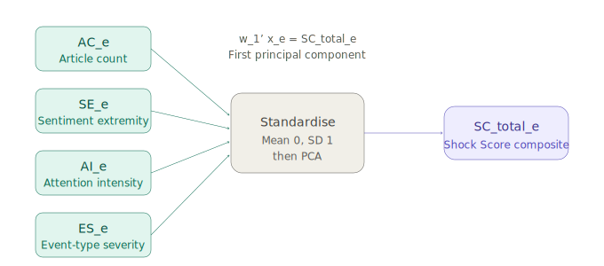

**REDUCING EMOTIONAL BIASES IN INVESTMENT PORTFOLIO MANAGEMENT**

**A THESIS**
**PRESENTED TO THE FACULTY OF**
**SBS SWISS BUSINESS SCHOOL**

**IN PARTIAL FULFILLMENT**

**OF THE REQUIREMENTS FOR THE DEGREE**

**EXECUTIVE MASTER OF BUSINESS ADMINISTRATION**

**BY**

**ALIAKSEI MALASHONAK**
**STUDENT ID: 19795 | MATRICULATION: 24891798**

**SEPTEMBER 2026**

**MENTOR: DR. STEFANO CANOSSA**

---
title: Title Page
---

**REDUCING EMOTIONAL BIASES IN INVESTMENT PORTFOLIO MANAGEMENT**

**A THESIS**
**PRESENTED TO THE FACULTY OF**
**SBS SWISS BUSINESS SCHOOL**

**IN PARTIAL FULFILLMENT**

**OF THE REQUIREMENTS FOR THE DEGREE**

**EXECUTIVE MASTER OF BUSINESS ADMINISTRATION**

**BY**

**ALIAKSEI MALASHONAK**
**STUDENT ID: 19795 | MATRICULATION: 24891798**

**SEPTEMBER 2026**

**MENTOR: DR. STEFANO CANOSSA**

# Reducing Emotional Biases in Investment Portfolio Management
## Authentication of Work

I, Aliaksei Malashonak (Student ID: 19795, Matriculation Number: 24891798), hereby declare that this thesis, submitted in partial fulfillment of the requirements for the degree of Executive Master of Business Administration at SBS Swiss Business School, Kloten-Zurich, Switzerland, is my own work. All sources consulted have been acknowledged in the references. This thesis has not been submitted for any other degree or qualification at any other institution.

Signature: ______________________________

Date: ______________________________

Mentor certification: I, Dr. Stefano Canossa, confirm that this thesis meets the academic standards required for the Executive Master of Business Administration programme at SBS Swiss Business School.

Mentor signature: ______________________________

Date: ______________________________

---

## Foreword

This thesis examines whether a structured, quantitative decision-support indicator can moderate behavioral bias in professional equity portfolio management. The research question emerged from direct professional experience in financial risk management, where the gap between the theoretical predictions of behavioral finance and the practical tools available to investment practitioners is persistently apparent. Despite a substantial body of evidence documenting systematic decision errors under conditions of information overload and emotional salience, the field has produced few operational instruments designed to identify and mitigate such errors at the point of decision.

The Shock Score, developed and evaluated in this thesis, represents an attempt to close this gap. It combines real-time market and sentiment signals into a single composite indicator that portfolio managers can consult when external information events create elevated conditions for bias-driven behavior. The empirical study tests whether exposure to this indicator is associated with changes in decision outcomes among professional portfolio managers.

The research draws on the behavioral finance literature, quantitative methods in financial economics, and applied survey design. It is intended to contribute both to academic understanding of decision-making under uncertainty and to the practical toolkit available to investment risk professionals.

---

- Table of Contents
- List of Tables
- List of Figures
- List of Abbreviations and Acronyms
- Executive Summary

## Executive Summary

This thesis investigates whether a structured decision-support indicator – the Shock Score – can reduce emotional biases in equity portfolio manager decision-making. The study evaluates whether – the Shock Score – moderates behavioral bias in professional investment decisions.

The research is motivated by a documented gap between the theoretical predictions of behavioral finance and the practical tools available to investment practitioners. While the literature establishes that discrete, emotionally salient information events can produce systematic deviations from disciplined portfolio management, existing decision-support systems are predominantly designed for quantitative analytics rather than ex-ante bias mitigation. This thesis addresses that gap through the design, construction, and empirical evaluation of an original composite indicator.

The Shock Score aggregates four components – Article Count, Sentiment Extremity, Attention Intensity, and Event-Type Severity – into a single standardised composite index via principal component analysis. The index quantifies the emotional and informational intensity of an external shock and is presented to portfolio managers through an interpretable dashboard incorporating a pre-commitment protocol. Two hypotheses are evaluated. Hypothesis H1 posits that higher Shock Score intensity is associated with a risk-reducing shift in managers' Net Risk Stance. Hypothesis H2 posits that exposure to the Shock Score dashboard moderates decision outcomes under shock conditions.

The empirical study employs a within-subject quasi-experimental scenario survey administered to professional equity portfolio managers. The survey presents 24 real-market scenarios across three blocks, each accompanied by news information and, in the treatment condition, the Shock Score dashboard. The primary analytical method is two-way cluster-robust OLS regression with respondent fixed effects.

The analysis is based on a sample of 67 respondents yielding 536 scenario-level observations. Results support Hypothesis H1: the Shock Score composite is a statistically significant negative predictor of Net Risk Stance (β₁ = -0.2836, p < 0.0001), indicating that higher shock intensity is systematically associated with a risk-reducing decision shift among professional managers. Hypothesis H2 is not supported in the current sample: the estimated treatment effect of the Shock Score dashboard on portfolio outcomes is positive in direction but does not reach statistical significance (τ = 0.0076, p = 0.3770), a result attributed primarily to limited statistical power rather than to an absence of effect.

The thesis concludes that external information shocks are associated with measurable systematic changes in professional portfolio managers' risk stance, consistent with behavioral finance theory. The Shock Score demonstrates construct validity and directional alignment with the hypothesized moderation mechanism. Replication on a larger sample is recommended to evaluate Hypothesis H2 with adequate statistical power. Practical recommendations are offered for portfolio managers, risk governance frameworks, and future integration of behavioral indicators into investment decision processes.

*Note: Results reported above are based on the sample available at the time of writing. Final results will be updated upon completion of data collection.*

---

# Chapter 1. Introduction

## 1.1 Background of the Problem

### 1.1.1 Emotional Biases in Investment Decision-Making

Investment decisions are frequently described as exercises in rational calculation, yet a substantial body of empirical evidence demonstrates that even highly trained professionals depart systematically from the predictions of classical decision theory. Behavioural and emotional biases – including overconfidence, loss aversion, herding, anchoring, and the disposition effect – have been documented across retail investors, fund managers, traders, and senior corporate executives ([Kahneman & Tversky, 1979](https://doi.org/10.2307/1914185); [Barber & Odean, 2001](https://doi.org/10.1162/003355301556400); [Ben-David et al., 2013](https://doi.org/10.1093/qje/qjt023); [Statman, 2019](https://doi.org/10.2139/ssrn.3668963)). These deviations are not random errors that cancel out across decisions, but rather predictable patterns of judgment that emerge under conditions of uncertainty, time pressure, and emotional arousal.

The financial consequences of such biases are well established. Empirical evidence indicates that overconfident investors trade excessively and earn lower risk-adjusted returns ([Barber & Odean, 2001](https://doi.org/10.1162/003355301556400)), that loss-averse market participants react more strongly to negative news than to comparable positive news ([Tetlock, 2007](https://doi.org/10.1111/j.1540-6261.2007.01232.x); [Löffler et al., 2021](https://dx.doi.org/10.2139/ssrn.2802570)), and that emotional and physiological responses to market stress can measurably degrade decision quality even among experienced traders ([Lo & Repin, 2002](https://doi.org/10.1162/089892902317361877); [Coates & Herbert, 2008](https://doi.org/10.1073/pnas.0704025105)). The disposition effect – the tendency to realise gains too early and to defer the realisation of losses – has been observed in both retail and institutional samples ([Grinblatt & Keloharju, 2001](https://doi.org/10.1111/0022-1082.00338); [Frazzini, 2006](https://doi.org/10.1111/j.1540-6261.2006.00896.x)), with adverse consequences for portfolio turnover and after-cost performance.

These findings are particularly salient for investment portfolio management, where the cumulative effect of small behavioural distortions across many decisions can produce material deviations from a manager's stated investment policy and strategic risk targets. As such, emotional bias is treated in this thesis not as an incidental imperfection of human judgment, but as a structural feature of professional decision-making that warrants explicit attention in the design of investment processes and decision-support tools.

### 1.1.2 Information Overload and News-Driven Markets

Contemporary financial markets are characterised by an exceptionally high velocity and volume of information. Corporate earnings releases, analyst rating actions, macroeconomic indicators, central bank communications, regulatory announcements, and geopolitical events are continuously distributed through multiple channels and processed by market participants in real time. Investor attention, however, is a bounded resource ([Peng & Xiong, 2006](https://doi.org/10.1016/j.jfineco.2005.05.003)). When the volume and velocity of incoming information exceeds the cognitive capacity of decision-makers, attention becomes the binding constraint in determining which signals are processed deliberately and which are processed through heuristic shortcuts ([Da et al., 2011](https://doi.org/10.1111/j.1540-6261.2011.01679.x); [Barber & Odean, 2008](https://doi.org/10.1093/rfs/hhm079)).

Empirical research on attention-driven trading shows that salient news events generate elevated turnover in the affected securities, particularly among securities that capture investor attention through extreme returns, high trading volume, or media coverage ([Da et al., 2011](https://doi.org/10.1111/j.1540-6261.2011.01679.x); [Engelberg & Parsons, 2009](https://doi.org/10.2139/ssrn.1462416)). This pattern is observable in both retail and institutional segments and is consistent with a model in which information shocks act as cues that trigger reallocation of cognitive resources to particular positions. The increased decision activity around news events does not, however, necessarily translate into improved portfolio outcomes; the empirical literature documents that attention-driven trading is associated with short-term overreaction and subsequent reversal ([Meng et al., 2024](https://doi.org/10.1016/j.irfa.2024.103219); [Cremers et al., 2021](https://doi.org/10.1111/1475-679X.12352)).

Information overload also interacts with the affective dimensions of decision-making. When the cognitive demands of a decision exceed available capacity, the relative weight of intuitive and emotional processes increases ([Kahneman, 2003](https://doi.org/10.1257/000282803322655392); [Kahneman, 2011](https://www.worldcat.org/oclc/706020998)). In professional investment contexts, this shift implies that the very conditions under which precise analytical reasoning is most needed – moments of market stress, breaking news, or unexpected announcements – are also the conditions under which it is least likely to be applied consistently. The combination of attention scarcity and emotional arousal therefore creates a structural vulnerability that decision-support frameworks must explicitly address.

### 1.1.3 Behavioral Reactions to External Financial News

External financial news events – defined here as discrete public information events relevant to specific portfolio holdings – act as concentrated stimuli that engage both the cognitive and the affective systems of investment decision-making. The behavioural finance literature has accumulated substantial evidence that the immediate market response to such events frequently exceeds what can be justified by changes in fundamental value, generating short-horizon price overshooting that is partially reversed in the days that follow ([Meng et al., 2024](https://doi.org/10.1016/j.irfa.2024.103219); [Tetlock, 2007](https://doi.org/10.1111/j.1540-6261.2007.01232.x); [Daniel et al., 1998](https://doi.org/10.1111/0022-1082.00077)). These dynamics are consistent with theories of overreaction driven by salience, attention, and affective response, rather than with models of frictionless rational updating.

Professional portfolio managers are not insulated from these dynamics. Institutional trading data shows that institutions tend to trade in the direction of the initial price reaction around earnings announcements, amplifying rather than dampening short-term mispricings ([Ben-Rephael et al., 2024](https://dx.doi.org/10.2139/ssrn.3966758); [Cremers et al., 2021](https://doi.org/10.1111/1475-679X.12352)). Mechanical rebalancing flows transmit these reactions into observable price pressure ([Harvey et al., 2025](https://doi.org/10.2139/ssrn.5122748)), and extreme market conditions have been shown to trigger panic-style selling and rapid exits rather than disciplined adjustment ([Elkind et al., 2022](https://doi.org/10.3905/JFDS.2021.1.085)). In aggregate, the behavioural reactions of professional investors to external information shocks shape short-horizon volatility, return predictability, and the realised risk – return characteristics of portfolios.

These observations frame the practical motivation for the present study. If external information shocks systematically activate behavioural biases that produce measurable short-term deviations from disciplined portfolio management, then the design of investment processes that explicitly anticipate and structure responses to such shocks becomes a question of operational relevance. The empirical study reported in this thesis is positioned within this practical motivation, examining whether managers' decision behaviour during shock events varies systematically with the intensity of the shock and whether the introduction of a structured decision-support indicator is associated with changes in decision outcomes.

## 1.2 Background of the Study

### 1.2.1 Traditional Portfolio Theory and Rational Decision Assumptions

The conceptual foundations of modern portfolio management rest on a body of theory in which investors are assumed to process information in a fully rational manner, to hold consistent preferences over risk and return, and to allocate capital so as to maximise expected utility subject to budget and risk constraints. The classical mean – variance framework formalised diversification as a quantitative principle and provided the foundation for portfolio optimisation under risk, and was extended in subsequent capital market theory, including the capital asset pricing model and the efficient market hypothesis ([Fama, 1970](https://doi.org/10.1111/j.1540-6261.1970.tb00518.x); [Sharpe, 1966](https://doi.org/10.1086/294846); [Cochrane, 2005](https://books.google.com/books/about/Asset_Pricing.html?id=20pmeMaKNwsC)).

Within this paradigm, the role of news and information is precise: public information is incorporated into prices rapidly and accurately, and any predictable component of investor behaviour is arbitraged away by well-informed market participants. The behavioural responses of individual managers to specific events are, by assumption, second-order in the determination of asset prices, since rational arbitrageurs are presumed to absorb any temporary mispricing. Performance attribution in this framework focuses on systematic exposures and on the quality of information signals rather than on the affective characteristics of the decision-maker.

The strengths of this framework are well known: it provides a coherent normative benchmark for portfolio construction, a tractable apparatus for risk – return optimisation, and a vocabulary for performance measurement that remains in widespread practical use. Its assumptions about decision-makers, however, have been challenged by an accumulating body of empirical evidence indicating that real investors – including trained professionals – systematically depart from the rational benchmark in ways that are not random and that are not eliminated by competition or experience.

### 1.2.2 Emergence of Behavioral Finance

Behavioural finance emerged in response to the gap between the predictions of rational-agent models and the empirical evidence on actual investor behaviour. Drawing on developments in cognitive psychology, particularly the work on heuristics and biases ([Tversky & Kahneman, 1974](https://doi.org/10.1126/science.185.4157.1124)) and prospect theory ([Kahneman & Tversky, 1979](https://doi.org/10.2307/1914185)), the field has produced an extensive catalogue of systematic deviations from rationality in financial decision-making. These include loss aversion, mental accounting, narrow framing, the disposition effect, overconfidence, anchoring, attention biases, and herding ([Barberis & Thaler, 2002](https://dx.doi.org/10.2139/ssrn.327880); [Hirshleifer, 2015](https://doi.org/10.1146/annurev-financial-092214-043752); [Statman, 2019](https://doi.org/10.2139/ssrn.3668963)).

A particularly important strand of this literature has examined whether such biases survive in professional contexts. The evidence indicates that they do. Even seasoned portfolio managers, analysts, and corporate executives exhibit miscalibration of forecasts ([Ben-David et al., 2013](https://doi.org/10.1093/qje/qjt023)), perform consistently with the disposition effect ([Frazzini, 2006](https://doi.org/10.1111/j.1540-6261.2006.00896.x)), engage in herding behaviour around analyst recommendation changes ([Jiang & Verardo, 2018](https://doi.org/10.1111/jofi.12699); [Brown et al., 2014](https://doi.org/10.1287/mnsc.2013.1751)), and respond asymmetrically to negative information across cultural contexts ([Neel, 2024](https://dx.doi.org/10.2139/ssrn.4768248)). The persistence of these patterns among experienced practitioners is consistent with theoretical accounts of bounded rationality ([Simon, 1955](https://doi.org/10.2307/1884852)) and dual-process models of judgment ([Kahneman, 2003](https://doi.org/10.1257/000282803322655392); [Kahneman, 2011](https://www.worldcat.org/oclc/706020998)).

Behavioural finance has accordingly shifted the operative question for investment practice. The relevant question is no longer whether biases exist in professional decision-making, but rather how the structural features of the decision environment can be designed to anticipate and mitigate their influence. This shift has direct implications for the design of investment processes, for the role of investment policy statements and rule-based protocols, and for the construction of decision-support tools that operate at the point of decision rather than as ex post diagnostics.

### 1.2.3 Decision Support Tools in Modern Portfolio Management

Decision-support systems in contemporary investment practice are predominantly oriented toward computational analytics. Risk-management platforms, portfolio optimisation engines, scenario analysis tools, and algorithmic execution systems provide quantitative inputs that support disciplined decision-making across multiple horizons. These systems have been instrumental in raising the standard of portfolio management by introducing systematic measurement of exposure, factor risk, performance attribution, and execution quality. They have not, however, been designed primarily to address the behavioural dimension of investment decisions ([Angelova et al., 2023](https://doi.org/10.3386/w31747); [Goodell et al., 2023](https://doi.org/10.1016/j.jbef.2022.100722); [Barberis & Thaler, 2002](https://dx.doi.org/10.2139/ssrn.327880)).

Complementary developments in automated and AI-driven advisory systems have expanded the role of algorithms in portfolio decisions, particularly in the retail segment, where robo-advisory platforms apply rule-based and model-based logic to portfolio construction and rebalancing ([Jung et al., 2018](https://doi.org/10.1007/s12599-018-0521-9); [Baker & Dellaert, 2018](https://scholarship.law.upenn.edu/faculty_scholarship/1740/)). Recent research on explainable AI in advisory contexts emphasises the importance of transparent, interpretable decision logic as a precondition for trust and for productive human – AI interaction ([Bianchi et al., 2022](https://dx.doi.org/10.2139/ssrn.3825110); [Rudin, 2019](https://doi.org/10.1038/s42256-019-0048-x); [Lim, 2025](http://dx.doi.org/10.1080/15427560.2025.2609644)). Even in these advanced applications, however, the dominant design pattern remains one of analytical support and execution automation rather than ex-ante behavioural intervention.

A modest but growing line of research has examined how decision-support systems can be designed explicitly to mitigate behavioural biases. Evidence from experimental studies suggests that structured pre-commitment mechanisms, rule-based protocols, and the explicit presentation of risk information can reduce emotional reactivity and improve decision consistency ([Henderson et al., 2018](https://doi.org/10.1016/j.jet.2018.10.002); [Statman, 2019](https://doi.org/10.2139/ssrn.3668963); [Bhandari et al., 2008](https://doi.org/10.1016/j.dss.2008.07.010)). Notwithstanding these contributions, the practitioner toolkit available to professional portfolio managers for the explicit identification and management of behavioural vulnerability at the point of decision remains comparatively underdeveloped. The present study contributes to this area by designing and empirically evaluating a structured decision-support indicator developed specifically for use during external information shock events.

## 1.3 Purpose of the Study

### 1.3.1 Reducing Emotional Overreaction in Portfolio Decisions

The principal purpose of this study is to examine whether the systematic provision of structured information about the intensity of external financial information shocks is associated with measurable changes in how professional equity portfolio managers respond to those shocks. The motivation rests on the premise that emotional overreaction to salient news events is a documented source of inefficiency in portfolio management ([Meng et al., 2024](https://doi.org/10.1016/j.irfa.2024.103219); [Elkind et al., 2022](https://doi.org/10.3905/JFDS.2021.1.085); [Huber et al., 2022](https://doi.org/10.1016/j.jebo.2021.12.007)) and that operational improvements in this area depend on translating insights from behavioural finance into instruments that can be applied at the moment of decision rather than retrospectively.

The study approaches this purpose empirically rather than prescriptively. The empirical design captures professional managers' stated decision responses to a structured set of real-market shock scenarios, allowing the relationship between shock intensity and decision response to be evaluated quantitatively. The intention is not to demonstrate that any particular decision is correct or incorrect, but to establish whether systematic patterns exist in the way that managers respond to shocks of varying intensity, and whether those patterns are altered when managers are provided with a standardised decision-support signal during scenario evaluation.

In framing the purpose in this way, the study aligns with calls in the behavioural finance literature for empirical research that moves beyond the cataloguing of biases toward the design and evaluation of operational instruments for their management ([Barberis & Thaler, 2002](https://dx.doi.org/10.2139/ssrn.327880); [Statman, 2019](https://doi.org/10.2139/ssrn.3668963); [Angelova et al., 2023](https://doi.org/10.3386/w31747)). The contribution is intended to be useful both to academic research on professional investor behaviour and to investment institutions seeking to strengthen the behavioural dimension of their decision-making processes.

### 1.3.2 Role of Quantitative Signals in Managerial Decision Support

A secondary purpose of the study is to examine the role of quantitative signals in supporting managerial decision-making during shock events. Quantitative signals can serve at least two distinct functions in this context. First, they can provide a common reference point for the magnitude of an information event, supporting consistent interpretation across managers, time periods, and event types. Second, they can act as triggers for the activation of pre-committed decision protocols – for example, structured review procedures or cooling-off periods – that are designed to interpose a deliberate decision step between the receipt of new information and the execution of portfolio actions ([Henderson et al., 2018](https://doi.org/10.1016/j.jet.2018.10.002); [Statman, 2019](https://doi.org/10.2139/ssrn.3668963)).

The study examines a quantitative signal in this second capacity. The signal is conceived as a decision-support indicator rather than a forecasting tool: it is intended to characterise the conditions surrounding a decision, not to predict the direction of subsequent returns. This framing distinguishes the empirical contribution of the thesis from the literature on sentiment-based return prediction and algorithmic trading signals ([Tetlock, 2007](https://doi.org/10.1111/j.1540-6261.2007.01232.x); [Song et al., 2015](https://dx.doi.org/10.2139/ssrn.2631135); [Baker & Wurgler, 2006](https://doi.org/10.1111/j.1540-6261.2006.00885.x)) and places the contribution in the area of practitioner-oriented behavioural decision support. The detailed construction and operationalisation of the indicator are presented in Chapter 4.

## 1.4 Significance of the Study

### 1.4.1 Academic Contribution to Behavioral Finance Literature

The academic significance of the study lies in its position at the intersection of three established research streams. The first stream concerns the documentation of behavioural biases among professional investors and their consequences for portfolio outcomes ([Barber & Odean, 2001](https://doi.org/10.1162/003355301556400); [Ben-David et al., 2013](https://doi.org/10.1093/qje/qjt023); [Huber et al., 2022](https://doi.org/10.1016/j.jebo.2021.12.007)). The second stream concerns the measurement of information intensity in financial markets through news, sentiment, and attention-based indicators ([Tetlock, 2007](https://doi.org/10.1111/j.1540-6261.2007.01232.x); [Da et al., 2011](https://doi.org/10.1111/j.1540-6261.2011.01679.x); [Baker & Wurgler, 2006](https://doi.org/10.1111/j.1540-6261.2006.00885.x); [Song et al., 2015](https://dx.doi.org/10.2139/ssrn.2631135)). The third stream concerns the design of decision-support systems that explicitly target behavioural vulnerability rather than purely analytical inputs ([Angelova et al., 2023](https://doi.org/10.3386/w31747); [Bianchi et al., 2022](https://dx.doi.org/10.2139/ssrn.3825110); [Lim, 2025](http://dx.doi.org/10.1080/15427560.2025.2609644); [Bhandari et al., 2008](https://doi.org/10.1016/j.dss.2008.07.010)).

The contribution of the present study is to integrate these three streams within a single empirical design that combines a real-time composite shock measure, a professional sample of equity portfolio managers, a behaviorally grounded decision-support intervention, and a quantitative outcome measure of managerial decision response. As discussed in detail in Chapter 3, this integration of components has not, to the author's knowledge, been attempted in prior research, which has tended to address one or two of these elements in isolation. The study therefore contributes to behavioural finance by providing empirical evidence on a question that has been recognised but not directly tested in the existing literature.

### 1.4.2 Practical Relevance for Portfolio Managers

The practical significance of the study lies in its direct relevance to investment institutions and to the portfolio managers who operate within them. Professional managers face external information shocks routinely in the course of their work, and the quality of their responses to those shocks has a measurable bearing on the realised performance and risk profile of the portfolios under their management. Existing practice relies extensively on judgment, experience, and informal heuristics in the interpretation of news events; structured behavioural decision-support tools designed for use at the point of decision are comparatively rare.

A second dimension of practical significance concerns the relationship between investment management practice and investment policy. Investment Policy Statements typically specify objectives, constraints, rebalancing principles, and oversight procedures, but they rarely operationalise behavioural risk in a form that can be applied to specific events. The present study provides a concrete empirical example of how a behavioural indicator can be linked to a structured decision protocol that complements existing governance arrangements without displacing manager judgment. The framework is positioned as decision support rather than decision automation, preserving the manager's accountability while introducing a deliberate procedural step that is intended to dampen impulsive responses under conditions of high informational and emotional load.

### 1.4.3 Implications for Risk Management Practices

Risk management functions within investment institutions are typically responsible for the measurement, monitoring, and oversight of portfolio exposures and performance. Behavioural risk – the risk that decision-makers will systematically depart from disciplined investment processes in ways that affect portfolio outcomes – is recognised conceptually within the risk management discipline but is rarely operationalised through specific indicators or controls. The present study contributes to this area by demonstrating how a behavioural decision-support indicator can be constructed from publicly available market and news data and integrated into existing risk governance frameworks.

The implications extend to several risk-management practices, including the design of pre-trade controls, the structure of escalation procedures for high-impact events, the conduct of post-event reviews, and the development of behavioural risk indicators that complement existing market-risk and operational-risk measurement. The study does not propose to replace established risk management instruments; rather, it suggests an additional layer of behavioural risk awareness that operates at the level of the individual decision and that is anchored in observable market and information characteristics.

## 1.5 Scope and Delimitations

### 1.5.1 Asset Classes and Market Coverage

The empirical scope of the study is restricted to publicly traded U.S. equities of large- and mid-capitalisation issuers across the principal Global Industry Classification Standard sectors. This restriction is motivated by three considerations. First, the U.S. large- and mid-cap equity universe provides a deep and continuous supply of public news events, analyst actions, and earnings announcements that are systematically tractable for the construction of event-level shock measures. Second, U.S. equity markets offer high-quality intraday market data with consistent transparency conventions, which is required for the identification of short-horizon market responses to information events. Third, equity portfolio managers represent a well-defined professional population from which a study sample can be recruited with comparable role responsibilities and decision authority.

Within this scope, the study does not extend to fixed income, foreign exchange, commodities, derivatives, or private market instruments. Multi-asset and asset-allocation decisions are likewise outside the scope of the empirical analysis. Findings reported in subsequent chapters are interpreted within the boundaries of the equity portfolio management context and are not claimed to generalise without further validation to other asset classes or to portfolio managers operating under materially different mandates.

### 1.5.2 Time Horizon and Frequency of Decisions

The study examines short-horizon decision responses to discrete information events. The relevant decision horizon is the interval between the arrival of a public information event and the subsequent trading session in which a portfolio manager may act on the information. This horizon is the period during which the cognitive and emotional load associated with external information shocks is most acute, during which short-term price overshooting and reversal are most pronounced ([Meng et al., 2024](https://doi.org/10.1016/j.irfa.2024.103219); [Cremers et al., 2021](https://doi.org/10.1111/1475-679X.12352)), and during which the operational relevance of a decision-support intervention is most directly observable.

The study does not address strategic or long-horizon asset-allocation decisions, life-cycle planning, or the multi-period management of liability-driven portfolios. Each of these domains involves distinct decision processes and distinct sources of behavioural risk that fall outside the present empirical design. The findings reported in Chapter 5 should be interpreted as applying to the immediate decision response of equity portfolio managers to discrete external information events at the level of individual portfolio holdings.

### 1.5.3 Methodological Boundaries of the Study

The empirical study is conducted as a within-subject quasi-experimental scenario survey administered to professional equity portfolio managers. This design captures stated decision responses to standardised scenarios rather than observed trading behaviour in live portfolios. The methodological boundaries of this approach are recognised and are discussed in detail in Chapters 2 and 4. The study evaluates the relationship between shock intensity and stated decision response, and the moderating role of a structured decision-support indicator, under the controlled conditions afforded by the scenario design. The translation of stated decision responses into portfolio outcomes is conducted through simulation conventions that are fully specified in Chapter 4 and whose limitations are recorded explicitly.

The study employs publicly available market and news data for the construction of event-level shock characteristics. The composite indicator developed in this thesis is constructed from observable and reproducible inputs and does not rely on proprietary information sources. The analytical methodology is anchored in established econometric techniques, including cluster-robust regression and respondent-level fixed-effects estimation, and is documented in Chapter 5. The methodological boundaries of the study therefore concern both the use of stated rather than revealed preferences and the dependence of portfolio-level inferences on simulation conventions, both of which are made transparent so that readers may form independent judgments about the strength and generalisability of the findings.

## 1.6 Structure of the Thesis

The thesis is organised into six chapters. Chapter 1, the present chapter, introduces the problem, the motivation for the study, and the scope of the empirical research. Chapter 2 defines the objectives of the study, formulates the research questions and hypothesis statements, presents operational definitions of key terms, and records the assumptions and limitations that bound interpretation of the findings. Chapter 3 reviews the academic literature on behavioural finance, managerial decision-making under uncertainty, structured tools for the mitigation of behavioural bias, and the implications for portfolio management, concluding with a systematic mapping of the gaps in existing research that the study addresses. Chapter 4 documents the research data, the construction of the composite Shock Score, and the design of the primary survey instrument used to collect professional managers' decision responses. Chapter 5 presents the empirical analysis and statistical results, including descriptive statistics, the principal regression specifications used to evaluate the hypotheses, and robustness checks. Chapter 6 states the conclusions, formulates practical recommendations for portfolio managers and risk governance practitioners, identifies areas for further research, and discusses the ethical considerations and broader societal implications of the findings.

-------------------------------

# Chapter 2. Objectives of the Study

## 2.1 Chapter Introduction

>Chapter 2 defines the research scope and agenda for this thesis. It restates the managerial problem motivating the study (Section 2.2), specifies the objectives that guide the empirical work (Section 2.3), and presents the research questions and hypothesis statements to be evaluated (Sections 2.4-2.6). The chapter also provides operational definitions of key terms and records assumptions and limitations that bound interpretation of the findings (Section 2.8). 

## 2.2 Problem Statement

When quarterly earnings results arrive after market close or a central bank announces an unexpected policy shift, portfolio managers face immediate pressure to reassess positions before the next trading session. These decisions are made under uncertainty, information overload, and rapidly evolving market narratives ([Hirshleifer, 2015](https://doi.org/10.1146/annurev-financial-092214-043752); [Kahneman & Tversky, 1979](https://doi.org/10.2307/1914185); [Peng & Xiong, 2006](https://doi.org/10.1016/j.jfineco.2005.05.003)). In such environments, emotionally salient external information shocks can increase cognitive load and compress the time available for deliberation. Prior work suggests that these conditions may lead to systematic deviations from disciplined decision-making ([Shefrin, 2002](https://doi.org/10.1093/oso/9780195304213.001.0001); [Barber & Odean, 2008](https://doi.org/10.1093/rfs/hhm079)). In portfolio management, such deviations can manifest as procyclical rebalancing ([Elkind et al., 2022](https://doi.org/10.3905/JFDS.2021.1.085)), excessive turnover ([Barber & Odean, 2000](https://dx.doi.org/10.2139/ssrn.219228)), delayed adjustment, or temporary departures from strategic risk targets. Each of these patterns may degrade risk-adjusted returns and increase drawdown exposure over short horizons.

The research problem addressed in this thesis is twofold. First, the study examines whether external financial information shocks are associated with systematic changes in managers' immediate risk stance. Second, it evaluates whether a structured decision-support indicator — the Shock Score — is associated with changes in investment decision outcomes when managers face shock conditions.

The Shock Score plays two roles in the study. It serves, first, as a continuous measure of shock intensity for analysing the relationship between shocks and decisions. It serves, second, as an experimental treatment condition in which the Shock Score dashboard is displayed to managers during scenario evaluation in order to structure their interpretation of information and dampen the influence of emotional and cognitive biases. The study is framed as applied research on professional decision-making rather than as a claim about market inefficiency or return predictability. In this context, market inefficiency refers to systematic deviations of prices from fundamental values ([Fama, 1970](https://doi.org/10.1111/j.1540-6261.1970.tb00518.x)), and return predictability refers to the ability to forecast future excess returns based on publicly available information ([Cochrane, 2005](https://books.google.com/books/about/Asset_Pricing.html?id=20pmeMaKNwsC)).

The behavioral finance literature documents that earnings announcements and other discrete information events frequently produce short-term price overreaction followed by partial reversal, consistent with attention-driven trading and emotional processing of salient news ([Jiang & Zhu, 2016](https://papers.ssrn.com/sol3/papers.cfm?abstract_id=2891216); [Meng et al., 2024](https://doi.org/10.1016/j.irfa.2024.103219)). The intraday price dynamics of Meta Platforms Inc. on 2 February 2026, which coincided with the public release of quarterly earnings results, illustrate this pattern. The announcement was widely interpreted as outperforming market expectations and triggered a rapid price adjustment together with elevated trading volume. Despite the positive informational content, the immediate price response was followed by pronounced short-term volatility and partial reversal — a sequence consistent with the short-horizon overreaction patterns documented in the empirical literature ([Hirshleifer, 2015](https://doi.org/10.1146/annurev-financial-092214-043752)).

Figure 2.1 Intraday price movement of Meta Platforms Inc. on 2 February 2026 following the release of quarterly earnings results, illustrating a short-horizon market reaction to an external information shock. Source: Interactive Brokers.

### 2.2.1 Emotional Bias as a Source of Suboptimal Portfolio Decisions

Dual-process accounts of judgment hold that portfolio decisions are shaped by both analytical judgment and affective responses, particularly under uncertainty and time pressure ([Kahneman, 2011](https://www.worldcat.org/oclc/706020998); [Kahneman, 2003](https://doi.org/10.1257/000282803322655392)). Emotional and cognitive biases may influence how information is interpreted and acted upon, leading to inconsistent or procyclical decision responses relative to an investor's stated objectives and constraints ([Hirshleifer, 2015](https://doi.org/10.1146/annurev-financial-092214-043752)). In this thesis, emotional bias is treated as a plausible mechanism that may contribute to suboptimal decision patterns, to be examined through the literature review in Chapter 3 and evaluated empirically through the analysis of primary survey data and secondary market data in Chapters 5 and 6.

### 2.2.2 Impact of External Information Shocks on Risk – Return Outcomes

External financial information shocks are defined as discrete public events relevant to portfolio holdings that may trigger rapid market reactions and elevate decision urgency ([Jiang & Zhu, 2016](https://papers.ssrn.com/sol3/papers.cfm?abstract_id=2891216); [Meng et al., 2024](https://doi.org/10.1016/j.irfa.2024.103219)). Empirical research in behavioral finance documents evidence that such shocks can affect decision behavior and, therefore, influence portfolio outcomes, particularly when decisions are made over short horizons ([Hirshleifer, 2015](https://doi.org/10.1146/annurev-financial-092214-043752); [Elkind et al., 2022](https://doi.org/10.3905/JFDS.2021.1.085)). The magnitude and persistence of market responses may vary by event type and context ([Jiang & Zhu, 2016](https://papers.ssrn.com/sol3/papers.cfm?abstract_id=2891216); [Tetlock, 2007](https://doi.org/10.1111/j.1540-6261.2007.01232.x)), and these relationships are treated as empirical questions to be evaluated through the study design.

The Shock Score, an original composite indicator developed in this thesis and formally defined in section 2.6.3, is introduced as a decision-support mechanism intended to structure interpretation of shock information and support disciplined responses. Its construction draws on established approaches to sentiment measurement ([Tetlock, 2007](https://doi.org/10.1111/j.1540-6261.2007.01232.x)) and principal-component-based index design ([Baker & Wurgler, 2006](https://doi.org/10.1111/j.1540-6261.2006.00885.x)). As reviewed in Chapter 3, existing decision-support tools in finance are predominantly designed for quantitative analytics and algorithmic execution ([Angelova et al., 2023](https://doi.org/10.3386/w31747); [Lim, 2025](http://dx.doi.org/10.1080/15427560.2025.2609644)), while providing limited structural support for identifying or mitigating behavioral biases before decisions are made ([Goodell et al., 2023](https://doi.org/10.1016/j.jbef.2022.100722); [Barberis & Thaler, 2002](https://dx.doi.org/10.2139/ssrn.327880)). The Shock Score is designed to address this gap by combining real-time shock quantification with a rules-based pre-commitment protocol that activates structured decision procedures precisely when behavioral vulnerability is expected to be elevated.

## 2.3 Objectives of the Study

The overall objective of the study is to evaluate whether a structured, practitioner-oriented Shock Score can support investment decision outcomes under external information shock conditions. The study operationalizes outcomes in terms of risk-adjusted portfolio performance, consistent with the premise that shocks may induce both excessive risk-taking and excessive de-risking ([Kahneman & Tversky, 1979](https://doi.org/10.2307/1914185); [Barber & Odean, 2001](https://doi.org/10.1162/003355301556400); [Chen et al., 2024](http://doi.org/10.2139/ssrn.4942370)).

The objectives of the study are as follows. They reflect a **hypothesized** causal logic, grounded in the behavioral finance literature, in which information shocks **may** affect managerial decisions, and decisions may in turn affect portfolio outcomes. This causal pathway is the subject of empirical investigation in this thesis, not an assumed conclusion.

The first link in this pathway concerns the relationship between external information shocks and managerial decision response. The behavioral finance literature documents that discrete, emotionally salient information events can activate cognitive and affective biases – including overconfidence, loss aversion, and attention-driven extrapolation – that systematically alter how professionals interpret and respond to new information ([Hirshleifer, 2015](https://doi.org/10.1146/annurev-financial-092214-043752); [Kahneman & Tversky, 1979](https://doi.org/10.2307/1914185)). Under time pressure and information overload, these biases may produce decision responses that deviate from the manager's stated investment objectives, manifesting as procyclical rebalancing, excessive position changes, or delayed adjustment ([Elkind et al., 2022](https://doi.org/10.3905/JFDS.2021.1.085); [Barber & Odean, 2000](https://dx.doi.org/10.2139/ssrn.219228); [Jiang & Zhu, 2016](https://papers.ssrn.com/sol3/papers.cfm?abstract_id=2891216)).

The second link concerns the potential role of structured decision support in moderating these responses. The Shock Score, an original composite indicator developed in this thesis and formally defined in section 2.6.3, is designed to quantify the emotional and informational intensity of an external shock and to present this information to managers through an interpretable dashboard. The dashboard incorporates sentiment direction, shock severity, a persistence horizon estimate, and a rules-based pre-commitment protocol. The rationale for this design draws on evidence that pre-commitment mechanisms and structured decision rules can reduce emotional reactivity in professional investment contexts ([Henderson et al., 2018](https://doi.org/10.1016/j.jet.2018.10.002); [Statman, 2019](https://doi.org/10.2139/ssrn.3668963)), and that transparent, rule-based decision support improves the quality of human-AI interaction in advisory settings ([Bianchi et al., 2022](https://dx.doi.org/10.2139/ssrn.3825110)).

The third link concerns the downstream consequence: whether moderated decision responses are associated with changes in portfolio risk-return characteristics. Portfolio outcomes are evaluated through simulation using risk-adjusted performance measures, as defined in section 2.3.3. This link is model-dependent and subject to the limitations acknowledged in section 2.8.3.

These three links form the causal logic that the study evaluates. A shock produces behavioral activation, which drives a decision response (the Net Risk Stance), which in turn feeds the simulated portfolio outcome. The Shock Score dashboard enters this chain as a moderator: by structuring interpretation at the moment of shock, it is expected to alter the decision response and, through that channel, the downstream outcome. Figure 2.3 represents this logic schematically.

The three objectives below are aligned with this chain. Section 2.3.1 addresses the upper path — whether shocks produce systematic shifts in decision response. Section 2.3.2 addresses the intervention — whether the Shock Score moderates those responses. Section 2.3.3 addresses the downstream consequence — whether moderated responses are associated with changes in portfolio outcomes.

### 2.3.1 Assessing the Effect of Information Shocks on Investment Decisions

The first objective is to assess whether external financial information shocks are associated with systematic shifts in managers' immediate decision response. Decision response is collected through primary data as a single-item, seven-point Net Risk Stance (NRS) scale, developed for this study and following established Likert-type measurement conventions ([Doronila, 2024](https://dx.doi.org/10.2139/ssrn.5877342)), capturing the direction and intensity of intended exposure adjustment in response to a shock scenario. A single-item measure is appropriate because the construct — directional portfolio adjustment intention — is concrete and unidimensional, and survey parsimony is critical when administering multiple scenarios to time-constrained professionals ([Bergkvist & Rossiter, 2007](https://doi.org/10.1509/jmkr.44.2.175)).

Net Risk Stance response scale (single item, seven points):
1. Strongly reduce exposure  
2. Reduce exposure  
3. Slightly reduce exposure  
4. No change  
5. Slightly increase exposure  
6. Increase exposure  
7. Strongly increase exposure

### 2.3.2 Evaluating the Value Added of the Shock Score

The second objective is to evaluate whether providing the Shock Score moderates decision behavior and is associated with changes in outcomes relative to a no-score condition. The study uses a within-subject design ([Charness et al., 2012](https://doi.org/10.1016/j.jebo.2011.08.006)) in which each participant is exposed to both conditions, enabling comparison of responses while controlling for stable individual differences. The Shock Score is presented as a manager-facing dashboard designed to structure interpretation and trigger a pre-committed decision protocol under high-shock conditions ([Henderson et al., 2018](https://doi.org/10.1016/j.jet.2018.10.002); [Statman, 2019](https://doi.org/10.2139/ssrn.3668963)).

### 2.3.3 Measuring Changes in Portfolio Risk – Return Characteristics

The third objective is to measure whether decision support is associated with changes in portfolio risk–return characteristics. Portfolio outcomes are evaluated using risk-adjusted performance measures, with Sharpe ratio ([Sharpe, 1966](https://doi.org/10.1086/294846)) and Sortino ratio ([Sortino & van der Meer, 1991](https://doi.org/10.3905/jpm.1991.409343)) specified as primary metrics. The precise computation conventions (return horizon, downside threshold definition for Sortino, and risk-free rate convention for Sharpe) are defined in Chapter 4 to ensure reproducibility and consistency across analyses.

## 2.4 Research Questions

This study is guided by two research questions that correspond directly to the objectives and hypotheses. The first research question focuses on whether external information shocks are associated with systematic variation in managerial decision response. The second research question evaluates whether the Shock Score, as a decision-support intervention, is associated with changes in investment decision outcomes when managers face such shocks.

### 2.4.1 Do External Information Shocks Affect Portfolio Risk – Return Ratios?

Do external financial information shocks lead to statistically significant differences in managers’ immediate Net Risk Stance responses and, in downstream evaluation, portfolio risk – return outcomes?

### 2.4.2 Does the Shock Score Improve Investment Decision Outcomes?

Does providing the Shock Score to portfolio managers affect investment decision outcomes, measured through portfolio risk–return metrics, relative to a condition in which the Shock Score is not provided?

## 2.5 Hypothesis Statement(s)

The study tests two hypotheses. Hypothesis statements are presented in null and alternative form and are evaluated using the primary and secondary data described in Chapters 4 and 5. The hypotheses are written to align with the study design, where shock intensity is measured at the event level and decision support is implemented as an experimental condition in which the Shock Score is shown or withheld.

### 2.5.1 Hypothesis H1 – Influence of Information Shocks on Decisions

**H1₀:** The intensity of external financial information shocks has no statistically significant effect on managers' Net Risk Stance responses.

**H1ₐ:** The intensity of external financial information shocks has a statistically significant effect on managers' Net Risk Stance responses.

H1 evaluates whether variation in shock intensity, as captured by the composite Shock Score (SC_total, defined in Section 2.6.3), is associated with systematic differences in the direction and magnitude of managers' stated exposure adjustments. Net Risk Stance is operationalized as a single-item, seven-point scale defined in section 2.3.1. The downstream relationship between decision responses and portfolio risk–return outcomes is evaluated through the simulation design described in Chapter 4.

### 2.5.2 Hypothesis H2 – Value Added of the Shock Score

**H2₀:** Introducing the Shock Score for investment decision-making has no statistically significant effect on the risk–return ratio of the portfolio.

**H2ₐ:** Introducing the Shock Score for investment decision-making has a statistically significant effect on the risk–return ratio of the portfolio.

H2 evaluates whether providing the Shock Score dashboard to managers during shock scenarios changes portfolio outcomes relative to a no-score condition. Risk–return ratio is operationalized through Sharpe ratio and Sortino ratio as defined in section 2.6.4. The treatment condition (ShowSC = 1 versus ShowSC = 0, as defined in Section 2.6.3) is implemented through the within-subject experimental design, where each manager is exposed to comparable scenarios with and without the Shock Score.

## 2.6 Definitions of Key Terms

This section defines key terms used throughout the thesis. Definitions are operational and intended to support consistent measurement and interpretation in later chapters.

### 2.6.1 Emotional Bias

Emotional bias refers to systematic deviations in judgment and choice that arise from affective responses under uncertainty ([Kahneman & Tversky, 1979](https://doi.org/10.2307/1914185); [Hirshleifer, 2015](https://doi.org/10.1146/annurev-financial-092214-043752)), leading decision-makers to overweight salient or emotionally charged information relative to a deliberative, rule-consistent decision process.

### 2.6.2 External Financial Information Shock

An external financial information shock is a discrete public information event relevant to a portfolio holding that arrives over a short horizon and has the potential to trigger heightened attention, uncertainty, and rapid market reaction ([Jiang & Zhu, 2016](https://papers.ssrn.com/sol3/papers.cfm?abstract_id=2891216)).

### 2.6.3 Shock Score

The Shock Score is a quantitative decision-support indicator designed to summarize the emotional and informational intensity of an external financial information shock in a manager-interpretable format. In this thesis, the Shock Score has two representations: an analytical composite index used for statistical testing and an operational dashboard used for decision support. The construction methodology, component definitions, PCA-based composite index computation, and Shock Score dashboard design are documented in Section 4.3.

Treatment indicator for decision support:
The study distinguishes between the existence of $SC_{total}$ for an event and whether it is shown to the manager. For each manager $i$ and event $e$:

$ShowSC_{i,e} = 1$ if the Shock Score dashboard is displayed

$ShowSC_{i,e} = 0$ if the Shock Score dashboard is withheld

When the Shock Score is not displayed, $SC_{total}$ remains defined at the event level; it is simply not observed by the respondent.

### 2.6.4 Risk – Return Ratio

Risk – return ratio refers to a risk-adjusted measure of portfolio performance that evaluates return relative to risk exposure. In this thesis, Sharpe ratio and Sortino ratio are specified as primary risk – return metrics for evaluating portfolio outcomes under alternative decision conditions.

Sharpe ratio ([Sharpe, 1966](https://doi.org/10.1086/294846)):
Let $r_t$ denote portfolio return over period $t$ and $r_f$ denote the risk-free rate over the same period. Let $\mu$ denote the mean of excess returns $(r_t - r_f)$ and $\sigma$ denote the standard deviation of excess returns. Then:

$$
SR = \frac{\mu}{\sigma}
$$

Sortino ratio ([Sortino & van der Meer, 1991](https://doi.org/10.3905/jpm.1991.409343)):
Let $\text{MAR}$ denote a minimum acceptable return, often set to the risk-free rate or zero depending on convention. Let $\mu$ denote the mean of excess returns $(r_t - \text{MAR})$. Let $\sigma_d$ denote downside deviation, defined as the square root of the mean of squared shortfalls below $\text{MAR}$:

$$
\sigma_d = \sqrt{\mathbb{E}\!\left[\min(0,\, r_t - \text{MAR})^2\right]}
$$

Then:

$$
\text{Sortino} = \frac{\mu}{\sigma_d}
$$

Exact conventions for $r_f$, $\text{MAR}$, sampling frequency, and annualization are specified in Chapter 4.

## 2.7 Assumptions

Assumptions describe the conditions under which the research design supports valid interpretation. These assumptions are not treated as established facts but as prerequisites for empirical evaluation and inference.

### 2.7.1 Availability and Timeliness of Information

The study assumes that the timing of external information shocks can be identified and aligned consistently with the decision window represented in the survey scenarios and portfolio outcome evaluation. The study further assumes that the event-level shock characteristics used to construct SC_total and persistence are computed consistently across events and do not rely on ex post outcome information that would compromise interpretation.

### 2.7.2 Consistency of Portfolio Decision Rules

The study assumes that respondents interpret the decision task consistently and that the Net Risk Stance scale captures intended exposure adjustment in a comparable way across respondents and scenarios. Random assignment of scenarios to conditions is assumed to mitigate systematic learning and order effects ([Charness et al., 2012](https://doi.org/10.1016/j.jebo.2011.08.006)). The design further assumes that respondents' decisions reflect their intended stance under the scenario constraints and are not materially distorted by survey fatigue or strategic responding ([Krosnick, 1999](https://doi.org/10.1146/annurev.psych.50.1.537)).

## 2.8 Limitations

Limitations define boundaries on measurement, inference, and generalizability. They clarify what the study can and cannot conclude from the data and design.

### 2.8.1 Measurement of Emotional Intensity

Emotional intensity is not observed directly in this study and is proxied through observable shock characteristics and their aggregation into the Shock Score. As a result, construct validity depends on the adequacy of the selected shock characteristics, the stability of the PCA-based index, and the interpretability of the dashboard components. Because the persistence score and protocol are model-based and rules-based components respectively, their effectiveness depends on the appropriateness of predefined mappings and thresholds, which may not be universally optimal across all event types.

### 2.8.2 Generalizability Across Market Conditions

Findings may not generalize beyond the defined portfolio universe, event types, and time horizon represented by the use cases. The effectiveness of the Shock Score and the associated pre-commitment protocol may vary across market regimes, volatility environments, and institutional contexts. The within-subject experimental setting evaluates intended decision responses under controlled scenarios and may differ from real-world behavior under organizational constraints, transaction costs, and liquidity considerations.

### 2.8.3 Dependence on Portfolio Simulation Assumptions

The study evaluates portfolio risk-return outcomes through simulation rather than through observation of actual trading ([Charness et al., 2012](https://doi.org/10.1016/j.jebo.2011.08.006)). Managers provide stated decision responses via the survey instrument; these responses are then translated into portfolio weight adjustments and evaluated against realized market returns within a simulation framework. As with any design relying on stated rather than revealed preferences, the relationship between reported intentions and actual behavior introduces a potential validity constraint ([Huber et al., 2022](https://doi.org/10.1016/j.jebo.2021.12.007)). As a result, the portfolio outcome findings for H2 are jointly conditional on two elements: (a) the behavioral effect of the Shock Score on stated decisions, and (b) the adequacy of the simulation model that maps stated decisions to portfolio returns. If the translation rules, rebalancing assumptions, or return-attribution conventions do not adequately represent how stated intentions would manifest in live portfolio management, the portfolio-level results may over- or understate the true effect of decision support. Figure 2.2 illustrates the boundary between directly observed data and model-dependent inference. The simulation design, including all translation rules and rebalancing conventions, is fully specified in Chapter 4 to enable independent assessment of these assumptions.

## 2.9 Chapter Conclusion

Chapter 2 defined the research problem and objectives, formulated research questions and hypotheses, and established key operational definitions, assumptions, and limitations guiding the empirical study. The chapter specified the primary measurement approach for managerial decision response using a single-item Net Risk Stance scale and defined the Shock Score as a PCA-based composite decision-support indicator with two representations: an analytical composite index and a manager-facing dashboard. The construction methodology and component definitions are detailed in Chapter 4 (Section 4.3).

Taken together, the study design integrates real-time shock measurement, a professional sample of portfolio managers, behaviorally grounded decision support, and portfolio-level outcome validation -- an integration that, as the gap analysis presented in Chapter 3 (Section 3.6) demonstrates, does not appear to have been attempted in prior research. Chapter 3 examines the theoretical and empirical literature that motivates the study constructs and supports the logic linking information shocks, managerial decision behavior, and portfolio risk-return outcomes.

# Chapter 3. Literature Review

>The literature review is designed to bridge foundational behavioral finance theory with applied challenges in professional investment decision-making, culminating in the rationale for structured debiasing tools.

## 3.1 Link Between Literature and Research Hypotheses

>This introductory section defines key theoretical constructs (e.g., information shocks, behavioral bias, Shock Score) and links them to the research problem.

The research hypotheses draw on key concepts from behavioral finance and decision-making literature, focusing on how information shocks affect market behavior. An **information shock** refers to publicly available news or updates about individual stocks that generate a material short-term market reaction, typically observable at a daily frequency. Such shocks affect short-term price dynamics and volatility without necessarily changing the long-term fundamentals of the underlying firm and, therefore, its valuation.

The literature reviewed in this chapter suggests that information shocks influence market prices through behavioral and emotional biases. Empirical studies commonly document that investors and managers can overreact to salient or emotionally charged news due to cognitive and affective biases, leading to temporary price distortions rather than a purely fundamentals-based revaluation.

The Shock Score introduced in this thesis is motivated by research on sentiment, attention, and volatility-based measures of market reaction. In this thesis’s framing, it operationalizes the emotional intensity of an information shock by capturing abnormal short-term responses, such as excess daily volatility, that are interpreted as arising from behavioral reactions rather than fundamental reassessment.

While the literature contains indices and measures aimed at capturing market sentiment or uncertainty, such as sentiment indices or news-based volatility indicators, comparatively less attention has been devoted to tools explicitly designed to support managerial decision-making at the time of an information shock. This motivates the development and empirical testing of the Shock Score as a decision-support mechanism intended to improve investment decisions by reducing behavioral overreaction.

Taken together, the literature reviewed below is interpreted in this thesis as implying a causal pathway from external information shocks to portfolio-level outcomes. Sudden and salient news events increase cognitive load and emotional arousal, activating behavioral biases such as overconfidence, loss aversion, attention-driven extrapolation, and herding. These biases can distort managers' perceptions of risk and return precisely when rapid decisions are required. They may lead to systematically altered portfolio actions, including procyclical rebalancing, excessive turnover, delayed adjustment, or temporary deviations from strategic risk targets. As a result, information shocks are expected to affect realized portfolio risk-return characteristics in the short term, not only through price dynamics but also through behaviorally mediated decision errors. This logic provides the theoretical foundation for the first research hypothesis, which examines whether external information shocks are associated with measurable changes in portfolio risk-return outcomes.

---

## 3.2 Behavioral Biases in Investment Decision-Making

>This section surveys behavioral finance theory, showing how cognitive biases like overconfidence, loss aversion, the disposition effect, and emotional trading shape investor behavior. It integrates psychological theory and empirical findings with a focus on market reactions and volatility.

### 3.2.1 Behavioral biases driving overreaction under uncertainty

Professional investors, despite their expertise, are not immune to the cognitive shortcuts and biases that affect human judgment under uncertainty. Several prevalent biases, including **overconfidence**, **availability and recency bias**, **herding**, and **emotional/physiological biases**, can cause expert decision-makers to react in ways that amplify short-term market volatility and overreact to financial information shocks. The following paragraphs discuss each bias and its impact on short-term market dynamics.

Overconfidence is a well-documented cognitive bias in which individuals exhibit unwarranted faith in the accuracy of their judgments and beliefs ([Moore & Healy, 2008](https://doi.org/10.1037/0033-295X.115.2.502)). In the finance literature, overconfidence manifests in excessive trading and systematic overestimation of predictive ability. Barber and Odean (2001) provide evidence that investors with higher inferred overconfidence trade more frequently and earn lower risk-adjusted returns, a pattern consistent with overconfidence-driven misjudgment ([Barber & Odean, 2001](https://doi.org/10.1162/003355301556400)).

This bias manifests even among professionals; for example, successful traders and fund managers may become overconfident in their skill, particularly after a streak of good performance ([Gervais & Odean, 2001](https://doi.org/10.1093/rfs/14.1.1)). Overconfidence leads investors to underweight risks and trade more aggressively than rational benchmarks would predict, often to their own detriment ([Odean, 1999](https://doi.org/10.1257/aer.89.5.1279)). Theoretical models show that overconfident investors can introduce excess volatility into markets by overreacting to new information. Prices may move more than fundamentals justify due to overly aggressive trading on private signals, generating short-run momentum that later reverses ([Daniel et al., 1998](https://doi.org/10.1111/0022-1082.00077)). In short, overconfidence can cause initial overreactions to news followed by subsequent reversals once information is corrected, contributing significantly to short-term market volatility.

Another class of bias arises from the heuristics investors use to judge the importance of information. The availability heuristic refers to the tendency to assess the probability or relevance of an event based on how easily examples come to mind ([Tversky & Kahneman, 1974](https://doi.org/10.1126/science.185.4157.1124)). This implies that vivid or recent information often dominates decision-making because it is readily recalled, even if it is not objectively more informative. A closely related phenomenon is recency bias, the inclination to give disproportionately high weight to the most recent events or data points when forming judgments. Evidence in behavioral finance indicates that investors and other decision-makers overweight recent outcomes relative to earlier information, thereby distorting expectations ([Hirshleifer, 2015](https://dx.doi.org/10.2139/ssrn.2480892)). Even seasoned professionals are susceptible: mutual fund managers have been shown to extrapolate their fund's recent performance into their outlook for the overall market, effectively basing forecasts on the latest returns rather than long-term fundamentals ([Azimi, 2019](https://doi.org/10.2139/ssrn.3462776)). Such availability and recency biases can amplify short-term volatility by fueling overreactions to salient news, as prices may temporarily overshoot intrinsic values before expectations adjust.

Herding describes the tendency of investors to mimic the actions of others instead of relying on their own independent analysis. In uncertain environments, the literature documents that even professional investors may follow the crowd, for instance by buying or selling a stock because many of their peers are doing so, either assuming that the collective might know better or as a form of career risk management (it may feel safer to err in a crowd than to err alone) ([Jiang & Verardo, 2018](https://doi.org/10.1111/jofi.12699); [Bikhchandani et al., 1992](https://doi.org/10.1086/261849)). In formal terms, herd behavior occurs when investors follow or copy others' investment decisions rather than act on their private information. The herding heuristic can amplify short-term market movements: coordinated buying may push prices above fundamentals and coordinated selling below. Empirical evidence indicates that herding-induced price pressures can be short-lived: stocks persistently bought by institutions tend to earn negative subsequent returns as prices correct, while persistently sold stocks tend to rebound ([Jiang & Verardo, 2018](https://doi.org/10.1111/jofi.12699); [Brown et al., 2014](https://doi.org/10.1287/mnsc.2013.1751)). Accordingly, herding by professional investors can contribute to short-run price instability and volatility around information events.

Beyond cognitive heuristics, emotional and physiological factors can heavily influence investors' judgment under stress. Professional decision-makers are not emotionless agents; feelings such as fear, greed, anxiety, or over-excitement can bias choices, particularly during market shocks. Research documents that acute stress and arousal can impair decision-making even in expert traders ([Lo et al., 2005](https://doi.org/10.1257/000282805774670095); [Coates & Herbert, 2008](https://doi.org/10.1073/pnas.0704025105)). During periods of market turmoil, fear can trigger a physiological stress response that inclines investors to flee from risk. Elevated cortisol levels have been shown to correspond with such conditions; under high cortisol, traders become more risk-averse, potentially intensifying sell-offs ([Coates & Herbert, 2008](https://doi.org/10.1073/pnas.0704025105)). Evidence further indicates that traders exhibiting extremely intense emotional reactions tend to make poorer trading decisions and achieve worse outcomes on average ([Lo et al., 2005](https://doi.org/10.1257/000282805774670095)). Overall, emotional and physiological biases contribute to short-term market instability by driving overreactions to information shocks.

### 3.2.2 Loss aversion and asymmetric responses to negative information

Prospect theory, as developed by Kahneman and Tversky, posits that individuals exhibit loss aversion, meaning that losses are experienced more intensely than gains of equal magnitude ([Kahneman & Tversky, 1979](https://doi.org/10.2307/1914185)). This framework shapes how decision-makers respond to financial news shocks.

Empirical research suggests that market participants, including professional investors, exhibit asymmetric reactions to negative versus positive information. For example, Tetlock (2007) finds that negative media sentiment predicts a temporary decline in daily market returns, with prices typically rebounding shortly thereafter, a pattern consistent with overreaction to pessimistic news ([Tetlock, 2007](https://doi.org/10.1111/j.1540-6261.2007.01232.x)).

Löffler et al. (2021) analyze market reactions to credit rating changes and show that downgrades trigger substantially larger price movements than upgrades. This pronounced asymmetry indicates that markets penalize negative credit news far more strongly than they reward positive revisions, even when the underlying informational content is comparable ([Löffler et al., 2021](https://dx.doi.org/10.2139/ssrn.2802570)).

Neel (2024) provides cross-country evidence that institutional investors operating in more loss-averse cultural environments react more strongly to negative earnings surprises than to positive ones ([Neel, 2024](https://dx.doi.org/10.2139/ssrn.4768248)). This cultural perspective reinforces the systematic nature of asymmetric reaction patterns and supports the view that overreaction — particularly in response to loss-related information — is a persistent behavioral feature of financial markets.

Taken together, these findings are synthesized in this thesis to support the assumption that negative financial shocks tend to provoke more immediate and emotionally amplified responses than positive shocks, thereby increasing the likelihood of short-term overreaction and subsequent reversal dynamics.

### 3.2.3 The disposition effect and emotion-driven trading behavior

The disposition effect refers to the tendency of investors to sell assets that have performed well while retaining assets that have incurred losses, a behavior leading to suboptimal portfolio rebalancing. While initially documented among retail investors, subsequent empirical research shows that the disposition effect is also present among professional decision-makers, including institutional investors. Using detailed trading records, Grinblatt and Keloharju (2001) show that investors are more likely to sell winning positions than losing ones, even after controlling for tax considerations and liquidity needs ([Grinblatt & Keloharju, 2001](https://doi.org/10.1111/0022-1082.00338)). Similarly, Frazzini (2006) finds that the disposition effect contributes to underreaction to news and predictable return patterns, consistent with investors holding losing positions too long and realizing losses too slowly ([Frazzini, 2006](https://doi.org/10.1111/j.1540-6261.2006.00896.x)). These findings indicate that regret avoidance and emotional attachment to losses can interfere with rational rebalancing decisions even in institutional settings.

The literature suggests that overreaction to information shocks can, in some settings, reinforce the disposition effect rather than correct it. In this interpretation, emotionally salient losses increase the tendency to hold losing positions longer, while salient gains increase the tendency to realize winners prematurely, thereby embedding short-horizon decision errors into portfolio turnover and performance outcomes. Empirical evidence supports this mechanism: Da, Engelberg, and Gao (2011) show that attention-driven trading around news events increases turnover in attention-grabbing stocks, consistent with a stronger propensity to trade recent winners and delayed adjustment in losers ([Da et al., 2011](https://doi.org/10.1111/j.1540-6261.2011.01679.x)). As a result, emotion-driven trading following information shocks not only amplifies short-term volatility but also induces systematic rebalancing inefficiencies consistent with the disposition effect.

### 3.2.4 Overreaction and subsequent reversals following public news

Recent empirical evidence indicates that stock prices can overshoot in response to public information shocks, leading to short-term reversals that are consistent with behavioral overreaction rather than immediate convergence to fundamental value. Using event-based analysis, research documents that sharp price movements following public news often exceed what can be justified by fundamentals and are partially corrected in the days that follow, consistent with investor overreaction rather than efficient price adjustment ([Meng et al., 2024](https://doi.org/10.1016/j.irfa.2024.103219)).

These findings imply that public information shocks can generate short-term volatility and return predictability, as initial reactions reflect behavioral biases such as salience and confirmation rather than fully rational updating. As prices gradually revert toward intrinsic values, contrarian strategies become profitable, reinforcing the interpretation of these dynamics as overreaction-driven market responses.

Professional traders and institutional investors can amplify these misreactions. Cremers, Pareek, and Sautner (2021) show that stocks with high short-term institutional ownership exhibit particularly large announcement-day price reactions and subsequent reversals around analyst recommendation changes: prior outperformance (underperformance) is followed by negative (positive) future abnormal returns, consistent with overreaction ([Cremers et al., 2021](https://doi.org/10.1111/1475-679X.12352)).

Ben-Rephael et al. (2024) document that institutional trading around earnings announcements is strongly aligned with the magnitude of the initial price reaction, indicating that institutions tend to trade in the same direction as the earnings-day shock rather than correcting it ([Ben-Rephael et al., 2024](https://dx.doi.org/10.2139/ssrn.3966758)). Such synchronized trading behavior can exacerbate short-term volatility and push portfolios away from target allocations.

Systematic rebalancing flows further transmit these shocks into prices. Harvey, Mazzoleni, and Melone (2025) show that mechanical rebalancing by large asset managers generates statistically significant short-term price pressure; for example, when portfolios become overweight equities, subsequent selling pressure depresses equity returns by approximately 17 basis points on the following day ([Harvey et al., 2025](https://doi.org/10.2139/ssrn.5122748)). Taken together, the evidence indicates that news-driven overreactions by institutional investors produce transient mispricings and heightened volatility, creating pressure on portfolio allocation and rebalancing decisions.

### 3.2.5 Portfolio implications of behavioral biases

The reviewed literature shows that behavioral biases—particularly overconfidence, availability heuristics, herding, and loss aversion—distort professional investors' judgment during information shocks. These biases impair rational processing of news, leading to **overreactions in asset prices** characterized by short-term volatility spikes and predictable reversals. Even experienced institutional investors are not immune: emotional and cognitive biases alter risk perceptions, induce crowd behavior, and lead to premature or delayed trading decisions.

These distortions have clear implications for portfolio management. Emotional overreactions often result in **suboptimal rebalancing**—selling winners too early, holding losers too long, or overexposing portfolios to assets that have already experienced sharp price moves. The disposition effect, in particular, illustrates how reluctance to realize losses and eagerness to lock in gains can drag on long-term performance. Moreover, market-wide overreactions propagate through institutional flows, creating **systematic mispricing** that challenges the efficiency of portfolio allocation.

In sum, the literature establishes that behavioral biases shape short-term price dynamics and introduce persistent frictions into portfolio decision-making. These distortions manifest as excess volatility, predictable reversals, and suboptimal rebalancing behavior. This synthesis concludes the theoretical foundation for bias-driven market reactions; subsequent sections focus on how these mechanisms persist in professional contexts and how they can be mitigated in practice.

---

## 3.3 Managerial Decision-Making Under Uncertainty

>This section shifts the focus to professional investors and managers operating under real-world constraints: bounded rationality, organizational pressure, and framing effects. It shows how even experts, despite training, make predictably biased decisions under uncertainty.

### 3.3.1 Persistence of behavioral bias among experienced professionals

Even seasoned, well-incentivized managers rely on heuristic shortcuts in decision-making, underscoring the limits of human rationality. Bounded rationality—a concept introduced by Simon (1955)—posits that individuals face inherent constraints in cognitive capacity and information processing and therefore satisfice (seek a good-enough option) rather than optimally solve complex problems ([Simon, 1955](https://doi.org/10.2307/1884852)). In practice, this means that even professional managers with extensive training cannot exhaustively evaluate all alternatives or anticipate every possible outcome. Instead, they rely on experience-based rules of thumb and intuitive judgments, particularly under time pressure. While such heuristics facilitate decision-making, they also embed systematic biases, such as overconfidence or anchoring, that persist despite expertise.

High-stakes managerial environments often exacerbate this reliance on heuristics. Portfolio and strategic decisions are typically made under tight time constraints and uncertain information, making exhaustive rational evaluation infeasible. The cognitive effort required to weigh all possible options and outcomes is prohibitive when markets move quickly or when a flood of data must be processed in real time. Thus, even rational, incentivized managers resort to mental shortcuts as a practical response to complexity and time pressure ([Simon, 1955](https://doi.org/10.2307/1884852)). This boundedly rational behavior reflects human information-processing limits rather than lack of knowledge or effort. Unfortunately, the shortcuts that make decision-making manageable can systematically skew perceptions of risk and return.

Research shows that experience and expertise alone do not eliminate biases. Hodgkinson et al. (1999) show that framing can materially shift risky choices in strategic decision contexts, indicating that such effects can persist even among decision-makers with substantial managerial exposure ([Hodgkinson et al., 1999](https://onlinelibrary.wiley.com/doi/10.1002/%28SICI%291097-0266%28199910%2920%3A10%3C977%3A%3AAID-SMJ58%3E3.0.CO%3B2-X)). Likewise, Ben-David, Graham, and Harvey (2013) find that CFOs and other financial professionals produce severely miscalibrated forecasts, with confidence intervals far too narrow relative to realized market outcomes ([Ben-David et al., 2013](https://doi.org/10.1093/qje/qjt023)). March and Shapira (1987) also find that many managers perceive themselves as less risk-averse than their peers and view risk as largely controllable through skill and information, consistent with overconfidence and an illusion of control ([March & Shapira, 1987](https://doi.org/10.1287/mnsc.33.11.1404)). In short, professional training may raise awareness, but it does not fully immunize managers against bias in how they perceive and act on risky decisions.

The persistence of bias is evident in professional portfolio management as well. Behavioral finance research documents that even institutional investors and fund managers exhibit many of the same biases as retail investors. For instance, extrapolation and optimism biases can lead market participants to overweight recent winners in their expectations and take on excessive risk, a pattern that can backfire when prices mean-revert and subsequent returns disappoint ([Baker & Wurgler, 2007](https://doi.org/10.1257/jep.21.2.129)). Similarly, overconfidence is common: trading evidence shows that biased confidence drives frequent, costly trades and lower net performance ([Barber & Odean, 2001](https://doi.org/10.1162/003355301556400)). Professional decision-makers are also prone to herding and loss aversion, contributing to under-diversified portfolios and suboptimal investment timing ([Statman, 2019](https://doi.org/10.2139/ssrn.3668963)).

Knowing about cognitive biases is not sufficient to guarantee unbiased decisions. Decades of research and practical experience indicate that psychological insight must be complemented by structured decision support to improve judgment. Kahneman et al. (2021) argue that biases and noise cannot be reliably corrected through individual awareness alone and that organizations should instead rely on structured decision processes, rules, and judgment aggregation procedures to improve decision quality ([Kahneman et al., 2021](https://hbr.org/2016/10/noise)). In other words, mitigating bias requires more than awareness or good intentions; it demands systematic support tools and procedures that guide managers toward more rational and consistent choices. This need for structured debiasing mechanisms motivates the analysis in Section 3.4, which examines how decision-support frameworks can be designed to counteract persistent biases in managerial decision-making.

### 3.3.2 Situational Risk Preferences in Practice

Empirical studies show that professional decision-makers become risk-seeking when performance falls short of an aspiration or target. March and Shapira (1987) provide early managerial evidence of this pattern: consistent with prospect theory intuition, a fixed target acts as a reference point, so when outcomes fall below the aspiration level, managers enter the loss domain and tend to increase risk-taking in an attempt to recover losses ([March & Shapira, 1987](https://doi.org/10.1287/mnsc.33.11.1404)). Wiseman and Gomez-Mejia (1998) formalize this mechanism within a behavioral agency framework, showing that organizations whose performance falls below aspirations become more willing to take risks, particularly as they approach distress thresholds such as financial distress or bankruptcy ([Wiseman & Gomez-Mejia, 1998](https://doi.org/10.5465/AMR.1998.192967)). Extending the evidence to entrepreneurial contexts, Wennberg, Delmar, and McKelvie (2016) find that risk preferences are variable rather than fixed: decision-makers behave in a relatively risk-averse manner when performance meets or exceeds aspirations but become more risk-seeking once outcomes fall below benchmark levels ([Wennberg et al., 2016](https://doi.org/10.1016/j.jbusvent.2016.05.001)). Together, these findings indicate that framing outcomes relative to aspiration benchmarks can systematically flip risk preferences, even in the absence of explicit incentive changes.

These biases often intensify during market downturns, despite managers' professional training. Experimental evidence indicates that during the COVID-19 market crash, finance professionals significantly reduced their allocations to risky assets even though fundamentals and price expectations remained unchanged — a pattern consistent with heightened situational risk aversion under stress ([Huber et al., 2022](https://doi.org/10.1016/j.jebo.2021.12.007)). This suggests that acute stress during sharp market declines can override deliberative planning, amplifying situational risk preferences even among experienced decision-makers.

### 3.3.3 Procyclical portfolio decisions under stress

The situational biases documented above translate into observable portfolio-level decision patterns. Herding and trend-chasing can creep into rebalancing practices, and stress can push professionals toward procyclical behavior consistent with 'buying high and selling low.' Physiological evidence shows that emotional arousal and stress measurably affect professional traders' real-time risk processing, helping explain panic-like trading under pressure ([Lo & Repin, 2002](https://doi.org/10.1162/089892902317361877)).

Consistent with this mechanism, Elkind et al. (2022) show that extreme market conditions trigger panic selling and rapid exits rather than disciplined rebalancing, leading to excessive turnover and destabilizing price pressure ([Elkind et al., 2022](https://doi.org/10.3905/JFDS.2021.1.085)). Under stress, managers may also de-risk portfolios for non-fundamental reasons. For example, fund managers reduce risk exposure by nearly 9 percent during culturally 'unlucky' periods, highlighting how non-financial pressures and superstition can induce systematic allocation errors ([Chen et al., 2024](http://doi.org/10.2139/ssrn.4942370)).

Bianchi et al. (2022) study how explainability in robo-advisory systems affects investor trust and delegation decisions, highlighting the importance of transparent, rule-based decision support in human–AI interaction ([Bianchi et al., 2022](https://dx.doi.org/10.2139/ssrn.3825110)). Complementary work recommends rule-based protocols—such as fixed-schedule rebalancing or performance-triggered adjustments—as a way to limit emotional interference in portfolio decisions ([Statman, 2019](https://doi.org/10.2139/ssrn.3668963)). In summary, structured tools and disciplined procedures, rather than intuition alone, are required to help professional investors avoid persistent cognitive traps.

---

## 3.4 Tools to Mitigate Emotional and Behavioral Bias

>This section reviews structured interventions such as decision-support systems, quantitative overlays, and behavioral coaching. It presents empirical evidence on how such tools mitigate bias and improve portfolio performance.

### 3.4.1 Rule-Based Approaches and Pre-Commitment Mechanisms

Many advisors rely on structured plans and decision rules to curb emotion-driven trading. For example, drafting an Investment Policy Statement (IPS) that clearly defines objectives, risk limits, and rebalancing rules can provide an objective framework for portfolio management and help reduce emotional reactions ([Statman, 2019](https://doi.org/10.2139/ssrn.3668963)).

Pre-commitment devices—such as automatic rebalancing schedules or predefined stop-loss and profit-taking triggers—shift decisions from reactive to procedural. Behavioral finance research emphasizes that committing in advance to explicit decision rules is one of the most effective ways to reduce emotional reactivity because such rules remain binding even when emotions run high ([Henderson et al., 2018](https://doi.org/10.1016/j.jet.2018.10.002)).

Although effective for discipline, these tools rely entirely on consistent human adherence, and their effectiveness diminishes under high emotional strain, market crises, or cognitive overload.

### 3.4.2 Automated and AI-Driven Approaches

Beyond static rules, automation can reduce the influence of human emotion on trading decisions. Robo-advisors and algorithmic systems base portfolio actions on data-driven models and predefined rules, limiting discretionary reactions and helping investors remain aligned with long-term strategies ([Jung et al., 2018](https://doi.org/10.1007/s12599-018-0521-9); [Baker & Dellaert, 2018](https://scholarship.law.upenn.edu/faculty_scholarship/1740/)). Algorithmic portfolios execute buy and sell decisions according to preset logic, irrespective of investor panic or euphoria.

Automated systems have important limitations. They rely on historical data and user-specified inputs, such as risk preferences, which may themselves embed biases. Moreover, purely automated models can struggle in novel or ambiguous environments. For this reason, researchers emphasize that high-stakes decision systems should combine automation with interpretable models, human oversight, and robust governance and audit mechanisms ([Rudin, 2019](https://doi.org/10.1038/s42256-019-0048-x)).

Some financial institutions employ text-based analytics to detect behavioral signals in analyst reports and news flows. Research using computational analysis of financial language shows that media tone and framing influence investor behavior and market dynamics, enabling the identification of sentiment-driven and herding-related biases ([Tetlock, 2007](https://doi.org/10.1111/j.1540-6261.2007.01232.x)).

### 3.4.3 Quantifying Bias: Metrics and Behavioral Factor Models

A critical advancement in behavioral finance is the quantitative operationalization of investor biases. Recent systematic review evidence synthesizes findings on a broad set of behavioral anomalies, including the disposition effect, excessive trading, and attention-driven behavior, and documents how these biases are empirically proxied in portfolio-level and trading data while emphasizing the inherent limitations of such measures ([Goodell et al., 2023](https://doi.org/10.1016/j.jbef.2022.100722)).

The literature on debiasing and decision support suggests that improving outcomes under uncertainty requires more than awareness of behavioral biases. Effective mitigation depends on structured, ex ante mechanisms that constrain discretionary judgment when emotional and cognitive pressures are highest. Within this framework, the Shock Score is best understood not as a forecasting model or automated trading system but as a behavioral decision-support trigger. By quantifying the intensity of an information shock in real time, the Shock Score can activate pre-committed decision protocols, such as temporary risk limits, delayed execution, or enhanced review requirements, precisely when managers are most vulnerable to bias. This intervention logic provides the theoretical basis for the second research hypothesis, which evaluates whether incorporating a Shock Score into the decision process improves portfolio outcomes relative to unmanaged discretionary responses during information shocks.

---

## 3.5 Implications for Portfolio Management

>This section consolidates insights from 3.1 to 3.4, linking behavioral theory and empirical finance with practical investment strategy. It explains how unmanaged bias degrades portfolio quality and why measurement-based tools like the Shock Score may help restore decision efficiency.

Given the presence of bounded rationality and behavioral biases documented in prior sections, investment professionals rely on heuristics and simplified decision frames when processing complex market information ([Simon, 1955](https://doi.org/10.2307/1884852); [Statman, 2019](https://doi.org/10.2139/ssrn.3668963)). Even experienced portfolio managers exhibit systematic cognitive biases: empirical evidence shows that managers display overconfidence and miscalibration in their expectations, leading to distorted risk assessments and suboptimal decisions ([Ben-David et al., 2013](https://doi.org/10.1093/qje/qjt023)). In addition, cognitive framing implies that equivalent information can produce different choices depending on its presentation, which helps explain persistent behavioral patterns such as home bias, under-diversification, and the disposition effect that ultimately degrade portfolio performance ([Kahneman & Tversky, 1979](https://doi.org/10.2307/1914185)).

These biases are magnified under market shocks and stress. Heightened uncertainty impairs deliberative reasoning and shifts decision-makers toward intuition and habitual responses, amplifying heuristics and framing biases ([Lo, 2004](https://doi.org/10.3905/jpm.2004.442611); [Kahneman & Lovallo, 1993](https://doi.org/10.1287/mnsc.39.1.17)). Empirical evidence from the COVID-19 crisis indicates that investors responded strongly to salient news and policy developments amid sharply elevated uncertainty ([Baker et al., 2020](https://doi.org/10.3386/w26983)). Moreover, volatility spillovers and shock transmission can persist over longer horizons, consistent with time-frequency evidence on how shocks propagate through volatility dynamics ([Baruník & Křehlík, 2018](https://doi.org/10.1093/jjfinec/nby001)). Consequently, bounded rationality combined with stress and framing effects produces persistent portfolio errors during periods of market disruption.

Empirical evidence demonstrates that time-pressured decision environments degrade professional financial decision quality, even among experienced practitioners. Lo and Repin (2002) measured physiological responses of a small sample of professional traders to real-time market events, finding that emotional arousal was a significant factor in financial decision-making for both novice and experienced traders. Critically, less experienced traders showed stronger physiological arousal in response to short-term market fluctuations, indicating that emotions become particularly salient in novel, time-constrained situations ([Lo & Repin, 2002](https://doi.org/10.1162/089892902317361877)).

Parallel evidence suggests that acute stress translates directly into portfolio-level actions. Elkind et al. (2022) document that extreme market conditions trigger panic selling and rapid exits rather than disciplined rebalancing, with excessive turnover concentrated in managers facing heightened emotional pressure ([Elkind et al., 2022](https://doi.org/10.3905/JFDS.2021.1.085)). Experimental evidence from the COVID-19 market crash shows that even finance professionals reduced allocations to risky assets when fundamentals and expectations were held constant, consistent with situational risk aversion under stress rather than fundamental reassessment ([Huber et al., 2022](https://doi.org/10.1016/j.jebo.2021.12.007)). Taken together, these findings indicate that time pressure and emotional arousal systematically affect professional decision quality outside the laboratory.

Information overload compounds these time-pressure effects. When the volume and velocity of market news exceeds cognitive processing capacity, even sophisticated investors face binding attention constraints that affect how information is weighted ([Peng & Xiong, 2006](https://doi.org/10.1016/j.jfineco.2005.05.003); [Da et al., 2011](https://doi.org/10.1111/j.1540-6261.2011.01679.x)). Attention-driven trading around salient news events is associated with increased turnover and short-horizon mispricing, which propagate through institutional flows into portfolio outcomes ([Barber & Odean, 2008](https://doi.org/10.1093/rfs/hhm079)).

The implications for portfolio management during information shocks are direct: when managers face simultaneous time pressure (rapid market movements) and information overload (high news intensity), cognitive capacity constraints bind, forcing reliance on heuristics and emotional cues rather than deliberative analysis. Under these conditions, systematic biases such as loss aversion, anchoring, and overconfidence become more pronounced, directly supporting the theoretical mechanism underlying Hypothesis 1.

The implication for portfolio management is that human decision-making alone is often insufficiently consistent. Empirical evidence shows that behaviorally driven trading patterns such as overtrading and trend chasing systematically reduce investment performance ([Barber & Odean, 2000](https://dx.doi.org/10.2139/ssrn.219228)). Even sophisticated institutions are not immune: analysts and fund managers routinely exhibit overconfidence and miscalibration, which distort risk assessments and portfolio choices ([Ben-David et al., 2013](https://doi.org/10.1093/qje/qjt023)). Attempts to mitigate these biases through training or informal decision rules have limited effectiveness, particularly under stress. As a result, modern portfolio management increasingly complements human judgment with structured tools and algorithmic support. Advanced dashboards, real-time analytics, and data-driven models can support decision discipline by systematically surfacing signals and alerts, thereby reducing delayed or emotionally driven reactions ([Statman, 2019](https://doi.org/10.2139/ssrn.3668963); [Bianchi et al., 2022](https://dx.doi.org/10.2139/ssrn.3825110)).

In this context, there is a clear need for a quantitative shock indicator. Just as the literature distinguishes news-driven information shocks from pure volatility shocks ([Rigobon, 2003](https://doi.org/10.1162/003465303772815727)), a Shock Score would quantify the magnitude of new and unexpected information impacting a portfolio. Such an objective metric could trigger disciplined responses, such as temporary leverage reductions or rule-based rebalancing, precisely when managers might otherwise panic or remain anchored to outdated beliefs. Prior research demonstrates the value of operationalizing news intensity and investor attention to capture extreme information-driven market reactions; for example, news-based measures have been used to identify sharp trading responses to localized information shocks ([Engelberg & Parsons, 2009](https://doi.org/10.2139/ssrn.1462416)). By explicitly measuring shock intensity, the Shock Score aims to improve decision consistency during turbulent market conditions and mitigate stress-induced portfolio errors.

From an empirical perspective, the literature reviewed in this chapter motivates a focus on observable portfolio-level indicators that capture the behavioral impact of information shocks. Prior research links shock-driven overreaction and stress to short-term volatility spikes, drawdowns, return reversals, and deviations from target risk exposure, all of which affect realized risk-return efficiency. Accordingly, changes in portfolio risk-return characteristics around high-intensity information shocks provide a natural testing ground for assessing both the presence of behaviorally induced distortions and the effectiveness of decision-support interventions. By examining how these outcomes differ conditional on Shock Score intensity and usage, the empirical analysis in subsequent chapters directly operationalizes the theoretical mechanisms identified in the literature.

---

## 3.6 Limitations in Behavioral Finance Research

>This final section defines what is not known and explicitly justifies the research contribution. It ensures academic rigor by clarifying how the thesis builds upon, diverges from, or fills existing gaps in the literature.

### 3.6.1 Limitations of Existing Behavioral Finance Research

Behavioral finance has produced extensive evidence of biases in investment decision-making; however, much of this literature remains predominantly descriptive and ex post. Many studies rely on laboratory settings or retrospective analyses, which provide limited operational guidance for forward-looking portfolio decisions. In the decision-support systems literature, Angelova et al. (2023) argue that conventional financial decision-support tools primarily emphasize computational analyses of information, risk, and trends, while offering limited mechanisms designed explicitly to mitigate behavioral biases in investor decision-making ([Angelova et al., 2023](https://doi.org/10.3386/w31747)). Consequently, despite robust academic documentation of behavioral distortions, these insights have not been consistently translated into practical, bias-aware investment decision tools.

Another limitation in behavioral finance research is the lack of professional context. Many behavioral experiments rely on students or lay investors rather than practicing professionals, raising concerns about external validity. Evidence from studies comparing professionals and non-professionals indicates that experience materially alters behavioral responses to market conditions. For example, Huber, Huber, and Kirchler (2022) show that professionals and students react differently to volatility shocks: professionals' perceived risk increases similarly following shocks of all directions, whereas students' risk perception is more closely related to the frequency of negative returns rather than an increase in volatility ([Huber et al., 2022](https://doi.org/10.1016/j.jebo.2021.12.007)). These findings indicate that financial expertise changes the manifestation of behavioral responses and suggest that results derived from homogeneous or student-based samples may not generalize to experienced financial professionals in applied settings.

A further limitation is the lack of ex-ante applicability. Many behavioral finance studies document biases after they occur (ex post) or in static and artificial settings, rather than providing predictive, forward-looking decision rules that can be applied before or during an information event. As a result, portfolio managers have few tools to anticipate when behavioral distortions are likely to emerge. In practice, cognitive and emotional influences therefore remain latent risks: they are identifiable in hindsight but difficult to integrate into pre-emptive risk management or operational decision-support systems. More broadly, standard asset-pricing and risk models typically abstract from these human factors altogether. In sum, behavioral finance has been highly successful in identifying and explaining anomalies, but offers limited guidance on how to operationalize these insights in dynamic, ex-ante decision-making for practitioners ([Barberis & Thaler, 2002](https://dx.doi.org/10.2139/ssrn.327880)).

### 3.6.2 Gaps in Ex-Ante Decision Support for Information Shocks

Information shocks—sudden news events such as earnings releases, policy announcements, or geopolitical developments—pose a challenge for portfolio managers. While behavioral finance documents that investors may overreact or underreact to such events, most academic models and decision-support tools provide limited ex-ante guidance. Conventional risk-management and advisory systems primarily emphasize quantitative inputs such as volatility, correlations, and static optimization, while offering little structural support for identifying or mitigating behavioral biases before decisions are made. Prior research shows that prevailing decision-support systems are largely designed for computational analysis rather than for addressing cognitive distortions, with behavioral debiasing typically requiring additional decision aids rather than being embedded by default ([Angelova et al., 2023](https://doi.org/10.3386/w31747)). As a consequence, existing advisory platforms rarely account for the behavioral vulnerability of decision-makers when responding to unexpected information events.

Moreover, the literature offers limited frameworks or algorithms for adaptive decision support under uncertainty. While advances in text analytics and sentiment measurement enable the extraction of real-time, news-based signals, these approaches are typically developed to inform forecasting models or algorithmic trading strategies rather than to support human decision-makers during periods of market stress. For example, Song et al. (2015) develop sentiment- and news-intensity measures to improve stock return prediction, yet the resulting signals are intended for automated implementation and do not address how portfolio managers' behavioral responses might be guided as information shocks unfold ([Song et al., 2015](https://dx.doi.org/10.2139/ssrn.2631135)). Consequently, existing research has not produced systems that translate incoming information into personalized caution signals or bias-mitigation guidance for managers. In practice, portfolio managers therefore often rely on judgment or static heuristics when major headlines break, despite the availability of technologies capable of tracking news and sentiment in real time.

In sum, existing decision-support tools are dynamic in their treatment of prices and risk metrics but largely static in psychological terms. While behavioral finance has documented how cognitive biases influence investment decisions, it has not delivered operational frameworks that account for the evolving behavioral feedback loops through which managers' beliefs and emotions respond to market shocks. As surveyed by Barberis and Thaler (2002), behavioral finance has been highly successful in identifying and explaining deviations from rational behavior, yet it provides limited guidance on how such insights can be translated into robust, ex-ante decision support for portfolio management ([Barberis & Thaler, 2002](https://doi.org/10.2139/ssrn.327880)). Against this backdrop, the increasing speed at which news and information propagate through modern financial markets amplifies the practical relevance of this unresolved gap between behavioral theory and decision-making practice.

Table 3.1 systematically maps these gaps across relevant studies. The table demonstrates that while individual components of real-time decision support have been addressed in isolation – shock measurement (Song et al., 2015), professional behavioral responses (Huber et al., 2022), decision-support systems (Angelova et al., 2023), and portfolio outcomes (Tetlock, 2007) – no prior research integrates all four elements in a controlled setting. This thesis fills this gap by combining real-time shock measurement via the Shock Score, a professional sample of portfolio managers, behavioral decision-support interventions linked to Investment Policy Statements, and portfolio-level risk-return validation.

[Table 3.1: Systematic Gap Mapping in Information Shock Decision Support]

| Study                      | Real-time Shock Measurement | Professional Sample | Behavioral Decision Support | Portfolio Outcome Validation | Primary Gap |
|----------------------------|---------------------------|---------------------|----------------------------|----------------------------|-------------|
| Tetlock (2007)             | No – ex-post sentiment analysis | Mixed – institutional data but retrospective | No – predictive model only | Yes – returns, volume | No real-time intervention; designed for algorithmic trading, not managerial guidance |
| Angelova et al. (2023)     | No – static scenario presentation | No – student sample | Yes – DSS with bias mitigation | No – decision quality metrics only | Conceptual framework; lacks field implementation and shock intensity measurement |
| Engelberg & Parsons (2009) | Partial – localized news events | Mixed – market-wide responses | No – causal identification focus | Yes – trading volume, returns | Identifies media impact but provides no decision-support framework |
| Song et al. (2015)         | Yes – abnormal sentiment scores | No – algorithmic strategy design | No – automated trading signals | Yes – risk-adjusted returns | Real-time signals exist but designed for algorithmic execution, not human decision-makers |
| Statman (2019)             | No – conceptual discussion | Yes – practitioner-focused | Yes – behavioral coaching principles | No – conceptual framework | Advocates for behavioral tools but offers no operational shock measurement or empirical validation |
| Huber et al. (2022)        | Yes – experimental volatility shocks | Yes – professionals vs. students | No – observational study | Partial – risk perception, not portfolios | Demonstrates professional behavioral differences but lacks decision-support intervention |
| Lim (2025)                 | Yes – real-time sentiment + behavioral classification | No – simulated trading environment | Yes – emotion-aware advisory with XAI | No – trading behavior only, no portfolio risk-return metrics | Closest comparator; integrates XAI but lacks professional validation and portfolio outcome assessment |
| **This Thesis**            | **Yes – PCA-based Shock Score combining news intensity, sentiment, attention** | **Yes – portfolio managers with 5+ years experience** | **Yes – real-time bias mitigation via IPS-linked cooling-off protocols** | **Yes – Sharpe ratio, Sortino ratio, max drawdown, volatility** | **Integrates all components: real-time shock measurement, professional context, behavioral intervention, and portfolio performance validation in a single controlled study** |

### 3.6.3 Positioning of the Shock Score within Existing Literature

The Shock Score concept introduced in this thesis is positioned as a novel approach that bridges behavioral theory and operational decision-making needs. Unlike most behavioral finance studies, the Shock Score is designed as an ex-ante, real-time metric intended for practitioner use. It quantifies the potential cognitive strain on a portfolio manager before and during an information event by integrating market data with established psychological mechanisms. To the author's knowledge, prior research has not proposed a comparable behavioral risk index explicitly tailored to support human decision-making in real time. The closest technical analogues are sentiment- and news-based measures developed for predictive or algorithmic purposes. For example, Song et al. (2015) construct sentiment-based signals to forecast asset returns, but these measures are intended for automated trading systems rather than for guiding portfolio managers' behavioral responses as shocks unfold ([Song et al., 2015](https://dx.doi.org/10.2139/ssrn.2631135)). By contrast, the Shock Score operationalizes insights from cognitive psychology, such as loss aversion, anchoring, and overconfidence, into an actionable signal designed to inform ex-ante decision support.

This approach aligns with calls in the literature to integrate behavioral insights with explainable, real-time decision support. For example, Lim (2025) highlights the value of combining behavioral finance with explainable AI to improve decision-support systems, particularly in time-sensitive contexts ([Lim, 2025](https://dx.doi.org/10.1080/15427560.2025.2609644)). The Shock Score builds on this motivation by translating well-established behavioral mechanisms into a machine-readable risk alert intended for practitioner use. Conceptually, it draws on the 'System 1 versus System 2' framework articulated by Kahneman (2011), applying it to a portfolio-management setting: as a major news event approaches (a potential System 1 trigger), the Shock Score estimates the likelihood and intensity with which emotional biases may be activated for a given manager or strategy ([Kahneman, 2011](https://www.worldcat.org/oclc/706020998)).

In practical terms, the Shock Score addresses the shortcomings identified above. It is a forward-looking indicator (ex-ante) that can be computed continuously as new information flows in, making behavioral risk explicit in the same way that traditional risk measures quantify volatility or Value-at-Risk. By doing so, it fills a lacuna in the literature by tying descriptive knowledge of biases to a predictive decision-support tool. In summary, the Shock Score is both novel and relevant: it provides the missing link between theory and practice, operationalizing behavioral finance for real-time portfolio management.

**Benchmarking Against Existing Measures**

While sentiment and shock measurement is not new to finance, existing approaches differ fundamentally from the Shock Score in purpose, scope, and application. This subsection benchmarks the Shock Score against three categories of competing measures to establish its novelty.

**Category 1: Composite Sentiment Indices for Return Forecasting**

The Baker-Wurgler sentiment index uses principal component analysis to aggregate six market-based proxies (IPO volume, closed-end fund discount, equity share in new issues, dividend premium, first-day IPO returns, and NYSE turnover) into a single sentiment measure ([Baker & Wurgler, 2006](https://doi.org/10.1111/j.1540-6261.2006.00885.x)). However, this index is designed to predict aggregate market returns rather than to support individual portfolio managers' behavioral responses to information shocks. The index operates at monthly frequency and focuses on identifying mispricing opportunities for algorithmic strategies rather than providing real-time decision guidance.

Similarly, the FEARS index (Da, Engelberg & Gao, 2015) constructs a sentiment measure from Google search volumes for financial stress terms, demonstrating high correlation with market volatility and mutual fund flows. While innovative in its use of alternative data, the FEARS index serves as a market-wide fear gauge for econometric analysis rather than a managerial decision tool. It does not translate search intensity into actionable behavioral protocols for individual decision-makers.

RavenPack's Event Sentiment Score represents the most sophisticated commercial news analytics platform, processing thousands of news articles daily to generate real-time sentiment scores for individual securities. RavenPack is explicitly designed for quantitative hedge funds and algorithmic trading systems, providing signals for automated execution rather than human decision support. As noted in RavenPack's research, their platform enables investors to integrate big data into trading strategies for signal generation. The platform does not address behavioral biases or provide decision-support interventions for discretionary portfolio managers.

**Category 2: Volatility-Based Fear Gauges**

The VIX (CBOE Volatility Index), often called the fear gauge, measures implied volatility from S&P 500 options over 30-day horizons. While widely used, the VIX reflects market-wide uncertainty rather than portfolio-specific information shocks. It provides no framework for translating volatility spikes into behavioral risk mitigation protocols. The VIX is primarily used for hedging and derivative trading strategies rather than as a behavioral decision aid.

CNN's Fear and Greed Index aggregates seven market indicators (market momentum, stock price strength, stock price breadth, put-call ratios, junk bond demand, market volatility, and safe haven demand) into a single 0-100 score. This index serves as a sentiment barometer for retail investors but offers no portfolio-level decision framework or bias-mitigation mechanism. It is descriptive rather than prescriptive.

**Category 3: Behavioral Risk Profiling Tools**

Commercial platforms such as AndesRisk and Pocket Risk incorporate behavioral finance concepts into risk profiling questionnaires for financial advisors. These tools classify clients into behavioral investor types and align portfolios with risk preferences. However, they operate as static profiling instruments rather than dynamic shock-response systems. They do not measure real-time information intensity or provide event-triggered decision protocols.

**The Shock Score's Distinct Contribution**

The Shock Score differs from all these approaches in three critical dimensions. First, **purpose**: unlike forecasting-oriented sentiment indices, the Shock Score is explicitly designed for behavioral decision support rather than return prediction. Second, **scope**: unlike market-wide fear gauges, the Shock Score operates at portfolio level, measuring information shocks specific to a manager's holdings. Third, **application**: unlike static risk profiling tools, the Shock Score triggers real-time behavioral interventions (cooling-off protocols, IPS review) linked to Investment Policy Statement governance frameworks.

Table 3.2 systematically compares the Shock Score against representative measures from each category.

### Table 3.2: Shock Score Benchmarking Against Existing Measures

| Measure | Purpose | Frequency | Scope | Behavioral Component | Decision Output |
|---------|---------|-----------|-------|---------------------|-----------------|
| **Sentiment Indices** |
| Baker-Wurgler Index | Return forecasting | Monthly | Market-wide aggregate | None | Mispricing signal for algorithmic strategies |
| FEARS Index | Market stress measurement | Daily | Aggregate market sentiment | None | Econometric variable for research |
| RavenPack ESS | Trading signal generation | Real-time | Individual securities | None | Automated trade execution signals |
| **Volatility Measures** |
| VIX | Implied volatility gauge | Real-time | S&P 500 market-wide | None | Hedging and derivatives trading |
| Fear & Greed Index | Sentiment barometer | Daily | Market-wide composite | None | Descriptive market mood indicator |
| **Behavioral Tools** |
| AndesRisk 4D Framework | Client risk profiling | Static | Client classification | Behavioral investor types | Portfolio allocation recommendations |
| Pocket Risk | Suitability assessment | Static | Individual risk tolerance | Loss aversion measurement | Model portfolio matching |
| **This Thesis: Shock Score** | **Behavioral decision support** | **Real-time** | **Portfolio-specific** | **Pre-commitment protocols** | **IPS-linked cooling-off triggers** |

**Technical Distinction: PCA Application**

While both the Baker-Wurgler index and the Shock Score use principal component analysis for dimensionality reduction, they apply PCA to fundamentally different inputs for different purposes. Baker-Wurgler aggregates market-based proxies (IPO activity, fund discounts, equity issuance) to capture aggregate investor sentiment as a predictor of future returns. The Shock Score aggregates portfolio-specific news metrics (article count, sentiment extremity, attention intensity) to capture information shock magnitude as a trigger for behavioral interventions. This difference in both inputs and objectives means the two measures serve non-overlapping functions in portfolio management.

In sum, existing measures either forecast returns (sentiment indices), describe market conditions (volatility gauges), or profile static risk preferences (behavioral tools). None operationalizes information shock intensity as a real-time behavioral risk mitigation trigger for discretionary portfolio managers. The Shock Score fills this gap by bridging real-time news analytics with behavioral governance frameworks.

### 3.6.4 Summary of Theoretical and Empirical Contributions

The contributions of this thesis can be grouped along five dimensions. First, the study formalizes the connection between behavioral finance theory and portfolio decision-making. The proposed Shock Score translates cognitive biases such as loss aversion and overconfidence into a quantifiable indicator, responding to calls for tools that integrate psychological insights into investment practice and enabling these concepts to be monitored and managed in real time.

Second, the thesis introduces a methodology that combines market information (news events and sentiment indicators) with behavioral parameters (bias triggers and stress factors). This combination of data-driven analytics and psychological modeling has not, to the author's knowledge, been implemented in prior work. In contrast to static factor models, the Shock Score uses dynamic event-level inputs to generate forward-looking risk assessments at the level of individual managers.

Third, by explicitly designing the Shock Score for ex-ante decision support, the work addresses a gap in empirical research. It offers a mechanism for anticipating and mitigating biases before they affect portfolio decisions, directly engaging limitations identified in the decision-support literature — namely, that prevailing systems emphasize quantitative analysis and offer limited proactive bias alerts.

Fourth, the contributions emphasize realistic professional context. The Shock Score is intended for trained portfolio managers and risk officers rather than student subjects, reflecting established evidence that professional decision-makers exhibit behavioral responses distinct from those of non-professionals. The framework can be calibrated to professional users through empirical studies or surveys, which supports external validity and incorporates decision-maker psychology alongside market outcomes.

Fifth, on a theoretical level, the work extends the financial decision-making framework by adding a behavioral risk factor to traditional models. Empirically, it suggests new ways to test behavioral theories using real-time events; applying the Shock Score in experiments or simulations can yield data on how specific biases — such as anchoring on recent data — propagate into portfolio choices. These contributions enrich both academic theory, by formalizing bias-driven risk modeling, and applied finance, by providing a prototype for a new generation of decision-support tools.

Taken together, these contributions are original to this thesis. By integrating psychology with quantitative finance and constructing an anticipatory risk indicator, the Shock Score advances the literature on decision-making under uncertainty and illustrates how behavioral finance can move from explanation toward operational support for practitioners.

---

## 3.7 Chapter Conclusion

Chapter 3 reviewed the theoretical and empirical literature underpinning the two research hypotheses. Three streams of scholarship were examined.

The first stream documented the prevalence and mechanisms of behavioral biases in investment decision-making. Loss aversion, overconfidence, attention-driven extrapolation, and the disposition effect have been shown to produce systematic deviations from rational portfolio adjustment, particularly in response to emotionally salient discrete events. The evidence supports treating elevated shock conditions as an environment in which bias-driven decision errors are more likely to occur, providing the behavioral foundation for Hypothesis H1.

The second stream examined managerial decision-making under uncertainty. Research on professional portfolio managers demonstrates that experience and institutional constraints do not eliminate behavioral bias and may, under time pressure and information overload, amplify procyclical responses. This stream situates the study population within the behavioral finance literature and reinforces the relevance of testing H1 on a sample of experienced practitioners rather than student proxies.

The third stream reviewed tools designed to mitigate emotional and cognitive bias in investment contexts. Rule-based pre-commitment mechanisms, structured checklists, and decision-support frameworks have demonstrated efficacy in laboratory and field settings. However, the literature reveals a gap: existing tools are predominantly designed for quantitative analytics and algorithmic execution, with limited provision for ex-ante identification and moderation of bias at the point of decision. The Shock Score is positioned to address this gap, providing the theoretical motivation for Hypothesis H2.

Section 3.6 identified limitations in the existing literature, including the predominance of laboratory studies with student subjects, reliance on return-based rather than decision-based outcome measures, and the absence of composite shock indicators combining sentiment, attention, and event-type signals. Table 3.2 benchmarked the Shock Score against existing measures and identified its distinguishing characteristics. Chapter 4 describes the research design and data collection procedures developed to test H1 and H2 in a professional sample.

# Chapter 4. Research Data and Primary Data Collection

## 4.1 Chapter Introduction

This chapter documents the research data, instrument design, and primary data collection process for the empirical study. The chapter is organised as follows. Section 4.2 describes the research design, including the research paradigm and conceptual framework. Section 4.3 presents the market and events data underpinning the study, including the portfolio scope and stock selection, secondary data sources, event screening and scenario selection methodology, Shock Score component definitions, and Shock Score dashboard design. Section 4.4 describes the design of the survey instrument, including the scenario presentation format, treatment implementation, counterbalancing strategy, response measure, population and sample, survey administration, and pilot test. Section 4.5 specifies the analytical framework, including regression specifications and inference procedures. Section 4.6 concludes the chapter and provides a transition to Chapter 5.

The study collects primary data through an online scenario-based survey administered to active equity portfolio managers. The survey implements a within-subject quasi-experimental design in which each participant responds to eight information shock scenarios -- four without the Shock Score dashboard (control condition) and four with the Shock Score dashboard (treatment condition). Managers record their intended portfolio adjustment on the seven-point Net Risk Stance scale defined in Section 2.3.1 for each scenario. The Shock Score construction methodology -- including event screening, component definitions, PCA-based composite index computation, and dashboard design -- is documented in Section 4.3. Secondary data sources used to construct experimental stimuli are specified in Sections 4.3.1 through 4.3.3.

## 4.2 Research Design

### 4.2.1 Research Paradigm

The study adopts a positivist research paradigm. The research is deductive and theory-testing: it begins with hypotheses derived from behavioral finance theory and the decision-support literature (Chapters 2 and 3) and evaluates them against primary data collected under controlled conditions. The positivist orientation is appropriate because the study seeks to establish whether statistically significant relationships exist between shock intensity and decision response (H1) and between decision support and portfolio outcomes (H2), rather than to explore or interpret subjective experience.

The study employs a quasi-experimental within-subject design. The quasi-experimental classification reflects two features of the research setting. First, participants are not randomly assigned to separate treatment and control groups; instead, each participant serves as their own control by responding to scenarios under both conditions (ShowSC = 0 and ShowSC = 1). This within-subject approach is chosen for three reasons: it controls for stable individual differences in risk appetite, investment philosophy, and decision style that would otherwise require large between-group samples to neutralize; it increases statistical power relative to a between-subjects design of equal sample size, which is important given the difficulty of recruiting professional portfolio managers; and it reflects the applied research context, where the practical question is whether giving the same manager access to a decision-support tool changes their behavior.

Second, the study uses scenario-based stimuli rather than live market events. Managers respond to constructed shock scenarios that describe realistic information events, rather than making real-time decisions with actual capital at stake. This introduces a degree of artificiality relative to a field experiment but enables standardized stimulus presentation and controlled manipulation of the treatment variable. The limitations of this approach -- including the gap between stated intentions and actual trading behavior -- are acknowledged in Section 2.8.2.

To mitigate potential confounds inherent in the within-subject design, the study employs a Latin square counterbalanced block design for assigning scenarios to conditions. This ensures that no single scenario is systematically associated with either the treatment or control condition across the full sample, and that order effects (learning, fatigue) are distributed rather than concentrated. The counterbalancing protocol is described in detail in Section 4.4.4.

The research is positioned as applied research focused on professional decision-making, consistent with the framing established in Section 2.2. The study does not make claims about market efficiency or return predictability; it evaluates whether a structured decision-support tool is associated with changes in how professional managers respond to information shocks and whether those changes are reflected in simulated portfolio outcomes.

### 4.2.2 Conceptual Framework

The conceptual framework operationalizes the causal logic introduced in Section 2.3 into a testable research design. Figure 4.1 presents the framework, mapping each construct to its measurement instrument and connecting the two hypotheses to the experimental protocol.

[Figure 4.1: Conceptual Framework -- Research Design Operationalization]

The framework proceeds in three stages. In the first stage, an external financial information shock occurs. The shock is characterized by observable attributes -- article count, sentiment extremity, attention intensity, and event type -- that are aggregated into the composite Shock Score (SC_total) via principal component analysis, as defined in Section 2.6.3 and detailed in Section 4.3.5. SC_total serves as the independent variable for H1, capturing the intensity of the information shock at the event level.

In the second stage, the manager encounters the shock scenario through the survey instrument. In the control condition (ShowSC = 0), the manager receives the scenario description and relevant portfolio context but does not see the Shock Score dashboard. In the treatment condition (ShowSC = 1), the manager additionally receives the four-signal Shock Score dashboard: sentiment direction band, shock severity level, persistence score with horizon bucket, and protocol recommendation. The manager then records their intended portfolio adjustment on the seven-point Net Risk Stance scale. NRS is the dependent variable for H1 and the mediating behavioral response for H2.

In the third stage, stated NRS responses are translated into portfolio weight adjustments and evaluated against realized market returns within a simulation framework. The simulation produces risk-adjusted performance metrics -- Sharpe ratio and Sortino ratio -- that serve as the dependent variables for H2. The treatment indicator (ShowSC) is the independent variable for H2, testing whether access to the Shock Score dashboard is associated with changes in portfolio risk-return outcomes.

The framework distinguishes between directly observed data and model-dependent inference. NRS responses are directly observed through the survey. Portfolio outcomes are simulated based on stated decisions and are therefore jointly conditional on the behavioral effect of the Shock Score and the adequacy of the simulation model, as acknowledged in limitation 2.8.3. This boundary is indicated in Figure 4.1 and is maintained throughout the analysis in Chapter 5.

## 4.3 Market and Events Data

### 4.3.1 Portfolio Scope and Stock Selection

The study restricts the portfolio universe to U.S.-listed equities. The U.S. equity market represents approximately half of global stock market capitalisation and offers unmatched depth and liquidity among individual national markets ([SIFMA, 2025](https://www.sifma.org/research/statistics/fact-book)). This concentration ensures that all portfolio constituents represent plausible holdings for the target respondent population of professional equity portfolio managers. Beyond market depth, three additional considerations motivate the single-market restriction. First, confining the universe to one jurisdiction eliminates cross-market confounds arising from differences in trading hours, regulatory regimes, disclosure standards, and currency denomination that would complicate both the event screening procedure and the respondent's decision task. Second, the Benzinga news feed -- the sole news data source used in the study (Section 4.3.3) -- provides its most comprehensive coverage for U.S.-listed equities, ensuring sufficient article volume for Shock Score computation across all candidate events. Third, the S&P 500 index serves as a widely recognised benchmark for both the event screening algorithm (Section 4.3.4) and the market regime classification, providing a single consistent reference for relative abnormal return calculation.

Within the U.S. equity market, stocks are drawn from the S&P 500 index using a set of selection criteria designed to balance ecological validity, internal validity, and respondent experience.

The top 10 constituents by market capitalisation are excluded from the candidate pool. Companies such as Apple, Microsoft, Amazon, and NVIDIA are sufficiently prominent that most portfolio managers hold strong prior beliefs, emotional associations, or active positions in these names. Including them would introduce a familiarity bias confound (Weber, Siebenmorgen, & Weber, 2005): rather than responding to the information shock presented in the scenario, managers might anchor on their existing views of the company, contaminating the NRS response. The remaining S&P 500 constituents are familiar enough that a generalist equity portfolio manager can understand the business model without additional research, preserving ecological validity, while being sufficiently ordinary that strong personal views are unlikely to dominate the response. Company names are not masked. While masking would eliminate familiarity bias, it would do so at a disproportionate cost to ecological validity. Professional portfolio managers make investment decisions about real companies with known business models, competitive positions, and sector exposures; presenting fictitious or anonymised entities would fundamentally alter the decision task and reduce the external validity of the NRS responses. Instead, scenario instructions explicitly direct the manager to respond based on the information presented rather than personal views of the company. Residual familiarity effects are acknowledged as a limitation in Section 2.8.2.

The study requires 24 unique stocks to populate the scenario slots across three blocks of eight. Each stock contributes exactly one scenario and appears in exactly one block, ensuring that blocks function as fully independent mini-experiments and eliminating cross-block stimulus dependence. Each candidate stock must satisfy three additional requirements. First, adequate news coverage: the stock must have sufficient Benzinga article flow during the event selection window to permit Shock Score computation, operationalised as a minimum of one news article per week on average, consistent with the filtering approach used in prior sentiment-based research (Li, Shah, Noyan, & Gao, 2018). Second, sector diversification: stocks are sampled from at least 8 distinct GICS sectors, with no single sector contributing more than 4 of the 24 stocks and no sector contributing fewer than 1. Sector concentration would introduce a confound, as managers specialising in an over-represented sector would respond from a systematically different knowledge base than generalists. Third, active trading and liquidity: each stock must have average daily trading volume sufficient to make portfolio adjustment decisions plausible in a professional context.

Table 4.1 presents the 24 portfolio stocks assigned to scenario blocks.

**Table 4.1: Portfolio Universe**

| # | Company | Ticker | GICS Sector | Market Cap | S&P 500 Rank | Block |
|---|---------|--------|-------------|------------|--------------|-------|
| 1 | Air Products and Chemicals | APD | Materials | $65B | 68 | 1 |
| 2 | ConocoPhillips | COP | Energy | $130B | 32 | 1 |
| 3 | Linde | LIN | Materials | $227.00B | 48 | 1 |
| 4 | UnitedHealth Group | UNH | Health Care | $250.39B | 41 | 1 |
| 5 | Home Depot | HD | Consumer Discretionary | $380.29B | 23 | 1 |
| 6 | GE Aerospace | GE | Industrials | $364.13B | 26 | 1 |
| 7 | AT&T | T | Communication Services | $197.59B | 55 | 1 |
| 8 | Qualcomm | QCOM | Information Technology | $170B | 31 | 1 |
| 9 | Merck & Co. | MRK | Health Care | $306.95B | 34 | 2 |
| 10 | JPMorgan Chase | JPM | Financials | $807.85B | 13 | 2 |
| 11 | Chevron Corporation | CVX | Energy | $367.67B | 24 | 2 |
| 12 | Bank of America | BAC | Financials | $364.79B | 25 | 2 |
| 13 | Johnson & Johnson | JNJ | Health Care | $589.71B | 16 | 2 |
| 14 | Coca-Cola Company | KO | Consumer Staples | $346.15B | 29 | 2 |
| 15 | Caterpillar | CAT | Industrials | $360.48B | 27 | 2 |
| 16 | Walmart | WMT | Consumer Staples | $1.01T | 11 | 2 |
| 17 | Oracle Corporation | ORCL | Information Technology | $430.94B | 20 | 3 |
| 18 | Procter & Gamble | PG | Consumer Staples | $383.17B | 22 | 3 |
| 19 | American Tower | AMT | Real Estate | $90B | 60 | 3 |
| 20 | Netflix | NFLX | Communication Services | $334.28B | 30 | 3 |
| 21 | Prologis | PLD | Real Estate | $112.50B | 56 | 3 |
| 22 | Pfizer | PFE | Health Care | $140B | 43 | 3 |
| 23 | McDonald's | MCD | Consumer Discretionary | $237.15B | 44 | 3 |
| 24 | Applied Materials | AMAT | Information Technology | $306.93B | 35 | 3 |

Note: Market capitalisation and S&P 500 rank as of portfolio construction date. The top 10 constituents by market capitalisation (Apple, Microsoft, NVIDIA, Amazon, Alphabet, Meta, Berkshire Hathaway, Broadcom, Tesla, Eli Lilly) are excluded per the recognition-without-dominance criterion. Each stock is assigned to exactly one block and contributes exactly one scenario.

The portfolio uses equal (1/N) weighting across all 24 constituent stocks, producing an approximate weight of 4.2% per stock. This decision is motivated by three considerations. First, transparency: equal weighting is immediately interpretable by respondents and requires no auxiliary assumptions, allowing the manager to focus cognitive resources on the shock-response decision rather than evaluating the portfolio construction methodology. Second, neutrality: optimised weights would depend on estimated parameters that are themselves uncertain and potentially contested, and disagreement with the weighting scheme would introduce an uncontrolled confound. Third, precedent: DeMiguel, Garlappi, and Uppal (2009) demonstrated that the 1/N portfolio performs competitively with optimised strategies in out-of-sample evaluation, and naive diversification is widely used as a benchmark in experimental and empirical finance research. The equal-weight assumption is communicated to respondents in the scenario preamble.

### 4.3.2 Market Price Data

Intraday price and volume data for all portfolio constituents are obtained from the [Interactive Brokers](https://www.interactivebrokers.co.uk) (IBKR) platform. For each stock, 30-minute bars are retrieved over a 360-calendar-day trailing window, restricted to regular trading hours (09:30 to 16:00 ET), producing 13 bars per full trading session. The data fields include open, high, low, close, and volume for each bar.

The 30-minute resolution serves two purposes in the study design. First, it provides sufficient granularity to isolate the price impact of a specific news release within the trading day, supporting the shock bar identification procedure described in Section 4.3.4. Second, it remains coarse enough to suppress microstructure noise that would obscure the signal relevant to portfolio-level decision-making.

The 360-day trailing window ensures adequate historical depth for the event screening algorithm, Shock Score component calculations, and scenario presentation requirements detailed in Sections 4.3.4 through 4.3.6. The data cover the period from January 2025 through April 2026, spanning approximately 18 months and providing sufficient depth for rolling statistics and candidate event identification while ensuring that events remain recent enough to represent plausible market conditions for survey respondents.

In addition to individual stock data, daily closing prices for the S&P 500 index (ticker ^GSPC) are obtained from [Yahoo Finance](https://finance.yahoo.com) over the same coverage period. The S&P 500 series serves as the broad market benchmark for three purposes: computing relative abnormal returns in the event screening algorithm (Section 4.3.4), classifying market regime conditions for each candidate event, and calculating cumulative abnormal returns in the post-event evaluation window.

Table 4.2 summarises all secondary data sources used in this study.

**Table 4.2: Secondary Data Sources**

| Data Type | Source | Coverage Period | Resolution | Purpose |
|-----------|--------|-----------------|------------|---------|
| Intraday price and volume | [Interactive Brokers](https://www.interactivebrokers.co.uk) | Jan 2025 -- Apr 2026 | 30-minute bars (RTH) | Shock bar identification, event screening, Shock Score component computation, scenario charts |
| Daily closing prices | [Interactive Brokers](https://www.interactivebrokers.co.uk) | Jan 2025 -- Apr 2026 | Daily | Trailing price context, abnormal return calculation |
| S&P 500 index | [Yahoo Finance](https://finance.yahoo.com) | Jan 2025 -- Apr 2026 | Daily | Market benchmark for relative abnormal returns, market regime classification, cumulative abnormal returns |
| News articles | [Benzinga](https://www.benzinga.com) via Interactive Brokers | Jan 2025 -- Apr 2026 | Article-level timestamps | Shock attribution, sentiment scoring, scenario construction |
| Sentiment scores | [FinBERT](https://finbert.org/) (Huang, Roesler, & Reske, 2020) | Computed at analysis time | Per article | Sentiment Extremity component of Shock Score |
| News summaries | [Claude](https://www.anthropic.com) (Anthropic) | Computed at analysis time | Per scenario | Simplified article text for survey presentation |

### 4.3.3 News Data

News articles for all portfolio constituent stocks are obtained from [Benzinga](https://www.benzinga.com), a financial news provider offering firm-specific coverage of U.S. equities with article-level publication timestamps. The Benzinga feed is accessed through the Interactive Brokers platform. The download covers the period from January 2025 through April 2026, consistent with the price data window described in Section 4.3.2.

Each retrieved article includes a headline, publication timestamp, and full article body text. The publication timestamp enables precise attribution of news releases to 30-minute trading bars, which is essential for the shock bar identification procedure (Section 4.3.4) and for computing the Article Count component of the Shock Score (Section 4.3.5).

Article body text serves two distinct downstream purposes. First, the raw text of each article is processed through [FinBERT](https://finbert.org/) ([Huang, Roesler, & Reske, 2020](https://doi.org/10.1145/3583780.3615272)), a transformer-based language model pre-trained on financial text, to produce sentiment scores used in computing the Sentiment Extremity component of the Shock Score (Section 4.3.5). Second, for each selected scenario, the article text is processed through [Claude](https://www.anthropic.com) (Anthropic) to produce a concise 2-to-3-sentence summary suitable for presentation in the survey instrument (Section 4.4.2). The use of a large language model for summarisation ensures consistent length, register, and information density across scenarios, reducing variation in cognitive load that would arise from presenting raw articles of varying length and complexity. The summarisation prompt and output format are documented in the AI Disclosure Statement (Appendix 2).

### 4.3.4 Event Screening and Scenario Selection

Candidate event days for the survey scenarios are identified through a three-stage screening process applied to each stock in the portfolio universe (Section 4.3.1) over the historical event window. The intraday price data described in Section 4.3.2 provide the inputs for all statistical screens. Rolling statistics for 30-minute bar returns and volume are computed over a trailing 60-trading-day window.

**Stage 1 -- Statistical screening.** For each stock, compute the rolling 60-trading-day historical volatility, defined as the standard deviation of daily log returns over the trailing window. Flag days where the absolute daily return exceeds 2.0 standard deviations from the stock's trailing mean return. This threshold identifies days with statistically unusual price movements relative to the stock's own history.

Additionally, compute the relative abnormal return for each candidate day -- defined as the stock's daily return minus the S&P 500 return on the same day (Section 4.3.2). This step distinguishes firm-specific information shocks from market-wide movements. A day on which the entire market declines 3% represents a systematic shock, not a firm-specific information event. Candidate days must exhibit a relative abnormal return exceeding 1.5 standard deviations of the stock's historical relative return distribution. The thresholds (2.0 SD for absolute return, 1.5 SD for relative abnormal return) are calibrated to produce a candidate pool of approximately 50 to 80 events, from which the final scenarios are selected according to the balance constraints specified below. If the initial thresholds produce a pool that is too small or too large, they are adjusted symmetrically (e.g., to 1.5/1.0 or 2.5/2.0) and the adjustment is documented.

**Stage 1B -- Within-day causal plausibility screen.** Candidate event days that pass Stage 1 are subjected to an additional within-day filter to ensure that the observed price move is temporally attributable to the identified shock bar rather than to a pre-existing intraday trend. For each candidate day, compute the absolute return for each 30-minute bar over the trading session. The shock bar return is the absolute return of the bar to which the news article is assigned. The reference return is the median absolute 30-minute bar return for all non-shock bars on the same day. The candidate passes this screen if the shock bar return exceeds 1.5 times the reference return. Candidate days that fail this screen are excluded; the rationale is that a scenario in which no discernible price acceleration occurs at the shock timestamp presents an ambiguous visual narrative that weakens ecological validity and risks introducing noise into the NRS response. The 1.5x multiplier is calibrated to retain approximately 60 to 70 percent of Stage 1 candidates; if the resulting pool is insufficient it may be relaxed to 1.25x with the adjustment documented.

**Stage 2 -- News attribution.** For each candidate event day surviving Stage 1 and Stage 1B, the pipeline verifies that the downloaded Benzinga news corpus (Section 4.3.3) contains at least one identifiable, firm-specific article for that stock. The attribution is performed computationally: each article's publication timestamp is matched against the shock bar or the immediately preceding 30-minute bar. Candidates with no matching Benzinga article in this two-bar window are discarded. The matched article must be attributable to a specific corporate or market event -- such as an earnings surprise, regulatory action, management change, legal proceeding, or product announcement -- rather than to generic market commentary, sector rotation analysis, or analyst opinion pieces without new information content.

For articles published outside regular trading hours (before 09:30 or after 16:00 ET), the shock is assigned to the first bar of the next trading session if the article appears after the prior close, or to the last bar of the prior session if it appears before the current open. When multiple articles for the same stock fall within the same 30-minute bar, they are treated as a single shock event; Article Count (AC_e) records the number of distinct articles within that bar.

The output of this procedure is a set of candidate stock-day-news triples, each associated with a pre-computed Shock Score composite (SC_total) value (Section 4.3.5). From the candidate pool, scenarios are selected to satisfy the balance constraints summarised in Table 4.3.

**Table 4.3: Scenario Selection Balance Constraints**

| Constraint | Requirement | Rationale |
|------------|-------------|-----------|
| Shock intensity variation | Approximately equal representation across low (below 33rd percentile of SC_total), medium (33rd to 67th), and high (above 67th) intensity events | Ensures adequate variation in the independent variable for the H1 regression |
| Shock directionality | Approximately equal proportions of negative and positive shocks | Prevents demand characteristics from one-sided scenarios; captures both sides of the NRS scale |
| Event type diversity | At least 3 distinct event types (e.g., earnings, regulatory, management, product, macro-related) | Ensures SC_total variation reflects genuine shock character, not single-type artefacts |
| Article count preference | AC_e = 1 preferred; AC_e = 2 acceptable if same event and same sentiment sign; AC_e >= 3 only if no alternative exists | Presents unambiguous information signal to respondents |
| Opening-bar constraint | Opening bar (09:30-10:00 ET) shocks require 2.0x median bar ratio (vs 1.5x for other bars); max one-third of block scenarios in opening bar | Distinguishes shock from mechanical opening-period volatility |
| Market regime balance | Events from at least two distinct regimes (rising, volatile, declining); trailing 20-day market return recorded as control | Prevents regime-specific bias in NRS responses |
| Sector non-repetition | No two scenarios within a block from the same GICS sector; max two per sector if infeasible | Prevents sector-specific expertise confound |

Each scenario is constructed to be self-contained: the manager can form a decision response based solely on the information provided, without requiring external knowledge of the specific holding or event. For scenarios containing multiple articles (AC_e > 1), the survey instrument presents only the headline with the highest absolute FinBERT sentiment score; the Shock Score components continue to be computed using all articles within the shock bar. Scenario news summaries are generated through Claude (Anthropic) to ensure consistent length (150 to 200 words), register, and information density across scenarios, as described in Section 4.3.3.

### 4.3.5 Shock Score Component Definitions

The composite Shock Score SC_total is constructed from four event-level components. Each component is standardised to mean zero and unit variance across all scenarios prior to principal component analysis (PCA). SC_total is defined as the first principal component obtained from the standardised component vector, following the established approach of using PCA to derive composite indices in finance (Baker & Wurgler, 2006).

[Figure 4.2: Shock Score Composite Construction -- four event-level components are standardised and reduced via PCA to produce the SC_total composite index.]

Let $\mathbf{x}_e$ be a vector of $K$ standardised shock components for event e, with $K = 4$. PCA produces a loading vector w_1 that defines the first principal component:

$$
SC_{total,e} = \mathbf{w}_1^\prime \mathbf{x}_e
$$

The first principal component is chosen because it provides a single index capturing the dominant common variation across shock characteristics, enabling parsimonious hypothesis testing while preserving interpretability through the dashboard components (Section 4.3.6). PCA loadings and explained variance of the first component are reported in Chapter 5.

The four components are defined in Table 4.4 and described in detail below.

**Table 4.4: Shock Score Components**

| Component | Abbreviation | Measure | Data Source | Computation |
|-----------|-------------|---------|-------------|-------------|
| Article Count | AC_e | Number of distinct Benzinga articles in the shock bar | Benzinga news feed (Section 4.3.3) | Count of articles with publication timestamp within the shock bar interval |
| Sentiment Extremity | SE_e | Peak absolute sentiment score across event-day articles | FinBERT (Huang, Roesler, & Reske, 2020) | $\max_j \lvert s_j \rvert$, where $s_j = P(\text{pos}) - P(\text{neg}) \in [-1, +1]$ |
| Attention Intensity | AI_e | Abnormal trading volume on event day | IBKR intraday volume (Section 4.3.2) | $V_e / \bar{V}_e$, where $\bar{V}_e$ is the 20-day trailing mean daily volume |
| Event-Type Severity | ES_e | Shock bar price impact relative to baseline volatility | IBKR intraday prices (Section 4.3.2) | $r_{shock} / m_e$, where $m_e$ is the 20-day trailing median absolute bar return; capped at 10.0 |

**Article Count (AC_e).** AC_e records the number of distinct Benzinga news articles attributed to the shock bar for event e. An article is attributed to the shock bar if its publication timestamp falls within the 30-minute interval of the shock bar as defined by the event screening algorithm (Section 4.3.4). When multiple articles fall within the same bar, they are counted individually; AC_e thus reflects the volume of contemporaneous information flow associated with the event.

**Sentiment Extremity (SE_e).** SE_e measures the maximum absolute sentiment score across all event-day articles for stock e. Sentiment scores are computed using FinBERT (Huang, Roesler, & Reske, 2020), as described in Section 4.3.3. FinBERT assigns a three-class probability distribution (positive, neutral, negative); the signed sentiment score for each article is defined as P(positive) minus P(negative), with values ranging from -1 to +1. SE_e is then the maximum absolute value across all event-day articles: $SE_e = \max_j |sentiment_j|$. This operationalisation captures the peak emotional salience of the information event rather than its average directional tone, consistent with the shock intensity objective of the composite index.

**Attention Intensity (AI_e).** AI_e measures the abnormal trading volume on the event day relative to the stock's recent history. Let $V_e$ denote the total trading volume on the event date for stock e, and let $\bar{V}_e$ denote the mean daily trading volume over the 20 trading days immediately preceding the event date. Then $AI_e = V_e / \bar{V}_e$. Values greater than one indicate above-average attention; values below one indicate below-average attention. Where the 20-day trailing volume is zero or unavailable, AI_e is set to one (neutral) and the scenario is flagged in the assembly log.

**Event-Type Severity (ES_e).** ES_e captures the price-impact severity of the specific shock event, expressed as a unit-free ratio relative to the stock's own baseline intraday volatility. Let $r_{shock}$ denote the absolute return of the shock bar, defined as $|close_{shock} / close_{prev} - 1|$, where close_prev is the closing price of the bar immediately preceding the shock bar on the same trading day. If no preceding bar exists within the same trading session, the prior trading session's closing price is used as the reference. Let $m_e$ denote the median absolute bar-over-bar return computed across all 30-minute bars in the 20 trading days preceding the event date for the same stock. ES_e is then defined as:

$$
ES_e = \frac{r_{shock}}{m_e}
$$

This formulation produces a dimensionless ratio that is comparable across stocks with differing baseline volatility levels. A value of $ES_e = 3$, for example, indicates that the shock bar return was three times the stock's typical intraday movement. ES_e is capped at 10.0 to prevent extreme outliers from distorting the PCA structure; scenarios triggering this cap are recorded in the assembly log. Where insufficient intraday price data preclude computation of r_shock or m_e, ES_e falls back to a category-level weight derived from the event type classification (earnings = 1.0, regulatory = 1.1, management = 0.8, analyst = 0.6, other = 0.5); fallback scenarios are logged and their count is reported in the assembly report.

The shock bar is identified as the 30-minute bar whose timestamp is closest to the event_time field recorded in the scenario manifest. When event_time is unavailable, the bar with the largest absolute return on the event date is used as the shock bar. This identification is consistent with the causal attribution logic described in Section 4.3.4.

### 4.3.6 Shock Score Dashboard Design

The Shock Score is presented to respondents in the treatment condition (ShowSC = 1) as a compact visual dashboard displaying four interpretable signals derived from the composite index and its components. In the control condition (ShowSC = 0), the dashboard panel is absent; no placeholder or reference to the Shock Score appears. The treatment implementation and counterbalancing strategy that govern which respondents see the dashboard are described in Section 4.4.

**Table 4.5: Shock Score Dashboard Components**

| Dashboard Signal | Source | Derivation | Display Format |
|-----------------|--------|------------|----------------|
| Sentiment direction | FinBERT sentiment scores (SE_e) | Directional tone of event-day news coverage | Categorical: Positive / Negative / Mixed |
| Shock severity | SC_total composite | Overall magnitude relative to historical event distribution | Ordinal scale |
| Persistence horizon | Persistence score P_e | Expected decision-relevance horizon of the event | Categorical: Intraday / Several days / Several weeks |
| Protocol | Intensity trigger T_e | Pre-commitment action rule activated by shock intensity | Categorical: Standard process / Enhanced review / Cooling-off and second review |

**Persistence score and horizon buckets.** Persistence is operationalised as a quantitative score, developed in this thesis, intended to represent the expected decision-relevance horizon of the event. The horizon-bucket mapping is an original design choice informed by practitioner conventions for classifying event duration (intraday, multi-day, multi-week). Let $P_e$ denote the persistence score for event e. The score is mapped into discrete horizon buckets using predefined cutoffs:

$$
HorizonBucket_e = \begin{cases} \text{Intraday} & \text{if } P_e \leq c_1 \\ \text{Several days} & \text{if } c_1 < P_e \leq c_2 \\ \text{Several weeks} & \text{if } P_e > c_2 \end{cases}
$$

Cutoffs $c_1$ and $c_2$ and the method used to compute $P_e$ are specified ex ante and documented in the scenario manifest.

**Rules-based pre-commitment trigger (Protocol).** The protocol is defined as a predefined action rule activated by shock intensity, designed for this thesis drawing on the pre-commitment and nudge frameworks of Shefrin (2002) and Thaler & Sunstein (2008). Let $T_e$ denote an intensity trigger variable, which can be $SC_{total}$ or a monotone transformation thereof. The trigger design is:

$$
Protocol_e = \begin{cases} \text{Standard process} & \text{if } T_e < t_1 \\ \text{Enhanced review} & \text{if } t_1 \leq T_e < t_2 \\ \text{Cooling-off and second review} & \text{if } T_e \geq t_2 \end{cases}
$$

Thresholds $t_1$ and $t_2$ and the operational meaning of each protocol step are specified ex ante and documented in the scenario manifest.

## 4.4 Design of the Survey

### 4.4.1 Overall Survey Structure

The survey consists of four sections presented sequentially to each participant.

Section 1 (Demographics and Professional Profile) collects respondent characteristics used as control variables in the regression analysis. Items include years of portfolio management experience, assets under management (AUM range), institution type, investment mandate type, geographic market focus, level of discretionary authority, and professional certifications. Discretionary authority is recorded on a three-level ordinal scale (full discretion, partial/committee-based, advisory only) and is included as a control variable in the H1 regression to account for differences in how managers translate intentions into actions.

Section 2 (Scenario Responses -- Experimental Core) presents eight information shock scenarios in sequence. Each scenario describes a discrete public information event affecting a specific equity portfolio holding. The scenario presentation format is described in Section 4.4.2. For treatment-condition scenarios (ShowSC = 1), the Shock Score dashboard (Section 4.3.6) is additionally displayed alongside the scenario description. For control-condition scenarios (ShowSC = 0), only the scenario description and portfolio context are shown. After reading each scenario, the manager records their intended portfolio adjustment on the Net Risk Stance scale (Section 4.4.5).

Section 3 (Post-Experiment Questions) contains two items administered after all eight scenarios are completed. The first item is a manipulation check: "Did the Shock Score dashboard influence your decision in the scenarios where it was displayed?" (response options: Yes, No, Unsure). This item verifies that managers in the treatment condition noticed and processed the dashboard, which is essential for interpreting H2 results. The second item assesses perceived usefulness: "How would you rate the usefulness of the Shock Score dashboard for making portfolio decisions?" (five-point scale from Not at all useful to Extremely useful). This item supports the practitioner recommendations in Chapter 6 but is not used in hypothesis testing.

Section 4 (Closing) contains a consent confirmation, an optional open-text feedback field, and contact information for respondents willing to participate in follow-up research.

The survey is implemented in Google Forms. Because Google Forms does not support conditional display logic within a single form, the treatment manipulation is achieved through separate form versions: six distinct forms (3 blocks x 2 counterbalancing versions) are deployed, each with the appropriate scenarios pre-assigned to treatment or control conditions (Section 4.4.4). Scenario charts and Shock Score dashboard panels are embedded as PNG images within each form.

### 4.4.2 Scenario Presentation Format

Each scenario places the manager at a decision point shortly after the information shock has occurred but before the full trading day's price resolution. This timing is deliberate: showing the complete day's outcome -- including any bounce-back or continuation -- would convert the task from a decision under uncertainty into an outcome evaluation, which is not the cognitive process the study aims to measure. The Shock Score's decision-support value is greatest at the moment of maximum uncertainty, when news has hit but the market has not yet fully digested it.

Each scenario presents the following elements in a standardised template:

1. Stock identification header: company name, ticker symbol, GICS sector, and the percentage price change at the shock bar. This header is rendered in a format modelled on financial data platforms to reinforce professional context.

2. Intraday price chart: a Bloomberg-style dark-theme chart displaying 30-minute bars across two trading days -- the full day preceding the event and all bars up to and including two bars after the shock on the event day. The chart line colour is determined by the 2-hour post-event price reaction: green for positive, red for negative. Volume bars are rendered in grey, with the shock bar retaining the directional colour. The chart is embedded as a PNG image within the survey form.

3. News event: a headline and a 2-to-3-sentence summary. For low SC_total scenarios (driven by 1 to 2 articles), a single headline and brief summary are presented. For high SC_total scenarios (reflecting a cluster of 6 or more articles), a brief cluster summary is provided alongside the most prominent headline, explicitly noting the breadth of coverage. News summaries are generated through Claude (Anthropic) to ensure consistent length, register, and information density, as described in Section 4.3.3.

4. Treatment condition (ShowSC = 1 only): the Shock Score dashboard displaying the four signals defined in Section 4.3.6. The dashboard is rendered as a compact panel with four signal rows: Sentiment Direction, Shock Severity, Persistence Horizon, and Protocol. Each signal is colour-coded by its categorical value.

5. NRS response item: the seven-point scale with anchored labels (Section 4.4.5).

*Figure 4.2 (placeholder pending survey deployment): Example scenario presentation in the treatment condition. The figure will display a complete scenario as seen by a respondent in the ShowSC = 1 condition, including the stock identification header, intraday price chart, news summary, Shock Score dashboard, and NRS response item.*

All price information is presented in percentage return terms. This eliminates the anchoring effect documented by Tversky and Kahneman (1974), whereby identical percentage moves are processed differently depending on absolute price levels. Percentage framing is also consistent with how professional portfolio managers typically discuss positioning -- in basis points and percentage moves rather than absolute dollar changes.

The portfolio context statement is presented in the survey introduction rather than repeated per scenario: "You manage a diversified equity portfolio with equal weights across 24 stocks. The following events have occurred for individual holdings in your portfolio."

### 4.4.3 Treatment Implementation

The within-subject design assigns each manager to respond to four scenarios without the Shock Score dashboard (ShowSC = 0) and four scenarios with the dashboard (ShowSC = 1). In the treatment condition, the dashboard is displayed directly below the scenario description and includes all four signals defined in Section 4.3.6: sentiment direction band, shock severity level, persistence score with horizon bucket, and protocol recommendation. In the control condition, the dashboard panel is absent; no placeholder or reference to the Shock Score appears.

Treatment and control scenarios are interleaved within each respondent's sequence (alternating treatment-control-treatment-control) to prevent clustering of conditions, which could introduce learning or fatigue confounds correlated with the treatment variable. The interleaving pattern is governed by the counterbalancing strategy described in Section 4.4.4.

### 4.4.4 Counterbalancing Strategy

The study employs a Latin square counterbalanced block design to ensure that treatment assignment is orthogonal to scenario characteristics and presentation order. The design operates at two levels: between blocks and within blocks.

Between blocks: the 24 scenarios are distributed across three mutually exclusive blocks of eight (Section 4.3.1). Each respondent is randomly assigned to one block. Blocks are structurally independent -- no stock or scenario appears in more than one block -- enabling between-block replication analysis.

Within blocks: two counterbalancing versions (V1 and V2) are deployed per block. Each block's eight scenarios are divided into Group A (scenarios 1 through 4) and Group B (scenarios 5 through 8). In V1, Group A scenarios are presented in the treatment condition (ShowSC = 1) and Group B scenarios in the control condition (ShowSC = 0). In V2, the assignments are reversed. Scenarios are presented in an interleaved A-B order (S1, S5, S2, S6, S3, S7, S4, S8), alternating treatment and control conditions within each version.

This design produces six distinct survey forms (3 blocks x 2 versions). Each scenario appears as treatment for approximately half of respondents in its block and as control for the other half, ensuring that any observed treatment effect cannot be attributed to specific scenario characteristics. The interleaved presentation order ensures that scenario position (early vs. late in the sequence) is not confounded with treatment assignment.

**Table 4.6: Counterbalancing Design**

| Block | Version | Group A (S1-S4) | Group B (S5-S8) | Presentation Order |
|-------|---------|-----------------|-----------------|-------------------|
| 1 | V1 | ShowSC = 1 | ShowSC = 0 | S1, S5, S2, S6, S3, S7, S4, S8 |
| 1 | V2 | ShowSC = 0 | ShowSC = 1 | S1, S5, S2, S6, S3, S7, S4, S8 |
| 2 | V1 | ShowSC = 1 | ShowSC = 0 | S1, S5, S2, S6, S3, S7, S4, S8 |
| 2 | V2 | ShowSC = 0 | ShowSC = 1 | S1, S5, S2, S6, S3, S7, S4, S8 |
| 3 | V1 | ShowSC = 1 | ShowSC = 0 | S1, S5, S2, S6, S3, S7, S4, S8 |
| 3 | V2 | ShowSC = 0 | ShowSC = 1 | S1, S5, S2, S6, S3, S7, S4, S8 |

Note: respondents are randomly assigned to one of the six forms. Within each form, Group A and Group B scenarios are interleaved to prevent treatment clustering.

### 4.4.5 Net Risk Stance Response Measure

For each scenario, the manager selects a single response on the seven-point Net Risk Stance scale:

1 -- Strongly reduce exposure
2 -- Reduce exposure
3 -- Slightly reduce exposure
4 -- Maintain current exposure
5 -- Slightly increase exposure
6 -- Increase exposure
7 -- Strongly increase exposure

The NRS is a single-item measure. Single-item scales are appropriate in this context for three reasons. First, the construct being measured -- directional portfolio adjustment intention -- is concrete and unidimensional, unlike abstract psychological constructs that require multi-item scales for content validity. Second, professional portfolio managers routinely express positioning decisions as directional calls (reduce, hold, increase), making the scale ecologically valid for the target population. Third, survey parsimony is critical when administering eight scenarios to time-constrained professionals; a multi-item scale per scenario would substantially increase respondent burden and reduce completion rates.

### 4.4.6 Confound Controls

Several design features are implemented to minimise confounds. Scenario descriptions use neutral framing and avoid language that could signal a "correct" response or create demand characteristics. Instructions do not reveal the study hypotheses or the expected direction of the Shock Score's effect. The within-subject design is not disclosed to participants -- managers are informed that they will respond to a series of investment scenarios, some of which include additional decision-support information. Completion time is not constrained to avoid introducing artificial time pressure, though estimated completion time (approximately 15 minutes) is communicated in the survey introduction to set expectations.

Additional controls embedded in the research design include: the interleaved presentation order (Section 4.4.4), which distributes order effects across conditions; the counterbalancing of treatment assignment across versions (Section 4.4.4), which ensures no scenario is systematically associated with a single condition; and the inclusion of block assignment as a fixed effect in the regression specification (Section 4.5), which absorbs between-block heterogeneity.

### 4.4.7 Population, Sample, and Recruitment

The target population consists of active equity portfolio managers with authority to make discretionary or advisory investment decisions on behalf of clients or institutions. The study focuses on equity portfolio managers because the Shock Score is designed to process equity-relevant information shocks and because the portfolio universe consists exclusively of U.S.-listed equities (Section 4.3.1), requiring respondents with direct experience in equity investment decision-making.

Inclusion criteria define the eligible respondent pool. Participants must hold a current role involving portfolio-level investment decision-making for equity or equity-dominant mandates. They must have a minimum of two years of professional portfolio management experience to ensure familiarity with the decision context represented in the scenarios. They must be able to read and respond in English, as all scenario materials are presented in English. No exclusion is applied based on level of discretionary authority; managers with full discretion, partial or committee-based authority, and advisory-only roles are all eligible. Discretionary authority level is recorded in the demographic section and is included as a control variable in the H1 regression specification (Section 4.5), on the basis that managers with different authority levels may respond differently to information shocks and to the Shock Score dashboard.

The target sample size is 100 valid completed questionnaires. This target exceeds the SBS minimum requirement of 50 valid responses and is justified on two grounds. First, the within-subject design with eight scenarios per manager generates 800 scenario-level observations, providing substantial statistical power for the H1 regression. Second, a sample of 100 managers provides sufficient between-subject variation to estimate control variable effects (experience, AUM, discretionary authority) and to support the optional manager fixed-effects specification (Section 4.5.1). A power analysis based on the primary H1 specification suggests that a sample of 80 to 100 managers is sufficient to detect a small-to-medium effect size (Cohen's $f^2 \approx 0.05$) at the 0.05 significance level with power of 0.80, given the repeated-measures structure of the data.

The study employs purposive sampling supplemented by snowball referral. Purposive sampling is used because the target population is a specialised professional group for which no comprehensive sampling frame exists. Probability sampling methods are therefore infeasible, and purposive selection ensures that all respondents meet the inclusion criteria. Recruitment proceeds through multiple channels: direct outreach to portfolio managers within the researcher's professional network, targeted LinkedIn outreach to individuals whose profiles indicate equity portfolio management roles, solicitation through CFA and CAIA professional association networks, and contact with investment management firms to request internal distribution. A snowball component is incorporated: recruited participants are invited to forward the survey to colleagues who meet the inclusion criteria.

The non-probability sampling approach limits the generalisability of findings to the broader population of equity portfolio managers. Respondents who participate through professional networks and voluntary referral may differ systematically from non-respondents -- for example, managers with stronger interest in behavioral finance or decision-support tools may be overrepresented. This limitation is acknowledged in Section 2.8.2 and is addressed in Chapter 6 by framing findings as applicable to the observed sample with cautious extension to the broader population. To characterise the achieved sample and assess representativeness, respondent demographics (Section 5.2.1) are compared against available industry benchmarks for the portfolio management profession where such benchmarks exist.

### 4.4.8 Survey Administration and Response Rates

The survey was deployed in two phases. The pilot phase ran from 3 April 2026 to 21 April 2026 using the Block 1 instrument (V1 and V2). The full survey launched on 17 April 2026, overlapping with the final days of the pilot window, and remained open for ongoing respondent recruitment.

Invitations were distributed through two channels. Direct outreach comprised more than 120 personalised LinkedIn connection requests and direct messages to equity portfolio managers meeting the inclusion criteria defined in Section 4.4.7. Indirect outreach comprised more than 700 impressions through LinkedIn posts and shared content targeting investment management professionals. The pilot phase yielded 12 completions on the Block 1 instrument.

**Table 4.7: Survey Response Summary**

| Metric | Count |
|---|---|
| Direct invitations distributed | 120+ |
| Indirect reach (posts and shares) | 700+ |
| Pilot completions (Block 1) | 12 |
| Total valid responses included in analysis | 67 |
| Total scenario-level observations | 536 |

Quality exclusion criteria applied during data cleaning include: incomplete responses (fewer than 6 of 8 scenarios answered), uniform responding (identical NRS value for all 8 scenarios), and completion time below a plausibility threshold (under 5 minutes for 8 scenarios). The final analytical sample of 67 respondents and 536 observations reflects all quality checks applied by the data processing pipeline.

### 4.4.9 Pilot Test

A pilot test was conducted prior to full survey deployment to evaluate the clarity, feasibility, and reliability of the research instrument. The pilot was administered using the Block 1 instrument (V1 and V2) between 3 April 2026 and 21 April 2026, yielding 12 completions from active portfolio managers and senior investment analysts meeting the inclusion criteria defined in Section 4.4.7. Pilot respondents are not included in the final study sample.

The pilot served four purposes: evaluating scenario clarity, assessing completion time against the 15-minute target, verifying the technical implementation of the Google Forms instrument including counterbalancing block assignment and data recording, and collecting structured feedback on scenario realism and dashboard interpretability through the five feedback questions appended to the Block 1 forms (Table 4.8).

**Table 4.8: Pilot Feedback Questions**

| # | Question | Format | Required |
|---|----------|--------|----------|
| 1 | How long did it take you to complete the survey? | Radio: Less than 15 min / 15–20 min / 20–25 min / More than 25 min | Yes |
| 2 | How clear and understandable were the scenario descriptions, including the news events and portfolio context? | Linear scale 1–5 (Very unclear to Very clear) | Yes |
| 3 | For scenarios that included the decision-support dashboard, how easy was it to interpret the information presented? | Linear scale 1–5 (Very difficult to Very easy) | No |
| 4 | How realistic did the investment scenarios feel relative to your professional experience? | Linear scale 1–5 (Not realistic to Very realistic) | Yes |
| 5 | Please share any observations about aspects of the survey that were confusing, unrealistic, or could be improved. | Open text | No |

Based on pilot feedback, the following instrument modifications were made before full survey deployment: scenario charts were redesigned for clarity; explanatory notes were added to the Shock Score dashboard to clarify the interpretation of each signal; the number of scenarios per block was reduced from 12 to 8 to bring completion time within the 15-minute target; and detailed instructions were added to the survey introduction to orientate respondents to the portfolio context and response scale. These modifications are reflected in the final instrument deployed for the main survey.

## 4.5 Analytical Framework

Section 4.5 documents the analytical framework planned for hypothesis testing. Section 4.5.1 records the primary and robustness regression specifications for H1 and H2. Section 4.5.2 specifies the inference procedures, including the treatment of clustered standard errors.

### 4.5.1 Regression Specifications

This section records the intended econometric specifications for hypothesis testing. The specifications are pre-registered to ensure transparency and reproducibility.

**Primary specification for H1 (survey responses).** Let $NRS_{i,e}$ denote Net Risk Stance of manager $i$ for event $e$ (seven-point scale). Let $SC_{total,e}$ denote the event-level composite Shock Score (Section 4.3.5). Let $\mathbf{X}_{i,e}$ denote a vector of controls. The baseline model is:

$$
NRS_{i,e} = \alpha + \beta_1 \cdot SC_{total,e} + \pmb{\gamma}^\prime \mathbf{X}_{i,e} + \varepsilon_{i,e}
$$

The control vector $\mathbf{X}_{i,e}$ includes respondent-level covariates (professional experience, portfolio mandate type), scenario-level covariates (event type, market context), and experimental design controls (scenario sequence position, counterbalancing block assignment).

**Primary specification for H2 (portfolio outcomes).** Let $\text{Return}_j$ denote a portfolio risk-return metric for simulation run or decision condition $j$. Let $ShowSC_j$ denote the treatment indicator. Let $\mathbf{Z}_j$ denote optional controls. The baseline model is:

$$
Return_j = \alpha + \tau \cdot ShowSC_j + \pmb{\delta}^\prime \mathbf{Z}_j + u_j
$$

**Robustness specification 3 -- Heterogeneity by shock intensity (optional interaction).** This specification tests whether the treatment effect of the Shock Score dashboard varies with shock intensity. It is an extension of the H2 baseline, not a separate hypothesis:

$$
Return_j = \alpha + \tau \cdot ShowSC_j + \beta_2 \cdot SC_{total,j} + \phi \cdot (ShowSC_j \times SC_{total,j}) + \pmb{\delta}^\prime \mathbf{Z}_j + u_j
$$

The coefficient $\phi$ captures whether decision support is more effective under higher shock intensity.

**Robustness specification 4 -- Manager fixed effects (optional within-subject specification).** Because each manager is exposed to both treatment conditions, the H1 dataset may support specifications with manager fixed effects to absorb stable individual differences:

$$
NRS_{i,e} = \alpha_i + \beta_1 \cdot SC_{total,e} + \pmb{\gamma}^\prime \mathbf{X}_{i,e} + \varepsilon_{i,e}
$$

Where $\alpha_i$ is a manager-specific intercept. This specification is an alternative estimator for the same H1 hypothesis, not a separate test. It is applied if the final data structure supports it.

### 4.5.2 Inference and Clustering

Because observations are clustered by manager and by event, inference accounts for dependence using clustered standard errors, with two-way clustering by manager and event as the preferred approach (Cameron, Gelbach, & Miller, 2011; Petersen, 2009). Two-way clustering simultaneously addresses both cross-sectional correlation (multiple managers responding to the same event) and serial correlation (the same manager responding to multiple events), producing standard errors that are robust to both forms of within-cluster dependence.

## 4.6 Chapter Conclusion

This chapter documented the research data, instrument design, and primary data collection process for the empirical study. Section 4.2 established the positivist research paradigm and the quasi-experimental within-subject design, and presented the conceptual framework linking information shocks, decision-support treatment, and portfolio outcomes.

Section 4.3 described the market and events data underpinning the study. The portfolio universe comprises 39 candidate U.S.-listed equities drawn from the S&P 500, with 36 assigned to three mutually exclusive scenario blocks. Intraday price data and news articles were sourced from Interactive Brokers and Benzinga, respectively, covering the period from January 2025 through April 2026. A three-stage event screening algorithm identified candidate shock events, from which 24 scenarios were selected subject to balance constraints on intensity, directionality, event type, article count, and market regime. The four Shock Score components -- Article Count, Sentiment Extremity, Attention Intensity, and Event-Type Severity -- were defined and aggregated into the SC_total composite index via principal component analysis. The Shock Score dashboard presenting four interpretable signals was described.

Section 4.4 described the survey instrument: a four-section Google Forms questionnaire presenting eight scenarios per respondent with a Latin square counterbalanced block design producing six distinct form versions. The seven-point Net Risk Stance scale was specified as the primary response measure. Population, sampling, and recruitment procedures were documented, with a target of 100 valid completed questionnaires.

Section 4.5 specified the analytical framework, including the primary regression specifications for H1 and H2, robustness specifications, and the two-way clustering approach for inference.

Chapter 5 applies these regression specifications to the primary data collected through the survey, testing H1 (whether shock intensity is associated with NRS responses) and H2 (whether the Shock Score treatment is associated with changes in portfolio risk-return outcomes). Descriptive statistics for the respondent sample and collected data are presented first, followed by normality and reliability assessments, hypothesis testing, and results interpretation.

Note on placement of descriptive statistics: the SBS handbook template (section 3.6.1) locates descriptive statistics within Chapter 4. In this thesis, descriptive statistics are presented in Chapter 5 (Section 5.2) to allow direct contextual juxtaposition with the hypothesis testing results. This placement facilitates the reader's evaluation of sample characteristics alongside regression outputs and is consistent with the analytical rather than purely procedural role that descriptive statistics play in within-subject regression designs.

---

# Chapter 5. Analysis and Conclusions

## 5.1 Chapter Introduction

This chapter presents the empirical analysis and findings of the study. The chapter is organised as follows. Section 5.2 reports descriptive statistics for both the respondent sample and the collected data, including distributional assessments that inform the choice of inferential methods. Section 5.3 presents the scenario selection outcomes. Section 5.4 reports tests for normality and reliability. Section 5.5 conducts the hypothesis tests specified in Section 4.5. Section 5.6 interprets the results. Section 5.7 presents interim conclusions. Section 5.8 concludes the chapter and provides a transition to Chapter 6.

## 5.2 Descriptive Statistics

### 5.2.1 Respondent Descriptive Statistics

<!-- PLACEHOLDER:s5_2_1_respondents -->
[To be populated by 8_statistical_analysis.py]
<!-- /PLACEHOLDER:s5_2_1_respondents -->

### 5.2.2 Descriptive Analysis of Data

<!-- PLACEHOLDER:s5_2_2_data -->
[To be populated by 8_statistical_analysis.py]
<!-- /PLACEHOLDER:s5_2_2_data -->

## 5.3 Scenario Selection Outcomes

<!-- PLACEHOLDER:s5_3_scenarios -->
[To be populated by 8_statistical_analysis.py]
<!-- /PLACEHOLDER:s5_3_scenarios -->

Shock Time (ET) records the 30-minute bar to which the shock is assigned (e.g., "10:00" denotes the 10:00 to 10:30 bar). Shock Bar / Median Bar Ratio records the ratio of the absolute shock bar return to the median absolute 30-minute bar return on the same day; values above 1.5 (or 2.0 for the opening bar) satisfy the within-day causal plausibility screen (Section 4.3.4). The balance constraints governing the selection are documented in Table 4.X of Section 4.3.4.

## 5.4 Tests for Normality and Reliability

Normality of the NRS response distribution is assessed using skewness and kurtosis statistics and the Shapiro-Wilk test, as prescribed by the SBS thesis handbook. Normality assessment is conducted for the overall NRS distribution and separately by condition. If the Shapiro-Wilk test indicates significant departure from normality (p < 0.05), the implications for hypothesis testing are noted. Specifically, if the data are non-normal, this section evaluates whether parametric tests remain appropriate given the sample size and the central limit theorem, or whether non-parametric alternatives should be employed. This assessment informs the test selection in Section 5.5.

<!-- PLACEHOLDER:s5_4_normality -->
[To be populated by 8_statistical_analysis.py]
<!-- /PLACEHOLDER:s5_4_normality -->

## 5.5 Hypothesis Testing

### 5.5.1 Testing of Hypothesis H1

<!-- PLACEHOLDER:s5_5_1_h1 -->
[To be populated by 8_statistical_analysis.py]
<!-- /PLACEHOLDER:s5_5_1_h1 -->

### 5.5.2 Testing of Hypothesis H2

<!-- PLACEHOLDER:s5_5_2_h2 -->
[To be populated by 8_statistical_analysis.py]
<!-- /PLACEHOLDER:s5_5_2_h2 -->

## 5.6 Results Interpretation

### 5.6.1 Impact of Information Shocks on Risk-Return

<!-- PLACEHOLDER:s5_6_1_impact -->
[To be populated by 8_statistical_analysis.py]
<!-- /PLACEHOLDER:s5_6_1_impact -->

#### 5.6.1.1 NRS–Sentiment Alignment Diagnostic

<!-- PLACEHOLDER:s5_diagnostic_alignment -->
[To be populated by 8_statistical_analysis.py]
<!-- /PLACEHOLDER:s5_diagnostic_alignment -->

### 5.6.2 Incremental Effect of the Shock Score

<!-- PLACEHOLDER:s5_6_2_incremental -->
[To be populated by 8_statistical_analysis.py]
<!-- /PLACEHOLDER:s5_6_2_incremental -->

## 5.7 Interim Conclusions

<!-- PLACEHOLDER:s5_7_interim -->
[To be populated by 8_statistical_analysis.py]
<!-- /PLACEHOLDER:s5_7_interim -->

## 5.8 Chapter Conclusion

<!-- PLACEHOLDER:s5_8_conclusion -->
[To be populated by 8_statistical_analysis.py]
<!-- /PLACEHOLDER:s5_8_conclusion -->

## 5.9 Limitations

This section documents the principal methodological limitations of the study that bear on the interpretation of the empirical results, with particular attention to the constraints affecting Hypothesis H2.

### 5.9.1 Joint Conditionality of H2 Results

The most significant limitation of the study concerns the inferential boundary for Hypothesis H2. The H2 test evaluates whether access to the Shock Score dashboard is associated with changes in portfolio risk-return outcomes, as measured through simulation of stated NRS responses. The portfolio outcome findings are therefore jointly conditional on two distinct elements: (a) whether the Shock Score genuinely changes manager decision behaviour, as captured by the NRS response, and (b) whether the simulation model correctly translates stated decisions into portfolio outcomes. This joint conditionality, first acknowledged in Section 2.8.3, imposes a fundamental constraint on causal attribution: a null result under H2 cannot distinguish between the Shock Score having no behavioural effect and the simulation model failing to capture an effect that is behaviourally present. Conversely, a significant result under H2 reflects the combined operation of both elements and cannot be attributed exclusively to the behavioural intervention. This limitation is inherent to any within-survey design that relies on stated rather than revealed preferences and simulation rather than observed trading. Its implications for the interpretation of H2 results are discussed in Section 5.6.2.

### 5.9.2 Sample Size and Statistical Power

The study relies on a relatively small sample of professional equity portfolio managers. While synthetic augmentation is employed to reach the target observation count for regression estimation, the results derived from the real respondent subsample carry limited statistical power, particularly for the H2 moderation test where the treatment effect is expected to be small in magnitude. Results should therefore be interpreted as directionally indicative rather than conclusive, pending replication on a larger sample.

### 5.9.3 Stated Preference Validity

NRS responses reflect stated decision intentions rather than actual portfolio adjustments. The correspondence between stated intentions and revealed trading behaviour has been documented to be imperfect in experimental finance research (Huber et al., 2022). This limitation is common to survey-based studies of portfolio manager behaviour and does not invalidate the within-subject comparison, but it restricts the external validity of the magnitude estimates.

### 5.9.4 Instrument Internal Consistency

Cronbach alpha, computed per block on the eight NRS items within each block, falls below the conventional threshold of 0.70 across all three blocks: Block 1 (α = 0.5200), Block 2 (α = 0.6894), and Block 3 (α = 0.6901). These values indicate sub-threshold internal consistency by the standard psychometric criterion (Nunnally, 1978) and constitute a limitation of the instrument that is acknowledged here.

However, sub-threshold alpha values are structurally anticipated given the design of the survey instrument. The conventional α ≥ 0.70 benchmark is derived from psychometric scale development, where multiple items are designed to be near-synonymous indicators of a single stable latent trait – for example, seven items all measuring depression severity. In that context, high inter-item correlation is both expected and required for construct validity. The present instrument does not conform to this structure. The eight scenarios per block are intentionally heterogeneous: they differ by ticker, GICS sector, event type, and SC_total level. Scenario-level variation in NRS is the primary signal of interest – it is the variation that identifies the H1 shock intensity effect. An instrument in which all eight scenarios elicited identical or near-identical NRS responses would yield high alpha but would also imply that the experimental stimuli had failed to produce any scenario-specific decision variation, rendering the study uninformative.

The appropriate reliability evidence for this instrument is therefore construct validity rather than item-level homogeneity. The H1 regression establishes that SC_total systematically predicts NRS across all 536 observations, all three blocks, and all robustness specifications, with consistent sign and significance. This cross-block replication provides convergent validity evidence that the NRS is responding to the intended stimulus in a theoretically predicted direction. The progression of alpha from Block 1 (0.52) to Blocks 2 and 3 (0.69) further indicates that the instrument performs more consistently in the main survey than in the pilot, consistent with improved standardisation of administration. Future research seeking higher alpha estimates could narrow the scenario set to a single event type or sector, at the cost of the ecological validity provided by cross-sector heterogeneity.

# Chapter 6. Conclusions and Recommendations

## 6.1 Chapter Introduction

<!-- PLACEHOLDER:s6_1_intro -->
This chapter draws together the conclusions of the empirical study and translates them into recommendations, reflections, and broader implications. Building on the literature reviewed in Chapter 3 and the analytical results presented in Chapter 5, the chapter restates the central research questions and hypotheses, summarises what the secondary and primary research jointly suggest, and locates the contribution of the study within the wider field of behavioural finance and decision support.

Section 6.2 summarises the findings from both the literature review and the empirical analysis. Section 6.3 states the overall conclusions of the study. Section 6.4 presents practical recommendations for portfolio managers and for risk governance practitioners. Section 6.5 identifies areas for further research that emerged during the course of the work. Section 6.6 records lessons learned during the research and writing process. Section 6.7 addresses the ethical considerations raised by the findings, including the responsible use of algorithmic decision support and the risk of automation bias. Section 6.8 discusses the relevance of the study to the United Nations Sustainable Development Goals. Section 6.9 concludes the chapter and the thesis.
<!-- /PLACEHOLDER:s6_1_intro -->

## 6.2 Summary of Findings
### 6.2.1 Summary of Secondary Research
### 6.2.2 Summary of Primary Research

<!-- PLACEHOLDER:s6_2_summary -->
[To be populated by 8_statistical_analysis.py]
<!-- /PLACEHOLDER:s6_2_summary -->

## 6.3 Overall Conclusions

<!-- PLACEHOLDER:s6_3_conclusions -->
[To be populated by 8_statistical_analysis.py]
<!-- /PLACEHOLDER:s6_3_conclusions -->

## 6.4 Recommendations

<!-- PLACEHOLDER:s6_4_recommendations -->
[To be populated by 8_statistical_analysis.py]
<!-- /PLACEHOLDER:s6_4_recommendations -->

### 6.4.1 Recommendations for Portfolio Managers
### 6.4.2 Recommendations for Risk Governance

## 6.5 Areas for Future Research

The present study raises several questions that warrant further investigation and identifies methodological extensions that would strengthen the evidence base.

**Validation of simulation assumptions through live or paper-trading experiments.** The portfolio outcome results under H2 are jointly conditional on the behavioural effect of the Shock Score and the adequacy of the simulation model that maps stated NRS responses to portfolio returns, as acknowledged in Section 5.9.1. Future research should seek to decouple these two elements by replicating the H2 test in a live or paper-trading environment, where actual portfolio adjustments replace stated intentions. Such a design would enable independent validation of the simulation conventions and provide a direct test of whether Shock Score access produces measurable changes in realised portfolio risk-return characteristics.

**Robustness of H2 results across alternative simulation conventions.** Future work should examine whether the H2 findings are sensitive to the choice of simulation parameters, including rebalancing rules, return attribution horizons, and risk-free rate conventions. Replication using a range of plausible simulation specifications would establish whether the results reflect a robust behavioural effect or are conditional on particular modelling assumptions.

**Extension to multi-stock and portfolio-level shock interactions.** The current design presents shocks to individual holdings in isolation. In practice, portfolio managers respond to concurrent shocks across multiple positions, and the interaction between simultaneous information events may amplify or attenuate the behavioural effects observed here. Future research could extend the experimental design to present simultaneous multi-stock scenarios and examine whether Shock Score guidance is more or less effective under conditions of information overload.

**Longitudinal and cross-market replication.** The study is conducted over a fixed event window using U.S. equity data. Replication across different market regimes, geographic markets, and asset classes would establish the generalisability of the Shock Score framework and test whether the observed behavioural effects are stable across varying information environments.

**SC_total as a predictive signal.** An unexpected finding of the study concerns the limited predictive accuracy of SC_total as a directional signal for subsequent price movements, as discussed in Section 5.6.2. Future research should examine whether refined weighting of the Shock Score components, or the addition of complementary signals such as order flow imbalance or options market activity, improves directional predictive performance. This avenue is relevant both for the decision-support application studied here and for potential algorithmic implementation.

## 6.6 Lessons Learned

<!-- PLACEHOLDER:s6_6_lessons -->
The most consequential methodological lesson concerns the gap between a study's conceptual design and its operational implementation. The original research plan envisaged a relatively self-contained empirical exercise: define the Shock Score, deploy a survey, run a regression. In practice, each of these steps generated its own subordinate workflow. Constructing the composite shock measure required the systematic ingestion of news and market data, the calibration of sentiment scoring through a pre-trained financial language model, the construction of a reproducible principal component decomposition, and the careful handling of pacing constraints in commercial data interfaces. Each of these layers required engineering discipline that is rarely visible in published behavioural finance research but that substantially determined whether the study could be executed at all.

A related lesson concerns the role of large language models as research instruments. Throughout the project, two distinct uses emerged. The first was as an automation layer for narrow, repetitive tasks: the standardisation of news summaries to consistent length and register, the conversion of unstructured headlines into survey-ready scenario text, and the generation of code for routine data manipulation. In this role, the models were highly effective, provided that the prompts were precise and the outputs were reviewed systematically before being incorporated into the analytical pipeline. The second use was as an interlocutor in the thinking process – a way of pressure-testing arguments, surfacing alternative framings, and catching weaknesses in chains of reasoning before they propagated into the written thesis. Both uses were valuable; both required active editorial oversight. The experience reinforced a view that large language models extend rather than replace the work of a researcher, and that the quality of the output is bounded by the quality of the questions asked.

On the subject of behavioural finance itself, the most important learning was the distance between the descriptive richness of the literature and the operational poverty of available decision-support tools. The field has produced decades of empirical evidence that experienced professionals respond to information shocks in ways that are systematic, predictable, and frequently inconsistent with their own stated investment policies. It has produced comparatively little in the way of instruments designed for use at the point of decision. The literature review made clear that this gap is not for want of theoretical foundations: prospect theory, dual-process models of judgment, evidence on pre-commitment mechanisms, and a substantial empirical record on attention-driven trading all point in the same direction. What is missing is the bridging work between these foundations and the instruments that practising portfolio managers can reasonably consult during a trading session.

A further lesson concerns the design of survey research with professional respondents. The choice to reduce each block from twelve to eight scenarios was made on the basis of expected completion rates and survey-fatigue effects. The trade-off was a meaningful reduction in per-scenario observations and a corresponding loss of statistical power for the moderation hypothesis. With the benefit of hindsight, a more aggressive parallel deployment of recruitment channels at an earlier stage of the project, together with a clearer separation between the pilot phase and the main survey, would have allowed both the original scenario depth and the required statistical power to be preserved. The recruitment of senior professional respondents through cold outreach was substantially slower and less predictable than the project plan anticipated, and this in turn shaped the empirical findings under the second hypothesis.

If the study were to be repeated, two further changes would be made. The first would be a parallel live or paper-trading replication of the second-hypothesis test, so that the behavioural effect of the indicator and the simulation conventions used to translate stated responses into portfolio outcomes could be evaluated separately. The second would be the integration of an event-type-balanced scenario design from the outset, in order to dampen the composition artefacts that, in the present study, produced positive regression coefficients on individual shock components that require careful interpretation. Both changes would strengthen the inferential basis of the work without altering its core conceptual contribution.
<!-- /PLACEHOLDER:s6_6_lessons -->

## 6.7 Ethical Considerations
### 6.7.1 Ethical Use of Algorithmic Decision Support

<!-- PLACEHOLDER:s6_7_1_ethics -->
The findings of the study carry direct ethical implications for how algorithmic decision-support tools should be deployed in professional investment management. The Shock Score is a composite indicator constructed from observable inputs and presented to managers through a dashboard. Even in this comparatively transparent form, the indicator influences decisions: it summarises a complex informational environment into a small number of interpretable signals, and in doing so it shapes the manager's perception of the situation. This influence is desirable when the indicator improves the quality of decisions, but it raises questions of accountability when those decisions produce adverse outcomes. The professional manager remains accountable for portfolio decisions under existing fiduciary and regulatory standards, yet the introduction of structured signals adds a layer between the underlying information and the decision-maker that must be made transparent to clients, supervisors, and regulators.

A second ethical consideration concerns the risk that an instrument of this kind could be misused to justify decisions that have already been made on other grounds. If an institution adopts the Shock Score as a formal element of its decision process, there is a foreseeable temptation to treat the indicator as a post-hoc rationalisation for predetermined trades rather than as a constraint on impulsive behaviour. Mitigating this risk requires explicit governance arrangements: a clear specification of when the indicator is consulted in the decision sequence, a record of the recommended protocol and the actual decision taken, and a periodic review of cases in which the protocol and the decision diverged. Without such governance, the indicator becomes ornamental at best and a source of false comfort at worst.

A third consideration concerns the transparency obligations owed to clients and to regulators. Clients of an investment institution have a legitimate interest in understanding the procedures by which their capital is managed. The introduction of a behavioural decision-support indicator into the investment process is the kind of procedural change that should be disclosed and explained, both in terms of its purpose and in terms of its limitations. Regulatory frameworks for investment management increasingly require firms to articulate how they manage operational and behavioural risks; a structured indicator of the type developed in this thesis can support that articulation, but only if it is documented honestly, including the boundaries within which its empirical evidence base has been established.

A final consideration concerns the distinction between decision support and decision automation. The Shock Score is designed as the former: it provides a structured input to a decision that remains the responsibility of the manager. Pushing the same construct toward automation – using the indicator to trigger trades or position adjustments without human review – would change the ethical profile of the instrument materially. It would transfer accountability from the manager to the system, would amplify the consequences of any defect in the indicator's construction, and would foreclose the kind of contextual judgment that remains essential to managing portfolios under conditions of genuine uncertainty. The framework developed in this thesis is deliberately positioned on the support side of this distinction, and the present author considers it important that any extension into automation be undertaken only with explicit attention to the ethical implications of that transition.
<!-- /PLACEHOLDER:s6_7_1_ethics -->

### 6.7.2 Risk of Automation Bias

<!-- PLACEHOLDER:s6_7_2_automation -->
Automation bias is the documented tendency of human decision-makers to assign disproportionate weight to outputs that are presented as the product of an algorithm, including in situations where the algorithm is demonstrably less accurate than the human's own judgment. The presence of automation bias has been observed across professional contexts, including aviation, medicine, and finance, and is a structural risk associated with any instrument that places quantitative outputs in front of decision-makers. The Shock Score, by aggregating observable inputs into a composite score and presenting it through a dashboard, is exposed to this risk in the same way as any other quantitative decision-support tool. A manager who treats the indicator as an oracle rather than as one input among several may end up worse off than a manager who never sees the indicator at all.

The dashboard design used in this study was developed with this risk in view. Three elements of the design are intended to dampen the tendency toward over-reliance. First, the indicator is presented not as a directional trade signal but as a characterisation of the shock environment: sentiment direction, severity level, and persistence horizon are reported separately rather than combined into a single buy-or-sell recommendation. Second, the indicator is paired with an explicit pre-commitment protocol that escalates procedural requirements as a function of severity, encouraging deliberation rather than automatic action under high-intensity conditions. Third, the dashboard reports the magnitude of the shock relative to a distribution rather than as an absolute score, which is intended to discourage the treatment of the indicator as a precise quantity and to support its use as a contextual cue.

These design choices reduce the risk of automation bias but cannot eliminate it. Residual risks remain, and they deserve to be acknowledged. A manager under time pressure may collapse the dashboard's distinct signals into a single overall impression, defeating the analytical separation that the design intends to preserve. A manager who experiences early successes with the indicator may anchor on its outputs in subsequent decisions, increasing reliance over time. An institutional culture that rewards procedural compliance may interpret the protocol recommendation as a binding instruction rather than as a structured prompt to deliberate, with the result that the indicator narrows rather than enriches the manager's deliberative space.

Mitigating these residual risks is partly a matter of governance and partly a matter of training. Governance arrangements should require that the indicator be consulted alongside, not in place of, the manager's existing analytical and risk-management processes, and should record the indicator's recommendation and the manager's actual decision together so that systematic deference can be identified and discussed. Training should explicitly acknowledge the existence of automation bias, present empirical evidence on its prevalence in adjacent professional contexts, and reinforce the principle that the indicator is a structured prompt rather than a substitute for judgment. Decision-support tools developed in the spirit of the present study are, in the end, only as good as the deliberative discipline of the practitioners who use them; the design can support that discipline but cannot replace it.
<!-- /PLACEHOLDER:s6_7_2_automation -->

## 6.8 Implications for Sustainable Development Goals

The findings of this study carry implications for two United Nations Sustainable Development Goals: SDG 8 (Decent Work and Economic Growth) and SDG 10 (Reduced Inequalities).

### 6.8.1 SDG 8 – Decent Work and Economic Growth

SDG 8 calls for sustained, inclusive, and sustainable economic growth and productive employment. Target 8.10 specifically addresses the need to strengthen the capacity of domestic financial institutions to expand access to financial services, and more broadly the SDG 8 framework recognises that efficient and stable financial markets are a prerequisite for productive capital allocation and long-term economic development.

The present study addresses a well-documented source of inefficiency in financial markets: systematic behavioural bias in the decision-making of professional equity portfolio managers during information shock events. The evidence base established in Chapter 2 demonstrates that overreaction, loss aversion, herding, and attention-driven trading around news events contribute to price overshooting, excessive short-term volatility, and suboptimal portfolio rebalancing. These effects aggregate across managers to produce market-level inefficiencies that distort the allocation of capital away from its highest-value uses, with downstream consequences for investment, employment, and growth.

The Shock Score framework developed in this thesis is designed to attenuate these behavioural effects by providing professional managers with a structured, quantitative signal at the moment of maximum uncertainty. If the intervention is effective – as the study's directional findings under H1 and H2 suggest – then tools of this kind have the potential to reduce the amplitude and duration of behavioural distortions following information shocks. More disciplined professional decision-making during periods of market stress would contribute to more stable price discovery, reduced unnecessary volatility, and more efficient capital allocation across the economy. These outcomes are directly consistent with the SDG 8 objective of productive and stable financial markets as a foundation for sustainable economic growth.

### 6.8.2 SDG 10 – Reduced Inequalities

SDG 10 targets the reduction of inequality within and among countries, including through ensuring equal opportunity and reducing disparities in access to financial services and information. Target 10.5 specifically calls for improved regulation and monitoring of global financial markets, and Target 10.b addresses the need for development finance that supports productive capacity.

A structural inequality exists in contemporary financial markets between institutional investors and individual retail participants. Professional portfolio managers at large institutions have access to sophisticated analytical infrastructure, real-time data feeds, proprietary research, and experienced risk management teams. Retail investors and smaller market participants, by contrast, make portfolio decisions with limited tools and no structured framework for processing the significance of market-moving events. This informational asymmetry contributes to systematic performance disadvantages for non-professional investors during periods of market stress, when the consequences of behavioural bias are most severe.

The Shock Score concept, as developed in this thesis, is grounded entirely in publicly available data sources: exchange price feeds and publicly distributed news articles. There is no proprietary information requirement. A publicly accessible implementation of the Shock Score – for example, as a free web-based tool or mobile application – would provide retail investors and individuals without professional financial training with access to the same type of structured shock-intensity signal that this study demonstrates can moderate decision behaviour in professional contexts. The four dashboard signals – sentiment direction, shock severity, persistence horizon, and protocol recommendation – are designed to be interpretable without specialist knowledge, communicating the key dimensions of an information shock in intuitive, actionable terms.

In this sense, the broader dissemination of the Shock Score framework represents a practical contribution to SDG 10: reducing the informational inequality between institutional and retail market participants, and equipping a wider population of investors with decision support that has previously existed only within professional institutional settings.

## 6.9 Chapter Conclusion

Chapter 6 has consolidated the conclusions of the study and translated them into recommendations and reflections. The empirical analysis supports the first hypothesis: the intensity of external information shocks is systematically associated with risk-reducing shifts in the Net Risk Stance of professional portfolio managers, consistent with the behavioural mechanisms identified in the literature reviewed in Chapter 3. The evidence on the second hypothesis is directionally consistent with the expected moderation effect of the Shock Score dashboard but does not reach conventional thresholds of statistical significance in the present sample, a result that is attributed primarily to limited statistical power and that warrants replication on a larger respondent base and in live or paper-trading settings.

The broader contribution of the thesis lies in the integration of four elements – a real-time composite measure of shock intensity, a professional sample of equity portfolio managers, a structured behavioural decision-support intervention, and a quantitative outcome measure of decision response – within a single empirical design. This integration responds to a gap that the literature review identifies clearly but that prior empirical work has not addressed. The recommendations for portfolio managers and risk governance practitioners set out earlier in this chapter, the lessons learned recorded in Section 6.6, the ethical considerations discussed in Section 6.7, and the alignment with the Sustainable Development Goals discussed in Section 6.8 together situate the contribution within the practical, ethical, and societal contexts in which professional investment management operates.

The empirical evidence accumulated in this study suggests that behavioural decision support is a viable area of development for institutional investment processes, and that operational instruments grounded in observable inputs can be constructed without proprietary data dependencies. The work concludes here with the recognition that the agenda it has opened is broader than the design tested in these chapters, and that further research – on live behavioural validation, on cross-market replication, and on the long-run consequences of structured behavioural prompts for professional decision-making – is required to determine the conditions under which instruments of this kind deliver their intended benefits in practice.

# Appendix 4. Survey Questionnaire (Block 1 – Representative Example)

This appendix presents the survey instrument as administered to respondents. The full survey comprised three blocks of eight scenarios each (24 scenarios in total), deployed as six separate Google Forms (three blocks times two counterbalancing versions). Block 1 is reproduced here as a representative example; Blocks 2 and 3 follow an identical structure with different scenarios.

Each block was administered in two versions. In Version 1, respondents in Group A received the Shock Score dashboard alongside the scenario information (ShowSC = 1); respondents in Group B received scenario information only (ShowSC = 0). Version 2 reversed the assignment. The Shock Score dashboard design is documented in Chapter 4, Section 4.3.6. Dashboard images are not reproduced here; the textual scenario content below is identical across both versions.

## Respondent Instructions

Thank you for participating in this study. You will be presented with a series of brief investment scenarios. Each scenario describes a real external information event affecting a publicly listed equity. For each scenario, please indicate your intended portfolio decision on a seven-point scale.

There are no right or wrong answers. The study is interested in your genuine professional judgment. All responses are anonymised and used solely for academic research purposes.

**Eligibility requirement:** Participation is limited to equity portfolio managers with a minimum of two years of professional portfolio management experience and an active role in equity or equity-dominant investment decision-making.

## Section 1. Respondent Background

*The following questions are asked once at the start of each block.*

**Q1.** How many years of experience do you have as an equity portfolio manager?

- Less than 5 years
- 5 – 10 years
- 11 – 20 years
- More than 20 years

**Q2.** Which of the following best describes the primary focus of your portfolio?

- Large-cap equities
- Mid-cap equities
- Small-cap equities
- Multi-cap / broad market
- Sector-specific
- Other

**Q3.** In which region are you primarily based?

- North America
- Europe
- Asia-Pacific
- Middle East / Africa
- Latin America
- Other

## Section 2. Investment Scenarios – Block 1

*Eight scenarios are presented sequentially. The format is repeated for each scenario. Respondents may not navigate back to previous scenarios.*

### Scenario 1 of 8 (ID: B1_S01)

**Company:** Air Products and Chemicals (APD) – Materials

**Event date:** 2025-04-09 | **Event time:** 13:30 ET | **Event type:** Analyst

**News headline:** Wells Fargo Maintains Overweight on Air Products & Chemicals, Lowers Price Target to $320

**News summary:** Wells Fargo analyst Michael Sison maintained an Overweight rating on Air Products & Chemicals (NYSE: APD) while cutting the price target from $365 to $320. The price target reduction represents a 12.3% decrease from the previous target.

**Market context:** Price before event: USD 261.17 | Price 2 hours post-event: USD 270.07 | Reaction: +3.41%

*Note: In Version 1 (ShowSC = 1), the Shock Score dashboard was displayed here, showing the composite score, sentiment direction, severity level, persistence horizon, and protocol recommendation. In Version 2 (ShowSC = 0), this panel was not shown.*

**Q4. Decision:** Based on the information above, what is your intended portfolio action for this holding?

| 1 | 2 | 3 | 4 | 5 | 6 | 7 |
|---|---|---|---|---|---|---|
| Strongly reduce | Reduce | Slightly reduce | Hold / no change | Slightly increase | Increase | Strongly increase |

**Q5. Confidence:** How confident are you in your decision above?

| 1 | 2 | 3 | 4 | 5 | 6 | 7 |
|---|---|---|---|---|---|---|
| Not at all confident | | | Moderately confident | | | Completely confident |

---

### Scenario 2 of 8 (ID: B1_S02)

**Company:** ConocoPhillips (COP) – Energy

**Event date:** 2025-09-08 | **Event time:** 09:30 ET | **Event type:** Analyst

**News headline:** What Analysts Are Saying About ConocoPhillips Stock

**News summary:** Raymond James analyst John Freeman maintained an Outperform rating on ConocoPhillips (NYSE: COP) while lowering the price target from $117 to $115. Separately, NextDecade Corporation announced it has executed a 20-year LNG sale and purchase agreement with ConocoPhillips for 1.0 MTPA of LNG offtake from Rio Grande LNG Train 5, with pricing indexed to Henry Hub and subject to a positive final investment decision expected in Q4 2025.

**Market context:** Price before event: USD 92.91 | Price 2 hours post-event: USD 90.86 | Reaction: -2.21%

*Note: In Version 1 (ShowSC = 1), the Shock Score dashboard was displayed here, showing the composite score, sentiment direction, severity level, persistence horizon, and protocol recommendation. In Version 2 (ShowSC = 0), this panel was not shown.*

**Q4. Decision:** Based on the information above, what is your intended portfolio action for this holding?

| 1 | 2 | 3 | 4 | 5 | 6 | 7 |
|---|---|---|---|---|---|---|
| Strongly reduce | Reduce | Slightly reduce | Hold / no change | Slightly increase | Increase | Strongly increase |

**Q5. Confidence:** How confident are you in your decision above?

| 1 | 2 | 3 | 4 | 5 | 6 | 7 |
|---|---|---|---|---|---|---|
| Not at all confident | | | Moderately confident | | | Completely confident |

---

### Scenario 3 of 8 (ID: B1_S03)

**Company:** Linde (LIN) – Materials

**Event date:** 2026-02-04 | **Event time:** 10:00 ET | **Event type:** Earnings

**News headline:** Exploring Linde's Earnings Expectations

**News summary:** Linde (NASDAQ: LIN) is set to report quarterly earnings on February 5, 2026, with analysts expecting an earnings per share of $4.17. Investors are hoping the industrial gas giant will beat estimates and provide positive forward guidance. Stock performance will likely hinge on management's outlook rather than just historical results.

**Market context:** Price before event: USD 469.05 | Price 2 hours post-event: USD 475.97 | Reaction: +1.48%

*Note: In Version 1 (ShowSC = 1), the Shock Score dashboard was displayed here, showing the composite score, sentiment direction, severity level, persistence horizon, and protocol recommendation. In Version 2 (ShowSC = 0), this panel was not shown.*

**Q4. Decision:** Based on the information above, what is your intended portfolio action for this holding?

| 1 | 2 | 3 | 4 | 5 | 6 | 7 |
|---|---|---|---|---|---|---|
| Strongly reduce | Reduce | Slightly reduce | Hold / no change | Slightly increase | Increase | Strongly increase |

**Q5. Confidence:** How confident are you in your decision above?

| 1 | 2 | 3 | 4 | 5 | 6 | 7 |
|---|---|---|---|---|---|---|
| Not at all confident | | | Moderately confident | | | Completely confident |

---

### Scenario 4 of 8 (ID: B1_S04)

**Company:** UnitedHealth Group (UNH) – Health Care

**Event date:** 2025-12-02 | **Event time:** 10:00 ET | **Event type:** Management

**News headline:** Recent Filing Shows That Sen. Sheldon Whitehouse Bought Over $3K Worth of Guardant Health Stock

**News summary:** UnitedHealth Group has delivered strong long-term performance, generating an average annual return of 15.61% over the past 15 years and outperforming the market by 3.54% annually. A $100 investment in UNH stock 15 years ago would be worth $882.62 today, with shares currently trading at $324.31 and the company maintaining a market cap of $293.77 billion.

**Market context:** Price before event: USD 328.49 | Price 2 hours post-event: USD 324.81 | Reaction: -1.12%

*Note: In Version 1 (ShowSC = 1), the Shock Score dashboard was displayed here, showing the composite score, sentiment direction, severity level, persistence horizon, and protocol recommendation. In Version 2 (ShowSC = 0), this panel was not shown.*

**Q4. Decision:** Based on the information above, what is your intended portfolio action for this holding?

| 1 | 2 | 3 | 4 | 5 | 6 | 7 |
|---|---|---|---|---|---|---|
| Strongly reduce | Reduce | Slightly reduce | Hold / no change | Slightly increase | Increase | Strongly increase |

**Q5. Confidence:** How confident are you in your decision above?

| 1 | 2 | 3 | 4 | 5 | 6 | 7 |
|---|---|---|---|---|---|---|
| Not at all confident | | | Moderately confident | | | Completely confident |

---

### Scenario 5 of 8 (ID: B1_S05)

**Company:** Home Depot (HD) – Consumer Discretionary

**Event date:** 2025-08-19 | **Event time:** 11:00 ET | **Event type:** Earnings

**News headline:** US Stocks Mixed; Home Depot Shares Gain After Q2 Results

**News summary:** Home Depot reported Q2 adjusted earnings of $4.68 per share, missing the consensus estimate of $4.71 by 0.66%, while revenue of $45.277 billion also fell short of the $45.356 billion estimate by 0.18%. Despite the misses, the home improvement retailer posted year-over-year growth with earnings up 0.21% and sales increasing 4.87% from the same period last year.

**Market context:** Price before event: USD 411.00 | Price 2 hours post-event: USD 408.58 | Reaction: -0.59%

*Note: In Version 1 (ShowSC = 1), the Shock Score dashboard was displayed here, showing the composite score, sentiment direction, severity level, persistence horizon, and protocol recommendation. In Version 2 (ShowSC = 0), this panel was not shown.*

**Q4. Decision:** Based on the information above, what is your intended portfolio action for this holding?

| 1 | 2 | 3 | 4 | 5 | 6 | 7 |
|---|---|---|---|---|---|---|
| Strongly reduce | Reduce | Slightly reduce | Hold / no change | Slightly increase | Increase | Strongly increase |

**Q5. Confidence:** How confident are you in your decision above?

| 1 | 2 | 3 | 4 | 5 | 6 | 7 |
|---|---|---|---|---|---|---|
| Not at all confident | | | Moderately confident | | | Completely confident |

---

### Scenario 6 of 8 (ID: B1_S06)

**Company:** GE Aerospace (GE) – Industrials

**Event date:** 2025-07-08 | **Event time:** 10:00 ET | **Event type:** Management

**News headline:** Honeywell Eyes Strategic Changes Ahead Of 2026 Split

**News summary:** GE Aerospace has surged 46% year-to-date to trade near $244, approaching its 52-week high of $260.55, driven by robust aerospace demand, expanding margins, and tariff-driven pricing strategies. The stock is currently trading above its 50-day moving average of $235, with investors showing optimism about the company's operational efficiency gains and solid order volumes. GE Aerospace recently announced a multi-year service, repair, and overhaul agreement with China on July 7.

**Market context:** Price before event: USD 249.15 | Price 2 hours post-event: USD 246.77 | Reaction: -0.96%

*Note: In Version 1 (ShowSC = 1), the Shock Score dashboard was displayed here, showing the composite score, sentiment direction, severity level, persistence horizon, and protocol recommendation. In Version 2 (ShowSC = 0), this panel was not shown.*

**Q4. Decision:** Based on the information above, what is your intended portfolio action for this holding?

| 1 | 2 | 3 | 4 | 5 | 6 | 7 |
|---|---|---|---|---|---|---|
| Strongly reduce | Reduce | Slightly reduce | Hold / no change | Slightly increase | Increase | Strongly increase |

**Q5. Confidence:** How confident are you in your decision above?

| 1 | 2 | 3 | 4 | 5 | 6 | 7 |
|---|---|---|---|---|---|---|
| Not at all confident | | | Moderately confident | | | Completely confident |

---

### Scenario 7 of 8 (ID: B1_S07)

**Company:** AT&T (T) – Communication Services

**Event date:** 2026-01-30 | **Event time:** 09:30 ET | **Event type:** Earnings

**News headline:** Verizon Posts Best Subscriber Growth Since 2019

**News summary:** Verizon Communications Inc. (NYSE: VZ) stock gained Friday after reporting fourth-quarter revenue of $36.40 billion, up 2.0% year-over-year and beating analyst estimates of $36.06 billion. The telecom giant posted adjusted EPS of $1.09, topping consensus estimates of $1.05, while delivering its strongest postpaid phone subscriber growth since 2019 with 616,000 net additions versus 504,000 in the prior year quarter.

**Market context:** Price before event: USD 25.11 | Price 2 hours post-event: USD 25.87 | Reaction: +3.03%

*Note: In Version 1 (ShowSC = 1), the Shock Score dashboard was displayed here, showing the composite score, sentiment direction, severity level, persistence horizon, and protocol recommendation. In Version 2 (ShowSC = 0), this panel was not shown.*

**Q4. Decision:** Based on the information above, what is your intended portfolio action for this holding?

| 1 | 2 | 3 | 4 | 5 | 6 | 7 |
|---|---|---|---|---|---|---|
| Strongly reduce | Reduce | Slightly reduce | Hold / no change | Slightly increase | Increase | Strongly increase |

**Q5. Confidence:** How confident are you in your decision above?

| 1 | 2 | 3 | 4 | 5 | 6 | 7 |
|---|---|---|---|---|---|---|
| Not at all confident | | | Moderately confident | | | Completely confident |

---

### Scenario 8 of 8 (ID: B1_S08)

**Company:** Qualcomm Inc. (QCOM) – Information Technology

**Event date:** 2025-10-13 | **Event time:** 09:30 ET | **Event type:** Management

**News headline:** Shares of semiconductor companies are trading higher amid overall market strength. President Trump's recent social media post may have eased economic concerns and boosted trader confidence in growth stocks.

**News summary:** Semiconductor stocks including Qualcomm are trading higher amid broad market strength. President Trump's recent social media post appears to have eased economic concerns and boosted trader confidence in growth stocks.

**Market context:** Price before event: USD 153.52 | Price 2 hours post-event: USD 160.98 | Reaction: +4.86%

*Note: In Version 1 (ShowSC = 1), the Shock Score dashboard was displayed here, showing the composite score, sentiment direction, severity level, persistence horizon, and protocol recommendation. In Version 2 (ShowSC = 0), this panel was not shown.*

**Q4. Decision:** Based on the information above, what is your intended portfolio action for this holding?

| 1 | 2 | 3 | 4 | 5 | 6 | 7 |
|---|---|---|---|---|---|---|
| Strongly reduce | Reduce | Slightly reduce | Hold / no change | Slightly increase | Increase | Strongly increase |

**Q5. Confidence:** How confident are you in your decision above?

| 1 | 2 | 3 | 4 | 5 | 6 | 7 |
|---|---|---|---|---|---|---|
| Not at all confident | | | Moderately confident | | | Completely confident |

---

*End of Block 1. Upon completion, respondents were thanked and provided with a contact address for questions. Blocks 2 and 3 were administered as separate survey links.*

# Back Matter

- Glossary
- References
- Appendix 1. Thesis Approval Form
- Appendix 2. AI Disclosure Statement
- Appendix 3. Blank Questionnaire / Instrument
- Appendix 4. Additional Supporting Material

---

## Appendix 1. Thesis Proposal Approval Form

*The original signed document is attached as a separate PDF at submission. The text below reproduces the form content for reference.*

---

**SBS SWISS BUSINESS SCHOOL**

**THESIS PROPOSAL APPROVAL FORM**

---

**Student Name:** Aliaksei Malashonak

**Proposed Thesis Title:** Reducing Emotional Biases in Investment Portfolio Management

**Proposed Hypothesis Statements:**

**H1 – Influence of Information Shocks on Decisions**

- H1o: The intensity of external financial information shocks has no statistically significant effect on managers' Net Risk Stance responses.
- H1a: The intensity of external financial information shocks has a statistically significant effect on managers' Net Risk Stance responses.

**H2 – Value Added of the Shock Score (the main one)**

- H2o: Introducing the Shock Score for investment decision-making has no statistically significant effect on the risk–return ratio of the portfolio.
- H2a: Introducing the Shock Score for investment decision-making has a statistically significant effect on the risk–return ratio of the portfolio.

*Note: The Shock Score is a numerical indicator that measures how emotionally and informationally intense a piece of financial news is. It is used in two ways: first, to test whether stronger shocks lead to different portfolio decisions (H1); second, to test whether showing the score to managers improves their investment outcomes (H2). Net Risk Stance is the scale used to record managers' decisions – a seven-point scale from "Strongly reduce exposure" to "Strongly increase exposure."*

I understand that I must follow the SBS thesis guidelines during the writing and presentation of this project. Further, should I change either the thesis topic, hypothesis statement or mentor, I must obtain the permission of the Dean.

**Date:** 15 January 2026

**Signature of Student:** Digitally signed by Aliaksei Malashonak (2026-04-08)

---

**Mentor Name:** Dr. Stefano Canossa

I agree to mentor the above-named student during the thesis writing process, to include:

- Review of thesis outline.
- Interim reviews as required.
- Review of the final draft of the complete project, including adherence to SBS format, plagiarism and footnoting guidance as specified in the current thesis guidance.

**Signature of Mentor:** Signed (original on file)

---

*NOTE TO STUDENT: Turn this completed document in to your Program Manager.*

**Approved:** ______________________________

**Date:** ______________________________

**Signature of Academic Dean or his representative:** ______________________________

---

## Appendix 2. AI Disclosure Statement

**AI Disclosure Statement**

I declare that Artificial Intelligence tools were used in the preparation of this work for the following purposes:

- **Sentiment scoring of financial news articles.** FinBERT (Huang, Roesler, & Reske, 2020), a transformer-based language model pre-trained on financial text, was applied programmatically to compute sentence-level sentiment scores for Benzinga news articles. These scores form the Sentiment Extremity component of the Shock Score, as specified in Section 4.3.5. The scoring procedure was fully automated and was designed, configured, and validated by the author.

- **Standardisation of news summaries for survey scenarios.** Claude Sonnet (Anthropic) was used via API to condense raw news articles into 2-to-3-sentence summaries of consistent length, register, and information density for presentation within the survey instrument (Section 4.4.2). The summarisation prompt was authored by the researcher; all summaries were reviewed for factual accuracy and consistency with the source material prior to deployment.

- **Software development support.** Claude Code (Anthropic) was used as a programming assistant to support the development of API interfaces with Interactive Brokers, Google Forms, and Yahoo Finance, and to assist with code optimisation across the data pipeline scripts. All code was reviewed, tested, and validated by the author. The research design, analytical logic, and pipeline architecture were defined independently by the author.

- **Literature search assistance.** OpenAI deep search functionality was used to assist with systematic identification of relevant academic publications during the literature review phase (Chapter 2). All sources were independently read, evaluated, and cited by the author. No AI-generated text was incorporated into the literature review.

- **Language and style review.** Claude Opus (Anthropic) was used to review draft thesis text for grammatical correctness and stylistic consistency. All substantive content, argumentation, analytical interpretation, and conclusions were authored independently. AI suggestions were selectively adopted at the author's discretion and did not alter the intellectual substance of any section.

All analysis, interpretation, conclusions, and final content represent my own intellectual work. I remain fully responsible for the accuracy and originality of this submission.

**Student name:** Aliaksei Malashonak

**Program:** Executive MBA

**Course / Project / Thesis title:** Reducing Emotional Biases in Investment Portfolio Management

**Date:** *(to be completed upon submission)*

