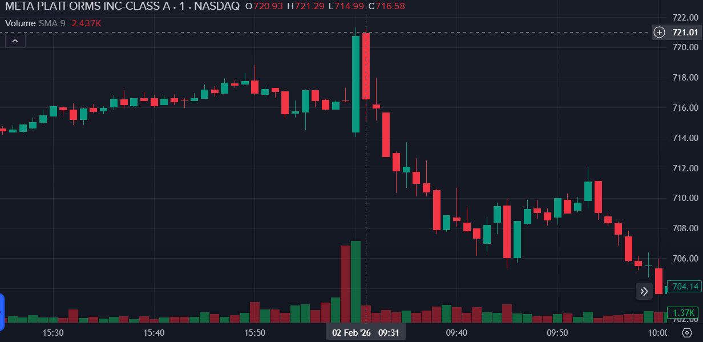
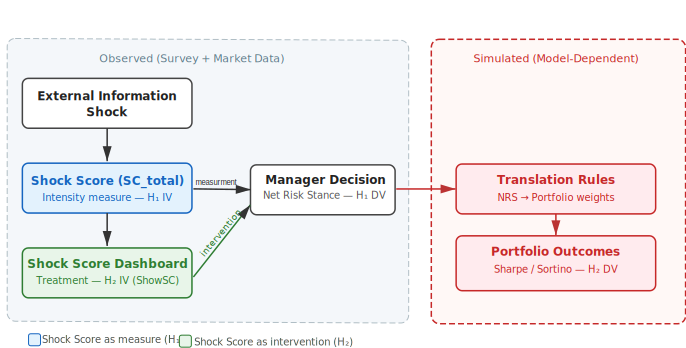
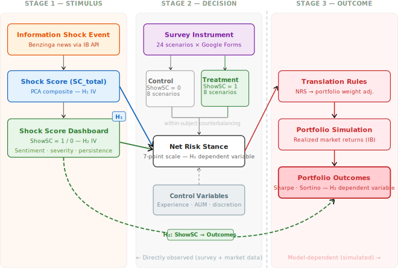

# Reducing Emotional Biases in Investment Portfolio Management
- Authentication of Work
- Foreword
- Acknowledgements
- Table of Contents
- List of Tables
- List of Figures
- List of Abbreviations and Acronyms
- Executive Summary

# Chapter 1. Introduction

## 1.1 Background of the Problem
### 1.1.1 Emotional Biases in Investment Decision-Making
### 1.1.2 Information Overload and News-Driven Markets
### 1.1.3 Behavioral Reactions to External Financial News

## 1.2 Background of the Study
### 1.2.1 Traditional Portfolio Theory and Rational Decision Assumptions
### 1.2.2 Emergence of Behavioral Finance
### 1.2.3 Decision Support Tools in Modern Portfolio Management

## 1.3 Purpose of the Study
### 1.3.1 Reducing Emotional Overreaction in Portfolio Decisions
### 1.3.2 Role of Quantitative Signals in Managerial Decision Support

## 1.4 Significance of the Study
### 1.4.1 Academic Contribution to Behavioral Finance Literature
### 1.4.2 Practical Relevance for Portfolio Managers
### 1.4.3 Implications for Risk Management Practices

## 1.5 Scope and Delimitations
### 1.5.1 Asset Classes and Market Coverage
### 1.5.2 Time Horizon and Frequency of Decisions
### 1.5.3 Methodological Boundaries of the Study

## 1.6 Structure of the Thesis

-------------------------------

# Chapter 2. Objectives of the Study

## 2.1 Chapter Introduction

>Chapter 2 defines the research scope and agenda for this thesis. It restates the managerial problem motivating the study (Section 2.2), specifies the objectives that guide the empirical work (Section 2.3), and presents the research questions and hypothesis statements to be evaluated (Sections 2.4-2.6). The chapter also provides operational definitions of key terms and records assumptions and limitations that bound interpretation of the findings (Section 2.8). 

## 2.2 Problem Statement

When quarterly earnings results arrive after market close or a central bank announces an unexpected policy shift, portfolio managers face immediate pressure to reassess positions before the next trading session. These decisions are made under uncertainty, information overload, and rapidly evolving market narratives ([Hirshleifer, 2015](https://doi.org/10.1146/annurev-financial-092214-043752); [Kahneman & Tversky, 1979](https://doi.org/10.2307/1914185), [Peng & Xiong, 2006](https://doi.org/10.1016/j.jfineco.2005.05.003)). In such environments, decision-makers may be exposed to emotionally salient external information shocks that can increase cognitive load and time pressure ([Hirshleifer, 2015](https://doi.org/10.1146/annurev-financial-092214-043752); [Peng & Xiong, 2006](https://doi.org/10.1016/j.jfineco.2005.05.003)). This study is motivated by the practical concern that such conditions may lead to systematic deviations from disciplined decision-making ([Kahneman & Tversky, 1979](https://doi.org/10.2307/1914185), [Shefrin, 2002](https://doi.org/10.1093/oso/9780195304213.001.0001), [Barber & Odean, 2008](https://doi.org/10.1093/rfs/hhm079)). In portfolio management, such deviations can manifest as procyclical rebalancing ([Elkind et al., 2022](https://doi.org/10.3905/JFDS.2021.1.085)), excessive turnover ([Barber & Odean, 2000](https://dx.doi.org/10.2139/ssrn.219228)), delayed adjustment, or temporary departures from strategic risk targets -- each of which may degrade risk-adjusted returns and increase drawdown exposure over short horizons.

The research problem addressed in this thesis is twofold. First, the study examines whether external financial information shocks are associated with systematic changes in managers' immediate risk stance. Second, it evaluates whether a structured decision-support indicator, the Shock Score, is associated with changes in investment decision outcomes when moderating responses under shock conditions.

Accordingly, the Shock Score serves two roles in this study: as a continuous measure of shock intensity for evaluating the relationship between shocks and decisions, and as an experimental treatment condition in which the Shock Score dashboard is explicitly displayed to managers during scenario evaluation in order to structure interpretation of information and reduce the influence of emotional and cognitive biases on decision-making. The study is designed as applied research focused on professional decision-making, rather than on claims of market inefficiency or return predictability. In this context, market inefficiency refers to systematic deviations of prices from fundamental values ([Fama, 1970](https://doi.org/10.1111/j.1540-6261.1970.tb00518.x)), and return predictability refers to the ability to forecast future excess returns based on publicly available information ([Cochrane, 2005](https://books.google.com/books/about/Asset_Pricing.html?id=20pmeMaKNwsC)).

The behavioral finance literature documents that earnings announcements and other discrete information events frequently produce short-term price overreaction followed by partial reversal, consistent with attention-driven trading and emotional processing of salient news ([Jiang & Zhu, 2016](https://papers.ssrn.com/sol3/papers.cfm?abstract_id=2891216); [Meng et al., 2024](https://doi.org/10.1016/j.irfa.2024.103219)). A practical illustration of this pattern is provided by the intraday price dynamics of Meta Platforms Inc. on 2 February 2026, coinciding with the public release of quarterly earnings results. The announcement was widely interpreted as outperforming market expectations, triggering a rapid price adjustment and elevated trading volume. Despite the positive informational content, the immediate price response was followed by pronounced short-term volatility and partial reversal, consistent with the short-horizon overreaction patterns documented in the empirical literature ([Hirshleifer, 2015](https://doi.org/10.1146/annurev-financial-092214-043752)).

Figure 2.1 Intraday price movement of Meta Platforms Inc. on 2 February 2026 following the release of quarterly earnings results, illustrating a short-horizon market reaction to an external information shock. Source: Interactive Brokers.

### 2.2.1 Emotional Bias as a Source of Suboptimal Portfolio Decisions

Dual-process accounts of judgment hold that portfolio decisions are shaped by both analytical judgment and affective responses, particularly under uncertainty and time pressure ([Kahneman, 2011](https://www.worldcat.org/oclc/706020998); [Kahneman, 2003](https://www.worldcat.org/oclc/706020998)). Emotional and cognitive biases may influence how information is interpreted and acted upon, leading to inconsistent or procyclical decision responses relative to an investor's stated objectives and constraints ([Hirshleifer, 2015](https://doi.org/10.1146/annurev-financial-092214-043752)). In this thesis, emotional bias is treated as a plausible mechanism that may contribute to suboptimal decision patterns, to be examined through the literature review in Chapter 3 and evaluated empirically through the analysis of primary survey data and secondary market data in Chapters 5 and 6.

### 2.2.2 Impact of External Information Shocks on Risk – Return Outcomes

External financial information shocks are defined as discrete public events relevant to portfolio holdings that may trigger rapid market reactions and elevate decision urgency ([Jiang & Zhu, 2016](https://papers.ssrn.com/sol3/papers.cfm?abstract_id=2891216); [Meng et al., 2024](https://doi.org/10.1016/j.irfa.2024.103219)). Empirical research in behavioral finance documents evidence that such shocks can affect decision behavior and, therefore, influence portfolio outcomes, particularly when decisions are made over short horizons ([Hirshleifer, 2015](https://doi.org/10.1146/annurev-financial-092214-043752); [Elkind et al., 2022](https://doi.org/10.3905/JFDS.2021.1.085)). The magnitude and persistence of market responses may vary by event type and context ([Jiang & Zhu, 2016](https://papers.ssrn.com/sol3/papers.cfm?abstract_id=2891216); [Tetlock, 2007](https://doi.org/10.1111/j.1540-6261.2007.01232.x)), and these relationships are treated as empirical questions to be evaluated through the study design.

The Shock Score, an original composite indicator developed in this thesis and formally defined in section 2.6.3, is introduced as a decision-support mechanism intended to structure interpretation of shock information and support disciplined responses. Its construction draws on established approaches to sentiment measurement ([Tetlock, 2007](https://doi.org/10.1111/j.1540-6261.2007.01232.x)) and principal-component-based index design ([Baker & Wurgler, 2006](https://doi.org/10.1111/j.1540-6261.2006.00885.x)). As reviewed in Chapter 3, existing decision-support tools in finance are predominantly designed for quantitative analytics and algorithmic execution ([Angelova et al., 2023](https://doi.org/10.3386/w31747); [Lim, 2025](http://dx.doi.org/10.1080/15427560.2025.2609644)), while providing limited structural support for identifying or mitigating behavioral biases before decisions are made ([Goodell et al., 2023](https://doi.org/10.1016/j.jbef.2022.100722); [Barberis & Thaler, 2002](https://dx.doi.org/10.2139/ssrn.327880 )). The Shock Score is designed to address this gap by combining real-time shock quantification with a rules-based pre-commitment protocol that activates structured decision procedures precisely when behavioral vulnerability is expected to be elevated.

## 2.3 Objectives of the Study

The overall objective of the study is to evaluate whether a structured, practitioner-oriented Shock Score can support investment decision outcomes under external information shock conditions. The study operationalizes outcomes in terms of risk-adjusted portfolio performance, consistent with the premise that shocks may induce both excessive risk-taking and excessive de-risking ([Kahneman & Tversky, 1979](https://doi.org/10.2307/1914185); [Barber & Odean, 2001](https://doi.org/10.1162/003355301556400); [Chen et al., 2024](http://doi.org/10.2139/ssrn.4942370)).

The objectives of the study are as follows. They reflect a **hypothesized** causal logic, grounded in the behavioral finance literature, in which information shocks **may** affect managerial decisions, and decisions may in turn affect portfolio outcomes. This causal pathway is the subject of empirical investigation in this thesis, not an assumed conclusion.

The first link in this pathway concerns the relationship between external information shocks and managerial decision response. The behavioral finance literature documents that discrete, emotionally salient information events can activate cognitive and affective biases – including overconfidence, loss aversion, and attention-driven extrapolation – that systematically alter how professionals interpret and respond to new information ([Hirshleifer, 2015](https://doi.org/10.1146/annurev-financial-092214-043752); [Kahneman & Tversky, 1979](https://doi.org/10.2307/1914185)). Under time pressure and information overload, these biases may produce decision responses that deviate from the manager's stated investment objectives, manifesting as procyclical rebalancing, excessive position changes, or delayed adjustment ([Elkind et al., 2022](https://doi.org/10.3905/JFDS.2021.1.085); [Barber & Odean, 2000](https://dx.doi.org/10.2139/ssrn.219228), [Jiang & Zhu, 2016](https://papers.ssrn.com/sol3/papers.cfm?abstract_id=2891216])).

The second link concerns the potential role of structured decision support in moderating these responses. The Shock Score, an original composite indicator developed in this thesis and formally defined in section 2.6.3, is designed to quantify the emotional and informational intensity of an external shock and to present this information to managers through an interpretable dashboard. The dashboard incorporates sentiment direction, shock severity, a persistence horizon estimate, and a rules-based pre-commitment protocol. The rationale for this design draws on evidence that pre-commitment mechanisms and structured decision rules can reduce emotional reactivity in professional investment contexts ([Henderson et al., 2018](https://doi.org/10.1016/j.jet.2018.10.002); [Statman, 2019](https://doi.org/10.2139/ssrn.3668963)), and that transparent, rule-based decision support improves the quality of human-AI interaction in advisory settings ([Bianchi et al., 2022](https://dx.doi.org/10.2139/ssrn.3825110)).

The third link concerns the downstream consequence: whether moderated decision responses are associated with changes in portfolio risk-return characteristics. Portfolio outcomes are evaluated through simulation using risk-adjusted performance measures, as defined in section 2.3.3. This link is model-dependent and subject to the limitations acknowledged in section 2.8.3.

Figure 2.3 provides a schematic representation of this three-stage causal logic, distinguishing between the directly observed decision response and the model-dependent portfolio outcome evaluation.

External information shock → Behavioral activation → Decision response (Net Risk Stance)
                                                          ↓
                                              Portfolio risk-return outcome
                                                          ↑
                              Shock Score dashboard → Structured interpretation → Disciplined response

this schematic chart does not convey what you want to say. Expand the above in one or more paragraphs and then you can use a schematic representation to consolidate the reader understanding. MIND to systematically use in-text references.

The first objective addresses the upper path: whether shocks produce systematic shifts in decision response. The second objective addresses the intervention: whether the Shock Score moderates those responses. The third objective addresses the downstream consequence: whether moderated responses are associated with changes in portfolio outcomes.

### 2.3.1 Assessing the Effect of Information Shocks on Investment Decisions

The first objective is to assess whether external financial information shocks are associated with systematic shifts in managers’ immediate decision response. Decision response is collected through primary data as a single-item, seven-point Net Risk Stance scale ([Doronila, 2024](https://dx.doi.org/10.2139/ssrn.5877342)) capturing the direction and intensity of intended exposure adjustment in response to a shock scenario.

Decision response is collected through primary data as a single-item, seven-point Net Risk Stance (NRS) scale, developed for this study and following established Likert-type measurement conventions ([Doronila, 2024](https://dx.doi.org/10.2139/ssrn.5877342)), capturing the direction and intensity of intended exposure adjustment in response to a shock scenario. The use of a single-item measure is appropriate here because the construct -- directional portfolio adjustment intention -- is concrete and unidimensional, and survey parsimony is critical when administering multiple scenarios to time-constrained professionals ([Bergkvist & Rossiter, 2007]( https://doi.org/10.1509/jmkr.44.2.175)).

Net Risk Stance response scale (single item, seven points):
1. Strongly reduce exposure  
2. Reduce exposure  
3. Slightly reduce exposure  
4. No change  
5. Slightly increase exposure  
6. Increase exposure  
7. Strongly increase exposure

### 2.3.2 Evaluating the Value Added of the Shock Score

The second objective is to evaluate whether providing the Shock Score to moderates decision behavior and is associated with changes in outcomes relative to a no-score condition. The study uses a within-subject design ([Charness et al., 2012](https://doi.org/10.1016/j.jebo.2011.08.006)) in which each participant is exposed to both conditions, enabling comparison of responses while controlling for stable individual differences. The Shock Score is presented as a manager-facing dashboard designed to structure interpretation and trigger a pre-committed decision protocol under high-shock conditions ([Henderson et al., 2018](https://doi.org/10.1016/j.jet.2018.10.002); [Statman, 2019](https://doi.org/10.2139/ssrn.3668963)).

### 2.3.3 Measuring Changes in Portfolio Risk – Return Characteristics

The third objective is to measure whether decision support is associated with changes in portfolio risk–return characteristics. Portfolio outcomes are evaluated using risk-adjusted performance measures, with Sharpe ratio ([Sharpe, 1966](https://doi.org/10.1086/294846)) and Sortino ratio ([Sortino & van der Meer, 1991](https://doi.org/10.3905/jpm.1991.409343)) specified as primary metrics. The precise computation conventions (return horizon, downside threshold definition for Sortino, and risk-free rate convention for Sharpe) are defined in Chapter 4 to ensure reproducibility and consistency across analyses.

## 2.4 Research Questions

This study is guided by two research questions that correspond directly to the objectives and hypotheses. The first research question focuses on whether external information shocks are associated with systematic variation in managerial decision response. The second research question evaluates whether the Shock Score, as a decision-support intervention, is associated with changes in investment decision outcomes when managers face such shocks.

### 2.4.1 Do External Information Shocks Affect Portfolio Risk – Return Ratios?

Do external financial information shocks lead to statistically significant differences in managers’ immediate Net Risk Stance responses and, in downstream evaluation, portfolio risk – return outcomes?

### 2.4.2 Does the Shock Score Improve Investment Decision Outcomes?

Does providing the Shock Score to portfolio managers affect investment decision outcomes, measured through portfolio risk–return metrics, relative to a condition in which the Shock Score is not provided?

## 2.5 Hypothesis Statement(s)

The study tests two hypotheses. Hypothesis statements are presented in null and alternative form and are evaluated using the primary and secondary data described in Chapters 4 and 5. The hypotheses are written to align with the study design, where shock intensity is measured at the event level and decision support is implemented as an experimental condition in which the Shock Score is shown or withheld.

### 2.5.1 Hypothesis H1 – Influence of Information Shocks on Decisions

**H1₀:** The intensity of external financial information shocks has no statistically significant effect on managers' Net Risk Stance responses.

**H1ₐ:** The intensity of external financial information shocks has a statistically significant effect on managers' Net Risk Stance responses.

H₁ evaluates whether variation in shock intensity, as captured by the composite Shock Score (SC_total, defined in Section 2.6.3), is associated with systematic differences in the direction and magnitude of managers' stated exposure adjustments. Net Risk Stance is operationalized as a single-item, seven-point scale defined in section 2.3.1. The downstream relationship between decision responses and portfolio risk–return outcomes is evaluated through the simulation design described in Chapter 4.

### 2.5.2 Hypothesis H2 – Value Added of the Shock Score

**H2₀:** Introducing the Shock Score for investment decision-making has no statistically significant effect on the risk–return ratio of the portfolio.

**H2ₐ:** Introducing the Shock Score for investment decision-making has a statistically significant effect on the risk–return ratio of the portfolio.

H₂ evaluates whether providing the Shock Score dashboard to managers during shock scenarios changes portfolio outcomes relative to a no-score condition. Risk–return ratio is operationalized through Sharpe ratio and Sortino ratio as defined in section 2.6.4. The treatment condition (ShowSC = 1 versus ShowSC = 0, as defined in Section 2.6.3) is implemented through the within-subject experimental design, where each manager is exposed to comparable scenarios with and without the Shock Score.

## 2.6 Definitions of Key Terms

This section defines key terms used throughout the thesis. Definitions are operational and intended to support consistent measurement and interpretation in later chapters.

### 2.6.1 Emotional Bias

Emotional bias refers to systematic deviations in judgment and choice that arise from affective responses under uncertainty ([Kahneman & Tversky, 1979](https://doi.org/10.2307/1914185); [Hirshleifer, 2015](https://doi.org/10.1146/annurev-financial-092214-043752)), leading decision-makers to overweight salient or emotionally charged information relative to a deliberative, rule-consistent decision process.

### 2.6.2 External Financial Information Shock

An external financial information shock is a discrete public information event relevant to a portfolio holding that arrives over a short horizon and has the potential to trigger heightened attention, uncertainty, and rapid market reaction ([Jiang & Zhu, 2016](https://papers.ssrn.com/sol3/papers.cfm?abstract_id=2891216)).

### 2.6.3 Shock Score

The Shock Score is a quantitative decision-support indicator designed to summarize the emotional and informational intensity of an external financial information shock in a manager-interpretable format. In this thesis, the Shock Score has two representations: an analytical composite index used for statistical testing and an operational dashboard used for decision support. The construction methodology, component definitions, PCA-based composite index computation, and Shock Score dashboard design are documented in Section 4.3.

Treatment indicator for decision support:
The study distinguishes between the existence of SC_total for an event and whether it is shown to the manager. For each manager i and event e:

ShowSC_i,e = 1 if the Shock Score dashboard is displayed
ShowSC_i,e = 0 if the Shock Score dashboard is withheld

When the Shock Score is not displayed, SC_total remains defined at the event level; it is simply not observed by the respondent.

### 2.6.4 Risk – Return Ratio

Risk – return ratio refers to a risk-adjusted measure of portfolio performance that evaluates return relative to risk exposure. In this thesis, Sharpe ratio and Sortino ratio are specified as primary risk – return metrics for evaluating portfolio outcomes under alternative decision conditions.

Sharpe ratio ([Sharpe, 1966](https://doi.org/10.1086/294846)):
Let r_t denote portfolio return over period t and r_f denote the risk-free rate over the same period. Let mu denote the mean of excess returns (r_t - r_f) and sigma denote the standard deviation of excess returns. Then:

Sharpe = mu / sigma

Sortino ratio ([Sortino & van der Meer, 1991](https://doi.org/10.3905/jpm.1991.409343)):
Let MAR denote a minimum acceptable return, often set to the risk-free rate or zero depending on convention. Let mu denote the mean of excess returns (r_t - MAR). Let sigma_d denote downside deviation, defined as the square root of the mean of squared shortfalls below MAR:

sigma_d = sqrt( E[ min(0, r_t - MAR)^2 ] )

Then:

Sortino = mu / sigma_d

Exact conventions for r_f, MAR, sampling frequency, and annualization are specified in Chapter 4.

## 2.7 Assumptions

Assumptions describe the conditions under which the research design supports valid interpretation. These assumptions are not treated as established facts but as prerequisites for empirical evaluation and inference.

### 2.7.1 Availability and Timeliness of Information

The study assumes that the timing of external information shocks can be identified and aligned consistently with the decision window represented in the survey scenarios and portfolio outcome evaluation. The study further assumes that the event-level shock characteristics used to construct SC_total and persistence are computed consistently across events and do not rely on ex post outcome information that would compromise interpretation.

### 2.7.2 Consistency of Portfolio Decision Rules

The study assumes that respondents interpret the decision task consistently and that the Net Risk Stance scale captures intended exposure adjustment in a comparable way across respondents and scenarios. Random assignment of scenarios to conditions is assumed to mitigate systematic learning and order effects ([Charness et al., 2012](https://doi.org/10.1016/j.jebo.2011.08.006)). he design further assumes that respondents' decisions reflect their intended stance under the scenario constraints and are not materially distorted by survey fatigue or strategic responding ([Krosnick, 1999](https://doi.org/10.1146/annurev.psych.50.1.537)).

## 2.8 Limitations

Limitations define boundaries on measurement, inference, and generalizability. They clarify what the study can and cannot conclude from the data and design.

### 2.8.1 Measurement of Emotional Intensity

Emotional intensity is not observed directly in this study and is proxied through observable shock characteristics and their aggregation into the Shock Score. As a result, construct validity depends on the adequacy of the selected shock characteristics, the stability of the PCA-based index, and the interpretability of the dashboard components. Because the persistence score and protocol are model-based and rules-based components respectively, their effectiveness depends on the appropriateness of predefined mappings and thresholds, which may not be universally optimal across all event types.

### 2.8.2 Generalizability Across Market Conditions

Findings may not generalize beyond the defined portfolio universe, event types, and time horizon represented by the use cases. The effectiveness of the Shock Score and the associated pre-commitment protocol may vary across market regimes, volatility environments, and institutional contexts. The within-subject experimental setting evaluates intended decision responses under controlled scenarios and may differ from real-world behavior under organizational constraints, transaction costs, and liquidity considerations.

### 2.8.3 Dependence on Portfolio Simulation Assumptions

The study evaluates portfolio risk-return outcomes through simulation rather than through observation of actual trading ([Charness et al., 2012](https://doi.org/10.1016/j.jebo.2011.08.006)). Managers provide stated decision responses via the survey instrument; these responses are then translated into portfolio weight adjustments and evaluated against realized market returns within a simulation framework. As with any design relying on stated rather than revealed preferences, the relationship between reported intentions and actual behavior introduces a potential validity constraint ([Huber et al., 2021](https://doi.org/10.1016/j.jebo.2021.12.007)). As a result, the portfolio outcome findings for H₂ are jointly conditional on two elements: (a) the behavioral effect of the Shock Score on stated decisions, and (b) the adequacy of the simulation model that maps stated decisions to portfolio returns. If the translation rules, rebalancing assumptions, or return-attribution conventions do not adequately represent how stated intentions would manifest in live portfolio management, the portfolio-level results may over- or understate the true effect of decision support. Figure 2.2 illustrates the boundary between directly observed data and model-dependent inference. The simulation design, including all translation rules and rebalancing conventions, is fully specified in Chapter 4 to enable independent assessment of these assumptions.

![Figure 2.2: Causal logic of the study design. The left domain (observed) encompasses survey responses and market data. The right domain (simulated) encompasses the translation of stated decisions into portfolio outcomes, introducing model dependency that bounds interpretation of H₂ results.]

## 2.9 Chapter Conclusion

Chapter 2 defined the research problem and objectives, formulated research questions and hypotheses, and established key operational definitions, assumptions, and limitations guiding the empirical study. The chapter specified the primary measurement approach for managerial decision response using a single-item Net Risk Stance scale and defined the Shock Score as a PCA-based composite decision-support indicator with two representations: an analytical composite index and a manager-facing dashboard. The construction methodology and component definitions are detailed in Chapter 4 (Section 4.3).

Taken together, the study design integrates real-time shock measurement, a professional sample of portfolio managers, behaviorally grounded decision support, and portfolio-level outcome validation -- an integration that, as the gap analysis presented in Chapter 3 (Section 3.6) demonstrates, does not appear to have been attempted in prior research. Chapter 3 examines the theoretical and empirical literature that motivates the study constructs and supports the logic linking information shocks, managerial decision behavior, and portfolio risk-return outcomes.

# Chapter 3. Literature Review

>The literature review is designed to bridge foundational behavioral finance theory with applied challenges in professional investment decision-making, culminating in the rationale for structured debiasing tools.

## 3.1 Link Between Literature and Research Hypotheses

>This introductory section defines key theoretical constructs (e.g., information shocks, behavioral bias, Shock Score) and links them to the research problem.

The research hypotheses draw on key concepts from behavioral finance and decision-making literature, focusing on how information shocks affect market behavior. An **information shock** refers to publicly available news or updates about individual stocks that generate a material short-term market reaction, typically observable at a daily frequency. Such shocks affect short-term price dynamics and volatility without necessarily changing the long-term fundamentals of the underlying firm and, therefore, its valuation.

The literature reviewed in this chapter suggests that information shocks influence market prices through behavioral and emotional biases. Empirical studies commonly document that investors and managers can overreact to salient or emotionally charged news due to cognitive and affective biases, leading to temporary price distortions rather than a purely fundamentals-based revaluation.

The Shock Score introduced in this thesis is motivated by research on sentiment, attention, and volatility-based measures of market reaction. In this thesis’s framing, it operationalizes the emotional intensity of an information shock by capturing abnormal short-term responses, such as excess daily volatility, that are interpreted as arising from behavioral reactions rather than fundamental reassessment.

While the literature contains indices and measures aimed at capturing market sentiment or uncertainty, such as sentiment indices or news-based volatility indicators, comparatively less attention has been devoted to tools explicitly designed to support managerial decision-making at the time of an information shock. This motivates the development and empirical testing of the Shock Score as a decision-support mechanism intended to improve investment decisions by reducing behavioral overreaction.

Taken together, the literature reviewed below is interpreted in this thesis as implying a causal pathway from external information shocks to portfolio-level outcomes. Sudden and salient news events increase cognitive load and emotional arousal, activating behavioral biases such as overconfidence, loss aversion, attention-driven extrapolation, and herding. These biases can distort managers' perceptions of risk and return precisely when rapid decisions are required. They may lead to systematically altered portfolio actions, including procyclical rebalancing, excessive turnover, delayed adjustment, or temporary deviations from strategic risk targets. As a result, information shocks are expected to affect realized portfolio risk-return characteristics in the short term, not only through price dynamics but also through behaviorally mediated decision errors. This logic provides the theoretical foundation for the first research hypothesis, which examines whether external information shocks are associated with measurable changes in portfolio risk-return outcomes.

---

## 3.2 Behavioral Biases in Investment Decision-Making

>This section surveys behavioral finance theory, showing how cognitive biases like overconfidence, loss aversion, the disposition effect, and emotional trading shape investor behavior. It integrates psychological theory and empirical findings with a focus on market reactions and volatility.

### 3.2.1 Behavioral biases driving overreaction under uncertainty

Professional investors, despite their expertise, are not immune to the cognitive shortcuts and biases that affect human judgment under uncertainty. Several prevalent biases, including **overconfidence**, **availability and recency bias**, **herding**, and **emotional/physiological biases**, can cause expert decision-makers to react in ways that amplify short-term market volatility and overreact to financial information shocks. The following paragraphs discuss each bias and its impact on short-term market dynamics.

Overconfidence is a well-documented cognitive bias in which individuals exhibit unwarranted faith in the accuracy of their judgments and beliefs ([Moore & Healy, 2008](https://doi.org/10.1037/0033-295X.115.2.502)). In the finance literature, overconfidence manifests in excessive trading and systematic overestimation of predictive ability. Barber and Odean (2001) provide evidence that investors with higher inferred overconfidence trade more frequently and earn lower risk-adjusted returns, a pattern consistent with overconfidence-driven misjudgment ([Barber & Odean, 2001](https://doi.org/10.1162/003355301556400)).

This bias manifests even among professionals; for example, successful traders and fund managers may become overconfident in their skill, particularly after a streak of good performance ([Gervais & Odean, 2001](https://doi.org/10.1093/rfs/14.1.1)). Overconfidence leads investors to underweight risks and trade more aggressively than rational benchmarks would predict, often to their own detriment ([Odean, 1999](https://doi.org/10.1257/aer.89.5.1279)). Theoretical models show that overconfident investors can introduce excess volatility into markets by overreacting to new information. Prices may move more than fundamentals justify due to overly aggressive trading on private signals, generating short-run momentum that later reverses ([Daniel et al., 1998](https://doi.org/10.1111/0022-1082.00077)). In short, overconfidence can cause initial overreactions to news followed by subsequent reversals once information is corrected, contributing significantly to short-term market volatility.

Another class of bias arises from the heuristics investors use to judge the importance of information. The availability heuristic refers to the tendency to assess the probability or relevance of an event based on how easily examples come to mind ([Tversky & Kahneman, 1974](https://doi.org/10.1126/science.185.4157.1124)). This implies that vivid or recent information often dominates decision-making because it is readily recalled, even if it is not objectively more informative. A closely related phenomenon is recency bias, the inclination to give disproportionately high weight to the most recent events or data points when forming judgments. Evidence in behavioral finance indicates that investors and other decision-makers overweight recent outcomes relative to earlier information, thereby distorting expectations ([Hirshleifer, 2015](hhttps://dx.doi.org/10.2139/ssrn.2480892)). Even seasoned professionals are susceptible: mutual fund managers have been shown to extrapolate their fund's recent performance into their outlook for the overall market, effectively basing forecasts on the latest returns rather than long-term fundamentals ([Azimi, 2019](https://doi.org/10.2139/ssrn.3462776)). Such availability and recency biases can amplify short-term volatility by fueling overreactions to salient news, as prices may temporarily overshoot intrinsic values before expectations adjust.

Herding describes the tendency of investors to mimic the actions of others instead of relying on their own independent analysis. In uncertain environments, the literature documents that even professional investors may follow the crowd, for instance by buying or selling a stock because many of their peers are doing so, either assuming that the collective might know better or as a form of career risk management (it may feel safer to err in a crowd than to err alone) ([Jiang & Verardo, 2018](https://doi.org/10.1111/jofi.12699); [Bikhchandani et al., 1992](https://doi.org/10.1086/261849)). In formal terms, herd behavior occurs when investors follow or copy others' investment decisions rather than act on their private information. The herding heuristic can amplify short-term market movements: coordinated buying may push prices above fundamentals and coordinated selling below. Empirical evidence indicates that herding-induced price pressures can be short-lived: stocks persistently bought by institutions tend to earn negative subsequent returns as prices correct, while persistently sold stocks tend to rebound ([Jiang & Verardo, 2018](https://doi.org/10.1111/jofi.12699); [Brown et al., 2014](https://doi.org/10.1287/mnsc.2013.1751)). Accordingly, herding by professional investors can contribute to short-run price instability and volatility around information events.

Beyond cognitive heuristics, emotional and physiological factors can heavily influence investors' judgment under stress. Professional decision-makers are not emotionless agents; feelings such as fear, greed, anxiety, or over-excitement can bias choices, particularly during market shocks. Research documents that acute stress and arousal can impair decision-making even in expert traders ([Lo et al., 2005](https://doi.org/10.1257/000282805774670095); [Coates & Herbert, 2008](https://doi.org/10.1073/pnas.0704025105)). During periods of market turmoil, fear can trigger a physiological stress response that inclines investors to flee from risk. Elevated cortisol levels have been shown to correspond with such conditions; under high cortisol, traders become more risk-averse, potentially intensifying sell-offs ([Coates & Herbert, 2008](https://doi.org/10.1073/pnas.0704025105)). Conversely, in euphoric markets, testosterone-linked increases in confidence and risk-taking may reinforce speculative behavior; excessive levels can foster reckless overconfidence (Coates, 2010, The winner effect: Testosterone, cortisol and the risk of financial bubbles). Evidence further indicates that traders exhibiting extremely intense emotional reactions tend to make poorer trading decisions and achieve worse outcomes on average ([Lo et al., 2005](https://doi.org/10.1257/000282805774670095)). Overall, emotional and physiological biases contribute to short-term market instability by driving overreactions to information shocks.

### 3.2.2 Loss aversion and asymmetric responses to negative information

Prospect theory, as developed by Kahneman and Tversky, posits that individuals exhibit loss aversion, meaning that losses are experienced more intensely than gains of equal magnitude ([Kahneman & Tversky, 1979](https://doi.org/10.2307/1914185)). This framework shapes how decision-makers respond to financial news shocks.

Empirical research suggests that market participants, including professional investors, exhibit asymmetric reactions to negative versus positive information. For example, Tetlock (2007) finds that negative media sentiment predicts a temporary decline in daily market returns, with prices typically rebounding shortly thereafter, a pattern consistent with overreaction to pessimistic news ([Tetlock, 2007](https://doi.org/10.1111/j.1540-6261.2007.01232.x)).

Löffler et al. (2021) analyze market reactions to credit rating changes and show that downgrades trigger substantially larger price movements than upgrades. This pronounced asymmetry indicates that markets penalize negative credit news far more strongly than they reward positive revisions, even when the underlying informational content is comparable ([Löffler et al., 2021](https://doi.org/10.1016/j.jbankfin.2021.106256)).

Neel (2024) provides cross-country evidence that institutional investors operating in more loss-averse cultural environments react more strongly to negative earnings surprises than to positive ones ([Neel, 2024](https://doi.org/10.1142/S1094406024500215)). This cultural perspective reinforces the systematic nature of asymmetric reaction patterns and supports the view that overreaction—particularly in response to loss-related information—is a persistent behavioral feature of financial markets.

Taken together, these findings are synthesized in this thesis to support the assumption that negative financial shocks tend to provoke more immediate and emotionally amplified responses than positive shocks, thereby increasing the likelihood of short-term overreaction and subsequent reversal dynamics.

### 3.2.3 The disposition effect and emotion-driven trading behavior

The disposition effect refers to the tendency of investors to sell assets that have performed well while retaining assets that have incurred losses, a behavior leading to suboptimal portfolio rebalancing. While initially documented among retail investors, subsequent empirical research shows that the disposition effect is also present among professional decision-makers, including institutional investors. Using detailed trading records, Grinblatt and Keloharju (2001) show that investors are more likely to sell winning positions than losing ones, even after controlling for tax considerations and liquidity needs ([Grinblatt & Keloharju, 2001](https://doi.org/10.1111/0022-1082.00338)). Similarly, Frazzini (2006) finds that the disposition effect contributes to underreaction to news and predictable return patterns, consistent with investors holding losing positions too long and realizing losses too slowly ([Frazzini, 2006](https://doi.org/10.1111/j.1540-6261.2006.00896.x)). These findings indicate that regret avoidance and emotional attachment to losses can interfere with rational rebalancing decisions even in institutional settings.

The literature suggests that overreaction to information shocks can, in some settings, reinforce the disposition effect rather than correct it. In this interpretation, emotionally salient losses increase the tendency to hold losing positions longer, while salient gains increase the tendency to realize winners prematurely, thereby embedding short-horizon decision errors into portfolio turnover and performance outcomes. Empirical evidence supports this mechanism: Da, Engelberg, and Gao (2011) show that attention-driven trading around news events increases turnover in attention-grabbing stocks, consistent with a stronger propensity to trade recent winners and delayed adjustment in losers ([Da et al., 2011](https://doi.org/10.1111/j.1540-6261.2011.01679.x)). As a result, emotion-driven trading following information shocks not only amplifies short-term volatility but also induces systematic rebalancing inefficiencies consistent with the disposition effect.

### 3.2.4 Overreaction and subsequent reversals following public news

Recent empirical evidence indicates that stock prices can overshoot in response to public information shocks, leading to short-term reversals that are consistent with behavioral overreaction rather than immediate convergence to fundamental value. Using event-based analysis, research documents that sharp price movements following public news often exceed what can be justified by fundamentals and are partially corrected in the days that follow, consistent with investor overreaction rather than efficient price adjustment ([Meng et al., 2024](https://doi.org/10.1016/j.irfa.2024.103219)).

These findings imply that public information shocks can generate short-term volatility and return predictability, as initial reactions reflect behavioral biases such as salience and confirmation rather than fully rational updating. As prices gradually revert toward intrinsic values, contrarian strategies become profitable, reinforcing the interpretation of these dynamics as overreaction-driven market responses.

Professional traders and institutional investors can amplify these misreactions. Cremers, Pareek, and Sautner (2021) show that stocks with high short-term institutional ownership exhibit particularly large announcement-day price reactions and subsequent reversals around analyst recommendation changes: prior outperformance (underperformance) is followed by negative (positive) future abnormal returns, consistent with overreaction ([Cremers et al., 2021](https://doi.org/10.1111/1475-679X.12352)).

Ben-Rephael et al. (2024) document that institutional trading around earnings announcements is strongly aligned with the magnitude of the initial price reaction, indicating that institutions tend to trade in the same direction as the earnings-day shock rather than correcting it ([Ben-Rephael et al., 2024](https://dx.doi.org/10.2139/ssrn.3966758)). Such synchronized trading behavior can exacerbate short-term volatility and push portfolios away from target allocations.

Systematic rebalancing flows further transmit these shocks into prices. Harvey, Mazzoleni, and Melone (2025) show that mechanical rebalancing by large asset managers generates statistically significant short-term price pressure; for example, when portfolios become overweight equities, subsequent selling pressure depresses equity returns by approximately 17 basis points on the following day ([Harvey et al., 2025](https://doi.org/10.2139/ssrn.5122748)). Taken together, the evidence indicates that news-driven overreactions by institutional investors produce transient mispricings and heightened volatility, creating pressure on portfolio allocation and rebalancing decisions.

### 3.2.5 Portfolio implications of behavioral biases

The reviewed literature shows that behavioral biases—particularly overconfidence, availability heuristics, herding, and loss aversion—distort professional investors' judgment during information shocks. These biases impair rational processing of news, leading to **overreactions in asset prices** characterized by short-term volatility spikes and predictable reversals. Even experienced institutional investors are not immune: emotional and cognitive biases alter risk perceptions, induce crowd behavior, and lead to premature or delayed trading decisions.

These distortions have clear implications for portfolio management. Emotional overreactions often result in **suboptimal rebalancing**—selling winners too early, holding losers too long, or overexposing portfolios to assets that have already experienced sharp price moves. The disposition effect, in particular, illustrates how reluctance to realize losses and eagerness to lock in gains can drag on long-term performance. Moreover, market-wide overreactions propagate through institutional flows, creating **systematic mispricing** that challenges the efficiency of portfolio allocation.

In sum, the literature establishes that behavioral biases shape short-term price dynamics and introduce persistent frictions into portfolio decision-making. These distortions manifest as excess volatility, predictable reversals, and suboptimal rebalancing behavior. This synthesis concludes the theoretical foundation for bias-driven market reactions; subsequent sections focus on how these mechanisms persist in professional contexts and how they can be mitigated in practice.

---

## 3.3 Managerial Decision-Making Under Uncertainty

>This section shifts the focus to professional investors and managers operating under real-world constraints: bounded rationality, organizational pressure, and framing effects. It shows how even experts, despite training, make predictably biased decisions under uncertainty.

### 3.3.1 Persistence of behavioral bias among experienced professionals

Even seasoned, well-incentivized managers rely on heuristic shortcuts in decision-making, underscoring the limits of human rationality. Bounded rationality—a concept introduced by Simon (1955)—posits that individuals face inherent constraints in cognitive capacity and information processing and therefore satisfice (seek a good-enough option) rather than optimally solve complex problems ([Simon, 1955](https://doi.org/10.2307/1884852)). In practice, this means that even professional managers with extensive training cannot exhaustively evaluate all alternatives or anticipate every possible outcome. Instead, they rely on experience-based rules of thumb and intuitive judgments, particularly under time pressure. While such heuristics facilitate decision-making, they also embed systematic biases, such as overconfidence or anchoring, that persist despite expertise.

High-stakes managerial environments often exacerbate this reliance on heuristics. Portfolio and strategic decisions are typically made under tight time constraints and uncertain information, making exhaustive rational evaluation infeasible. The cognitive effort required to weigh all possible options and outcomes is prohibitive when markets move quickly or when a flood of data must be processed in real time. Thus, even rational, incentivized managers resort to mental shortcuts as a practical response to complexity and time pressure (Simon, 1955; [Simon, 1955](https://doi.org/10.2307/1884852)). This boundedly rational behavior reflects human information-processing limits rather than lack of knowledge or effort. Unfortunately, the shortcuts that make decision-making manageable can systematically skew perceptions of risk and return.

Research shows that experience and expertise alone do not eliminate biases. Hodgkinson et al. (1999) show that framing can materially shift risky choices in strategic decision contexts, indicating that such effects can persist even among decision-makers with substantial managerial exposure ([Hodgkinson et al., 1999](https://doi.org/10.1002/(SICI)1097-0266(199910)20:10%3C977::AID-SMJ58%3E3.0.CO;2-X)). Likewise, Ben-David, Graham, and Harvey (2013) find that CFOs and other financial professionals produce severely miscalibrated forecasts, with confidence intervals far too narrow relative to realized market outcomes ([Ben-David et al., 2013](https://doi.org/10.1093/qje/qjt023)). March and Shapira (1987) also find that many managers perceive themselves as less risk-averse than their peers and view risk as largely controllable through skill and information, consistent with overconfidence and an illusion of control ([March & Shapira, 1987](https://doi.org/10.1287/mnsc.33.11.1404)). In short, professional training may raise awareness, but it does not fully immunize managers against bias in how they perceive and act on risky decisions.

The persistence of bias is evident in professional portfolio management as well. Behavioral finance research documents that even institutional investors and fund managers exhibit many of the same biases as retail investors. For instance, extrapolation and optimism biases can lead market participants to overweight recent winners in their expectations and take on excessive risk, a pattern that can backfire when prices mean-revert and subsequent returns disappoint ([Baker & Wurgler, 2007](https://doi.org/10.1257/jep.21.2.129)). Similarly, overconfidence is common: trading evidence shows that biased confidence drives frequent, costly trades and lower net performance ([Barber & Odean, 2001](https://doi.org/10.1162/003355301556400)). Professional decision-makers are also prone to herding and loss aversion, contributing to under-diversified portfolios and suboptimal investment timing ([Statman, 2019](https://doi.org/10.2139/ssrn.3668963)).

Knowing about cognitive biases is not sufficient to guarantee unbiased decisions. Decades of research and practical experience indicate that psychological insight must be complemented by structured decision support to improve judgment. Kahneman et al. (2021) argue that biases and noise cannot be reliably corrected through individual awareness alone and that organizations should instead rely on structured decision processes, rules, and judgment aggregation procedures to improve decision quality ([Kahneman et al., 2021](https://hbr.org/2016/10/noise)). In other words, mitigating bias requires more than awareness or good intentions; it demands systematic support tools and procedures that guide managers toward more rational and consistent choices. This need for structured debiasing mechanisms motivates the analysis in Section 3.4, which examines how decision-support frameworks can be designed to counteract persistent biases in managerial decision-making.

### 3.3.2 Situational Risk Preferences in Practice

Wiseman and Gomez-Mejia (1998) develop a behavioral agency framework in which performance below aspirations increases the propensity for risk taking, particularly as decision-makers approach distress thresholds ([Wiseman & Gomez-Mejia, 1998](https://doi.org/10.5465/AMR.1998.192967)). Similarly, Wennberg, Delmar, and McKelvie (2016) provide entrepreneurship evidence that risk-taking responses depend on performance feedback relative to aspiration levels, with behavior changing materially when outcomes fall below benchmarks ([Wennberg et al., 2016](https://doi.org/10.1016/j.jbusvent.2016.05.001)). These findings suggest that framing outcomes relative to benchmarks can flip risk preferences in practice.

Empirical studies show that professional decision-makers become risk-seeking when performance falls short of an aspiration or target. In line with prospect theory intuition, a fixed target acts as a reference point: when outcomes fall below the aspiration level, managers enter the loss domain and tend to increase risk-taking in an attempt to recover losses ([March & Shapira, 1987](https://doi.org/10.1287/mnsc.33.11.1404)).

Wiseman and Gomez-Mejia (1998) show that organizations experiencing poor performance become more willing to take risks as outcomes fall below aspiration levels, particularly as firms approach critical thresholds such as financial distress or bankruptcy ([Wiseman & Gomez-Mejia, 1998](https://doi.org/10.5465/AMR.1998.192967)).

Wennberg, Delmar, and McKelvie (2016) show that risk preferences are variable rather than fixed: decision-makers behave in a relatively risk-averse manner when performance meets or exceeds aspirations but become more risk-seeking once outcomes fall below benchmark levels ([Wennberg et al., 2016](https://doi.org/10.1016/j.jbusvent.2016.05.001)). These findings indicate that framing outcomes relative to aspiration benchmarks can systematically flip risk preferences, even in the absence of explicit incentive changes.

These biases often intensify during market downturns, despite managers' professional training. Behavioral evidence from controlled experiments indicates that during the COVID-19 market crash, finance professionals significantly reduced their allocations to risky assets even though fundamentals and price expectations remained unchanged—a pattern consistent with heightened situational risk aversion under stress ([Huber et al., 2021](https://www2.uibk.ac.at/downloads/c9821000/wpaper/2020-11.pdf)). This suggests that acute stress during sharp market declines can override deliberative planning, amplifying situational risk preferences even among experienced decision-makers.

### 3.3.3 Procyclical portfolio decisions under stress

The situational biases documented above translate into observable portfolio-level decision patterns. Herding and trend-chasing can creep into rebalancing practices, and stress can push professionals toward procyclical behavior consistent with 'buying high and selling low.' Physiological evidence shows that emotional arousal and stress measurably affect professional traders' real-time risk processing, helping explain panic-like trading under pressure ([Lo & Repin, 2002](https://doi.org/10.1162/089892902317361877)).

Consistent with this mechanism, Elkind et al. (2022) show that extreme market conditions trigger panic selling and rapid exits rather than disciplined rebalancing, leading to excessive turnover and destabilizing price pressure ([Elkind et al., 2022](https://doi.org/10.3905/JFDS.2021.1.085)). Under stress, managers may also de-risk portfolios for non-fundamental reasons. For example, fund managers reduce risk exposure by nearly 9 percent during culturally 'unlucky' periods, highlighting how non-financial pressures and superstition can induce systematic allocation errors ([Chen et al., 2024](http://doi.org/10.2139/ssrn.4942370)).

Bianchi et al. (2022) study how explainability in robo-advisory systems affects investor trust and delegation decisions, highlighting the importance of transparent, rule-based decision support in human–AI interaction ([Bianchi et al., 2022](https://dx.doi.org/10.2139/ssrn.3825110)). Complementary work recommends rule-based protocols—such as fixed-schedule rebalancing or performance-triggered adjustments—as a way to limit emotional interference in portfolio decisions ([Statman, 2019](https://doi.org/10.2139/ssrn.3668963)). In summary, structured tools and disciplined procedures, rather than intuition alone, are required to help professional investors avoid persistent cognitive traps.

---

## 3.4 Tools to Mitigate Emotional and Behavioral Bias

>This section reviews structured interventions such as decision-support systems, quantitative overlays, and behavioral coaching. It presents empirical evidence on how such tools mitigate bias and improve portfolio performance.

### 3.4.1 Rule-Based Approaches and Pre-Commitment Mechanisms

Many advisors rely on structured plans and decision rules to curb emotion-driven trading. For example, drafting an Investment Policy Statement (IPS) that clearly defines objectives, risk limits, and rebalancing rules can provide an objective framework for portfolio management and help reduce emotional reactions ([Statman, 2019](https://doi.org/10.2139/ssrn.3668963)).

Pre-commitment devices—such as automatic rebalancing schedules or predefined stop-loss and profit-taking triggers—shift decisions from reactive to procedural. Behavioral finance research emphasizes that committing in advance to explicit decision rules is one of the most effective ways to reduce emotional reactivity because such rules remain binding even when emotions run high ([Henderson et al., 2018](https://doi.org/10.1016/j.jet.2018.10.002)).

Although effective for discipline, these tools rely entirely on consistent human adherence, and their effectiveness diminishes under high emotional strain, market crises, or cognitive overload.

### 3.4.2 Automated and AI-Driven Approaches

Beyond static rules, automation can reduce the influence of human emotion on trading decisions. Robo-advisors and algorithmic systems base portfolio actions on data-driven models and predefined rules, limiting discretionary reactions and helping investors remain aligned with long-term strategies ([Jung et al., 2018](https://doi.org/10.1007/s12599-018-0521-9); [Baker & Dellaert, 2018](https://scholarship.law.upenn.edu/faculty_scholarship/1740/)). Algorithmic portfolios execute buy and sell decisions according to preset logic, irrespective of investor panic or euphoria.

Automated systems have important limitations. They rely on historical data and user-specified inputs, such as risk preferences, which may themselves embed biases. Moreover, purely automated models can struggle in novel or ambiguous environments. For this reason, researchers emphasize that high-stakes decision systems should combine automation with interpretable models, human oversight, and robust governance and audit mechanisms ([Rudin, 2019](https://doi.org/10.1038/s42256-019-0048-x)).

Some financial institutions employ text-based analytics to detect behavioral signals in analyst reports and news flows. Research using computational analysis of financial language shows that media tone and framing influence investor behavior and market dynamics, enabling the identification of sentiment-driven and herding-related biases ([Tetlock, 2007](https://doi.org/10.1111/j.1540-6261.2007.01232.x)).

### 3.4.3 Quantifying Bias: Metrics and Behavioral Factor Models

A critical advancement in behavioral finance is the quantitative operationalization of investor biases. Recent systematic review evidence synthesizes findings on a broad set of behavioral anomalies, including the disposition effect, excessive trading, and attention-driven behavior, and documents how these biases are empirically proxied in portfolio-level and trading data while emphasizing the inherent limitations of such measures ([Goodell et al., 2023](https://doi.org/10.1016/j.jbef.2022.100722)).

The literature on debiasing and decision support suggests that improving outcomes under uncertainty requires more than awareness of behavioral biases. Effective mitigation depends on structured, ex ante mechanisms that constrain discretionary judgment when emotional and cognitive pressures are highest. Within this framework, the Shock Score is best understood not as a forecasting model or automated trading system but as a behavioral decision-support trigger. By quantifying the intensity of an information shock in real time, the Shock Score can activate pre-committed decision protocols, such as temporary risk limits, delayed execution, or enhanced review requirements, precisely when managers are most vulnerable to bias. This intervention logic provides the theoretical basis for the second research hypothesis, which evaluates whether incorporating a Shock Score into the decision process improves portfolio outcomes relative to unmanaged discretionary responses during information shocks.

---

## 3.5 Implications for Portfolio Management

>This section consolidates insights from 3.1 to 3.4, linking behavioral theory and empirical finance with practical investment strategy. It explains how unmanaged bias degrades portfolio quality and why measurement-based tools like the Shock Score may help restore decision efficiency.

Given the presence of bounded rationality and behavioral biases documented in prior sections, investment professionals rely on heuristics and simplified decision frames when processing complex market information ([Simon, 1955](https://doi.org/10.2307/1884852); [Statman, 2019](https://doi.org/10.2139/ssrn.3668963)). Even experienced portfolio managers exhibit systematic cognitive biases: empirical evidence shows that managers display overconfidence and miscalibration in their expectations, leading to distorted risk assessments and suboptimal decisions ([Ben-David et al., 2013](https://doi.org/10.1093/rfs/hhs068)). In addition, cognitive framing implies that equivalent information can produce different choices depending on its presentation, which helps explain persistent behavioral patterns such as home bias, under-diversification, and the disposition effect that ultimately degrade portfolio performance ([Kahneman & Tversky, 1979](https://doi.org/10.2307/1914185)).

These biases are magnified under market shocks and stress. Heightened uncertainty impairs deliberative reasoning and shifts decision-makers toward intuition and habitual responses, amplifying heuristics and framing biases ([Lo, 2004](https://doi.org/10.3905/jpm.2004.442611); [Kahneman & Lovallo, 1993](https://doi.org/10.1287/mnsc.39.1.17)). Empirical evidence from the COVID-19 crisis indicates that investors responded strongly to salient news and policy developments amid sharply elevated uncertainty ([Baker et al., 2020](https://doi.org/10.3386/w26983)). Moreover, volatility spillovers and shock transmission can persist over longer horizons, consistent with time-frequency evidence on how shocks propagate through volatility dynamics ([Baruník & Křehlík, 2018](https://doi.org/10.1093/jjfinec/nby001)). Consequently, bounded rationality combined with stress and framing effects produces persistent portfolio errors during periods of market disruption.

Empirical evidence demonstrates that time-pressured decision environments degrade professional financial decision quality, even among experienced practitioners. Lo and Repin (2002) measured physiological responses of professional traders (N=10) to real-time market events, finding that emotional arousal was a significant factor in financial decision-making for both novice and experienced traders. Critically, less experienced traders showed stronger physiological arousal in response to short-term market fluctuations, indicating that emotions become particularly salient in novel, time-constrained situations.

Recent field evidence extends these findings to real-world trading environments. Research examining Moscow financial markets during periods of unexpected traffic congestion demonstrated that time-induced stress significantly affected professional investors' risk-taking behavior. When traders faced delays in reaching their desks due to traffic shocks, systematic changes in volatility pricing occurred, consistent with cognitive overload impairing information processing capacity. This natural experiment provides direct evidence that time pressure affects professional investment decisions outside laboratory settings.

The relationship between decision time and investment quality follows a threshold pattern. Analysis of thousands of peer-to-peer lending decisions revealed that investors who made faster decisions exhibited lower returns and riskier portfolio allocations. Specifically, when decision time fell below 10 seconds, investment quality deteriorated markedly, suggesting that rapid information processing under time constraints systematically degrades professional judgment. These findings align with cognitive psychology research showing that task performance initially improves with information flow but deteriorates once information exceeds processing capacity thresholds.

Information overload compounds time-pressure effects. When the volume and velocity of market news exceeds cognitive processing capacity, even sophisticated investors exhibit increased risk premiums and suboptimal allocation decisions. Empirical analysis of New York Times coverage from 1885 to present demonstrates that excessive information flow exhausts investors' processing capacity, deteriorating decision accuracy and increasing market risk premiums by approximately 60 basis points. This effect is concentrated among smaller stocks and firms with less institutional ownership, precisely where information processing demands are highest.

The implications for portfolio management during information shocks are direct: when managers face simultaneous time pressure (rapid market movements) and information overload (high news intensity), cognitive capacity constraints bind, forcing reliance on heuristics and emotional cues rather than deliberative analysis. Under these conditions, systematic biases such as loss aversion, anchoring, and overconfidence become more pronounced, directly supporting the theoretical mechanism underlying Hypothesis 1.

The implication for portfolio management is that human decision-making alone is often insufficiently consistent. Empirical evidence shows that behaviorally driven trading patterns such as overtrading and trend chasing systematically reduce investment performance ([Barber & Odean, 2000](https://doi.org/10.1111/0022-1082.00226)). Even sophisticated institutions are not immune: analysts and fund managers routinely exhibit overconfidence and miscalibration, which distort risk assessments and portfolio choices ([Ben-David et al., 2013](https://doi.org/10.1093/rfs/hhs068)). Attempts to mitigate these biases through training or informal decision rules have limited effectiveness, particularly under stress. As a result, modern portfolio management increasingly complements human judgment with structured tools and algorithmic support. Advanced dashboards, real-time analytics, and data-driven models can support decision discipline by systematically surfacing signals and alerts, thereby reducing delayed or emotionally driven reactions ([Statman, 2019](https://doi.org/10.2139/ssrn.3668963); [Bianchi et al., 2020](https://doi.org/10.2139/ssrn.3232721)).

In this context, there is a clear need for a quantitative shock indicator. Just as the literature distinguishes news-driven information shocks from pure volatility shocks ([Rigobon, 2003](https://doi.org/10.1162/003465303772815727)), a Shock Score would quantify the magnitude of new and unexpected information impacting a portfolio. Such an objective metric could trigger disciplined responses, such as temporary leverage reductions or rule-based rebalancing, precisely when managers might otherwise panic or remain anchored to outdated beliefs. Prior research demonstrates the value of operationalizing news intensity and investor attention to capture extreme information-driven market reactions; for example, news-based measures have been used to identify sharp trading responses to localized information shocks ([Engelberg & Parsons, 2009](https://doi.org/10.2139/ssrn.1462416)). By explicitly measuring shock intensity, the Shock Score aims to improve decision consistency during turbulent market conditions and mitigate stress-induced portfolio errors.

From an empirical perspective, the literature reviewed in this chapter motivates a focus on observable portfolio-level indicators that capture the behavioral impact of information shocks. Prior research links shock-driven overreaction and stress to short-term volatility spikes, drawdowns, return reversals, and deviations from target risk exposure, all of which affect realized risk-return efficiency. Accordingly, changes in portfolio risk-return characteristics around high-intensity information shocks provide a natural testing ground for assessing both the presence of behaviorally induced distortions and the effectiveness of decision-support interventions. By examining how these outcomes differ conditional on Shock Score intensity and usage, the empirical analysis in subsequent chapters directly operationalizes the theoretical mechanisms identified in the literature.

---

## 3.6 Limitations in Behavioral Finance Research

>This final section defines what is not known and explicitly justifies the research contribution. It ensures academic rigor by clarifying how the thesis builds upon, diverges from, or fills existing gaps in the literature.

### 3.6.1 Limitations of Existing Behavioral Finance Research

Behavioral finance has produced extensive evidence of biases in investment decision-making; however, much of this literature remains predominantly descriptive and ex post. Many studies rely on laboratory settings or retrospective analyses, which provide limited operational guidance for forward-looking portfolio decisions. In the decision-support systems literature, Angelova et al. (2023) argue that conventional financial decision-support tools primarily emphasize computational analyses of information, risk, and trends, while offering limited mechanisms designed explicitly to mitigate behavioral biases in investor decision-making ([Angelova et al., 2023](https://doi.org/10.3386/w31747)). Consequently, despite robust academic documentation of behavioral distortions, these insights have not been consistently translated into practical, bias-aware investment decision tools.

Another limitation in behavioral finance research is the lack of professional context. Many behavioral experiments rely on students or lay investors rather than practicing professionals, raising concerns about external validity. Evidence from studies comparing professionals and non-professionals indicates that experience materially alters behavioral responses to market conditions. For example, Huber, Huber, and Kirchler (2022) show that professionals and students react differently to volatility shocks: professionals' perceived risk increases similarly following shocks of all directions, whereas students' risk perception is more closely related to the frequency of negative returns rather than an increase in volatility ([Huber et al., 2022](https://doi.org/10.1016/j.jebo.2021.12.007)). These findings indicate that financial expertise changes the manifestation of behavioral responses and suggest that results derived from homogeneous or student-based samples may not generalize to experienced financial professionals in applied settings.

A further limitation is the lack of ex-ante applicability. Many behavioral finance studies document biases after they occur (ex post) or in static and artificial settings, rather than providing predictive, forward-looking decision rules that can be applied before or during an information event. As a result, portfolio managers have few tools to anticipate when behavioral distortions are likely to emerge. In practice, cognitive and emotional influences therefore remain latent risks: they are identifiable in hindsight but difficult to integrate into pre-emptive risk management or operational decision-support systems. More broadly, standard asset-pricing and risk models typically abstract from these human factors altogether. In sum, behavioral finance has been highly successful in identifying and explaining anomalies, but offers limited guidance on how to operationalize these insights in dynamic, ex-ante decision-making for practitioners ([Barberis & Thaler, 2002](https://dx.doi.org/10.2139/ssrn.327880)).

### 3.6.2 Gaps in Ex-Ante Decision Support for Information Shocks

Information shocks—sudden news events such as earnings releases, policy announcements, or geopolitical developments—pose a challenge for portfolio managers. While behavioral finance documents that investors may overreact or underreact to such events, most academic models and decision-support tools provide limited ex-ante guidance. Conventional risk-management and advisory systems primarily emphasize quantitative inputs such as volatility, correlations, and static optimization, while offering little structural support for identifying or mitigating behavioral biases before decisions are made. Prior research shows that prevailing decision-support systems are largely designed for computational analysis rather than for addressing cognitive distortions, with behavioral debiasing typically requiring additional decision aids rather than being embedded by default ([Angelova et al., 2023](https://doi.org/10.3386/w31747)). As a consequence, existing advisory platforms rarely account for the behavioral vulnerability of decision-makers when responding to unexpected information events.

Moreover, the literature offers limited frameworks or algorithms for adaptive decision support under uncertainty. While advances in text analytics and sentiment measurement enable the extraction of real-time, news-based signals, these approaches are typically developed to inform forecasting models or algorithmic trading strategies rather than to support human decision-makers during periods of market stress. For example, Song et al. (2015) develop sentiment- and news-intensity measures to improve stock return prediction, yet the resulting signals are intended for automated implementation and do not address how portfolio managers' behavioral responses might be guided as information shocks unfold ([Song et al., 2015](https://dx.doi.org/10.2139/ssrn.2631135)). Consequently, existing research has not produced systems that translate incoming information into personalized caution signals or bias-mitigation guidance for managers. In practice, portfolio managers therefore often rely on judgment or static heuristics when major headlines break, despite the availability of technologies capable of tracking news and sentiment in real time.

In sum, existing decision-support tools are dynamic in their treatment of prices and risk metrics but largely static in psychological terms. While behavioral finance has documented how cognitive biases influence investment decisions, it has not delivered operational frameworks that account for the evolving behavioral feedback loops through which managers' beliefs and emotions respond to market shocks. As surveyed by Barberis and Thaler (2002), behavioral finance has been highly successful in identifying and explaining deviations from rational behavior, yet it provides limited guidance on how such insights can be translated into robust, ex-ante decision support for portfolio management ([Barberis & Thaler, 2002](https://doi.org/10.2139/ssrn.327880)). Against this backdrop, the increasing speed at which news and information propagate through modern financial markets amplifies the practical relevance of this unresolved gap between behavioral theory and decision-making practice.

Consequently, existing research has not produced systems that translate incoming information into personalized caution signals or bias-mitigation guidance for managers.

Table 3.1 systematically maps these gaps across relevant studies. The table demonstrates that while individual components of real-time decision support have been addressed in isolation – shock measurement (Song et al., 2015), professional behavioral responses (Huber et al., 2022), decision-support systems (Angelova et al., 2023), and portfolio outcomes (Tetlock, 2007) – no prior research integrates all four elements in a controlled setting. This thesis fills this gap by combining real-time shock measurement via the Shock Score, a professional sample of portfolio managers, behavioral decision-support interventions linked to Investment Policy Statements, and portfolio-level risk-return validation.

[Table 3.1: Systematic Gap Mapping in Information Shock Decision Support]

| Study                      | Real-time Shock Measurement | Professional Sample | Behavioral Decision Support | Portfolio Outcome Validation | Primary Gap |
|----------------------------|---------------------------|---------------------|----------------------------|----------------------------|-------------|
| Tetlock (2007)             | No – ex-post sentiment analysis | Mixed – institutional data but retrospective | No – predictive model only | Yes – returns, volume | No real-time intervention; designed for algorithmic trading, not managerial guidance |
| Angelova et al. (2023)     | No – static scenario presentation | No – student sample | Yes – DSS with bias mitigation | No – decision quality metrics only | Conceptual framework; lacks field implementation and shock intensity measurement |
| Engelberg & Parsons (2009) | Partial – localized news events | Mixed – market-wide responses | No – causal identification focus | Yes – trading volume, returns | Identifies media impact but provides no decision-support framework |
| Song et al. (2015)         | Yes – abnormal sentiment scores | No – algorithmic strategy design | No – automated trading signals | Yes – risk-adjusted returns | Real-time signals exist but designed for algorithmic execution, not human decision-makers |
| Statman (2019)             | No – conceptual discussion | Yes – practitioner-focused | Yes – behavioral coaching principles | No – conceptual framework | Advocates for behavioral tools but offers no operational shock measurement or empirical validation |
| Huber et al. (2022)        | Yes – experimental volatility shocks | Yes – professionals vs. students | No – observational study | Partial – risk perception, not portfolios | Demonstrates professional behavioral differences but lacks decision-support intervention |
| Lim (2025)                 | Yes – real-time sentiment + behavioral classification | No – simulated trading environment | Yes – emotion-aware advisory with XAI | No – trading behavior only, no portfolio risk-return metrics | Closest comparator; integrates XAI but lacks professional validation and portfolio outcome assessment |
| **This Thesis**            | **Yes – PCA-based Shock Score combining news intensity, sentiment, attention** | **Yes – portfolio managers with 5+ years experience** | **Yes – real-time bias mitigation via IPS-linked cooling-off protocols** | **Yes – Sharpe ratio, Sortino ratio, max drawdown, volatility** | **Integrates all components: real-time shock measurement, professional context, behavioral intervention, and portfolio performance validation in a single controlled study** |

In sum, existing decision-support tools are dynamic in their treatment of prices and risk metrics but largely static in psychological terms.

### 3.6.3 Positioning of the Shock Score within Existing Literature

The Shock Score concept introduced in this thesis is positioned as a novel approach that bridges behavioral theory and operational decision-making needs. Unlike most behavioral finance studies, the Shock Score is designed as an ex-ante, real-time metric intended for practitioner use. It quantifies the potential cognitive strain on a portfolio manager before and during an information event by integrating market data with established psychological mechanisms. To the author's knowledge, prior research has not proposed a comparable behavioral risk index explicitly tailored to support human decision-making in real time. The closest technical analogues are sentiment- and news-based measures developed for predictive or algorithmic purposes. For example, Song et al. (2015) construct sentiment-based signals to forecast asset returns, but these measures are intended for automated trading systems rather than for guiding portfolio managers' behavioral responses as shocks unfold ([Song et al., 2015](https://dx.doi.org/10.2139/ssrn.2631135)). By contrast, the Shock Score operationalizes insights from cognitive psychology, such as loss aversion, anchoring, and overconfidence, into an actionable signal designed to inform ex-ante decision support.

This approach aligns with calls in the literature to integrate behavioral insights with explainable, real-time decision support. For example, Lim (2025) highlights the value of combining behavioral finance with explainable AI to improve decision-support systems, particularly in time-sensitive contexts ([Lim, 2025](https://dx.doi.org/10.1080/15427560.2025.2609644)). The Shock Score builds on this motivation by translating well-established behavioral mechanisms into a machine-readable risk alert intended for practitioner use. Conceptually, it draws on the 'System 1 versus System 2' framework articulated by Kahneman (2011), applying it to a portfolio-management setting: as a major news event approaches (a potential System 1 trigger), the Shock Score estimates the likelihood and intensity with which emotional biases may be activated for a given manager or strategy ([Kahneman, 2011](https://www.worldcat.org/oclc/706020998)).

In practical terms, the Shock Score addresses the shortcomings identified above. It is a forward-looking indicator (ex-ante) that can be computed continuously as new information flows in, making behavioral risk explicit in the same way that traditional risk measures quantify volatility or Value-at-Risk. By doing so, it fills a lacuna in the literature by tying descriptive knowledge of biases to a predictive decision-support tool. In summary, the Shock Score is both novel and relevant: it provides the missing link between theory and practice, operationalizing behavioral finance for real-time portfolio management.

**Benchmarking Against Existing Measures**

While sentiment and shock measurement is not new to finance, existing approaches differ fundamentally from the Shock Score in purpose, scope, and application. This subsection benchmarks the Shock Score against three categories of competing measures to establish its novelty.

**Category 1: Composite Sentiment Indices for Return Forecasting**

The Baker-Wurgler sentiment index uses principal component analysis to aggregate six market-based proxies (IPO volume, closed-end fund discount, equity share in new issues, dividend premium, first-day IPO returns, and NYSE turnover) into a single sentiment measure ([Baker & Wurgler, 2006](https://doi.org/10.1111/j.1540-6261.2006.00885.x)). However, this index is designed to predict aggregate market returns rather than to support individual portfolio managers' behavioral responses to information shocks. The index operates at monthly frequency and focuses on identifying mispricing opportunities for algorithmic strategies rather than providing real-time decision guidance.

Similarly, the FEARS index (Da, Engelberg & Gao, 2015) constructs a sentiment measure from Google search volumes for financial stress terms, demonstrating high correlation with market volatility and mutual fund flows. While innovative in its use of alternative data, the FEARS index serves as a market-wide fear gauge for econometric analysis rather than a managerial decision tool. It does not translate search intensity into actionable behavioral protocols for individual decision-makers.

RavenPack's Event Sentiment Score represents the most sophisticated commercial news analytics platform, processing thousands of news articles daily to generate real-time sentiment scores for individual securities. RavenPack is explicitly designed for quantitative hedge funds and algorithmic trading systems, providing signals for automated execution rather than human decision support. As noted in RavenPack's research, their platform enables investors to integrate big data into trading strategies for signal generation. The platform does not address behavioral biases or provide decision-support interventions for discretionary portfolio managers.

**Category 2: Volatility-Based Fear Gauges**

The VIX (CBOE Volatility Index), often called the fear gauge, measures implied volatility from S&P 500 options over 30-day horizons. While widely used, the VIX reflects market-wide uncertainty rather than portfolio-specific information shocks. It provides no framework for translating volatility spikes into behavioral risk mitigation protocols. The VIX is primarily used for hedging and derivative trading strategies rather than as a behavioral decision aid.

CNN's Fear and Greed Index aggregates seven market indicators (market momentum, stock price strength, stock price breadth, put-call ratios, junk bond demand, market volatility, and safe haven demand) into a single 0-100 score. This index serves as a sentiment barometer for retail investors but offers no portfolio-level decision framework or bias-mitigation mechanism. It is descriptive rather than prescriptive.

**Category 3: Behavioral Risk Profiling Tools**

Commercial platforms such as AndesRisk and Pocket Risk incorporate behavioral finance concepts into risk profiling questionnaires for financial advisors. These tools classify clients into behavioral investor types and align portfolios with risk preferences. However, they operate as static profiling instruments rather than dynamic shock-response systems. They do not measure real-time information intensity or provide event-triggered decision protocols.

**The Shock Score's Distinct Contribution**

The Shock Score differs from all these approaches in three critical dimensions. First, **purpose**: unlike forecasting-oriented sentiment indices, the Shock Score is explicitly designed for behavioral decision support rather than return prediction. Second, **scope**: unlike market-wide fear gauges, the Shock Score operates at portfolio level, measuring information shocks specific to a manager's holdings. Third, **application**: unlike static risk profiling tools, the Shock Score triggers real-time behavioral interventions (cooling-off protocols, IPS review) linked to Investment Policy Statement governance frameworks.

Table 3.2 systematically compares the Shock Score against representative measures from each category.

### Table 3.2: Shock Score Benchmarking Against Existing Measures

| Measure | Purpose | Frequency | Scope | Behavioral Component | Decision Output |
|---------|---------|-----------|-------|---------------------|-----------------|
| **Sentiment Indices** |
| Baker-Wurgler Index | Return forecasting | Monthly | Market-wide aggregate | None | Mispricing signal for algorithmic strategies |
| FEARS Index | Market stress measurement | Daily | Aggregate market sentiment | None | Econometric variable for research |
| RavenPack ESS | Trading signal generation | Real-time | Individual securities | None | Automated trade execution signals |
| **Volatility Measures** |
| VIX | Implied volatility gauge | Real-time | S&P 500 market-wide | None | Hedging and derivatives trading |
| Fear & Greed Index | Sentiment barometer | Daily | Market-wide composite | None | Descriptive market mood indicator |
| **Behavioral Tools** |
| AndesRisk 4D Framework | Client risk profiling | Static | Client classification | Behavioral investor types | Portfolio allocation recommendations |
| Pocket Risk | Suitability assessment | Static | Individual risk tolerance | Loss aversion measurement | Model portfolio matching |
| **This Thesis: Shock Score** | **Behavioral decision support** | **Real-time** | **Portfolio-specific** | **Pre-commitment protocols** | **IPS-linked cooling-off triggers** |

**Technical Distinction: PCA Application**

While both the Baker-Wurgler index and the Shock Score use principal component analysis for dimensionality reduction, they apply PCA to fundamentally different inputs for different purposes. Baker-Wurgler aggregates market-based proxies (IPO activity, fund discounts, equity issuance) to capture aggregate investor sentiment as a predictor of future returns. The Shock Score aggregates portfolio-specific news metrics (article count, sentiment extremity, attention intensity) to capture information shock magnitude as a trigger for behavioral interventions. This difference in both inputs and objectives means the two measures serve non-overlapping functions in portfolio management.

In sum, existing measures either forecast returns (sentiment indices), describe market conditions (volatility gauges), or profile static risk preferences (behavioral tools). None operationalizes information shock intensity as a real-time behavioral risk mitigation trigger for discretionary portfolio managers. The Shock Score fills this gap by bridging real-time news analytics with behavioral governance frameworks.

### 3.6.4 Summary of Theoretical and Empirical Contributions

- **Bridging Theory and Practice**: This research formalizes the connection between behavioral finance theory and portfolio decision-making. The proposed Shock Score translates cognitive biases into a quantifiable indicator, meeting calls for tools that integrate psychological insights into investment practice. It operationalizes concepts (e.g., loss aversion, overconfidence) in a way that can be monitored and managed in real time.

- **Novel Methodology**: The thesis introduces a methodology combining market information (news events, sentiment indicators) with behavioral parameters (bias triggers, stress factors). This fusion of data-driven analytics and psychological modeling has not appeared in prior literature. The Shock Score uses dynamic event inputs to generate forward-looking risk assessments for individual managers, unlike static factor models.

- **Focus on Ex-Ante Adaptation**: By explicitly designing for ex-ante decision support, this work fills a gap in empirical research. It demonstrates how to anticipate and mitigate biases before they affect portfolio decisions. This addresses limitations noted by researchers: existing DSS emphasize quantitative analysis and lack proactive bias alerts, and this thesis's model directly tackles that issue.

- **Professional Context and Behavioral Integration**: The contributions emphasize application in a realistic professional context. The Shock Score is intended for trained portfolio managers or risk officers rather than student subjects. This focus reflects established evidence that professional decision-makers exhibit behavioral responses that differ systematically from those of non-professionals. Methodologically, the framework can be calibrated to professional users (e.g., through empirical studies or surveys), thereby enhancing external validity. It models not only market outcomes but also decision-maker psychology.

- **Advancing Modeling Innovations**: On a theoretical level, the work extends the financial decision-making framework by adding a behavioral 'risk factor' to traditional models. Empirically, it suggests new ways to test behavioral theories using real-time events. For example, applying the Shock Score in experiments or simulations can yield data on how specific biases (e.g., anchoring on recent data) propagate into portfolio choices. These contributions enrich both academic theory (by formalizing bias-driven risk modeling) and applied finance (by providing a prototype for next-generation decision support).

Each of these contributions is original to this thesis. By integrating psychology with quantitative finance and creating an anticipatory risk indicator, the Shock Score advances the literature on decision-making under uncertainty. It provides a concrete example of how behavioral finance can move from explanation to operational support, benefiting both theoretical research and practical portfolio management.

---

# Chapter 4. Collection of Primary Data

## 4.1 Chapter Introduction

This chapter documents the primary data collection process for the empirical study. The chapter is organized as follows. Section 4.2 describes the research design, including the research paradigm, conceptual framework, design of the research instrument, pilot test, population and sample, and sampling technique. Section 4.3 reports the research execution, including key dates and return rates. Section 4.4 presents descriptive statistics of the respondent sample and the collected data. Section 4.5 concludes the chapter and provides a transition to Chapter 5.

The study collects primary data through an online scenario-based survey administered to active equity portfolio managers. The survey implements a within-subject quasi-experimental design in which each participant responds to eight information shock scenarios — four without the Shock Score dashboard (control condition) and four with the Shock Score dashboard (treatment condition). Managers record their intended portfolio adjustment on the seven-point Net Risk Stance scale defined in section 2.3.1 for each scenario.

The Shock Score construction methodology — including news data sourcing, sentiment scoring, event-type classification, PCA-based composite index computation, persistence scoring, and protocol trigger calibration — is documented in the Technical Appendix to Chapter 2. This chapter focuses on the survey instrument through which primary data is collected, the experimental protocol through which the Shock Score is presented to participants, and the descriptive characteristics of the resulting dataset. Secondary data sources used to construct experimental stimuli and to evaluate portfolio outcomes are specified in the Technical Appendix to Chapter 2 and referenced in this chapter where relevant.

## 4.2 Research Design

### 4.2.1 Research Paradigm

The study adopts a positivist research paradigm. The research is deductive and theory-testing: it begins with hypotheses derived from behavioral finance theory and the decision-support literature (Chapters 2 and 3) and evaluates them against primary data collected under controlled conditions. The positivist orientation is appropriate because the study seeks to establish whether statistically significant relationships exist between shock intensity and decision response (H₁) and between decision support and portfolio outcomes (H₂), rather than to explore or interpret subjective experience.

The study employs a quasi-experimental within-subject design. The quasi-experimental classification reflects two features of the research setting. First, participants are not randomly assigned to separate treatment and control groups; instead, each participant serves as their own control by responding to scenarios under both conditions (ShowSC = 0 and ShowSC = 1). This within-subject approach is chosen for three reasons: it controls for stable individual differences in risk appetite, investment philosophy, and decision style that would otherwise require large between-group samples to neutralize; it increases statistical power relative to a between-subjects design of equal sample size, which is important given the difficulty of recruiting professional portfolio managers; and it reflects the applied research context, where the practical question is whether giving the same manager access to a decision-support tool changes their behavior.

Second, the study uses scenario-based stimuli rather than live market events. Managers respond to constructed shock scenarios that describe realistic information events, rather than making real-time decisions with actual capital at stake. This introduces a degree of artificiality relative to a field experiment but enables standardized stimulus presentation and controlled manipulation of the treatment variable. The limitations of this approach — including the gap between stated intentions and actual trading behavior — are acknowledged in section 2.8.2 and are addressed in the portfolio simulation framework specified in the Technical Appendix to Chapter 2.

To mitigate potential confounds inherent in the within-subject design, the study employs a Latin square counterbalanced block design for assigning scenarios to conditions. This ensures that no single scenario is systematically associated with either the treatment or control condition across the full sample, and that order effects (learning, fatigue) are distributed rather than concentrated. The counterbalancing protocol is described in detail in section 4.2.3.

The research is positioned as applied research focused on professional decision-making, consistent with the framing established in section 2.2. The study does not make claims about market efficiency or return predictability; it evaluates whether a structured decision-support tool is associated with changes in how professional managers respond to information shocks and whether those changes are reflected in simulated portfolio outcomes.

### 4.2.2 Conceptual Framework

The conceptual framework operationalizes the causal logic introduced in section 2.3 into a testable research design. Figure 4.1 presents the framework, mapping each construct to its measurement instrument and connecting the two hypotheses to the experimental protocol.

[Figure 4.1: Conceptual Framework — Research Design Operationalization]

The framework proceeds in three stages. In the first stage, an external financial information shock occurs. The shock is characterized by observable attributes — article count, sentiment extremity, attention intensity, and event type — that are aggregated into the composite Shock Score (SC_total) via principal component analysis, as defined in section 2.6.3 and detailed in the Technical Appendix to Chapter 2. SC_total serves as the independent variable for H₁, capturing the intensity of the information shock at the event level.

In the second stage, the manager encounters the shock scenario through the survey instrument. In the control condition (ShowSC = 0), the manager receives the scenario description and relevant portfolio context but does not see the Shock Score dashboard. In the treatment condition (ShowSC = 1), the manager additionally receives the four-signal Shock Score dashboard: sentiment direction band, shock severity level, persistence score with horizon bucket, and protocol recommendation. The manager then records their intended portfolio adjustment on the seven-point Net Risk Stance scale. NRS is the dependent variable for H₁ and the mediating behavioral response for H₂.

In the third stage, stated NRS responses are translated into portfolio weight adjustments and evaluated against realized market returns within a simulation framework. The simulation produces risk-adjusted performance metrics — Sharpe ratio and Sortino ratio — that serve as the dependent variables for H₂. The treatment indicator (ShowSC) is the independent variable for H₂, testing whether access to the Shock Score dashboard is associated with changes in portfolio risk-return outcomes. The simulation framework, including all translation rules, rebalancing conventions, and return-attribution methodology, is specified in the Technical Appendix to Chapter 2.

The framework distinguishes between directly observed data and model-dependent inference. NRS responses are directly observed through the survey. Portfolio outcomes are simulated based on stated decisions and are therefore jointly conditional on the behavioral effect of the Shock Score and the adequacy of the simulation model, as acknowledged in limitation 2.8.3. This boundary is indicated in Figure 4.1 and is maintained throughout the analysis in Chapter 5.

### 4.2.3 Design of the Research Instrument

The research instrument is an online scenario-based survey administered through Google Forms. The instrument collects primary data on portfolio managers' decision responses under controlled information shock conditions. This section describes the overall survey structure, scenario design, treatment implementation, response measures, counterbalancing strategy, and confound controls.

#### Overall survey structure.

The survey consists of four sections presented sequentially to each participant:

Section 1 (Demographics and Professional Profile) collects respondent characteristics used as control variables in the regression analysis. Items include years of portfolio management experience, assets under management (AUM range), institution type, investment mandate type, geographic market focus, level of discretionary authority, and professional certifications. Discretionary authority is recorded on a three-level ordinal scale (full discretion, partial/committee-based, advisory only) and is included as a control variable in the H₁ regression to account for differences in how managers translate intentions into actions.

Section 2 (Scenario Responses — Experimental Core) presents eight information shock scenarios in sequence. Each scenario describes a discrete public information event affecting a specific equity portfolio holding. The scenario presentation includes: a news headline and brief event description sourced from real market events; the relevant portfolio holding and its recent performance context; and sector and market context. For treatment-condition scenarios (ShowSC = 1), the Shock Score dashboard is additionally displayed alongside the scenario description. For control-condition scenarios (ShowSC = 0), only the scenario description and portfolio context are shown. After reading each scenario, the manager records their intended portfolio adjustment on the Net Risk Stance scale.

Section 3 (Post-Experiment Questions) contains two items administered after all eight scenarios are completed. The first item is a manipulation check: "Did the Shock Score dashboard influence your decision in the scenarios where it was displayed?" (response options: Yes, No, Unsure). This item verifies that managers in the treatment condition noticed and processed the dashboard, which is essential for interpreting H₂ results. The second item assesses perceived usefulness: "How would you rate the usefulness of the Shock Score dashboard for making portfolio decisions?" (five-point scale from Not at all useful to Extremely useful). This item supports the practitioner recommendations in Chapter 6 but is not used in hypothesis testing.

Section 4 (Closing) contains a consent confirmation, an optional open-text feedback field, and contact information for respondents willing to participate in follow-up research.

#### Portfolio construction and stock selection.

The scenarios are set within the context of a diversified equity portfolio from which the manager evaluates individual holdings under information shock conditions. The portfolio design and constituent stock selection follow five criteria intended to balance ecological validity, internal validity, and respondent experience.

First, universe size: the portfolio comprises a minimum of 24 unique stocks, with a target range of 24 to 30. Each scenario features a distinct stock-shock combination; no stock appears in more than one scenario. Reusing a stock across multiple scenarios would introduce a within-stock learning confound, as the manager's NRS response to a later scenario featuring the same company would be contaminated by their earlier decision, violating the independence assumption across scenario-level observations. The surplus above 8 provides a buffer for attrition during pilot testing or quality screening.

Second, recognition without dominance: stocks are drawn from the S&P 500 index, selecting mid-to-large capitalisation constituents. Companies should be familiar enough to a generalist equity portfolio manager that no research effort is required to understand the business model, but not so prominent that strong prior beliefs or emotional associations dominate the response. Operationally, the top 10 constituents by market capitalisation are excluded (e.g., Apple, Microsoft, Amazon, NVIDIA), while retaining names that any active equity PM would recognise. The objective is ecological validity -- professional managers make decisions about real companies, not fictitious entities -- while constraining the familiarity bias that arises when managers hold strong personal views about a specific stock (Weber, Siebenmorgen, and Weber, 2005). Company names are not masked. Masking would eliminate familiarity bias but at a disproportionate cost to ecological validity, as portfolio managers do not evaluate abstract entities and the realism of the decision context is central to eliciting meaningful NRS responses. Instead, scenario instructions explicitly direct the manager to assume the stock is held in the portfolio and to respond based on the information presented, not on personal views of the company. Residual familiarity effects are acknowledged as a limitation in section 2.8.2.

Third, adequate news coverage: each stock must have sufficient Benzinga news flow via the Interactive Brokers API during the event selection window to permit Shock Score computation. Stocks with fewer than one news article per week on average during the selection window are excluded, consistent with the filtering approach used in prior sentiment-based research (Li, Shah, Noyan, and Gao, 2016).

Fourth, sector diversification: stocks are sampled from at least 8 to 10 distinct GICS (Global Industry Classification Standard) sectors. Sector concentration would introduce a confound, as managers specialising in the over-represented sector would respond from a systematically different knowledge base than generalists. The target allocation is approximately proportional to S&P 500 sector weights, with the constraint that no single sector contributes more than 4 of the total stocks and no sector contributes fewer than 1.

Fifth, active trading and liquidity: each stock must have average daily trading volume sufficient to make portfolio adjustment decisions plausible. Illiquid or thinly traded names would undermine the ecological validity of the scenario, as professional PMs would not hold such positions in a diversified equity book.

#### Portfolio weighting.

The portfolio uses equal (1/N) weighting across all constituent stocks. This decision is motivated by three considerations. First, transparency: equal weighting is immediately interpretable by respondents and requires no auxiliary assumptions. The manager can focus cognitive resources on the shock-response decision rather than on evaluating the portfolio construction methodology. Second, neutrality: CAPM-optimised or mean-variance weights would depend on estimated parameters (expected returns, covariance matrices) that are themselves uncertain and potentially contested. Disagreement with the weighting scheme would introduce an uncontrolled confound, as some managers might adjust their NRS response to correct for perceived misallocation rather than responding to the information shock. Third, precedent: DeMiguel, Garlappi, and Uppal (2009) demonstrated that the 1/N portfolio performs competitively with optimised strategies in out-of-sample evaluation, and naive diversification is widely used as a benchmark in both experimental and empirical finance research. The equal-weight assumption is communicated to respondents in the scenario preamble. For the portfolio simulation in the Technical Appendix, the 1/N starting allocation is the baseline from which NRS-implied adjustments are computed.

#### Scenario design.

Eight shock scenarios are constructed from real market information events sourced through the Benzinga news feed accessed via the Interactive Brokers API. Events are drawn from a historical window of approximately 18 to 36 months prior to survey administration. This range balances three competing concerns: freshness (the market context should remain recognisable and plausible to respondents), recognition avoidance (events should not be so recent that managers remember the actual outcome and anchor on realised returns rather than responding under uncertainty), and data availability (the window must contain sufficient candidate events across the required stocks and sectors). Events involving companies that have been acquired, delisted, or fundamentally restructured since the event date are excluded.

Candidate event days are identified through a two-stage screening process described in the Technical Appendix to Chapter 2. The first stage applies a statistical screen based on abnormal returns relative to the stock's own history and relative to the broad market. The second stage verifies that each candidate day is associated with at least one identifiable, firm-specific news item in the Benzinga feed, attributable to a specific corporate or market event rather than to generic market commentary.

From the candidate pool, eight scenarios are selected to satisfy the following balance constraints:

Shock intensity variation: SC_total is pre-computed for each candidate event using the PCA-based methodology defined in the Technical Appendix to Chapter 2. Scenarios are selected to span the SC_total distribution, with approximately 4 low-intensity events (below the 33rd percentile of the candidate distribution), 4 medium-intensity events (33rd to 67th percentile), and 4 high-intensity events (above the 67th percentile). Sufficient variation in the independent variable is essential for the H1 regression of NRS on SC_total to have adequate statistical power.

Shock directionality: the scenario set includes both negative and positive shocks in approximately equal proportions -- 6 negative and 6 positive, or 5 and 5 with 2 ambiguous or mixed-signal events. If all scenarios presented negative shocks, the study would measure only the reduce-exposure side of the NRS scale, and respondents might detect the pattern, introducing demand characteristics that undermine internal validity.

Event type diversity: the eight scenarios include at least 3 distinct event types from the classification taxonomy used in Shock Score construction (e.g., earnings surprises, regulatory or legal actions, management changes, product or operational news, macro-related firm-specific events). This ensures that SC_total variation reflects genuine differences in shock character rather than differences in article count for a single event type.

Article count preference: scenarios with a single attributable news article in the shock bar (AC_e = 1) are preferred, as they present the respondent with an unambiguous information signal. Scenarios with AC_e = 2 are acceptable if both articles pertain to the same underlying event (e.g., two outlets covering the same earnings release or analyst action) and their FinBERT sentiment scores share the same sign. Scenarios with AC_e >= 3 are included only if no single-article or dual-article alternative exists for the required combination of intensity, direction, event type, and sector. When a scenario contains multiple articles (AC_e > 1), the survey instrument presents only the headline with the highest absolute FinBERT sentiment score; the Shock Score components continue to be computed using all articles within the shock bar. The total AC_e and displayed headline for each scenario are recorded in Table 4.X.

Opening-bar constraint: shocks assigned to the first 30-minute bar of the trading session (09:30 to 10:00 ET) are subject to a stricter threshold -- the absolute return of the opening bar must exceed 2.0 times the median absolute 30-minute bar return for all subsequent bars on the same day, compared with the 1.5x threshold applied in Stage 1B for non-opening bars. This elevated requirement ensures that the shock bar is clearly distinguishable from the mechanical volatility of the opening period caused by overnight information, pre-market order flow, and opening auction mechanics. As a soft balance constraint, no more than one-third of the scenarios in any single block may have their shock in the opening bar; when the candidate pool permits, shocks occurring from 10:00 ET onward are preferred.

Market regime balance: events are drawn from at least two distinct market regimes (e.g., a broadly rising market period and a volatile or declining period). Managers' baseline risk appetite is regime-dependent, and drawing all events from a single regime would limit the generalisability of NRS responses. The prevailing VIX level or trailing 20-day market return on each event date is recorded as a scenario-level control variable.

Sector non-repetition: no two scenarios feature stocks from the same GICS sector, unless the candidate pool makes this infeasible, in which case no sector appears more than twice.

Table 4.X documents the scenario selection outcomes:

Table 4.X: Scenario Selection Summary

| Scenario | Stock | Ticker | GICS Sector | Event Date | Shock Time (ET) | Event Type | Direction | SC_total | AC_e | Displayed Headline | Rel. Abnormal Return | Shock Bar / Median Bar Ratio | Market Regime |
|---|---|---|---|---|---|---|---|---|---|---|---|---|---|
| 1 | | | | | | | | | | | | | |
| ... | | | | | | | | | | | | | |
| 12 | | | | | | | | | | | | | |

[This table will be completed upon execution of the scenario selection procedure. Shock Time (ET) records the 30-minute bar to which the shock is assigned (e.g., "10:00" denotes the 10:00 to 10:30 bar). Shock Bar / Median Bar Ratio records the ratio of the absolute shock bar return to the median absolute 30-minute bar return on the same day; values above 1.5 (or 2.0 for the opening bar) satisfy the within-day causal plausibility screen.]

Each scenario is constructed to be self-contained: the manager can form a decision response based solely on the information provided, without requiring external knowledge of the specific holding or event. Scenario descriptions are standardised in length (150 to 200 words) and structure to minimise variation in reading time and cognitive load across scenarios.

#### Scenario presentation format.

Each scenario places the manager at a decision point shortly after the information shock has occurred but before the full trading day's price resolution. This timing is deliberate: showing the complete day's outcome -- including any bounce-back or continuation -- would convert the task from a decision under uncertainty into an outcome evaluation, which is not the cognitive process the study aims to measure. The Shock Score's decision-support value is greatest at the moment of maximum uncertainty, when news has hit but the market has not yet fully digested it.

Each scenario presents the following elements in a standardised template:

1. Portfolio context statement, identical across all scenarios: "You manage a diversified equity portfolio with equal weights across [N] stocks. The following event has occurred for one of your holdings."

2.  Stock identification: company name, ticker symbol, and GICS sector.

3.  Trailing price context: the stock's daily closing prices for the 20 trading days preceding the event, displayed as a line chart with an indexed price axis (rebased to 100 at the start of the window).

4.  News event: a headline in bold and a 2 to 3 sentence summary drawn from the Benzinga news feed. For low SC_total scenarios (driven by 1 to 2 articles), a single headline and brief summary are presented. For high SC_total scenarios (reflecting a cluster of 6 or more articles), a brief cluster summary is provided alongside the most prominent headline, explicitly noting the breadth of coverage. This calibration preserves the ecological validity of the information environment -- a high-intensity shock in reality involves a flood of coverage, and presenting a single headline would understate the attentional pressure that contributes to the elevated SC_total.

5.  Immediate price reaction: an intraday price chart displaying 30-minute bar returns from market open through the shock bar, producing up to 13 bars for a full trading day (09:30 to 16:00 ET). The chart is truncated at the shock bar to preserve the decision-under-uncertainty framing; bars subsequent to the shock are not shown. The 30-minute resolution is selected to balance temporal attribution (sufficient granularity to isolate the shock-driven move from pre-existing intraday trends) against visual legibility (13 bars per day are interpretable within the survey context, whereas finer intervals introduce noise without additional decision-relevant signal).

6.  Treatment condition (ShowSC = 1 only): the Shock Score dashboard displaying the four signals defined in section 2.6.3.

7.  NRS response item: the seven-point scale with anchored labels.

All price information is presented in percentage return terms, with stocks rebased to 100 at the start of the 20-day trailing window. This eliminates the anchoring effect documented by Tversky and Kahneman (1974), whereby identical percentage moves are processed differently depending on absolute price levels. Percentage framing is also consistent with how professional portfolio managers typically discuss positioning -- in basis points and percentage moves rather than absolute dollar changes.

The template is implemented in Google Forms with conditional display logic controlling the inclusion or exclusion of the Shock Score dashboard based on the respondent's counterbalancing block assignment.

Market price data used to contextualise scenarios -- including trailing price histories and intraday reactions -- is sourced from the Interactive Brokers API. The Shock Score components for each scenario are computed using the methodology specified in the Technical Appendix to Chapter 2, producing both the SC_total composite index and the four dashboard signals.

#### Treatment implementation.

The within-subject design assigns each manager to respond to four scenarios without the Shock Score dashboard (ShowSC = 0) and four scenarios with the dashboard (ShowSC = 1). In the treatment condition, the dashboard is displayed directly below the scenario description and includes all four signals defined in section 2.6.3: sentiment direction band, shock severity level, persistence score with horizon bucket, and protocol recommendation. The dashboard is presented as a compact visual panel consistent with the manager-facing design described in section 2.6.3. In the control condition, the dashboard panel is absent; no placeholder or reference to the Shock Score appears.

#### Counterbalancing strategy.

Two counterbalancing versions (V1 and V2) are deployed per block. In V1, the first four scenarios (Group A) are presented in the treatment condition (ShowSC = 1) and the remaining four (Group B) in the control condition (ShowSC = 0). In V2, the assignments are reversed. Each scenario therefore appears as treatment for approximately half of respondents in the block and as control for the other half. This design ensures that any observed difference between treatment and control conditions cannot be attributed to specific scenario characteristics, because the same scenarios appear in both conditions across the full sample.

This design ensures that any observed difference between treatment and control conditions cannot be attributed to specific scenario characteristics, because the same scenarios appear in both conditions across the full sample. It also ensures that scenario position (early vs. late in the sequence) is not confounded with treatment assignment.

#### Net Risk Stance response measure.

For each scenario, the manager selects a single response on the seven-point Net Risk Stance scale:

1 — Strongly reduce exposure
2 — Reduce exposure
3 — Slightly reduce exposure
4 — Maintain current exposure
5 — Slightly increase exposure
6 — Increase exposure
7 — Strongly increase exposure

The NRS is a single-item measure. Single-item scales are appropriate in this context for three reasons. First, the construct being measured — directional portfolio adjustment intention — is concrete and unidimensional, unlike abstract psychological constructs that require multi-item scales for content validity. Second, professional portfolio managers routinely express positioning decisions as directional calls (reduce, hold, increase), making the scale ecologically valid for the target population. Third, survey parsimony is critical when administering eight scenarios to time-constrained professionals; a multi-item scale per scenario would substantially increase respondent burden and reduce completion rates.

#### Confound controls.

Several design features are implemented to minimize confounds. Scenario descriptions use neutral framing and avoid language that could signal a "correct" response or create demand characteristics. Instructions do not reveal the study hypotheses or the expected direction of the Shock Score's effect. The within-subject design is not disclosed to participants — managers are informed that they will respond to a series of investment scenarios, some of which include additional decision-support information. Completion time is not constrained to avoid introducing artificial time pressure, though estimated completion time (approximately 15 minutes) is communicated in the survey introduction to set expectations.

### 4.2.4 Pilot Test

A pilot test is conducted prior to full survey deployment to evaluate the clarity, feasibility, and reliability of the research instrument. The pilot sample consists of 5–10 finance professionals, including active portfolio managers and senior investment analysts, recruited through the researcher's professional network. Pilot participants are not included in the final study sample.

The pilot test serves four purposes. First, it evaluates scenario clarity: whether the information shock descriptions, portfolio context, and dashboard displays are interpreted consistently and without ambiguity. Second, it assesses completion time: whether the eight-scenario instrument can be completed within the estimated 15-minute window without inducing fatigue. Third, it verifies the technical implementation of the Google Forms instrument, including conditional display logic for treatment versus control scenarios, counterbalancing block assignment, and data recording accuracy. Fourth, it collects qualitative feedback on the realism of scenarios, the interpretability of the Shock Score dashboard, and any aspects of the survey that create confusion or disengagement.

Based on pilot feedback, the following adjustments may be made before full deployment: revision of scenario wording for clarity, adjustment of dashboard visual layout for readability, modification of scenario length if completion time substantially exceeds the target, and correction of any technical issues in the survey platform.

Regarding reliability assessment, the primary response measure (Net Risk Stance) is a single-item scale for which traditional internal consistency measures such as Cronbach's alpha do not apply. Reliability for single-item measures is instead evaluated through consistency of responses across structurally similar scenarios within each condition and through comparison of response variance between pilot and main study samples. For the two post-experiment items (manipulation check and usefulness rating), descriptive statistics from the pilot are examined to verify adequate variance and absence of ceiling or floor effects.

The pilot test results and any instrument modifications are documented in this section upon completion.

### 4.2.5 Population and Sample

The target population consists of active equity portfolio managers with authority to make discretionary or advisory investment decisions on behalf of clients or institutions. The study focuses on equity portfolio managers because the Shock Score is designed to process equity-relevant information shocks and because equity markets generate the highest frequency and diversity of public information events relevant to the study design.

Inclusion criteria define the eligible respondent pool. Participants must hold a current role involving portfolio-level investment decision-making for equity or equity-dominant mandates. They must have a minimum of two years of professional portfolio management experience to ensure familiarity with the decision context represented in the scenarios. They must be able to read and respond in English, as all scenario materials are presented in English.

No exclusion is applied based on level of discretionary authority. Managers with full discretion, partial or committee-based authority, and advisory-only roles are all included in the sample. Discretionary authority level is recorded in the demographic section and is included as a control variable in the H₁ regression specification (the control vector X_i,e defined in the Technical Appendix to Chapter 2), on the basis that managers with different authority levels may respond differently to information shocks and to the Shock Score dashboard.

The target sample size is 100 valid completed questionnaires. This target exceeds the SBS minimum requirement of 50 valid responses and is justified on two grounds. First, the within-subject design with eight scenarios per manager generates 800 scenario-level observations, providing substantial statistical power for the H₁ regression. Second, a sample of 100 managers provides sufficient between-subject variation to estimate control variable effects (experience, AUM, discretionary authority) and to support the optional manager fixed-effects specification noted in the Technical Appendix to Chapter 2. A power analysis based on the primary H₁ specification suggests that a sample of 80–100 managers is sufficient to detect a small-to-medium effect size (Cohen's f² ≈ 0.05) at the 0.05 significance level with power of 0.80, given the repeated-measures structure of the data.

### 4.2.6 Sampling Technique

The study employs purposive sampling supplemented by snowball referral. Purposive sampling is used because the target population — active equity portfolio managers — is a specialized professional group for which no comprehensive sampling frame exists. Probability sampling methods (simple random, stratified) are therefore infeasible, and purposive selection ensures that all respondents meet the inclusion criteria.

Recruitment proceeds through multiple channels. Primary channels include direct outreach to portfolio managers within the researcher's professional network, solicitation through CFA and CAIA professional association networks, targeted LinkedIn outreach to individuals whose profiles indicate equity portfolio management roles, and contact with investment management firms to request internal distribution. A snowball component is incorporated: recruited participants are invited to forward the survey to colleagues who meet the inclusion criteria.

The non-probability sampling approach limits the generalizability of findings to the broader population of equity portfolio managers. Respondents who participate through professional networks and voluntary referral may differ systematically from non-respondents in ways that affect decision behavior — for example, managers with stronger interest in behavioral finance or decision-support tools may be overrepresented. This limitation is acknowledged in section 2.8.2 and is addressed in Chapter 6 by framing findings as applicable to the observed sample with cautious extension to the broader population.

To characterize the achieved sample and assess representativeness, respondent demographics (section 4.4.1) are compared against available industry benchmarks for the portfolio management profession where such benchmarks exist.

## 4.3 Research Execution

### 4.3.1 Key Dates

[This section will be completed upon survey execution.]

The survey is planned for deployment in [Month Year]. The following timeline is anticipated:

Pilot test: [dates to be determined]. Estimated duration: one week.
Instrument revision based on pilot feedback: [dates to be determined]. Estimated duration: three to five days.
Full survey launch (opening date): [date to be determined].
First reminder to non-respondents: one week after launch.
Second reminder to non-respondents: two weeks after launch.
Survey closing date: [date to be determined]. Estimated survey window: four to six weeks.

The survey window length reflects the difficulty of recruiting senior professional respondents, who may require multiple reminders and flexible timing to complete the instrument.

### 4.3.2 Return Rates

[This section will be completed upon survey execution.]

Return rates will be reported in the following format:

Table 4.X: Survey Response Summary

| Metric | Count |
|---|---|
| Surveys distributed | [N] |
| Surveys started (partial responses) | [N] |
| Surveys completed | [N] |
| Valid responses after quality checks | [N] |
| Response rate (completed / distributed) | [%] |
| Valid response rate (valid / distributed) | [%] |

Quality exclusion criteria applied during data cleaning include: incomplete responses (fewer than 10 of 12 scenarios answered), uniform responding (identical NRS value for all 12 scenarios, suggesting inattentive completion), and completion time below a plausibility threshold (under 5 minutes for 12 scenarios, suggesting non-engagement with scenario content).

The target of 100 valid completed questionnaires requires distributing the survey to a substantially larger pool, given expected response rates for professional survey research. Based on published response rate benchmarks for senior financial professionals, a distribution pool of 300–500 is anticipated to yield 100 valid completions.

## 4.4 Descriptive Statistics

### 4.4.1 Respondent Descriptive Statistics

[This section will be completed upon survey execution. The planned reporting structure is described below.]

Respondent demographics will be reported in tabular form. Table 4.X presents the planned demographic summary:

Table 4.X: Respondent Demographics

| Characteristic | Categories / Metric | Reporting Format |
|---|---|---|
| Years of experience | Continuous | Mean, median, SD, range |
| AUM managed | Ordinal categories (< $100M, $100M–$500M, $500M–$1B, $1B–$5B, > $5B) | Frequency and percentage per category |
| Institution type | Asset manager, hedge fund, pension/insurance, family office, private bank, other | Frequency and percentage per category |
| Investment mandate | Equity only, equity-dominant multi-asset, sector-specific, other | Frequency and percentage per category |
| Geographic market focus | North America, Europe, Asia-Pacific, Global, other | Frequency and percentage per category |
| Discretionary authority | Full discretion, partial/committee-based, advisory only | Frequency and percentage per category |
| Professional certifications | CFA, CAIA, FRM, other, none | Frequency and percentage (multiple selection) |

The demographic profile is examined for notable skews or gaps relative to the target population. If a disproportionate share of respondents falls into a single category on any dimension (e.g., more than 70% from one institution type), this concentration is noted as a sample characteristic that may affect generalizability.

### 4.4.2 Descriptive Analysis of Data

[This section will be completed upon survey execution. The planned analytical procedures are described below.]

Descriptive analysis proceeds in three stages: summary statistics, distributional assessment, and graphical representation.

**Summary statistics.** The following summary statistics are computed and reported:

For Net Risk Stance responses: mean, median, standard deviation, minimum, and maximum, reported separately for the overall sample, the control condition (ShowSC = 0), and the treatment condition (ShowSC = 1). A comparison of central tendency and dispersion between conditions provides a preliminary indication of treatment effects before formal hypothesis testing in Chapter 5.

For SC_total across the twenty-four scenarios: mean, median, standard deviation, minimum, and maximum. The distribution of shock intensity across scenarios confirms that the scenario selection provides adequate variation in the independent variable for the H₁ regression. PCA loadings and explained variance for the first principal component are reported here, fulfilling the forward reference from section 2.6.3. The four input components — article count, sentiment extremity, attention intensity, and event-type severity — are also summarized individually.

For the manipulation check item: frequency distribution of responses (Yes, No, Unsure). A high proportion of "No" or "Unsure" responses would indicate that the treatment manipulation was insufficiently salient and would qualify interpretation of H₂ results.

For the usefulness rating: mean, median, and distribution across the five-point scale. This item is reported for descriptive purposes and is used in Chapter 6 practitioner recommendations.

**Distributional assessment.** Normality of the NRS response distribution is assessed using skewness and kurtosis statistics and the Shapiro-Wilk test, as prescribed by the SBS thesis handbook. Normality assessment is conducted for the overall NRS distribution and separately by condition. If the Shapiro-Wilk test indicates significant departure from normality (p < 0.05), the implications for hypothesis testing are noted. Specifically, if the data are non-normal, Chapter 5 evaluates whether parametric tests remain appropriate given the sample size and the central limit theorem, or whether non-parametric alternatives should be employed. This assessment fulfills the handbook requirement that normality testing in Chapter 4 informs test selection in Chapter 5.

**Graphical representations.** The following figures are planned:

Figure 4.X: Histogram of NRS responses by condition (side-by-side or overlaid).
Figure 4.X: Box plots comparing NRS distributions between control and treatment conditions.
Figure 4.X: Scatter plot of SC_total versus NRS (pooled across conditions), providing a visual preview of the H₁ relationship.
Figure 4.X: Bar chart of respondent demographics (experience distribution, institution type breakdown).

All figures follow APA formatting conventions and are numbered consecutively within Chapter 4.

## 4.5 Chapter Conclusion

This chapter described the research design and primary data collection process for the empirical study. The study employs a quasi-experimental within-subject design in which 100 equity portfolio managers respond to eight information shock scenarios — four without the Shock Score dashboard (control condition) and four with the Shock Score dashboard (treatment condition) — recording their intended portfolio adjustment on the seven-point Net Risk Stance scale. The survey is administered online through Google Forms, with scenarios constructed from real market events sourced through the Benzinga news feed via the Interactive Brokers API. A Latin square counterbalanced block design ensures that treatment assignment is independent of scenario characteristics and presentation order.

The research instrument collects respondent demographics, scenario-level NRS responses, a manipulation check, and a perceived usefulness rating. Respondent demographics — including years of experience, AUM, institution type, and discretionary authority level — serve as control variables in the regression analysis. The descriptive statistics presented in section 4.4 characterize the achieved sample and assess the distributional properties of the primary response variable, including normality testing that informs the hypothesis testing approach in Chapter 5.

Chapter 5 applies the regression specifications defined in the Technical Appendix to Chapter 2 to the primary data collected in this chapter, testing H₁ (whether shock intensity is associated with NRS responses) and H₂ (whether the Shock Score treatment is associated with changes in portfolio risk-return outcomes).

---
# Chapter 5. Analysis and Conclusions

## 5.1 Chapter Introduction

## 5.2 Hypothesis Testing
### 5.2.1 Testing of Hypothesis H1
### 5.2.2 Testing of Hypothesis H2

## 5.3 Results Interpretation
### 5.3.1 Impact of Information Shocks on Risk–Return
### 5.3.2 Incremental Effect of the Shock Score

## 5.4 Interim Conclusions

## 5.5 Chapter Conclusion

# Chapter 6. Conclusions and Recommendations

## 6.1 Chapter Introduction

## 6.2 Summary of Findings
### 6.2.1 Summary of Secondary Research
### 6.2.2 Summary of Primary Research

## 6.3 Overall Conclusions

## 6.4 Recommendations
### 6.4.1 Recommendations for Portfolio Managers
### 6.4.2 Recommendations for Risk Governance

## 6.5 Areas for Future Research

## 6.6 Lessons Learned

## 6.7 Ethical Considerations
### 6.7.1 Ethical Use of Algorithmic Decision Support
### 6.7.2 Risk of Automation Bias

## 6.8 Implications for Sustainable Development Goals
### 6.8.1 Responsible Decision-Making in Financial Markets

## 6.9 Chapter Conclusion

# Back Matter

- Glossary
- References
- Appendix A. Thesis Approval Form
- Appendix B. Blank Questionnaire / Instrument
- Appendix C. Additional Supporting Material

