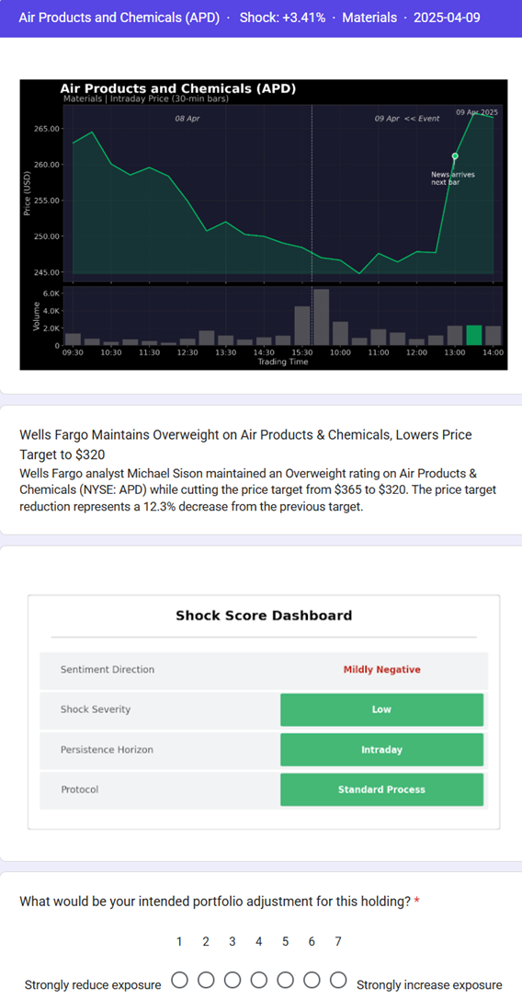
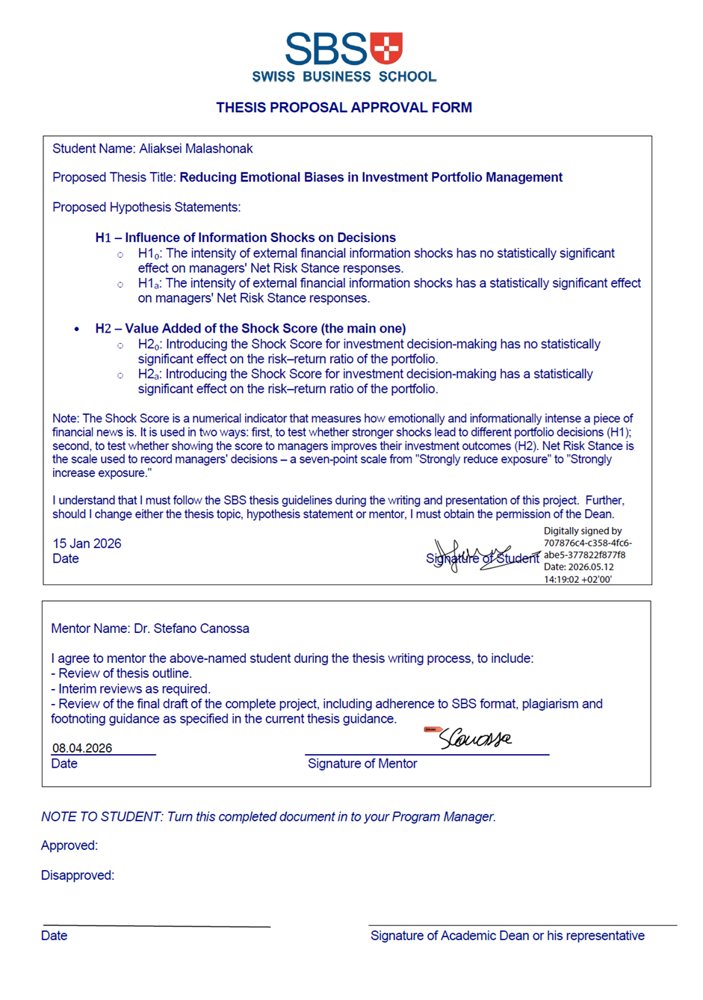
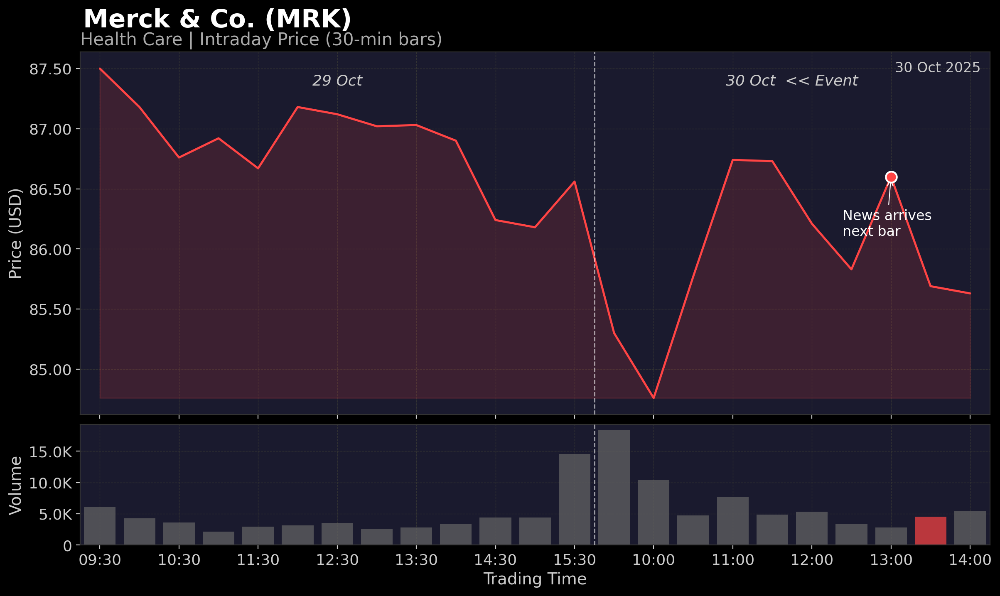
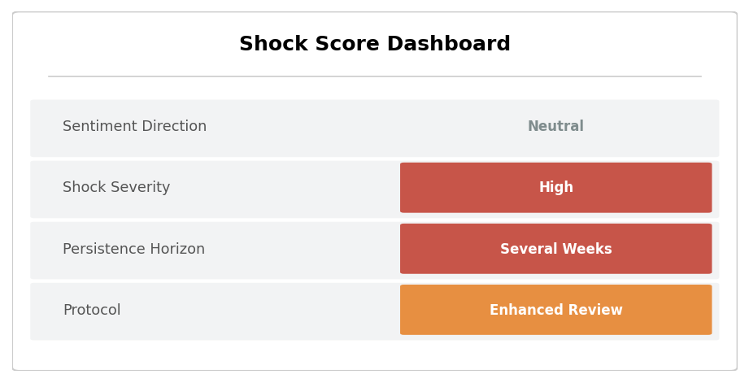
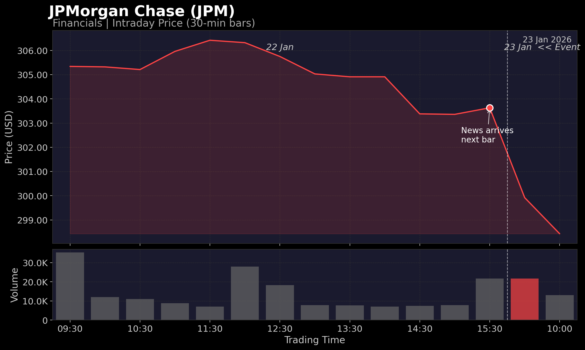

# Authentication of Work

I, Aliaksei Malashonak (Student ID: 19795, Matriculation Number: 24891798), hereby declare that this thesis, submitted in partial fulfillment of the requirements for the degree of Executive Master of Business Administration at SBS Swiss Business School, Kloten-Zurich, Switzerland, is my own work. All sources consulted have been acknowledged in the references. This thesis has not been submitted for any other degree or qualification at any other institution.

Signature: ______________________________

Date: ______________________________

Mentor certification: I, Dr. Stefano Canossa, confirm that this thesis meets the academic standards required for the Executive Master of Business Administration program at SBS Swiss Business School.

Mentor signature: ______________________________

Date: ______________________________

# Foreword

This thesis examines whether a structured, quantitative decision-support indicator can moderate behavioral bias in professional equity portfolio management. The research question emerged from direct professional experience in financial risk management, where the gap between the theoretical predictions of behavioral finance and the practical tools available to investment practitioners is persistently apparent. Despite a substantial body of evidence documenting systematic decision errors under conditions of information overload and emotional salience, the field has produced few operational instruments designed to identify and mitigate such errors at the point of decision.

The Shock Score, developed and evaluated in this thesis, represents an attempt to close this gap. It combines real-time market and sentiment signals into a single composite indicator that portfolio managers can consult when external information events create elevated conditions for bias-driven behavior. The empirical study tests whether exposure to this indicator is associated with changes in decision outcomes among professional portfolio managers.

The research draws on the behavioral finance literature, quantitative methods in financial economics, and applied survey design. It is intended to contribute both to academic understanding of decision-making under uncertainty and to the practical toolkit available to investment risk professionals.

# List of Tables

<!-- PLACEHOLDER:list_of_tables -->
[To be populated by 9_compile_thesis.py]
<!-- /PLACEHOLDER:list_of_tables -->

# List of Figures

<!-- PLACEHOLDER:list_of_figures -->
[To be populated by 9_compile_thesis.py]
<!-- /PLACEHOLDER:list_of_figures -->

# List of Abbreviations and Acronyms

| Abbreviation | Definition |
|---|---|
| $\mathrm{AC}_e$ | Article Count – number of distinct news articles attributed to the shock bar for event *e*; Shock Score component |
| $\mathrm{AI}_e$ | Attention Intensity – abnormal trading volume on the event day relative to the trailing mean; Shock Score component |
| API | Application Programming Interface |
| AUM | Assets Under Management |
| $D_{\mathrm{neg}}$ | Binary indicator equal to 1 for negative-sentiment shock events |
| DistilBERT | Distilled Bidirectional Encoder Representations from Transformers – compact transformer model used for behavioral classification |
| $\mathrm{ES}_e$ | Event-Type Severity – shock-bar price impact relative to baseline intraday volatility; Shock Score component |
| $\mathrm{ES}_{\mathrm{raw}}$ | Unstandardized Event-Type Severity value used in the decomposed component specification |
| FEARS | Financial and Economic Attitudes Revealed by Search – Google-search-based investor sentiment index (Da et al., 2015) |
| FinBERT | Finance-domain pre-trained BERT model used for article-level sentiment scoring (Yang et al., 2020) |
| GICS | Global Industry Classification Standard |
| HC3 | Heteroskedasticity-Consistent standard error estimator, finite-sample variant 3 |
| IBKR | Interactive Brokers |
| ICC | Intraclass Correlation Coefficient |
| LLM | Large Language Model |
| MAR | Minimum Acceptable Return |
| NRS | Net Risk Stance – seven-point scale capturing the direction and intensity of a manager's intended portfolio exposure adjustment |
| $P_e$ | Persistence score for event *e* – operationalizes the expected decision-relevance horizon of the information shock |
| PC1 | First Principal Component |
| PCA | Principal Component Analysis |
| RF | Risk-free rate |
| $\mathrm{SC}_{\mathrm{total}}$ | Shock Score composite – PCA-based first principal component of the four standardized Shock Score components |
| $\mathrm{SE}_e$ | Sentiment Extremity – maximum absolute FinBERT sentiment score across event-day articles; Shock Score component |
| ShowSC | Treatment indicator: ShowSC = 1 if the Shock Score dashboard is displayed; ShowSC = 0 if withheld |
| T_e | Intensity trigger variable mapping the Shock Score to a pre-commitment protocol tier |

# Executive Summary

This thesis investigates whether a structured decision-support indicator, the Shock Score, can reduce emotional biases in equity portfolio manager decision-making. The study evaluates whether the Shock Score moderates behavioral bias in professional investment decisions.

The research is motivated by a documented gap between the theoretical predictions of behavioral finance and the practical tools available to investment practitioners. While the literature establishes that discrete, emotionally salient information events can produce systematic deviations from disciplined portfolio management, existing decision-support systems are predominantly designed for quantitative analytics rather than ex-ante bias mitigation. This thesis investigates these questions through the design, construction, and empirical evaluation of an original composite indicator, thereby contributing to a reduction of the identified gap.

The Shock Score aggregates four components – Article Count, Sentiment Extremity, Attention Intensity, and Event-Type Severity – into a single standardized composite index via principal component analysis. The index quantifies the emotional and informational intensity of an external shock and is presented to portfolio managers through an interpretable dashboard incorporating a pre-commitment protocol. Two hypotheses are evaluated. Hypothesis H1 tests whether Shock Score intensity has a statistically significant effect on managers' Net Risk Stance. Hypothesis H2 tests whether exposure to the Shock Score dashboard has a statistically significant effect on portfolio risk–return outcomes.

The empirical study employs a within-subject quasi-experimental scenario survey administered to professional equity portfolio managers. The survey presents 24 real-market scenarios across three blocks, each accompanied by news information and, in the treatment condition, the Shock Score dashboard. The primary analytical method is two-way cluster-robust OLS regression with respondent fixed effects.

The analysis is based on a sample of 53 respondents yielding 424 scenario-level observations. At the 5% significance level, the null hypothesis H1₀ is rejected in favour of the alternative H1ₐ: the Shock Score composite is a statistically significant negative predictor of Net Risk Stance (β₁ = −0.4874, p = 0.0015), indicating that higher shock intensity is systematically associated with a risk-reducing decision shift among professional managers. For Hypothesis H2, the null H2₀ is not rejected in the current sample: the estimated treatment effect of the Shock Score dashboard on portfolio outcomes does not reach statistical significance (τ = −0.1584, p = 0.7428), a result attributed primarily to limited statistical power rather than to an absence of effect.

The thesis concludes that external information shocks are associated with measurable systematic changes in professional portfolio managers' risk stance, consistent with behavioral finance theory. The Shock Score demonstrates construct validity and directional alignment with the hypothesized moderation mechanism. Replication on a larger sample is recommended to evaluate Hypothesis H2 with adequate statistical power. Practical recommendations are offered for portfolio managers, risk governance frameworks, and future integration of behavioral indicators into investment decision processes.

# Chapter 1. Introduction

## 1.1 Background of the Problem

### 1.1.1 Emotional Biases in Investment Decision-Making

Investment decisions are frequently described as exercises in rational calculation, yet highly trained professionals are now well-documented to depart systematically from the predictions of classical decision theory ([Kahneman & Tversky, 1979](https://doi.org/10.2307/1914185); [Barber & Odean, 2001](https://doi.org/10.1162/003355301556400); [Ben-David et al., 2013](https://doi.org/10.1093/qje/qjt023)). Behavioral and emotional biases – including overconfidence, loss aversion, herding, anchoring, and the disposition effect – have been documented across retail investors, fund managers, traders, and senior corporate executives ([Kahneman & Tversky, 1979](https://doi.org/10.2307/1914185); [Barber & Odean, 2001](https://doi.org/10.1162/003355301556400); [Ben-David et al., 2013](https://doi.org/10.1093/qje/qjt023); [Statman, 2019](https://doi.org/10.2139/ssrn.3668963)). These deviations are not random errors that cancel out across decisions, but rather predictable patterns of judgment that emerge under conditions of uncertainty, time pressure, and emotional arousal ([Tversky & Kahneman, 1974](https://doi.org/10.1126/science.185.4157.1124); [Kahneman, 2003](https://doi.org/10.1257/000282803322655392)).

The financial consequences of such biases are well established. [Barber & Odean (2001)](https://doi.org/10.1162/003355301556400) show that overconfident investors trade excessively and earn lower risk-adjusted returns, that loss-averse market participants react more strongly to negative news than to comparable positive news ([Tetlock, 2007](https://doi.org/10.1111/j.1540-6261.2007.01232.x); [Löffler et al., 2021](https://dx.doi.org/10.2139/ssrn.2802570)), and that emotional and physiological responses to market stress can measurably degrade decision quality even among experienced traders ([Lo & Repin, 2002](https://doi.org/10.1162/089892902317361877); [Coates & Herbert, 2008](https://doi.org/10.1073/pnas.0704025105)). The disposition effect, the tendency to realize gains too early and to defer the realization of losses, has been observed in both retail and institutional samples ([Grinblatt & Keloharju, 2001](https://doi.org/10.1111/0022-1082.00338); [Frazzini, 2006](https://doi.org/10.1111/j.1540-6261.2006.00896.x)), with adverse consequences for portfolio turnover and after-cost performance.

These findings are particularly salient for investment portfolio management, where the cumulative effect of small behavioral distortions across many decisions can produce material deviations from a manager's stated investment policy and strategic risk targets. As such, emotional bias is treated in this thesis not as an incidental imperfection of human judgment, but as a structural feature of professional decision-making that warrants explicit attention in the design of investment processes and decision-support tools.

### 1.1.2 Information Overload and News-Driven Markets

Contemporary financial markets are characterized by an exceptionally high velocity and volume of information. Corporate earnings releases, analyst rating actions, macroeconomic indicators, central bank communications, regulatory announcements, and geopolitical events are continuously distributed through multiple channels and processed by market participants in real time. Investor attention, however, is a bounded resource ([Peng & Xiong, 2006](https://doi.org/10.1016/j.jfineco.2005.05.003)). When the volume and velocity of incoming information exceeds the cognitive capacity of decision-makers, attention becomes the binding constraint in determining which signals are processed deliberately and which are processed through heuristic shortcuts ([Da et al., 2011](https://doi.org/10.1111/j.1540-6261.2011.01679.x); [Barber & Odean, 2008](https://doi.org/10.1093/rfs/hhm079)).

[Da et al., 2011](https://doi.org/10.1111/j.1540-6261.2011.01679.x) and [Barber & Odean, 2008](https://doi.org/10.1093/rfs/hhm079) show that salient news events generate elevated turnover in the affected securities, particularly among securities that capture investor attention through extreme returns, high trading volume, or media coverage ([Engelberg & Parsons, 2009](https://doi.org/10.2139/ssrn.1462416)). This pattern is observable in both retail and institutional segments and is consistent with a model in which information shocks (defined in Section 2.6) act as cues that trigger reallocation of cognitive resources to particular positions. The increased decision activity around news events does not, however, necessarily translate into improved portfolio outcomes; the empirical literature documents that attention-driven trading is associated with short-term overreaction and subsequent reversal ([Meng et al., 2024](https://doi.org/10.1016/j.irfa.2024.103219); [Cremers et al., 2021](https://doi.org/10.1111/1475-679X.12352)).

Information overload also interacts with the affective dimensions of decision-making. When the cognitive demands of a decision exceed available capacity, the relative weight of intuitive and emotional processes increases ([Kahneman, 2003](https://doi.org/10.1257/000282803322655392); [Kahneman, 2011](https://www.worldcat.org/oclc/706020998)). In professional investment contexts, this shift implies that the very conditions under which precise analytical reasoning is most needed – moments of market stress, breaking news, or unexpected announcements – are also the conditions under which it is least likely to be applied consistently. The combination of attention scarcity and emotional arousal therefore creates a structural vulnerability that decision-support frameworks must explicitly address.

### 1.1.3 Behavioral Reactions to External Financial News

External financial news events, defined here as discrete public information events relevant to specific portfolio holdings, act as concentrated stimuli that engage both the cognitive and the affective systems of investment decision-making. The behavioral finance literature has accumulated substantial evidence that the immediate market response to such events frequently exceeds what can be justified by changes in fundamental value, generating short-horizon price overshooting that is partially reversed in the days that follow ([Meng et al., 2024](https://doi.org/10.1016/j.irfa.2024.103219); [Tetlock, 2007](https://doi.org/10.1111/j.1540-6261.2007.01232.x); [Daniel et al., 1998](https://doi.org/10.1111/0022-1082.00077)). These dynamics are consistent with theories of overreaction driven by salience, attention, and affective response, rather than with models of frictionless rational updating.

Professional portfolio managers are not insulated from these dynamics. [Ben-Rephael et al., 2024](https://dx.doi.org/10.2139/ssrn.3966758) show that institutions tend to trade in the direction of the initial price reaction around earnings announcements, amplifying rather than dampening short-term mispricings ([Cremers et al., 2021](https://doi.org/10.1111/1475-679X.12352)). Mechanical rebalancing flows transmit these reactions into observable price pressure ([Harvey et al., 2025](https://doi.org/10.2139/ssrn.5122748)), and extreme market conditions have been shown to trigger panic-style selling and rapid exits rather than disciplined adjustment ([Elkind et al., 2022](https://doi.org/10.3905/JFDS.2021.1.085)). In aggregate, the behavioral reactions of professional investors to external information shocks shape short-horizon volatility, return predictability, and the realized risk–return characteristics of portfolios.

These observations frame the practical motivation for the present study. If external information shocks systematically activate behavioral biases that produce measurable short-term deviations from disciplined portfolio management, then the design of investment processes that explicitly anticipate and structure responses to such information shocks becomes a question of operational relevance. The empirical study reported in this thesis is positioned within this practical motivation, examining whether managers' decision behavior during shock events varies systematically with the intensity of the information shock and whether the introduction of a structured decision-support indicator is associated with changes in decision outcomes.

## 1.2 Background of the Study

### 1.2.1 Traditional Portfolio Theory and Rational Decision Assumptions

The conceptual foundations of modern portfolio management rest on a body of theory in which investors are assumed to process information in a fully rational manner, to hold consistent preferences over risk and return, and to allocate capital so as to maximise expected utility subject to budget and risk constraints. The classical mean–variance framework formalised diversification as a quantitative principle ([Markowitz, 1952](https://doi.org/10.1111/j.1540-6261.1952.tb01525.x)) and provided the foundation for portfolio optimization under risk, and was extended in subsequent capital market theory, including the capital asset pricing model and the efficient market hypothesis ([Fama, 1970](https://doi.org/10.1111/j.1540-6261.1970.tb00518.x); [Sharpe, 1966](https://doi.org/10.1086/294846); [Cochrane, 2005](https://books.google.com/books/about/Asset_Pricing.html?id=20pmeMaKNwsC)).

Within this paradigm, the role of news and information is precise: public information is incorporated into prices rapidly and accurately, and any predictable component of investor behavior is arbitraged away by well-informed market participants. The behavioral responses of individual managers to specific events are, by assumption, second-order in the determination of asset prices, since rational arbitrageurs are presumed to absorb any temporary mispricing. Performance attribution in this framework focuses on systematic exposures and on the quality of information signals rather than on the affective characteristics of the decision-maker.

The strengths of this framework are well known: it provides a coherent normative benchmark for portfolio construction, a tractable apparatus for risk–return optimization, and a vocabulary for performance measurement that remains in widespread practical use. Its assumptions about decision-makers, however, have been challenged by an accumulating body of empirical evidence indicating that real investors, including trained professionals, systematically depart from the rational benchmark in ways that are not random and that are not eliminated by competition or experience.

### 1.2.2 Emergence of Behavioral Finance

Behavioral finance emerged in response to the gap between the predictions of rational-agent models and the empirical evidence on actual investor behavior. Drawing on developments in cognitive psychology, particularly the work on heuristics and biases ([Tversky & Kahneman, 1974](https://doi.org/10.1126/science.185.4157.1124)) and prospect theory ([Kahneman & Tversky, 1979](https://doi.org/10.2307/1914185)), the field has produced an extensive catalogue of systematic deviations from rationality in financial decision-making. These include loss aversion, mental accounting, narrow framing, the disposition effect, overconfidence, anchoring, attention biases, and herding ([Barberis & Thaler, 2002](https://dx.doi.org/10.2139/ssrn.327880); [Hirshleifer, 2015](https://doi.org/10.1146/annurev-financial-092214-043752); [Statman, 2019](https://doi.org/10.2139/ssrn.3668963)).

A particularly important strand of this literature has examined whether such biases survive in professional contexts. These biases persist in professional contexts. Even seasoned corporate executives exhibit miscalibration of forecasts ([Ben-David et al., 2013](https://doi.org/10.1093/qje/qjt023)), perform consistently with the disposition effect ([Frazzini, 2006](https://doi.org/10.1111/j.1540-6261.2006.00896.x)), engage in herding behavior around analyst recommendation changes ([Jiang & Verardo, 2018](https://doi.org/10.1111/jofi.12699); [Brown et al., 2014](https://doi.org/10.1287/mnsc.2013.1751)), and respond asymmetrically to negative information across cultural contexts ([Neel, 2024](https://dx.doi.org/10.2139/ssrn.4768248)). The persistence of these patterns among experienced practitioners is consistent with theoretical accounts of bounded rationality ([Simon, 1955](https://doi.org/10.2307/1884852)) and dual-process models of judgment ([Kahneman, 2003](https://doi.org/10.1257/000282803322655392); [Kahneman, 2011](https://www.worldcat.org/oclc/706020998)).

Behavioral finance has accordingly shifted the operative question for investment practice. The relevant question is no longer whether biases exist in professional decision-making, but rather how the structural features of the decision environment can be designed to anticipate and mitigate their influence. This shift has direct implications for the design of investment processes, for the role of investment policy statements and rule-based protocols, and for the construction of decision-support tools that operate at the point of decision rather than as ex post diagnostics.

### 1.2.3 Decision Support Tools in Modern Portfolio Management

Decision-support systems in contemporary investment practice are predominantly oriented toward computational analytics. Risk-management platforms, portfolio optimization engines, scenario analysis tools, and algorithmic execution systems provide quantitative inputs that support disciplined decision-making across multiple horizons. These systems have been instrumental in raising the standard of portfolio management by introducing systematic measurement of exposure, factor risk, performance attribution, and execution quality. They have not, however, been designed primarily to address the behavioral dimension of investment decisions ([Goodell et al., 2023](https://doi.org/10.1016/j.jbef.2022.100722); [Barberis & Thaler, 2002](https://dx.doi.org/10.2139/ssrn.327880); [Bhandari et al., 2008](https://doi.org/10.1016/j.dss.2008.07.010)).

Complementary developments in automated and AI-driven advisory systems have expanded the role of algorithms in portfolio decisions, particularly in the retail segment, where robo-advisory platforms apply rule-based and model-based logic to portfolio construction and rebalancing ([Jung et al., 2018](https://doi.org/10.1007/s12599-018-0521-9); [Baker & Dellaert, 2018](https://scholarship.law.upenn.edu/faculty_scholarship/1740/)). Recent research on explainable AI in advisory contexts emphasizes the importance of transparent, interpretable decision logic as a precondition for trust and for productive human–AI interaction ([Bianchi et al., 2022](https://dx.doi.org/10.2139/ssrn.3825110); [Rudin, 2019](https://doi.org/10.1038/s42256-019-0048-x); [Lim, 2026](https://doi.org/10.1080/15427560.2025.2609644)). Even in these advanced applications, however, the dominant design pattern remains one of analytical support and execution automation rather than ex-ante behavioral intervention.

A modest but growing line of research has examined how decision-support systems can be designed explicitly to mitigate behavioral biases. Evidence from [Henderson et al. (2018)](https://doi.org/10.1016/j.jet.2018.10.002) and [Statman (2019)](https://doi.org/10.2139/ssrn.3668963) indicates that structured pre-commitment mechanisms, rule-based protocols, and the explicit presentation of risk information can reduce emotional reactivity and improve decision consistency ([Bhandari et al., 2008](https://doi.org/10.1016/j.dss.2008.07.010)). Notwithstanding these contributions, the practitioner toolkit available to professional portfolio managers for the explicit identification and management of behavioral vulnerability at the point of decision remains comparatively underdeveloped. The present study contributes to this area by designing and empirically evaluating a structured decision-support indicator developed specifically for use during external information shock events.

## 1.3 Purpose of the Study

### 1.3.1 Reducing Emotional Overreaction in Portfolio Decisions

The principal purpose of this study is to examine whether the systematic provision of structured information about the intensity of external financial information shocks is associated with measurable changes in how professional equity portfolio managers respond to those information shocks. The motivation rests on the premise that emotional overreaction to salient news events is a documented source of inefficiency in portfolio management ([Meng et al., 2024](https://doi.org/10.1016/j.irfa.2024.103219); [Elkind et al., 2022](https://doi.org/10.3905/JFDS.2021.1.085); [Huber et al., 2022](https://doi.org/10.1016/j.jebo.2021.12.007)) and that operational improvements in this area depend on translating insights from behavioral finance into instruments that can be applied at the moment of decision rather than retrospectively.

The study approaches this purpose empirically rather than prescriptively. The empirical design captures professional managers' stated decision responses to a structured set of real-market information shock scenarios, allowing the relationship between information shock intensity and decision response to be evaluated quantitatively. The intention is not to demonstrate that any particular decision is correct or incorrect, but to establish whether systematic patterns exist in the way that managers respond to information shocks of varying intensity, and whether those patterns are altered when managers are provided with a standardized decision-support signal during scenario evaluation.

In framing the purpose in this way, the study aligns with calls in the behavioral finance literature for empirical research that moves beyond the cataloguing of biases toward the design and evaluation of operational instruments for their management ([Barberis & Thaler, 2002](https://dx.doi.org/10.2139/ssrn.327880); [Statman, 2019](https://doi.org/10.2139/ssrn.3668963); [Lim, 2026](https://doi.org/10.1080/15427560.2025.2609644)). The contribution is intended to be useful both to academic research on professional investor behavior and to investment institutions seeking to strengthen the behavioral dimension of their decision-making processes.

### 1.3.2 Role of Quantitative Signals in Managerial Decision Support

A secondary purpose of the study is to examine the role of quantitative signals in supporting managerial decision-making during shock events. Quantitative signals can serve at least two distinct functions in this context. First, they can provide a common reference point for the magnitude of an information event, supporting consistent interpretation across managers, time periods, and event types. Second, they can act as triggers for the activation of pre-committed decision protocols – for example, structured review procedures or cooling-off periods – that are designed to interpose a deliberate decision step between the receipt of new information and the execution of portfolio actions ([Henderson et al., 2018](https://doi.org/10.1016/j.jet.2018.10.002); [Statman, 2019](https://doi.org/10.2139/ssrn.3668963)).

The study examines a quantitative signal in this second capacity. The signal is conceived as a decision-support indicator rather than a forecasting tool: it is intended to characterize the conditions surrounding a decision, not to predict the direction of subsequent returns. This framing distinguishes the empirical contribution of the thesis from the literature on sentiment-based return prediction and algorithmic trading signals ([Tetlock, 2007](https://doi.org/10.1111/j.1540-6261.2007.01232.x); [Song et al., 2015](https://dx.doi.org/10.2139/ssrn.2631135); [Baker & Wurgler, 2006](https://doi.org/10.1111/j.1540-6261.2006.00885.x)) and places the contribution in the area of practitioner-oriented behavioral decision support. The detailed construction and operationalisation of the indicator are presented in Chapter 4.

## 1.4 Significance of the Study

### 1.4.1 Academic Contribution to Behavioral Finance Literature

The academic significance of the study lies in its position at the intersection of three established research streams. The first stream concerns the documentation of behavioral biases among professional investors and corporate executives and their consequences for portfolio outcomes ([Barber & Odean, 2001](https://doi.org/10.1162/003355301556400); [Ben-David et al., 2013](https://doi.org/10.1093/qje/qjt023); [Huber et al., 2022](https://doi.org/10.1016/j.jebo.2021.12.007)). The second stream concerns the measurement of information intensity in financial markets through news, sentiment, and attention-based indicators ([Tetlock, 2007](https://doi.org/10.1111/j.1540-6261.2007.01232.x); [Da et al., 2011](https://doi.org/10.1111/j.1540-6261.2011.01679.x); [Baker & Wurgler, 2006](https://doi.org/10.1111/j.1540-6261.2006.00885.x); [Song et al., 2015](https://dx.doi.org/10.2139/ssrn.2631135)). The third stream concerns the design of decision-support systems that explicitly target behavioral vulnerability rather than purely analytical inputs ([Bianchi et al., 2022](https://dx.doi.org/10.2139/ssrn.3825110); [Lim, 2026](https://doi.org/10.1080/15427560.2025.2609644); [Bhandari et al., 2008](https://doi.org/10.1016/j.dss.2008.07.010)).

The contribution of the present study is to integrate these three streams within a single empirical design that combines a real-time composite information shock measure, a professional sample of equity portfolio managers, a behaviorally grounded decision-support intervention, and a quantitative outcome measure of managerial decision response. As discussed in detail in Chapter 3, the author could not identify prior research within the reviewed literature that integrates these components; existing studies have tended to address one or two of these elements in isolation. The study therefore contributes to behavioral finance by providing empirical evidence on a question that has been recognized but not directly tested in the existing literature.

### 1.4.2 Practical Relevance for Portfolio Managers

The practical significance of the study lies in its direct relevance to investment institutions and to the portfolio managers who operate within them. Professional managers face external information shocks routinely in the course of their work, and the quality of their responses to those information shocks has a measurable bearing on the realized performance and risk profile of the portfolios under their management. Existing practice relies extensively on judgment, experience, and informal heuristics in the interpretation of news events; structured behavioral decision-support tools designed for use at the point of decision are comparatively rare.

A second dimension of practical significance concerns the relationship between investment management practice and investment policy. Investment policy statements typically specify objectives, constraints, rebalancing principles, and oversight procedures, but they rarely operationalize behavioral risk in a form that can be applied to specific events. The present study provides a concrete empirical example of how a behavioral indicator can be linked to a structured decision protocol that complements existing governance arrangements without displacing manager judgment. The framework is positioned as decision support rather than decision automation, preserving the manager's accountability while introducing a deliberate procedural step that is intended to dampen impulsive responses under conditions of high informational and emotional load.

### 1.4.3 Implications for Risk Management Practices

Risk management functions within investment institutions are typically responsible for the measurement, monitoring, and oversight of portfolio exposures and performance. Behavioral risk, the risk that decision-makers will systematically depart from disciplined investment processes in ways that affect portfolio outcomes, is recognized conceptually within the risk management discipline but is rarely operationalized through specific indicators or controls ([Bhandari et al., 2008](https://doi.org/10.1016/j.dss.2008.07.010); [Barberis & Thaler, 2002](https://dx.doi.org/10.2139/ssrn.327880)). The present study contributes to this area by demonstrating how a behavioral decision-support indicator can be constructed from publicly available market and news data and integrated into existing risk governance frameworks.

The implications extend to several risk-management practices, including the design of pre-trade controls, the structure of escalation procedures for high-impact events, the conduct of post-event reviews, and the development of behavioral risk indicators that complement existing market-risk and operational-risk measurement. The study does not propose to replace established risk management instruments; rather, it points toward an additional layer of behavioral risk awareness that operates at the level of the individual decision and that is anchored in observable market and information characteristics; the concrete form this could take in practice is developed in the recommendations of Section 6.4.

## 1.5 Scope and Delimitations

### 1.5.1 Asset Classes and Market Coverage

The empirical scope of the study is restricted to publicly traded U.S. equities of large- and mid-capitalisation issuers across the principal Global Industry Classification Standard sectors. This restriction is motivated by three considerations. First, the U.S. large- and mid-cap equity universe provides a deep and continuous supply of public news events, analyst actions, and earnings announcements that are systematically tractable for the construction of event-level information shock measures. Second, U.S. equity markets offer high-quality intraday market data with consistent transparency conventions, which is required for the identification of short-horizon market responses to information events. Third, equity portfolio managers represent a well-defined professional population from which a study sample can be recruited with comparable role responsibilities and decision authority.

Within this scope, the study does not extend to fixed income, foreign exchange, commodities, derivatives, or private market instruments. Multi-asset and asset-allocation decisions are likewise outside the scope of the empirical analysis. Findings reported in subsequent chapters are interpreted within the boundaries of the equity portfolio management context and are not claimed to generalise without further validation to other asset classes or to portfolio managers operating under materially different mandates.

The primary data collected for this study consist of the stated decision responses (Net Risk Stance) of professional equity portfolio managers to the standardized scenarios, together with the respondent characteristics recorded in the survey. The two data sets are used jointly: the secondary market and news data are reduced to the event-level Shock Score, which serves as the independent variable, while the primary survey responses provide the dependent variable, so that knowledge is inferred from the association between externally measured shock intensity and managers' stated decisions (Chapters 4 and 5).

### 1.5.2 Time Horizon and Frequency of Decisions

The study examines short-horizon decision responses to discrete information events. The relevant decision horizon is the interval between the arrival of a public information event and the subsequent trading session in which a portfolio manager may act on the information. This horizon is the period during which the cognitive and emotional load associated with external information shocks is most acute, during which short-term price overshooting and reversal are most pronounced ([Meng et al., 2024](https://doi.org/10.1016/j.irfa.2024.103219); [Cremers et al., 2021](https://doi.org/10.1111/1475-679X.12352)), and during which the operational relevance of a decision-support intervention is most directly observable. In data terms, this horizon corresponds to the 30-minute bars over which the secondary market data capture the shock and its immediate aftermath, and to the single post-shock decision point at which the primary survey elicits each manager's Net Risk Stance.

The study does not address strategic or long-horizon asset-allocation decisions, life-cycle planning, or the multi-period management of liability-driven portfolios. Each of these domains involves distinct decision processes and distinct sources of behavioral risk that fall outside the present empirical design. The findings reported in Chapter 5 should be interpreted as applying to the immediate decision response of equity portfolio managers to discrete external information events at the level of individual portfolio holdings.

### 1.5.3 Methodological Boundaries of the Study

The empirical study is conducted as a within-subject quasi-experimental scenario survey (Shadish et al., 2002) administered to professional equity portfolio managers. This design captures stated decision responses to standardized scenarios rather than observed trading behavior in live portfolios. The methodological boundaries of this approach are recognized and are discussed in detail in Chapters 2 and 4. The study evaluates the relationship between information shock intensity and stated decision response, and the moderating role of a structured decision-support indicator, under the controlled conditions afforded by the scenario design. The translation of stated decision responses into portfolio outcomes is conducted through simulation conventions that are fully specified in Chapter 4 and whose limitations are recorded explicitly.

The study employs publicly available market and news data for the construction of event-level shock characteristics. The composite indicator developed in this thesis is constructed from observable and reproducible inputs and does not rely on proprietary information sources. The analytical methodology is anchored in established econometric techniques, including cluster-robust regression and respondent-level fixed-effects estimation, and is documented in Chapter 5. The methodological boundaries of the study therefore concern both the use of stated rather than revealed preferences and the dependence of portfolio-level inferences on simulation conventions, both of which are made transparent so that readers may form independent judgments about the strength and generalisability of the findings.

## 1.6 Structure of the Thesis

The thesis is organized into six chapters. Chapter 1, the present chapter, introduces the problem, the motivation for the study, and the scope of the empirical research. Chapter 2 defines the objectives of the study, formulates the research questions and hypothesis statements, presents operational definitions of key terms, and records the assumptions and limitations that bound interpretation of the findings. Chapter 3 reviews the academic literature on behavioral finance, managerial decision-making under uncertainty, structured tools for the mitigation of behavioral bias, and the implications for portfolio management, concluding with a systematic mapping of the gaps in existing research that the study addresses. Chapter 4 documents the research data, the construction of the composite Shock Score, and the design of the primary survey instrument used to collect professional managers' decision responses. Chapter 5 presents the empirical analysis and statistical results, including descriptive statistics, the principal regression specifications used to evaluate the hypotheses, and robustness checks. Chapter 6 states the conclusions, formulates practical recommendations for portfolio managers and risk governance practitioners, identifies areas for further research, and discusses the ethical considerations and broader societal implications of the findings.

# Chapter 2. Objectives of the Study

## 2.1 Chapter Introduction

Chapter 2 defines the research scope and agenda for the study. It restates the managerial problem motivating the research (Section 2.2), specifies the objectives that guide the empirical work (Section 2.3), and presents the research questions and hypothesis statements to be evaluated (Sections 2.4 to 2.6). The chapter also provides operational definitions of key terms and records the assumptions and limitations that bound interpretation of the findings (Section 2.8).

## 2.2 Problem Statement

When quarterly earnings results are issued after market close or a central bank announces an unexpected policy shift, portfolio managers face immediate pressure to reassess positions before the next trading session. These decisions are made under uncertainty, information overload, and rapidly evolving market narratives ([Hirshleifer, 2015](https://doi.org/10.1146/annurev-financial-092214-043752); [Kahneman & Tversky, 1979](https://doi.org/10.2307/1914185); [Peng & Xiong, 2006](https://doi.org/10.1016/j.jfineco.2005.05.003)). In such environments, emotionally salient external information shocks can increase cognitive load and compress the time available for deliberation. Prior work suggests that these conditions may lead to systematic deviations from disciplined decision-making ([Shefrin, 2002](https://doi.org/10.1093/oso/9780195304213.001.0001); [Barber & Odean, 2008](https://doi.org/10.1093/rfs/hhm079)). In portfolio management, such deviations can manifest as procyclical rebalancing ([Harvey et al., 2025](https://doi.org/10.2139/ssrn.5122748); [Elkind et al., 2022](https://doi.org/10.3905/JFDS.2021.1.085)), excessive turnover ([Barber & Odean, 2000](https://dx.doi.org/10.2139/ssrn.219228)), delayed adjustment, or temporary departures from strategic risk targets. Each of these patterns may degrade risk-adjusted returns and increase drawdown exposure over short horizons.

The research problem addressed in this thesis is twofold. First, the study examines whether external financial information shocks are associated with systematic changes in managers' immediate risk stance. Second, it evaluates whether a structured decision-support indicator, the Shock Score, is associated with changes in investment decision outcomes when managers face information shock conditions.

The Shock Score plays two roles in the study. It serves, first, as a continuous measure of information shock intensity for analyzing the relationship between information shocks and decisions. It serves, second, as an experimental treatment condition in which the Shock Score dashboard is displayed to managers during scenario evaluation in order to structure their interpretation of information and dampen the influence of emotional and cognitive biases. The study is framed as quantitative research on professional decision-making rather than as a claim about market inefficiency or return predictability.

The behavioral finance literature documents that earnings announcements and other discrete information events frequently produce short-term price overreaction followed by partial reversal, consistent with attention-driven trading and emotional processing of salient news ([Jiang & Zhu, 2016](https://papers.ssrn.com/sol3/papers.cfm?abstract_id=2891216); [Meng et al., 2024](https://doi.org/10.1016/j.irfa.2024.103219)). The intraday price dynamics of Meta Platforms Inc. on 2 February 2026, which coincided with the public release of quarterly earnings results, illustrate this pattern. The announcement triggered a rapid upward price adjustment together with elevated trading volume, consistent with a positive earnings surprise. Despite the positive informational content, the immediate price response was followed by pronounced short-term volatility and partial reversal, a sequence consistent with the short-horizon overreaction patterns documented in the empirical literature ([Hirshleifer, 2015](https://doi.org/10.1146/annurev-financial-092214-043752)).

**Figure 2.1**

*Intraday Price Movement of Meta Platforms Inc. on 2 February 2026 Following the Release of Quarterly Earnings Results, Illustrating a Short-Horizon Market Reaction to an External Information Shock*

*Note.* Intraday price and volume data for Meta Platforms Inc. (ticker: META), retrieved via the Interactive Brokers API.

### 2.2.1 Emotional Bias as a Source of Suboptimal Portfolio Decisions

Dual-process accounts of judgment hold that portfolio decisions are shaped by both analytical judgment and affective responses, particularly under uncertainty and time pressure ([Kahneman, 2011](https://www.worldcat.org/oclc/706020998); [Kahneman, 2003](https://doi.org/10.1257/000282803322655392)). Emotional and cognitive biases may influence how information is interpreted and acted upon, leading to inconsistent or procyclical decision responses relative to an investor's stated objectives and constraints ([Hirshleifer, 2015](https://doi.org/10.1146/annurev-financial-092214-043752)). External information shocks, by their nature as sudden and salient stimuli, are particularly likely to activate affective responses that may diverge from, and override, deliberative cognitive assessments of risk, making emotional bias an especially relevant source of decision error in the context of this study ([Loewenstein et al., 2001](https://doi.org/10.1037/0033-2909.127.2.267); [Meng et al., 2024](https://doi.org/10.1016/j.irfa.2024.103219)). In this thesis, emotional bias is treated as a plausible mechanism that may contribute to suboptimal decision patterns ([Kahneman & Tversky, 1979](https://doi.org/10.2307/1914185); [Loewenstein et al., 2001](https://doi.org/10.1037/0033-2909.127.2.267)), to be examined through the literature review in Chapter 3 and evaluated empirically through the analysis of primary survey data and secondary market data in Chapters 5 and 6.

### 2.2.2 Impact of External Information Shocks on Risk–Return Outcomes

External financial information shocks are defined as discrete public events relevant to portfolio holdings that may trigger rapid market reactions and elevate decision urgency ([Jiang & Zhu, 2016](https://papers.ssrn.com/sol3/papers.cfm?abstract_id=2891216); [Meng et al., 2024](https://doi.org/10.1016/j.irfa.2024.103219)). Empirical research in behavioral finance documents evidence that such information shocks can affect decision behavior and, therefore, influence portfolio outcomes, particularly when decisions are made over short horizons ([Hirshleifer, 2015](https://doi.org/10.1146/annurev-financial-092214-043752); [Elkind et al., 2022](https://doi.org/10.3905/JFDS.2021.1.085)). The magnitude and persistence of market responses may vary by event type and context ([Jiang & Zhu, 2016](https://papers.ssrn.com/sol3/papers.cfm?abstract_id=2891216); [Tetlock, 2007](https://doi.org/10.1111/j.1540-6261.2007.01232.x)), and these relationships are treated as empirical questions to be evaluated through the study design.

The Shock Score, an original composite indicator developed in this thesis and formally defined in section 2.6.3, is introduced as a decision-support mechanism intended to structure interpretation of information shock information and support disciplined responses. Its construction draws on established approaches to sentiment measurement ([Tetlock, 2007](https://doi.org/10.1111/j.1540-6261.2007.01232.x)) and principal-component-based index design ([Baker & Wurgler, 2006](https://doi.org/10.1111/j.1540-6261.2006.00885.x)). As reviewed in Chapter 3, existing decision-support tools in finance are predominantly designed for quantitative analytics and algorithmic execution ([Lim, 2026](https://doi.org/10.1080/15427560.2025.2609644); [Bhandari et al., 2008](https://doi.org/10.1016/j.dss.2008.07.010)), while providing limited structural support for identifying or mitigating behavioral biases before decisions are made ([Goodell et al., 2023](https://doi.org/10.1016/j.jbef.2022.100722); [Barberis & Thaler, 2002](https://dx.doi.org/10.2139/ssrn.327880)). The Shock Score is designed to address this gap by combining real-time information shock quantification with a rules-based pre-commitment protocol that activates structured decision procedures precisely when behavioral vulnerability is expected to be elevated.

## 2.3 Objectives of the Study

The overall objective of the study is to evaluate whether a structured, practitioner-oriented Shock Score can support investment decision outcomes under external information shock conditions. The study operationalizes outcomes in terms of risk-adjusted portfolio performance, consistent with the premise that information shocks may induce both excessive risk-taking and excessive de-risking ([Kahneman & Tversky, 1979](https://doi.org/10.2307/1914185); [Barber & Odean, 2001](https://doi.org/10.1162/003355301556400); [Chen et al., 2024](http://doi.org/10.2139/ssrn.4942370)).

The objectives of the study are as follows. While behavioral finance establishes that information shocks may activate cognitive and emotional biases in investors ([Barberis & Thaler, 2002](https://dx.doi.org/10.2139/ssrn.327880)), two questions remain empirically open in the context of professional equity portfolio management: whether information shock intensity systematically predicts the magnitude of decision deviation, and whether providing managers with a structured information shock indicator at the moment of decision can moderate that deviation. These questions motivate the causal pathway examined in this thesis.

The first link in this pathway concerns the relationship between external information shocks and managerial decision response. The behavioral finance literature documents that discrete, emotionally salient information events can activate cognitive and affective biases – including overconfidence, loss aversion, and attention-driven extrapolation – that systematically alter how professionals interpret and respond to new information ([Hirshleifer, 2015](https://doi.org/10.1146/annurev-financial-092214-043752); [Kahneman & Tversky, 1979](https://doi.org/10.2307/1914185)). Under time pressure and information overload, these biases may produce decision responses that deviate from the manager's stated investment objectives, manifesting as procyclical rebalancing, excessive position changes, or delayed adjustment ([Elkind et al., 2022](https://doi.org/10.3905/JFDS.2021.1.085); [Barber & Odean, 2000](https://dx.doi.org/10.2139/ssrn.219228); [Jiang & Zhu, 2016](https://papers.ssrn.com/sol3/papers.cfm?abstract_id=2891216)).

The second link concerns the potential role of structured decision support in moderating emotional and behavioral responses to information shocks. The Shock Score, an original composite indicator developed in this thesis and formally defined in section 2.6.3, is designed to quantify the emotional and informational intensity of an external information shock and to present this information to managers through an interpretable dashboard. The dashboard incorporates sentiment direction, information shock severity, a persistence horizon estimate, and a rules-based pre-commitment protocol. The rationale for this design draws on evidence that pre-commitment mechanisms and structured decision rules can reduce emotional reactivity in professional investment contexts ([Henderson et al., 2018](https://doi.org/10.1016/j.jet.2018.10.002); [Statman, 2019](https://doi.org/10.2139/ssrn.3668963)), and that transparent, rule-based decision support, where an algorithmic indicator informs but does not replace human judgment, improves decision consistency in advisory settings ([Bianchi et al., 2022](https://dx.doi.org/10.2139/ssrn.3825110)). Cross-domain evidence further indicates that discretionary human overrides of algorithmic recommendations typically degrade rather than improve decision accuracy, motivating the advisory rather than override-based design of the Shock Score dashboard ([Angelova et al., 2023](https://doi.org/10.3386/w31747)).

The third link concerns the downstream consequence: whether moderated decision responses are associated with changes in portfolio risk-return characteristics. Portfolio outcomes are evaluated through simulation using risk-adjusted performance measures, as defined in section 2.3.2. This link is model-dependent and subject to the limitations acknowledged in section 2.8.

These three links form the causal logic that the study evaluates. An information shock produces behavioral activation, which drives a decision response (the Net Risk Stance), which in turn feeds the simulated portfolio outcome. The Shock Score dashboard enters this chain as a moderator: by structuring interpretation at the moment of information shock, it is expected to alter the decision response and, through that channel, the downstream outcome. Figure 2.3 represents this logic schematically.

The three objectives below are aligned with this chain. Section 2.3.1 addresses the upper path, whether information shocks produce systematic shifts in decision response. Section 2.3.2 addresses the intervention and its downstream consequence, whether the Shock Score moderates those responses and whether moderated responses are associated with changes in portfolio outcomes.

### 2.3.1 Assessing the Effect of Information Shocks on Investment Decisions

The first objective is to assess whether external financial information shocks are associated with systematic shifts in managers' immediate decision response, and whether those responses are in turn associated with changes in portfolio risk–return characteristics. Decision response is collected through primary data as a single-item, seven-point Net Risk Stance (NRS) scale, developed for this study and following established Likert-type measurement conventions ([Doronila, 2025](https://dx.doi.org/10.2139/ssrn.5877342)), capturing the direction and intensity of intended exposure adjustment in response to an information shock scenario. A single-item measure is appropriate because the construct, directional portfolio adjustment intention, is concrete and unidimensional, and survey parsimony is critical when administering multiple scenarios to time-constrained professionals ([Bergkvist & Rossiter, 2007](https://doi.org/10.1509/jmkr.44.2.175)). Portfolio outcomes are evaluated using risk-adjusted performance measures, with Sharpe ratio ([Sharpe, 1966](https://doi.org/10.1086/294846)) and Sortino ratio ([Sortino & van der Meer, 1991](https://doi.org/10.3905/jpm.1991.409343)) specified as primary metrics, with precise computation conventions defined in Chapter 4.

Net Risk Stance response scale (single item, seven points):
1. Strongly reduce exposure  
2. Reduce exposure  
3. Slightly reduce exposure  
4. No change  
5. Slightly increase exposure  
6. Increase exposure  
7. Strongly increase exposure

### 2.3.2 Evaluating the Value Added of the Shock Score

The second objective is to evaluate whether providing the Shock Score moderates decision behavior and is associated with changes in outcomes relative to a no-score condition. The study uses a within-subject design ([Charness et al., 2012](https://doi.org/10.1016/j.jebo.2011.08.009)) in which each participant is exposed to both conditions, enabling comparison of responses while controlling for stable individual differences. The Shock Score is presented as a manager-facing dashboard designed to structure interpretation and trigger a pre-committed decision protocol under elevated-information-shock conditions ([Henderson et al., 2018](https://doi.org/10.1016/j.jet.2018.10.002); [Statman, 2019](https://doi.org/10.2139/ssrn.3668963)). The downstream consequence of any treatment effect is evaluated through changes in portfolio risk-return characteristics: Sharpe ratio ([Sharpe, 1966](https://doi.org/10.1086/294846)) and Sortino ratio ([Sortino & van der Meer, 1991](https://doi.org/10.3905/jpm.1991.409343)) are computed per respondent-condition pair from NRS-weighted simulated portfolio returns, with computation conventions specified in Chapter 4.

## 2.4 Research Questions

This study is guided by two research questions that correspond directly to the objectives and hypotheses. The first research question focuses on whether external information shocks are associated with systematic variation in managerial decision response. The second research question evaluates whether the Shock Score, as a decision-support intervention, is associated with changes in investment decision outcomes when managers face such information shocks. RQ1 addresses Objective 1 by evaluating both the immediate decision response to information shocks and its downstream portfolio outcome. RQ2 addresses Objective 2 by evaluating the moderating role of the Shock Score on that response.

- Do external financial information shocks lead to statistically significant differences in managers’ immediate Net Risk Stance responses and, in downstream evaluation, portfolio risk–return outcomes?

- Does providing the Shock Score to portfolio managers affect investment decision outcomes, measured through portfolio risk–return metrics, relative to a condition in which the Shock Score is not provided?

## 2.5 Hypothesis Statement(s)

The study tests two hypotheses. Hypothesis statements are presented in null and alternative form and are evaluated using the primary and secondary data described in Chapters 4 and 5. The hypotheses are written to align with the study design, where information shock intensity is measured at the event level and decision support is implemented as an experimental condition in which the Shock Score is shown or withheld.

### 2.5.1 Hypothesis H1 – Influence of Information Shocks on Decisions

**H1₀:** The intensity of external financial information shocks has no statistically significant effect on managers' Net Risk Stance responses.

**H1ₐ:** The intensity of external financial information shocks has a statistically significant effect on managers' Net Risk Stance responses.

H1 evaluates whether variation in information shock intensity, as captured by the composite Shock Score ($\mathrm{SC}_{\mathrm{total}}$, defined in Section 2.6.3), is associated with systematic differences in the direction and magnitude of managers' stated exposure adjustments. Net Risk Stance is operationalized as a single-item, seven-point scale defined in section 2.3.1. The downstream relationship between decision responses and portfolio risk–return outcomes is evaluated through the simulation design described in Chapter 4.

### 2.5.2 Hypothesis H2 – Value Added of the Shock Score

**H2₀:** Introducing the Shock Score for investment decision-making has no statistically significant effect on the risk–return ratio of the portfolio.

**H2ₐ:** Introducing the Shock Score for investment decision-making has a statistically significant effect on the risk–return ratio of the portfolio.

H2 evaluates whether providing the Shock Score dashboard to managers during information shock scenarios changes portfolio outcomes relative to a no-score condition. Risk–return ratio is operationalized through Sharpe ratio and Sortino ratio as defined in section 2.6.4. The treatment condition (ShowSC = 1 versus ShowSC = 0, as defined in Section 2.6.3) is implemented through the within-subject experimental design, where each manager is exposed to comparable scenarios with and without the Shock Score.

## 2.6 Definitions of Key Terms

This section defines key terms used throughout the thesis. Definitions are operational and intended to support consistent measurement and interpretation in later chapters.

- Emotional bias refers to systematic deviations in judgment and choice that arise from affective responses under uncertainty ([Kahneman & Tversky, 1979](https://doi.org/10.2307/1914185); [Hirshleifer, 2015](https://doi.org/10.1146/annurev-financial-092214-043752)), leading decision-makers to overweight salient or emotionally charged information relative to a deliberative, rule-consistent decision process.

- An external financial information shock is a discrete public information event relevant to a portfolio holding that arrives over a short horizon and has the potential to trigger heightened attention, uncertainty, and rapid market reaction ([Jiang & Zhu, 2016](https://papers.ssrn.com/sol3/papers.cfm?abstract_id=2891216)).

- The Shock Score is a quantitative decision-support indicator designed to summarize the emotional and informational intensity of an external financial information shock in a manager-interpretable format. In this thesis, the Shock Score has two representations: an analytical composite index used for statistical testing and an operational dashboard used for decision support. The construction methodology, component definitions, PCA-based composite index computation, and Shock Score dashboard design are documented in Section 4.3.

Treatment indicator for decision support:
The study distinguishes between the existence of $\mathrm{SC}_{\mathrm{total}}$ for an event and whether it is shown to the manager. For each manager $i$ and event $e$:

$\mathrm{ShowSC}_{i,e} = 1$ if the Shock Score dashboard is displayed

$\mathrm{ShowSC}_{i,e} = 0$ if the Shock Score dashboard is withheld

When the Shock Score is not displayed, $\mathrm{SC}_{\mathrm{total}}$ remains defined at the event level; it is simply not observed by the respondent.

Risk–return ratio refers to a risk-adjusted measure of portfolio performance that evaluates return relative to risk exposure. In this thesis, Sharpe ratio and Sortino ratio are specified as primary risk–return metrics for evaluating portfolio outcomes under alternative decision conditions.

Sharpe ratio ([Sharpe, 1966](https://doi.org/10.1086/294846)):
Let $r_t$ denote portfolio return over period $t$ and $r_f$ denote the risk-free rate over the same period. Let $\mu$ denote the mean of excess returns $(r_t - r_f)$ and $\sigma$ denote the standard deviation of excess returns. Then:

$$
SR = \frac{\mu}{\sigma}
$$

Sortino ratio ([Sortino & van der Meer, 1991](https://doi.org/10.3905/jpm.1991.409343)):
Let $\text{MAR}$ denote a minimum acceptable return, often set to the risk-free rate or zero depending on convention. Let $\mu$ denote the mean of excess returns $(r_t - \text{MAR})$. Let $\sigma_d$ denote downside deviation, defined as the square root of the mean of squared shortfalls below $\text{MAR}$:

$$
\sigma_d = \sqrt{\mathbb{E}\!\left[\min(0,\, r_t - \text{MAR})^2\right]}
$$

Then:

$$
\text{Sortino} = \frac{\mu}{\sigma_d}
$$

Exact conventions for $r_f$, $\text{MAR}$, sampling frequency, and annualization are specified in Chapter 4.

## 2.7 Assumptions

Assumptions describe the conditions under which the research design supports valid interpretation. These assumptions are not treated as established facts but as prerequisites for empirical evaluation and inference.

The study assumes that:

- the timing of external information shocks can be identified and aligned consistently with the decision window represented in the survey scenarios and portfolio outcome evaluation. The study further assumes that the event-level shock characteristics used to construct $\mathrm{SC}_{\mathrm{total}}$ and persistence are computed consistently across events and do not rely on ex post outcome information that would compromise interpretation.

- respondents interpret the decision task consistently and that the Net Risk Stance scale captures intended exposure adjustment in a comparable way across respondents and scenarios. Scenario order is counterbalanced consistent with within-subject design conventions established by [Charness et al., 2012](https://doi.org/10.1016/j.jebo.2011.08.009) to mitigate systematic learning and order effects. The design further assumes that respondents' decisions reflect their intended stance under the scenario constraints and are not materially distorted by survey fatigue or strategic responding ([Krosnick, 1999](https://doi.org/10.1146/annurev.psych.50.1.537)).

## 2.8 Limitations

Limitations define boundaries on measurement, inference, and generalizability. They clarify what the study can and cannot conclude from the data and design.

Emotional intensity is not observed directly in this study and is proxied through four observable shock characteristics — Article Count, Sentiment Extremity, Attention Intensity, and Event-Type Severity — aggregated into $\mathrm{SC}_{\mathrm{total}}$ via principal component analysis (components and construction defined in Section 4.3.5; PCA method per [Jolliffe & Cadima, 2016](https://doi.org/10.1098/rsta.2015.0202)). Each component captures a distinct dimension of the informational stimulus that behavioral research associates with heightened investor attention and affective response ([Loewenstein et al., 2001](https://doi.org/10.1037/0033-2909.127.2.267); [Barber & Odean, 2008](https://doi.org/10.1093/rfs/hhm079)). The Shock Score as a composite proxy for emotional intensity is a novel construct introduced in this thesis; its construct validity is an empirical question evaluated in Chapter 5 through its explanatory power over Net Risk Stance responses. The effectiveness of the persistence score and pre-commitment protocol components additionally depends on predefined thresholds, which may not be universally optimal across all event types and market regimes.

Findings may not generalize beyond the defined portfolio universe, event types, and time horizon represented by the use cases. The effectiveness of the Shock Score and the associated pre-commitment protocol may vary across market regimes, volatility environments, and institutional contexts. The within-subject experimental setting evaluates intended decision responses under controlled scenarios and may differ from real-world behavior under organizational constraints, transaction costs, and liquidity considerations.

The study evaluates portfolio risk-return outcomes through simulation rather than through observation of actual trading ([Charness et al., 2012](https://doi.org/10.1016/j.jebo.2011.08.009)). Managers provide stated decision responses via the survey instrument; these responses are then translated into portfolio weight adjustments and evaluated against realized market returns within a simulation framework. As with any design relying on stated rather than revealed preferences, the relationship between reported intentions and actual behavior introduces a potential validity constraint ([Huber et al., 2022](https://doi.org/10.1016/j.jebo.2021.12.007)). As a result, the portfolio outcome findings for H2 are jointly conditional on two elements: (a) the behavioral effect of the Shock Score on stated decisions, and (b) the adequacy of the simulation model that maps stated decisions to portfolio returns. If the translation rules, rebalancing assumptions, or return-attribution conventions do not adequately represent how stated intentions would manifest in live portfolio management, the portfolio-level results may over- or understate the true effect of decision support. Figure 2.2 illustrates the boundary between directly observed data and model-dependent inference. The simulation design, including all translation rules and rebalancing conventions, is fully specified in Chapter 4 to enable independent assessment of these assumptions.

**Figure 2.2**

*Causal Logic of the Study Design*

*Note.* The left domain (observed) encompasses survey responses and market data. The right domain (simulated) encompasses the translation of stated decisions into portfolio outcomes, introducing model dependency that bounds interpretation of H2 results. Original figure by the author.

## 2.9 Chapter Conclusion

Chapter 2 defined the research problem and objectives, formulated research questions and hypotheses, and established key operational definitions, assumptions, and limitations guiding the empirical study. The chapter specified the primary measurement approach for managerial decision response using a single-item Net Risk Stance scale and defined the Shock Score as a PCA-based composite decision-support indicator with two representations: an analytical composite index and a manager-facing dashboard. The construction methodology and component definitions are detailed in Chapter 4 (Section 4.3).

Taken together, the study design integrates real-time information shock measurement, a professional sample of portfolio managers, behaviorally grounded decision support, and portfolio-level outcome validation -- an integration that, as the gap analysis presented in Chapter 3 (Section 3.6) demonstrates, does not appear to have been attempted in prior research. Chapter 3 examines the theoretical and empirical literature that motivates the study constructs and supports the logic linking information shocks, managerial decision behavior, and portfolio risk-return outcomes.

# Chapter 3. Literature Review

The literature review is structured to bridge foundational behavioral finance theory with the applied challenges of professional investment decision-making, culminating in the rationale for structured debiasing tools. This body of literature directly supports the two hypotheses of the study: H1, which posits that information shock intensity is associated with measurable shifts in managerial decision response; and H2, which posits that the Shock Score dashboard moderates that response by acting as a pre-commitment nudge.

## 3.1 Link Between Literature and Research Hypotheses

Chapter 3 is organized as follows. The present section (3.1) establishes the link between the literature and the research hypotheses, defining information shocks and motivating the use of a composite measure. Section 3.2 reviews behavioral biases in investment decision-making. Section 3.3 examines managerial decision-making under uncertainty and the persistence of bias among experienced professionals. Section 3.4 surveys tools developed to mitigate behavioral bias, including rule-based pre-commitment protocols, automated and AI-driven approaches, and behavioral metrics. Section 3.5 draws implications for portfolio management. Section 3.6 identifies limitations in existing research and positions the Shock Score within the gap addressed by this thesis. Section 3.7 concludes the chapter.

The research hypotheses draw on key concepts from behavioral finance ([Barberis & Thaler, 2002](https://dx.doi.org/10.2139/ssrn.327880)) and decision-making literature ([Kahneman, 2011](https://www.worldcat.org/oclc/706020998)), focusing on how information shocks affect market behavior. An **information shock** refers to publicly available news or updates about individual stocks that generate a material short-term market reaction, typically observable at a daily frequency. Such information shocks affect short-term price dynamics and volatility without necessarily changing the long-term fundamentals of the underlying firm and, therefore, its valuation ([Meng et al., 2024](https://doi.org/10.1016/j.irfa.2024.103219); [Tetlock, 2007](https://doi.org/10.1111/j.1540-6261.2007.01232.x)).

[Barberis & Thaler, 2002](https://dx.doi.org/10.2139/ssrn.327880) and [Hirshleifer, 2015](https://doi.org/10.1146/annurev-financial-092214-043752) review and synthesise evidence that information shocks influence market prices through behavioral and emotional biases. [Meng et al., 2024](https://doi.org/10.1016/j.irfa.2024.103219) and [Barber & Odean, 2008](https://doi.org/10.1093/rfs/hhm079) document that investors and managers overreact to salient or emotionally charged news due to cognitive and affective biases, leading to temporary price distortions rather than a purely fundamentals-based revaluation. Notably, [Meng et al., 2024](https://doi.org/10.1016/j.irfa.2024.103219) identify information shocks through price reactions, whereas the present study approaches shock identification from the news side, deriving shock characteristics observable before the market response (the construction of the Shock Score is documented in Chapter 4). The Shock Score, introduced in Chapter 4, is motivated by research on sentiment, attention, and volatility-based measures of market reaction; its operationalisation and components are documented there.

While the literature contains indices and measures aimed at capturing market sentiment or uncertainty, such as sentiment indices or news-based volatility indicators, comparatively less attention has been devoted to tools explicitly designed to support managerial decision-making at the time of an information shock. This motivates the development and empirical testing of the Shock Score as a decision-support mechanism intended to improve investment decisions by reducing behavioral overreaction.

Taken together, the studies reviewed below are interpreted in this thesis as implying a causal pathway from external information shocks to portfolio-level outcomes. Sudden and salient news events may increase cognitive load and emotional arousal, potentially activating behavioral biases such as overconfidence, loss aversion, attention-driven extrapolation, and herding. These biases may distort managers' perceptions of risk and return precisely when rapid decisions are required. They may lead to systematically altered portfolio actions, including procyclical rebalancing, excessive turnover, delayed adjustment, or temporary deviations from strategic risk targets. As a result, information shocks are expected to affect realized portfolio risk-return characteristics in the short term, not only through price dynamics but also through behaviorally mediated decision errors. This logic provides the theoretical foundation for the first research hypothesis, which examines whether external information shocks are associated with measurable changes in portfolio risk-return outcomes.

## 3.2 Behavioral Biases in Investment Decision-Making

### 3.2.1 Behavioral biases driving overreaction under uncertainty

Behavioral finance theory documents how cognitive biases such as overconfidence ([Moore & Healy, 2008](https://doi.org/10.1037/0033-295X.115.2.502); [Barber & Odean, 2001](https://doi.org/10.1162/003355301556400)), loss aversion ([Kahneman & Tversky, 1979](https://doi.org/10.2307/1914185)), the disposition effect ([Frazzini, 2006](https://doi.org/10.1111/j.1540-6261.2006.00896.x)), and emotional trading ([Lo et al., 2005](https://doi.org/10.1257/000282805774670095)) shape investor behavior and amplify short-term market reactions to information shocks. Professional investors, despite their expertise, are not immune to these cognitive shortcuts and biases that affect human judgment under uncertainty ([Hirshleifer, 2015](https://doi.org/10.1146/annurev-financial-092214-043752); [Barberis & Thaler, 2002](https://dx.doi.org/10.2139/ssrn.327880)). Several prevalent biases, including **overconfidence**, **availability and recency bias**, **herding**, and **emotional/physiological biases**, can cause expert decision-makers to react in ways that amplify short-term market volatility and overreact to financial information shocks. The following paragraphs discuss each bias and its impact on short-term market dynamics.

Overconfidence is a well-documented cognitive bias in which individuals exhibit unwarranted faith in the accuracy of their judgments and beliefs ([Moore & Healy, 2008](https://doi.org/10.1037/0033-295X.115.2.502)). In the finance literature, overconfidence manifests in excessive trading and systematic overestimation of predictive ability ([Barberis & Thaler, 2002](https://dx.doi.org/10.2139/ssrn.327880)). [Barber and Odean (2001)](https://doi.org/10.1162/003355301556400) provide evidence that investors with higher inferred overconfidence trade more frequently and earn lower risk-adjusted returns, a pattern consistent with overconfidence-driven misjudgment.

This bias manifests even among professionals; for example, successful traders and fund managers may become overconfident in their skill, particularly after a streak of good performance ([Gervais & Odean, 2001](https://doi.org/10.1093/rfs/14.1.1)). Overconfidence leads investors to underweight risks and trade more aggressively than rational benchmarks would predict, often to their own detriment ([Odean, 1999](https://doi.org/10.1257/aer.89.5.1279)). Theoretical models show that overconfident investors can introduce excess volatility into markets by overreacting to new information ([Gervais & Odean, 2001](https://doi.org/10.1093/rfs/14.1.1)). Prices may move more than fundamentals justify due to overly aggressive trading on private signals, generating short-run momentum that later reverses ([Daniel et al., 1998](https://doi.org/10.1111/0022-1082.00077)). In the context of this study, this dynamic suggests that managers can deviate from their investment mandates in response to information shocks; the Shock Score is intended to provide a structured reference point against which managers may calibrate the objective severity of the information shock; whether it functions as such is evaluated empirically in H2 (Chapter 5).

Another class of bias arises from the heuristics investors use to judge the importance of information. The availability heuristic refers to the tendency to assess the probability or relevance of an event based on how easily examples come to mind ([Tversky & Kahneman, 1974](https://doi.org/10.1126/science.185.4157.1124)). This implies that vivid or recent information often dominates decision-making because it is readily recalled, even if it is not objectively more informative. A closely related phenomenon is recency bias, the inclination to give disproportionately high weight to the most recent events or data points when forming judgments. Evidence in behavioral finance indicates that investors and other decision-makers overweight recent outcomes relative to earlier information, thereby distorting expectations ([Hirshleifer, 2015](https://doi.org/10.1146/annurev-financial-092214-043752)). Even seasoned professionals are susceptible: mutual fund managers have been shown to extrapolate their fund's recent performance into their outlook for the overall market, effectively basing forecasts on the latest returns rather than long-term fundamentals ([Azimi, 2019](https://doi.org/10.2139/ssrn.3462776)). Such availability and recency biases can amplify short-term volatility by fueling overreactions to salient news, as prices may temporarily overshoot intrinsic values before expectations adjust. In this study, availability and recency bias are treated as factors that may cause portfolio managers to overweight the most recent or salient information shock signal; the Shock Score counteracts this by aggregating multiple objective information shock dimensions rather than relying on subjective perception.

Herding describes the tendency of investors to mimic the actions of others instead of relying on their own independent analysis. In uncertain environments, [Bikhchandani & Sharma, 2000](https://doi.org/10.2307/3867650) and Brown et al. (2014) document that even professional investors may follow the crowd, for instance by buying or selling a stock because many of their peers are doing so, either assuming that the collective might know better or as a form of career risk management (it may feel safer to err in a crowd than to err alone) ([Jiang & Verardo, 2018](https://doi.org/10.1111/jofi.12699); [Bikhchandani et al., 1992](https://doi.org/10.1086/261849)). In formal terms, herd behavior occurs when investors follow or copy others' investment decisions rather than act on their private information. The herding heuristic can amplify short-term market movements: coordinated buying may push prices above fundamentals and coordinated selling below. [Jiang & Verardo, 2018](https://doi.org/10.1111/jofi.12699) and [Brown et al., 2014](https://doi.org/10.1287/mnsc.2013.1751) show that herding-induced price pressures can be short-lived: stocks persistently bought by institutions tend to earn negative subsequent returns as prices correct, while persistently sold stocks tend to rebound. Accordingly, herding by professional investors can contribute to short-run price instability and volatility around information events. In the present study, herding represents a confounding behavioral factor; by presenting the Shock Score individually to each respondent in a controlled scenario design, the study isolates individual decision responses from peer influence.

Beyond cognitive heuristics, emotional and physiological factors can heavily influence investors' judgment under stress. Professional decision-makers are not emotionless agents; feelings such as fear, greed, anxiety, or over-excitement can bias choices, particularly during market shocks. [Lo et al., 2005](https://doi.org/10.1257/000282805774670095) document that acute stress and arousal can impair decision-making even in expert traders ([Coates & Herbert, 2008](https://doi.org/10.1073/pnas.0704025105)). During periods of market turmoil, fear can trigger a physiological stress response that inclines investors to flee from risk. Elevated cortisol levels have been shown to correspond with such conditions; under high cortisol, traders become more risk-averse, potentially intensifying sell-offs ([Coates & Herbert, 2008](https://doi.org/10.1073/pnas.0704025105)). Evidence further indicates that traders exhibiting extremely intense emotional reactions tend to make poorer trading decisions and achieve worse outcomes on average ([Lo et al., 2005](https://doi.org/10.1257/000282805774670095)). Overall, emotional and physiological biases contribute to short-term market instability by driving overreactions to information shocks. This study treats emotional bias as a latent driver of deviation from neutral risk stance; the Shock Score is intended to provide a stabilising informational anchor at the point when information is consumed and a decision response is forming.

### 3.2.2 Loss aversion and asymmetric responses to negative information

Prospect theory, as developed by Kahneman and Tversky, posits that individuals exhibit loss aversion, meaning that losses are experienced more intensely than gains of equal magnitude ([Kahneman & Tversky, 1979](https://doi.org/10.2307/1914185)). This framework shapes how decision-makers respond to financial news information shocks.

[Tetlock (2007)](https://doi.org/10.1111/j.1540-6261.2007.01232.x) finds that market participants, including professional investors, exhibit asymmetric reactions to negative versus positive information. For example, Tetlock (2007) finds that negative media sentiment predicts a temporary decline in daily market returns, with prices typically rebounding shortly thereafter, a pattern consistent with overreaction to pessimistic news.

Löffler et al. (2021) analyze market reactions to credit rating changes and show that downgrades trigger substantially larger price movements than upgrades. This pronounced asymmetry indicates that markets penalize negative credit news far more strongly than they reward positive revisions, even when the underlying informational content is comparable ([Löffler et al., 2021](https://dx.doi.org/10.2139/ssrn.2802570)).

Neel (2024) provides cross-country evidence that institutional investors operating in more loss-averse cultural environments react more strongly to negative earnings surprises than to positive ones. This cultural perspective reinforces the systematic nature of asymmetric reaction patterns and supports the view that overreaction, particularly in response to loss-related information, is a persistent behavioral feature of financial markets.

Taken together, these findings are synthesized in this thesis to support the assumption that negative financial information shocks tend to provoke more immediate and emotionally amplified responses than positive information shocks, thereby increasing the likelihood of short-term overreaction and subsequent reversal dynamics. This asymmetry is reflected in the study design through the inclusion of both positive and negative information shocks across scenarios, allowing H1 to be tested across the full directional range of the Net Risk Stance variable.

### 3.2.3 The disposition effect and emotion-driven trading behavior

The disposition effect refers to the tendency of investors to sell assets that have performed well while retaining assets that have incurred losses, a behavior leading to suboptimal portfolio rebalancing. While initially documented among retail investors, [Frazzini (2006)](https://doi.org/10.1111/j.1540-6261.2006.00896.x) and [Grinblatt and Keloharju (2001)](https://doi.org/10.1111/0022-1082.00338) document that the disposition effect is also present among professional decision-makers, including institutional investors. Using detailed trading records, [Grinblatt and Keloharju (2001)](https://doi.org/10.1111/0022-1082.00338) show that investors are more likely to sell winning positions than losing ones, even after controlling for tax considerations and liquidity needs. Similarly, [Frazzini (2006)](https://doi.org/10.1111/j.1540-6261.2006.00896.x) finds that the disposition effect contributes to underreaction to news and predictable return patterns, consistent with investors holding losing positions too long and realizing losses too slowly. These findings indicate that regret avoidance and emotional attachment to losses can interfere with rational rebalancing decisions even in institutional settings.

[Daniel et al., 1998](https://doi.org/10.1111/0022-1082.00077) model how overreaction driven by overconfidence can produce short-horizon return predictability, while [Frazzini, 2006](https://doi.org/10.1111/j.1540-6261.2006.00896.x) documents that the disposition effect produces underreaction to news: investors hold losing positions and realize gains prematurely, leading to post-announcement price drift. These two channels represent complementary behavioral mechanisms through which information shocks distort price adjustment. In the latter interpretation, emotionally salient losses increase the tendency to hold losing positions longer, while salient gains increase the tendency to realize winners prematurely, thereby embedding short-horizon decision errors into portfolio turnover and performance outcomes. Empirical evidence supports this mechanism: Da, Engelberg, and Gao (2011) show that attention-driven trading around news events increases turnover in attention-grabbing stocks, consistent with a stronger propensity to trade recent winners and delayed adjustment in losers ([Da et al., 2011](https://doi.org/10.1111/j.1540-6261.2011.01679.x)). As a result, emotion-driven trading following information shocks not only amplifies short-term volatility but also induces systematic rebalancing inefficiencies consistent with the disposition effect. In this study, the disposition effect represents a potential source of asymmetric bias in the Net Risk Stance variable, where managers may respond differently to positive and negative information shocks independent of their objective severity as measured by the Shock Score.

### 3.2.4 Overreaction and subsequent reversals following public news

[De Bondt & Thaler, 1985](https://doi.org/10.1111/j.1540-6261.1985.tb05004.x) and Daniel et al. (1998) show that stock prices can overshoot in response to public information shocks, leading to short-term reversals that are consistent with behavioral overreaction rather than immediate convergence to fundamental value. Using event-based analysis, [Meng et al. (2024)](https://doi.org/10.1016/j.irfa.2024.103219) document that sharp price movements following public news often exceed what can be justified by fundamentals and are partially corrected in the days that follow, consistent with investor overreaction rather than efficient price adjustment.

These findings imply that public information shocks can generate short-term volatility and return predictability, as initial reactions reflect behavioral biases such as salience and confirmation rather than fully rational updating ([Meng et al., 2024](https://doi.org/10.1016/j.irfa.2024.103219); [Daniel et al., 1998](https://doi.org/10.1111/0022-1082.00077)). As prices gradually revert toward intrinsic values, contrarian strategies become profitable, reinforcing the interpretation of these dynamics as overreaction-driven market responses.

Professional traders and institutional investors can amplify these misreactions. Cremers, Pareek, and Sautner (2021) show that stocks with high short-term institutional ownership exhibit particularly large announcement-day price reactions and subsequent reversals around analyst recommendation changes: prior outperformance (underperformance) is followed by negative (positive) future abnormal returns, consistent with overreaction ([Cremers et al., 2021](https://doi.org/10.1111/1475-679X.12352)).

[Ben-Rephael et al., 2024](https://dx.doi.org/10.2139/ssrn.3966758) document that institutional trading around earnings announcements is strongly aligned with the magnitude of the initial price reaction, indicating that institutions tend to trade in the same direction as the earnings-day information shock rather than correcting it. Such synchronized trading behavior can exacerbate short-term volatility and push portfolios away from target allocations.

Systematic rebalancing flows further transmit these information shocks into prices. Harvey, Mazzoleni, and Melone (2025) show that mechanical rebalancing by large asset managers generates statistically significant short-term price pressure; for example, when portfolios become overweight equities, subsequent selling pressure depresses equity returns by approximately 17 basis points on the following day ([Harvey et al., 2025](https://doi.org/10.2139/ssrn.5122748)). Taken together, the evidence indicates that news-driven overreactions by institutional investors produce transient mispricings and heightened volatility, creating pressure on portfolio allocation and rebalancing decisions.

### 3.2.5 Portfolio implications of behavioral biases

[Barberis & Thaler, 2002](https://dx.doi.org/10.2139/ssrn.327880) and [Hirshleifer, 2015](https://doi.org/10.1146/annurev-financial-092214-043752) document that behavioral biases—particularly overconfidence, availability heuristics, herding, and loss aversion—distort professional investors' judgment during information shocks. These biases impair rational processing of news, leading to **overreactions in asset prices** characterized by short-term volatility spikes and predictable reversals. Even experienced institutional investors are not immune: emotional and cognitive biases alter risk perceptions, induce crowd behavior, and lead to premature or delayed trading decisions.

These distortions have clear implications for portfolio management. Emotional overreactions often result in **suboptimal rebalancing**: selling winners too early, holding losers too long, or overexposing portfolios to assets that have already experienced sharp price moves. The disposition effect, in particular, illustrates how reluctance to realize losses and eagerness to lock in gains can drag on long-term performance. Moreover, market-wide overreactions propagate through institutional flows, creating **systematic mispricing** that challenges the efficiency of portfolio allocation.

In sum, research across these studies indicates that behavioral biases shape short-term price dynamics and introduce persistent frictions into portfolio decision-making. These distortions manifest as excess volatility, predictable reversals, and suboptimal rebalancing behavior. This synthesis concludes the theoretical foundation for bias-driven market reactions; subsequent sections focus on how these mechanisms persist in professional contexts and how they can be mitigated in practice.

## 3.3 Managerial Decision-Making Under Uncertainty

This section examines how behavioral biases persist in professional investment decision-making despite training and experience. Research by [Simon, 1955](https://doi.org/10.2307/1884852) and [Kahneman & Lovallo, 1993](https://doi.org/10.1287/mnsc.39.1.17) establishes that cognitive capacity constraints are structural rather than correctible through expertise alone, while empirical studies — including [Ben-David et al., 2013](https://doi.org/10.1093/qje/qjt023) and [Huber et al., 2022](https://doi.org/10.1016/j.jebo.2021.12.007) — document that professional decision-makers exhibit systematic biases in risk perception and portfolio behavior. The subsections below review the persistence of these biases, situational shifts in risk preference, and procyclical portfolio decisions under market stress.

### 3.3.1 Persistence of behavioral bias among experienced professionals

The professional investment context is governed by real-world constraints — bounded rationality, organizational pressure, and framing effects — under which even experienced experts make predictably biased decisions despite training ([Simon, 1955](https://doi.org/10.2307/1884852); [Kahneman, 2003](https://doi.org/10.1257/000282803322655392)). Even seasoned, well-incentivized managers rely on heuristic shortcuts in decision-making, underscoring the limits of human rationality. Bounded rationality, a concept introduced by Simon (1955), posits that individuals face inherent constraints in cognitive capacity and information processing and therefore satisfice (seek a good-enough option) rather than optimally solve complex problems. In practice, this means that even professional managers with extensive training cannot exhaustively evaluate all alternatives or anticipate every possible outcome. Instead, they rely on experience-based rules of thumb and intuitive judgments, particularly under time pressure. While such heuristics facilitate decision-making, they also embed systematic biases, such as overconfidence or anchoring, that persist despite expertise.

High-stakes managerial environments often exacerbate this reliance on heuristics. Portfolio and strategic decisions are typically made under tight time constraints and uncertain information, making exhaustive rational evaluation infeasible. The cognitive effort required to weigh all possible options and outcomes is prohibitive when markets move quickly or when a flood of data must be processed in real time. Thus, even rational, incentivized managers resort to mental shortcuts as a practical response to complexity and time pressure ([Simon, 1955](https://doi.org/10.2307/1884852); [Kahneman & Lovallo, 1993](https://doi.org/10.1287/mnsc.39.1.17); [March & Shapira, 1987](https://doi.org/10.1287/mnsc.33.11.1404)). This boundedly rational behavior reflects human information-processing limits rather than lack of knowledge or effort. Unfortunately, the shortcuts that make decision-making manageable can systematically skew perceptions of risk and return.

[Hodgkinson et al., 1999](https://onlinelibrary.wiley.com/doi/10.1002/%28SICI%291097-0266%28199910%2920%3A10%3C977%3A%3AAID-SMJ58%3E3.0.CO%3B2-X) show that experience and expertise alone do not eliminate biases. [Hodgkinson et al., 1999](https://onlinelibrary.wiley.com/doi/10.1002/%28SICI%291097-0266%28199910%2920%3A10%3C977%3A%3AAID-SMJ58%3E3.0.CO%3B2-X) show that framing can materially shift risky choices in strategic decision contexts, indicating that such effects can persist even among decision-makers with substantial managerial exposure. Likewise, Ben-David, Graham, and Harvey (2013) find that CFOs and other financial professionals produce severely miscalibrated forecasts, with confidence intervals far too narrow relative to realized market outcomes ([Ben-David et al., 2013](https://doi.org/10.1093/qje/qjt023)). [March and Shapira (1987)](https://doi.org/10.1287/mnsc.33.11.1404) also find that many managers perceive themselves as less risk-averse than their peers and view risk as largely controllable through skill and information, consistent with overconfidence and an illusion of control. In short, professional training may raise awareness, but it does not fully immunize managers against bias in how they perceive and act on risky decisions.

The persistence of bias is evident in professional portfolio management as well. Frazzini (2006) documents that even institutional investors and fund managers exhibit many of the same biases as retail investors. For instance, extrapolation and optimism biases can lead market participants to overweight recent winners in their expectations and take on excessive risk, a pattern that can backfire when prices mean-revert and subsequent returns disappoint ([Baker & Wurgler, 2007](https://doi.org/10.1257/jep.21.2.129)). Similarly, overconfidence is common: trading evidence shows that biased confidence drives frequent, costly trades and lower net performance ([Barber & Odean, 2001](https://doi.org/10.1162/003355301556400)). Professional decision-makers are also prone to herding and loss aversion, contributing to under-diversified portfolios and suboptimal investment timing ([Statman, 2019](https://doi.org/10.2139/ssrn.3668963)).

Knowing about cognitive biases is not sufficient to guarantee unbiased decisions. Decades of research and practical experience indicate that psychological insight must be complemented by structured decision support to improve judgment. [Kahneman et al., 2021](https://www.worldcat.org/oclc/1242782025) argue that biases and noise cannot be reliably corrected through individual awareness alone and that organizations should instead rely on structured decision processes, rules, and judgment aggregation procedures to improve decision quality. In other words, mitigating bias requires more than awareness or good intentions; it demands systematic support tools and procedures that guide managers toward more rational and consistent choices. This need for structured debiasing mechanisms motivates the analysis in Section 3.4, which examines how decision-support frameworks can be designed to counteract persistent biases in managerial decision-making.

### 3.3.2 Situational Risk Preferences in Practice

[March & Shapira, 1987](https://doi.org/10.1287/mnsc.33.11.1404) and [Kahneman & Tversky, 1979](https://doi.org/10.2307/1914185) show that professional decision-makers become risk-seeking when performance falls short of an aspiration or target. [March and Shapira (1987)](https://doi.org/10.1287/mnsc.33.11.1404) provide early managerial evidence of this pattern: consistent with prospect theory intuition, a fixed target acts as a reference point, so when outcomes fall below the aspiration level, managers enter the loss domain and tend to increase risk-taking in an attempt to recover losses. [Wiseman and Gomez-Mejia (1998)](https://doi.org/10.5465/AMR.1998.192967) formalize this mechanism within a behavioral agency framework, showing that organizations whose performance falls below aspirations become more willing to take risks, particularly as they approach distress thresholds such as financial distress or bankruptcy. Extending the evidence to entrepreneurial contexts, Wennberg, Delmar, and McKelvie (2016) find that risk preferences are variable rather than fixed: decision-makers behave in a relatively risk-averse manner when performance meets or exceeds aspirations but become more risk-seeking once outcomes fall below benchmark levels ([Wennberg et al., 2016](https://doi.org/10.1016/j.jbusvent.2016.05.001)). Together, these findings indicate that framing outcomes relative to aspiration benchmarks can systematically flip risk preferences, even in the absence of explicit incentive changes.

These biases often intensify during market downturns, despite managers' professional training. [Huber et al. (2022)](https://doi.org/10.1016/j.jebo.2021.12.007) find that during the COVID-19 market crash, finance professionals significantly reduced their allocations to risky assets even though fundamentals and price expectations remained unchanged, a pattern consistent with heightened situational risk aversion under stress. This suggests that acute stress during sharp market declines can override deliberative planning, amplifying situational risk preferences even among experienced decision-makers.

### 3.3.3 Procyclical portfolio decisions under stress

The situational biases documented above translate into observable portfolio-level decision patterns. Herding and trend-chasing can creep into rebalancing practices, and stress can push professionals toward procyclical behavior consistent with 'buying high and selling low.' [Lo and Repin (2002)](https://doi.org/10.1162/089892902317361877) show through physiological measurement that emotional arousal and stress measurably affect professional traders' real-time risk processing, helping explain panic-like trading under pressure.

Consistent with this mechanism, Elkind et al. (2022) show that extreme market conditions trigger panic selling and rapid exits rather than disciplined rebalancing, leading to excessive turnover and destabilizing price pressure. Under stress, managers may also de-risk portfolios for non-fundamental reasons. For example, fund managers reduce risk exposure by nearly 9 percent during culturally 'unlucky' periods, highlighting how non-financial pressures and superstition can induce systematic allocation errors ([Chen et al., 2024](http://doi.org/10.2139/ssrn.4942370)).

[Bianchi et al., 2022](https://dx.doi.org/10.2139/ssrn.3825110) study how explainability in robo-advisory systems affects investor trust and delegation decisions, highlighting the importance of transparent, rule-based decision support in human–AI interaction. Complementary work recommends rule-based protocols, such as fixed-schedule rebalancing or performance-triggered adjustments, as a way to limit emotional interference in portfolio decisions ([Statman, 2019](https://doi.org/10.2139/ssrn.3668963)). In summary, structured tools and disciplined procedures, rather than intuition alone, are required to help professional investors avoid persistent cognitive traps.

## 3.4 Tools to Mitigate Emotional and Behavioral Bias

This section surveys the principal mechanisms developed to reduce the influence of behavioral bias in investment decision-making. Rule-based pre-commitment tools and automated systems — reviewed by [Statman, 2019](https://doi.org/10.2139/ssrn.3668963) and [Henderson et al., 2018](https://doi.org/10.1016/j.jet.2018.10.002) — represent the dominant approaches, while [Goodell et al., 2023](https://doi.org/10.1016/j.jbef.2022.100722) and [Bianchi et al., 2022](https://dx.doi.org/10.2139/ssrn.3825110) highlight the limitations of these tools in addressing behavioral vulnerability at the point of decision. The subsections below assess each approach and identify the gap that motivates the Shock Score developed in this thesis.

### 3.4.1 Rule-Based Approaches and Pre-Commitment Mechanisms

Many advisors rely on structured plans and decision rules to curb emotion-driven trading. For example, drafting an investment policy Statement that clearly defines objectives, risk limits, and rebalancing rules can provide an objective framework for portfolio management and help reduce emotional reactions ([Statman, 2019](https://doi.org/10.2139/ssrn.3668963)).

Pre-commitment devices, such as automatic rebalancing schedules or predefined stop-loss and profit-taking triggers, shift decisions from reactive to procedural. Behavioral finance research emphasizes that committing in advance to explicit decision rules is one of the most effective ways to reduce emotional reactivity because such rules remain binding even when emotions run high ([Henderson et al., 2018](https://doi.org/10.1016/j.jet.2018.10.002)). Although effective for discipline, these tools rely entirely on consistent human adherence, and their effectiveness diminishes under high emotional strain, market crises, or cognitive overload.

### 3.4.2 Automated and AI-Driven Approaches

Beyond static rules, automation can reduce the influence of human emotion on trading decisions. Robo-advisors and algorithmic systems base portfolio actions on data-driven models and predefined rules, limiting discretionary reactions and helping investors remain aligned with long-term strategies ([Jung et al., 2018](https://doi.org/10.1007/s12599-018-0521-9); [Baker & Dellaert, 2018](https://scholarship.law.upenn.edu/faculty_scholarship/1740/)). Algorithmic portfolios execute buy and sell decisions according to preset logic, irrespective of investor panic or euphoria.

Automated systems have important limitations. They rely on historical data and user-specified inputs, such as risk preferences, which may themselves embed biases. Moreover, purely automated models can struggle in novel or ambiguous environments. For this reason, researchers emphasize that high-stakes decision systems should combine automation with interpretable models, human oversight, and robust governance and audit mechanisms ([Rudin, 2019](https://doi.org/10.1038/s42256-019-0048-x)).

A further limitation concerns not the construction of these systems but their reception by the people meant to use them. Even well-designed algorithmic aids are frequently underused: decision-makers tend to discount advice that is identifiably algorithmic, and to abandon such aids quickly after seeing them err, a tendency documented as algorithm aversion ([Dietvorst et al., 2015](https://doi.org/10.1037/xge0000033)) and, more generally, as the discounting of external advice relative to one's own judgment ([Angelova et al., 2023](https://doi.org/10.3386/w31747)). The tendency is particularly relevant for experienced professionals, whose confidence in their own expertise can lead them to override structured signals; it implies that the effectiveness of a decision-support tool depends not only on the quality of the signal it produces but also on whether its intended users are willing to rely on it.

Some financial institutions employ text-based analytics to detect behavioral signals in analyst reports and news flows. Research using computational analysis of financial language shows that media tone and framing influence investor behavior and market dynamics, enabling the identification of sentiment-driven and herding-related biases ([Tetlock, 2007](https://doi.org/10.1111/j.1540-6261.2007.01232.x)).

A recent proof-of-concept study by Lim (2026) illustrates the current state of the art in AI-driven behavioral decision support. The system integrates FinBERT for real-time market sentiment classification, DistilBERT for behavioral profiling of trader actions, and a large language model for personalized risk advisory generation. Evaluated across 1,500 simulated trading sessions spanning crisis, speculative, and stable market regimes, the system reduced panic-driven trade volume by approximately 44 percent in the high-volatility scenario and achieved statistically significant reductions in portfolio variance ([Lim, 2026](https://doi.org/10.1080/15427560.2025.2609644)). However, the study is explicitly a technical feasibility exercise conducted entirely with scripted algorithmic agents: no human participants were involved, and the author acknowledges that the results cannot be interpreted as evidence of behavioral change in real traders. The study consequently calls for future work involving pilot user studies and longitudinal evaluations with practicing investors to establish whether AI-driven advisory interventions produce the behavioral effects observed in simulation.

### 3.4.3 Quantifying Bias: Metrics and Behavioral Factor Models

A critical advancement in behavioral finance is the quantitative operationalization of investor biases. Recent systematic review evidence synthesizes findings on a broad set of behavioral anomalies, including the disposition effect, excessive trading, and attention-driven behavior, and documents how these biases are empirically proxied in portfolio-level and trading data while emphasizing the inherent limitations of such measures ([Goodell et al., 2023](https://doi.org/10.1016/j.jbef.2022.100722)).

[Thaler & Sunstein, 2008](https://www.worldcat.org/oclc/191578377) and [Kahneman et al., 2021](https://www.worldcat.org/oclc/1242782025) establish that improving outcomes under uncertainty requires more than awareness of behavioral biases. Effective mitigation depends on structured, ex ante mechanisms that constrain discretionary judgment when emotional and cognitive pressures are highest. Within this framework, the Shock Score is best understood not as a forecasting model or automated trading system but as a behavioral decision-support trigger. By quantifying the intensity of an information shock in real time, the Shock Score can activate pre-committed decision protocols, such as temporary risk limits, delayed execution, or enhanced review requirements, precisely when managers are most vulnerable to bias. This intervention logic provides the theoretical basis for the second research hypothesis, which evaluates whether incorporating a Shock Score into the decision process improves portfolio outcomes relative to unmanaged discretionary responses during information shocks.

## 3.5 Implications for Portfolio Management

Behavioral theory and the empirical finance evidence reviewed in Sections 3.1 to 3.4 converge on a common implication for practical investment management: unmanaged bias degrades portfolio quality at the point of decision, and measurement-based tools designed to operate at that point, among them the Shock Score developed in this thesis, provide a candidate mechanism for restoring decision discipline under stress ([Statman, 2019](https://doi.org/10.2139/ssrn.3668963); [Bianchi et al., 2022](https://dx.doi.org/10.2139/ssrn.3825110)). Given the presence of bounded rationality and behavioral biases documented in prior sections, investment professionals rely on heuristics and simplified decision frames when processing complex market information ([Simon, 1955](https://doi.org/10.2307/1884852); [Statman, 2019](https://doi.org/10.2139/ssrn.3668963)). Even senior corporate executives exhibit systematic cognitive biases: [Ben-David et al., 2013](https://doi.org/10.1093/qje/qjt023) show that managers display overconfidence and miscalibration in their expectations, leading to distorted risk assessments and suboptimal decisions. In addition, cognitive framing implies that equivalent information can produce different choices depending on its presentation, which helps explain persistent behavioral patterns such as home bias, under-diversification, and the disposition effect that ultimately degrade portfolio performance ([Kahneman & Tversky, 1979](https://doi.org/10.2307/1914185)).

These biases are magnified under market information shocks and stress. Heightened uncertainty impairs deliberative reasoning and shifts decision-makers toward intuition and habitual responses, amplifying heuristics and framing biases ([Lo, 2004](https://doi.org/10.3905/jpm.2004.442611); [Kahneman & Lovallo, 1993](https://doi.org/10.1287/mnsc.39.1.17)). Empirical evidence from the COVID-19 crisis indicates that investors responded strongly to salient news and policy developments amid sharply elevated uncertainty ([Baker et al., 2020](https://doi.org/10.3386/w26983)). Moreover, volatility spillovers and information shock transmission can persist over longer horizons, consistent with time-frequency evidence on how information shocks propagate through volatility dynamics ([Baruník & Křehlík, 2018](https://doi.org/10.1093/jjfinec/nby001)). Consequently, bounded rationality combined with stress and framing effects produces persistent portfolio errors during periods of market disruption.

[Lo and Repin (2002)](https://doi.org/10.1162/089892902317361877) demonstrate that time-pressured decision environments degrade professional financial decision quality, even among experienced practitioners. Lo and Repin (2002) measured physiological responses of a small sample of professional traders to real-time market events, finding that emotional arousal was a significant factor in financial decision-making for both novice and experienced traders. Critically, less experienced traders showed stronger physiological arousal in response to short-term market fluctuations, indicating that emotions become particularly salient in novel, time-constrained situations ([Lo & Repin, 2002](https://doi.org/10.1162/089892902317361877)).

[Elkind et al. (2022)](https://doi.org/10.3905/JFDS.2021.1.085) document that acute stress translates directly into portfolio-level actions: extreme market conditions trigger panic selling and rapid exits rather than disciplined rebalancing, with excessive turnover concentrated in managers facing heightened emotional pressure. Experimental evidence from the COVID-19 market crash shows that even finance professionals reduced allocations to risky assets when fundamentals and expectations were held constant, consistent with situational risk aversion under stress rather than fundamental reassessment ([Huber et al., 2022](https://doi.org/10.1016/j.jebo.2021.12.007)). Taken together, these findings indicate that time pressure and emotional arousal systematically affect professional decision quality outside the laboratory.

Information overload compounds these time-pressure effects. When the volume and velocity of market news exceeds cognitive processing capacity, even sophisticated investors face binding attention constraints that affect how information is weighted ([Peng & Xiong, 2006](https://doi.org/10.1016/j.jfineco.2005.05.003); [Da et al., 2011](https://doi.org/10.1111/j.1540-6261.2011.01679.x)). Attention-driven trading around salient news events is associated with increased turnover and short-horizon mispricing, which propagate through institutional flows into portfolio outcomes ([Barber & Odean, 2008](https://doi.org/10.1093/rfs/hhm079)).

The implications for portfolio management during information shocks are direct: when managers face simultaneous time pressure (rapid market movements) and information overload (high news intensity), cognitive capacity constraints bind, forcing reliance on heuristics and emotional cues rather than deliberative analysis. Under these conditions, systematic biases such as loss aversion, anchoring, and overconfidence become more pronounced, directly supporting the theoretical mechanism underlying Hypothesis 1.

The implication for portfolio management is that human decision-making alone is often insufficiently consistent. [Barber & Odean (2000)](https://dx.doi.org/10.2139/ssrn.219228) show that behaviorally driven trading patterns such as overtrading and trend chasing systematically reduce investment performance. Even sophisticated institutions are not immune: senior corporate executives routinely exhibit overconfidence and miscalibration in market forecasts, which distort risk assessments and corporate financial decisions ([Ben-David et al., 2013](https://doi.org/10.1093/qje/qjt023)). Attempts to mitigate these biases through training or informal decision rules have limited effectiveness, particularly under stress. As a result, modern portfolio management increasingly complements human judgment with structured tools and algorithmic support. Advanced dashboards, real-time analytics, and data-driven models can support decision discipline by systematically surfacing signals and alerts, thereby reducing delayed or emotionally driven reactions ([Statman, 2019](https://doi.org/10.2139/ssrn.3668963); [Bianchi et al., 2022](https://dx.doi.org/10.2139/ssrn.3825110)).

In this context, there is a clear need for a quantitative information shock indicator. Just as the literature distinguishes news-driven information shocks from pure volatility shocks ([Rigobon, 2003](https://doi.org/10.1162/003465303772815727)), a Shock Score would quantify the magnitude of new and unexpected information impacting a portfolio. Such an objective metric could trigger disciplined responses, such as temporary leverage reductions or rule-based rebalancing, precisely when managers might otherwise panic or remain anchored to outdated beliefs. [Engelberg and Parsons (2009)](https://doi.org/10.2139/ssrn.1462416) demonstrate the value of operationalizing news intensity and investor attention to capture extreme information-driven market reactions; news-based measures have been used to identify sharp trading responses to localized information shocks. By explicitly measuring information shock intensity, the Shock Score aims to improve decision consistency during turbulent market conditions and mitigate stress-induced portfolio errors.

From an empirical perspective, the studies reviewed in this chapter motivate a focus on observable portfolio-level indicators that capture the behavioral impact of information shocks. Prior research links information-shock-driven overreaction and stress to short-term volatility spikes, drawdowns, return reversals, and deviations from target risk exposure, all of which affect realized risk-return efficiency. Accordingly, changes in portfolio risk-return characteristics around high-intensity information shocks provide a natural testing ground for assessing both the presence of behaviorally induced distortions and the effectiveness of decision-support interventions. By examining how these outcomes differ conditional on Shock Score intensity and usage, the empirical analysis in subsequent chapters directly operationalizes the theoretical mechanisms identified in the literature.

## 3.6 Limitations in Behavioral Finance Research

### 3.6.1 Limitations of Existing Behavioral Finance Research

Behavioral finance has produced extensive evidence of biases in investment decision-making ([Barberis & Thaler, 2002](https://dx.doi.org/10.2139/ssrn.327880)); however, much of this literature remains predominantly descriptive and ex post. Many studies rely on laboratory settings or retrospective analyzes, which provide limited operational guidance for forward-looking portfolio decisions. In the decision-support systems literature, [Bhandari et al., 2008](https://doi.org/10.1016/j.dss.2008.07.010) argue that conventional financial decision-support tools primarily emphasize computational analyzes of information, risk, and trends, while offering limited mechanisms designed explicitly to mitigate behavioral biases in investor decision-making. Consequently, despite robust academic documentation of behavioral distortions, these insights have not been consistently translated into practical, bias-aware investment decision tools.

Another limitation in behavioral finance research is the lack of professional context. Many behavioral experiments rely on students or lay investors rather than practicing professionals, raising concerns about external validity ([Azimi, 2019](https://doi.org/10.2139/ssrn.3462776)). Evidence from studies comparing professionals and non-professionals indicates that experience materially alters behavioral responses to market conditions. For example, Huber, Huber, and Kirchler (2022) show that professionals and students react differently to volatility information shocks: professionals' perceived risk increases similarly following information shocks of all directions, whereas students' risk perception is more closely related to the frequency of negative returns rather than an increase in volatility ([Huber et al., 2022](https://doi.org/10.1016/j.jebo.2021.12.007)). These findings indicate that financial expertise changes the manifestation of behavioral responses and suggest that results derived from homogeneous or student-based samples may not generalize to experienced financial professionals in applied settings.

A further limitation is the lack of ex-ante applicability. [Frazzini (2006)](https://doi.org/10.1111/j.1540-6261.2006.00896.x) and [Daniel et al. (1998)](https://doi.org/10.1111/0022-1082.00077) are representative examples of studies that document biases after they occur (ex post) rather than providing predictive, forward-looking decision rules that can be applied before or during an information event. As a result, portfolio managers have few tools to anticipate when behavioral distortions are likely to emerge. In practice, cognitive and emotional influences therefore remain latent risks: they are identifiable in hindsight but difficult to integrate into pre-emptive risk management or operational decision-support systems. More broadly, standard asset-pricing and risk models typically abstract from these human factors altogether. In sum, behavioral finance has been highly successful in identifying and explaining anomalies, but offers limited guidance on how to operationalize these insights in dynamic, ex-ante decision-making for practitioners ([Barberis & Thaler, 2002](https://dx.doi.org/10.2139/ssrn.327880)).

### 3.6.2 Gaps in Ex-Ante Decision Support for Information Shocks

Information shocks—sudden news events such as earnings releases, policy announcements, or geopolitical developments—pose a challenge for portfolio managers. While behavioral finance documents that investors may overreact or underreact to such events, most academic models and decision-support tools provide limited ex-ante guidance. Conventional risk-management and advisory systems primarily emphasize quantitative inputs such as volatility, correlations, and static optimization, while offering little structural support for identifying or mitigating behavioral biases before decisions are made. [Bhandari et al., 2008](https://doi.org/10.1016/j.dss.2008.07.010) show that prevailing decision-support systems are largely designed for computational analysis rather than for addressing cognitive distortions, with behavioral debiasing typically requiring additional decision aids rather than being embedded by default. As a consequence, existing advisory platforms rarely account for the behavioral vulnerability of decision-makers when responding to unexpected information events.

Moreover, the literature offers limited frameworks or algorithms for adaptive decision support under uncertainty ([Bhandari et al., 2008](https://doi.org/10.1016/j.dss.2008.07.010); [Lim, 2026](https://doi.org/10.1080/15427560.2025.2609644)). While advances in text analytics and sentiment measurement enable the extraction of real-time, news-based signals, these approaches are typically developed to inform forecasting models or algorithmic trading strategies rather than to support human decision-makers during periods of market stress. For example, [Song et al., 2015](https://dx.doi.org/10.2139/ssrn.2631135) develop sentiment- and news-intensity measures to improve stock return prediction, yet the resulting signals are intended for automated implementation and do not address how portfolio managers' behavioral responses might be guided as information shocks unfold. Consequently, existing research has not produced systems that translate incoming information into personalized caution signals or bias-mitigation guidance for managers. In practice, portfolio managers therefore often rely on judgment or static heuristics when major headlines break, despite the availability of technologies capable of tracking news and sentiment in real time.

In sum, existing decision-support tools are dynamic in their treatment of prices and risk metrics but largely static in psychological terms. While behavioral finance has documented how cognitive biases influence investment decisions, it has not delivered operational frameworks that account for the evolving behavioral feedback loops through which managers' beliefs and emotions respond to market information shocks. As surveyed by [Barberis and Thaler (2002)](https://doi.org/10.2139/ssrn.327880), behavioral finance has been highly successful in identifying and explaining deviations from rational behavior, yet it provides limited guidance on how such insights can be translated into robust, ex-ante decision support for portfolio management. Against this backdrop, the increasing speed at which news and information propagate through modern financial markets amplifies the practical relevance of this unresolved gap between behavioral theory and decision-making practice.

This gap persists even in the most recent AI-driven systems. Lim (2026) develops a modular emotion-aware advisory platform combining FinBERT sentiment analysis, DistilBERT behavioral classification, and LLM-generated risk guidance, and demonstrates its technical feasibility across 1,500 simulated trading sessions. Yet the study is bounded by the same fundamental limitation as earlier algorithmic approaches: all evaluation is conducted with synthetic trader profiles operating under scripted behavioral rules, and no human decision-makers are involved ([Lim, 2026](https://doi.org/10.1080/15427560.2025.2609644)). The author explicitly identifies the absence of human-participant evidence as the primary gap requiring resolution in future research. Consequently, the literature has not yet produced evidence that structured decision-support tools, whether rule-based or AI-driven, measurably alter the real-time decisions of professional equity portfolio managers responding to live information shocks.

Table 3.1 systematically maps these gaps across relevant studies. The table demonstrates that while individual components of real-time decision support have been addressed in isolation – information shock measurement (Song et al., 2015), professional behavioral responses (Huber et al., 2022), behavioral decision-support principles (Statman, 2019), and portfolio outcomes (Tetlock, 2007) – no prior research integrates all four elements in a controlled setting. This thesis fills this gap by combining real-time information shock measurement via the Shock Score, a professional sample of portfolio managers, behavioral decision-support interventions linked to investment policy statements, and portfolio-level risk-return validation.

**Table 3.1**

*Systematic Gap Mapping in Information Shock Decision Support*

| Study                      | Real-time Shock Measurement | Professional Sample | Behavioral Decision Support | Portfolio Outcome Validation | Primary Gap |
|----------------------------|---------------------------|---------------------|----------------------------|----------------------------|-------------|
| Tetlock (2007)             | No – ex-post sentiment analysis | Mixed – institutional data but retrospective | No – predictive model only | Yes – returns, volume | No real-time intervention; designed for algorithmic trading, not managerial guidance |
| Engelberg & Parsons (2009) | Partial – localized news events | Mixed – market-wide responses | No – causal identification focus | Yes – trading volume, returns | Identifies media impact but provides no decision-support framework |
| Song et al. (2015)         | Yes – abnormal sentiment scores | No – algorithmic strategy design | No – automated trading signals | Yes – risk-adjusted returns | Real-time signals exist but designed for algorithmic execution, not human decision-makers |
| Statman (2019)             | No – conceptual discussion | Yes – practitioner-focused | Yes – behavioral coaching principles | No – conceptual framework | Advocates for behavioral tools but offers no operational information shock measurement or empirical validation |
| Huber et al. (2022)        | Yes – experimental volatility shocks | Yes – professionals vs. students | No – observational study | Partial – risk perception, not portfolios | Demonstrates professional behavioral differences but lacks decision-support intervention |
| Lim (2026) | Yes – FinBERT sentiment + volume-based market event detection | No – scripted algorithmic agents only; no human participants | Yes – FinBERT + DistilBERT + LLM advisory pipeline; behavioral nudge design | Yes – simulated portfolio variance and drawdown | Simulation-only validation; no human-participant evidence; results cannot be interpreted as evidence of behavioral change in real traders |
| **This Thesis**            | **Yes – composite Shock Score (construction in Chapter 4)** | **Yes – portfolio managers with 5+ years experience** | **Yes – real-time bias mitigation via IPS-linked cooling-off protocols** | **Yes – Sharpe ratio, Sortino ratio, max drawdown, volatility** | **Integrates all components: real-time information shock measurement, professional context, behavioral intervention, and portfolio performance validation in a single controlled study** |

*Note.* Summary based on the author's review of the cited literature. Gap assessments reflect the primary scope and sample characteristics of each study as reported in the original publications.

### 3.6.3 Positioning of the Shock Score within Existing Literature

Chapter 4 introduces the Shock Score as a novel composite indicator bridging behavioral theory and operational decision-making needs. Unlike most behavioral finance instruments, the Shock Score is designed as an ex-ante, real-time metric intended for practitioner use. Prior research has not proposed a comparable behavioral risk index explicitly tailored to support human decision-making in real time. The closest technical analogues are sentiment- and news-based measures developed for predictive or algorithmic purposes. For example, Song et al. (2015) construct sentiment-based signals to forecast asset returns, but these measures are intended for automated trading systems rather than for guiding portfolio managers' behavioral responses as information shocks unfold. By contrast, the Shock Score is designed to inform ex-ante decision support, operationalizing insights from cognitive psychology such as loss aversion, anchoring, and overconfidence (its construction is detailed in Chapter 4).

This approach aligns with calls in the literature to integrate behavioral insights with explainable, real-time decision support. For example, Lim (2026) highlights the value of combining behavioral finance with explainable AI to improve decision-support systems, particularly in time-sensitive contexts. The Shock Score builds on this motivation by translating well-established behavioral mechanisms into a machine-readable risk alert intended for practitioner use. Conceptually, it draws on the 'System 1 versus System 2' framework articulated by [Kahneman (2011)](https://www.worldcat.org/oclc/706020998), applying it to a portfolio-management setting: as a major news event approaches (a potential System 1 trigger), the Shock Score estimates the likelihood and intensity with which emotional biases may be activated for a given manager or strategy.

In practical terms, the Shock Score addresses the shortcomings identified above. Unlike the ex-post descriptive measures dominant in the existing literature, the Shock Score (defined in Chapter 4) is a forward-looking, ex-ante decision-support indicator, making behavioral risk explicit in the same way that traditional risk measures quantify volatility or Value-at-Risk. By doing so, it fills a lacuna in the literature by tying descriptive knowledge of biases to a predictive decision-support tool. In summary, the Shock Score is both novel and relevant: it provides the missing link between theory and practice, operationalizing behavioral finance for real-time portfolio management. While sentiment and information shock measurement is not new to finance, existing approaches differ fundamentally from the Shock Score in purpose, scope, and application.

#### Category 1: Composite Sentiment Indices for Return Forecasting

The Baker-Wurgler sentiment index uses principal component analysis to aggregate six market-based proxies (IPO volume, closed-end fund discount, equity share in new issues, dividend premium, first-day IPO returns, and NYSE turnover) into a single sentiment measure ([Baker & Wurgler, 2006](https://doi.org/10.1111/j.1540-6261.2006.00885.x)). However, this index is designed to predict aggregate market returns rather than to support individual portfolio managers' behavioral responses to information shocks. The index operates at monthly frequency and focuses on identifying mispricing opportunities for algorithmic strategies rather than providing real-time decision guidance.

Similarly, the FEARS index (Da, Engelberg & Gao, 2015) constructs a sentiment measure from Google search volumes for financial stress terms, demonstrating high correlation with market volatility and mutual fund flows. While innovative in its use of alternative data, the FEARS index serves as a market-wide fear gauge for econometric analysis rather than a managerial decision tool. It does not translate search intensity into actionable behavioral protocols for individual decision-makers.

RavenPack's Event Sentiment Score represents the most sophisticated commercial news analytics platform, processing thousands of news articles daily to generate real-time sentiment scores for individual securities. RavenPack is explicitly designed for quantitative hedge funds and algorithmic trading systems, providing signals for automated execution rather than human decision support. As noted in RavenPack's research, their platform enables investors to integrate big data into trading strategies for signal generation. The platform does not address behavioral biases or provide decision-support interventions for discretionary portfolio managers.

#### Category 2: Volatility-Based Fear Gauges

The VIX (CBOE Volatility Index), often called the fear gauge, measures implied volatility from S&P 500 options over 30-day horizons. While widely used, the VIX reflects market-wide uncertainty rather than portfolio-specific information shocks. It provides no framework for translating volatility spikes into behavioral risk mitigation protocols. The VIX is primarily used for hedging and derivative trading strategies rather than as a behavioral decision aid.

CNN's Fear and Greed Index aggregates seven market indicators (market momentum, stock price strength, stock price breadth, put-call ratios, junk bond demand, market volatility, and safe haven demand) into a single 0-100 score. This index serves as a sentiment barometer for retail investors but offers no portfolio-level decision framework or bias-mitigation mechanism. It is descriptive rather than prescriptive.

#### Category 3: Behavioral Risk Profiling Tools

Commercial platforms such as AndesRisk and Pocket Risk incorporate behavioral finance concepts into risk profiling questionnaires for financial advisors. These tools classify clients into behavioral investor types and align portfolios with risk preferences. However, they operate as static profiling instruments rather than dynamic information shock-response systems. They do not measure real-time information intensity or provide event-triggered decision protocols.

#### The Shock Score's Distinct Contribution

The Shock Score differs from all these approaches in three critical dimensions. First, **purpose**: unlike forecasting-oriented sentiment indices, the Shock Score is explicitly designed for behavioral decision support rather than return prediction. Second, **scope**: unlike market-wide fear gauges, the Shock Score operates at portfolio level, measuring information shocks specific to a manager's holdings. Third, **application**: unlike static risk profiling tools, the Shock Score triggers real-time behavioral interventions (cooling-off protocols, IPS review) linked to investment policy statement governance frameworks.

The table below systematically compares the Shock Score against representative measures from each category.

**Table 3.2**

*Shock Score Benchmarking Against Existing Measures*

| Measure | Purpose | Frequency | Scope | Behavioral Component | Decision Output |
|---------|---------|-----------|-------|---------------------|-----------------|
| **Sentiment Indices** |
| Baker-Wurgler Index | Return forecasting | Monthly | Market-wide aggregate | None | Mispricing signal for algorithmic strategies |
| FEARS Index | Market stress measurement | Daily | Aggregate market sentiment | None | Econometric variable for research |
| RavenPack ESS | Trading signal generation | Real-time | Individual securities | None | Automated trade execution signals |
| **Volatility Measures** |
| VIX | Implied volatility gauge | Real-time | S&P 500 market-wide | None | Hedging and derivatives trading |
| Fear & Greed Index | Sentiment barometer | Daily | Market-wide composite | None | Descriptive market mood indicator |
| **Behavioral Tools** |
| AndesRisk 4D Framework | Client risk profiling | Static | Client classification | Behavioral investor types | Portfolio allocation recommendations |
| Pocket Risk | Suitability assessment | Static | Individual risk tolerance | Loss aversion measurement | Model portfolio matching |
| **This Thesis: Shock Score** | **Behavioral decision support** | **Real-time** | **Portfolio-specific** | **Pre-commitment protocols** | **IPS-linked cooling-off triggers** |

*Note.* Based on [Baker & Wurgler, 2006](https://doi.org/10.1111/j.1540-6261.2006.00885.x), [Da, Engelberg & Gao, 2015](https://doi.org/10.1093/rfs/hhu072), RavenPack (2011), Statman (2019), and the present study design. Classification reflects primary intended use as reported in the cited publications.

**Technical Distinction: PCA Application**

While both the Baker-Wurgler index and the Shock Score use principal component analysis for dimensionality reduction, they apply PCA to fundamentally different inputs for different purposes. Baker-Wurgler aggregates market-based proxies (IPO activity, fund discounts, equity issuance) to capture aggregate investor sentiment as a predictor of future returns. The Shock Score (whose components are defined in Chapter 4) aggregates portfolio-specific news metrics to capture information shock magnitude as a trigger for behavioral interventions. This difference in both inputs and objectives means the two measures serve non-overlapping functions in portfolio management.

In sum, existing measures either forecast returns (sentiment indices), describe market conditions (volatility gauges), or profile static risk preferences (behavioral tools). None operationalizes information shock intensity as a real-time behavioral risk mitigation trigger for discretionary portfolio managers. The Shock Score fills this gap by bridging real-time news analytics with behavioral governance frameworks.

### 3.6.4 Relevance of Reviewed Literature to Research Hypotheses

Chapter 3 has reviewed three streams of literature that together provide the theoretical foundation for the research hypotheses. [Hirshleifer, 2015](https://doi.org/10.1146/annurev-financial-092214-043752) and [Barberis & Thaler, 2002](https://dx.doi.org/10.2139/ssrn.327880) establish the behavioral mechanisms through which information shocks produce systematic decision errors, supporting H1. [Henderson et al., 2018](https://doi.org/10.1016/j.jet.2018.10.002), [Statman, 2019](https://doi.org/10.2139/ssrn.3668963), and [Bianchi et al., 2022](https://dx.doi.org/10.2139/ssrn.3825110) demonstrate that structured, rule-based decision support can reduce emotional reactivity in investment contexts, supporting the design rationale for H2. The Shock Score is positioned as a novel construct that bridges these two streams; its construction, empirical evaluation, and contribution relative to existing measures are addressed in Chapters 4 and 5.

## 3.7 Chapter Conclusion

Chapter 3 reviewed the theoretical and empirical literature underpinning the two research hypotheses. Three streams of scholarship were examined.

The first stream documented the prevalence and mechanisms of behavioral biases in investment decision-making. Loss aversion, overconfidence, attention-driven extrapolation, and the disposition effect have been shown to produce systematic deviations from rational portfolio adjustment, particularly in response to emotionally salient discrete events. The evidence supports treating elevated information shock conditions as an environment in which bias-driven decision errors are more likely to occur, providing the behavioral foundation for Hypothesis H1.

The second stream examined managerial decision-making under uncertainty. Research on professional portfolio managers demonstrates that experience and institutional constraints do not eliminate behavioral bias and may, under time pressure and information overload, amplify procyclical responses. This stream situates the study population within the behavioral finance literature and reinforces the relevance of testing H1 on a sample of experienced practitioners rather than student proxies.

The third stream reviewed tools designed to mitigate emotional and cognitive bias in investment contexts. Rule-based pre-commitment mechanisms, structured checklists, and decision-support frameworks have demonstrated efficacy in laboratory and field settings. However, the literature reveals a gap: existing tools are predominantly designed for quantitative analytics and algorithmic execution, with limited provision for ex-ante identification and moderation of bias at the point of decision. The Shock Score is positioned to address this gap, providing the theoretical motivation for Hypothesis H2.

Section 3.6 identified limitations in the existing literature, including the predominance of laboratory studies with student subjects, reliance on return-based rather than decision-based outcome measures, and the absence of composite information shock indicators combining sentiment, attention, and event-type signals. Table 3.2 benchmarked the Shock Score against existing measures and identified its distinguishing characteristics. Chapter 4 describes the research design and data collection procedures developed to test H1 and H2 in a professional sample.

# Chapter 4. Research Data and Primary Data Collection

## 4.1 Chapter Introduction

This chapter documents the research data, instrument design, and primary data collection process. Section 4.2 establishes the research paradigm and conceptual framework. Section 4.3 presents the market and events data, event screening, Shock Score components, and dashboard. Section 4.4 documents the survey instrument and administration. Section 4.5 specifies the analytical framework. Section 4.6 concludes.

Primary data are collected through an online scenario-based survey of active equity portfolio managers. Each participant responds to eight information shock scenarios -- four without the Shock Score dashboard (ShowSC = 0) and four with the dashboard (ShowSC = 1) -- recording their intended portfolio adjustment on the seven-point Net Risk Stance scale defined in Section 2.3.1.

## 4.2 Research Design

### 4.2.1 Research Paradigm

The study adopts a positivist, deductive, theory-testing paradigm (Saunders et al., 2019): hypotheses derived from behavioral finance and the decision-support literature (Chapters 2 and 3) are evaluated against primary data collected under controlled conditions. The design is quasi-experimental and within-subject ([Charness et al., 2012](https://doi.org/10.1016/j.jebo.2011.08.009)). Each participant serves as their own control by responding to scenarios under both conditions (ShowSC = 0 and ShowSC = 1), which controls for stable individual differences in risk appetite and decision style, increases statistical power relative to a between-subjects design -- important given the difficulty of recruiting professional managers -- and reflects the applied question of whether the same manager's behavior changes when given access to the tool. Scenario-based stimuli replace live market events, enabling standardized presentation and controlled manipulation of the treatment at the cost of some artificiality; the gap between stated intentions and actual trading behavior is acknowledged in Section 2.8. A Latin square counterbalanced block design (Section 4.4.4) mitigates within-subject confounds by ensuring no scenario is systematically associated with one condition and by distributing order effects across respondents.

The research is positioned as applied research focused on professional decision-making (Section 2.2). It makes no claims about market efficiency; it evaluates whether decision support is associated with changes in manager responses and simulated portfolio outcomes.

### 4.2.2 Conceptual Framework

Figure 4.1 operationalizes the causal logic introduced in Section 2.3, mapping each construct to its measurement instrument and linking the two hypotheses to the experimental protocol.

**Figure 4.1**

*Conceptual Framework – Research Design Operationalization*

*Note.* Original figure by the author. The framework maps the study constructs to their measurement instruments and links the two hypotheses to the experimental protocol.

The framework proceeds in three stages. First, an external information shock is characterized by four observable attributes -- article count, sentiment extremity, attention intensity, and event type -- aggregated into $\mathrm{SC}_{\mathrm{total}}$ via PCA (Section 4.3.5). $\mathrm{SC}_{\mathrm{total}}$ is the independent variable for H1.

Second, the manager encounters the scenario through the survey. The treatment condition adds the four-signal Shock Score dashboard (Section 4.3.6); the control condition omits it. The manager then records the seven-point Net Risk Stance, which serves as the dependent variable for H1 and the mediating behavioral response for H2.

Third, stated NRS responses are translated into portfolio weight adjustments and evaluated against realized returns within a simulation framework, producing Sharpe and Sortino ratios as the H2 dependent variables. ShowSC is the H2 independent variable. NRS is directly observed; portfolio outcomes are model-dependent and therefore jointly conditional on the behavioral treatment effect and the adequacy of the simulation, as noted in Section 2.8.

## 4.3 Market and Events Data

### 4.3.1 Portfolio Scope and Stock Selection

The portfolio universe is restricted to U.S.-listed equities. The U.S. market accounts for roughly half of global equity capitalisation and offers unmatched depth and liquidity ([SIFMA, 2025](https://www.sifma.org/research/statistics/fact-book)), ensuring all constituents are plausible holdings for the target respondent population. A single-market restriction also eliminates cross-jurisdiction confounds (trading hours, regulatory regimes, currency), aligns with Benzinga's most comprehensive coverage (Section 4.3.3), and supplies the S&P 500 as a single consistent benchmark for the event screening algorithm (Section 4.3.4). Stocks are drawn from the S&P 500 ([S&P Dow Jones Indices, 2026](https://www.spglobal.com/spdji/en/indices/equity/sp-500/)) using selection criteria that balance ecological validity (the extent to which the experimental scenarios resemble the real-world conditions under which managers actually decide), internal validity, and respondent experience.

The top 10 constituents by market capitalisation (Apple, Microsoft, NVIDIA, Amazon, Alphabet, Meta, Berkshire Hathaway, Broadcom, Tesla, Eli Lilly) are excluded: managers typically hold strong priors or active positions in these names, which would introduce a familiarity-bias confound (Weber, Siebenmorgen, & Weber, 2005). Remaining S&P 500 constituents are familiar enough for generalist managers to evaluate without research yet ordinary enough that personal views are unlikely to dominate the response. Company names are not masked, as anonymisation would substantially reduce ecological validity; scenario instructions direct respondents to react to the information presented rather than to prior views. Residual familiarity effects are acknowledged in Section 2.8.

Twenty-four unique stocks populate the scenario slots across three blocks of eight, with each stock appearing in exactly one block so that blocks function as independent mini-experiments. Candidate stocks – that is, the S&P 500 constituents remaining after the top-10 exclusion described above – must additionally meet three requirements: (i) adequate news coverage, operationalised as at least one Benzinga article per week on average; (ii) sector diversification across at least 8 GICS sectors, with no sector contributing more than 4 or fewer than 1 of the 24 stocks, to avoid expertise-based response heterogeneity; and (iii) sufficient average daily trading volume to make portfolio adjustments professionally plausible.

These 24 stocks are stimulus material, not holdings the respondent actively trades: each manager is assigned a single block and therefore reacts to eight scenarios, one per stock, recording a Net Risk Stance for each (the survey mechanics are set out in Section 4.4). No respondent sees the full universe, and the stock–event pairing, not the stock itself, is the unit of analysis.

The 24 portfolio stocks assigned to scenario blocks are listed below.

**Table 4.1**

*Portfolio Universe*

| # | Company | Ticker | GICS Sector | Market Cap | S&P 500 Rank | Block |
|---|---------|--------|-------------|------------|--------------|-------|
| 1 | Air Products and Chemicals | APD | Materials | $65B | 68 | 1 |
| 2 | ConocoPhillips | COP | Energy | $130B | 32 | 1 |
| 3 | Linde | LIN | Materials | $227.00B | 48 | 1 |
| 4 | UnitedHealth Group | UNH | Health Care | $250.39B | 41 | 1 |
| 5 | Home Depot | HD | Consumer Discretionary | $380.29B | 23 | 1 |
| 6 | GE Aerospace | GE | Industrials | $364.13B | 26 | 1 |
| 7 | AT&T | T | Communication Services | $197.59B | 55 | 1 |
| 8 | Qualcomm | QCOM | Information Technology | $170B | 31 | 1 |
| 9 | Merck & Co. | MRK | Health Care | $306.95B | 34 | 2 |
| 10 | JPMorgan Chase | JPM | Financials | $807.85B | 13 | 2 |
| 11 | Chevron Corporation | CVX | Energy | $367.67B | 24 | 2 |
| 12 | Bank of America | BAC | Financials | $364.79B | 25 | 2 |
| 13 | Johnson & Johnson | JNJ | Health Care | $589.71B | 16 | 2 |
| 14 | Coca-Cola Company | KO | Consumer Staples | $346.15B | 29 | 2 |
| 15 | Caterpillar | CAT | Industrials | $360.48B | 27 | 2 |
| 16 | Walmart | WMT | Consumer Staples | $1.01T | 11 | 2 |
| 17 | Oracle Corporation | ORCL | Information Technology | $430.94B | 20 | 3 |
| 18 | Procter & Gamble | PG | Consumer Staples | $383.17B | 22 | 3 |
| 19 | American Tower | AMT | Real Estate | $90B | 60 | 3 |
| 20 | Netflix | NFLX | Communication Services | $334.28B | 30 | 3 |
| 21 | Prologis | PLD | Real Estate | $112.50B | 56 | 3 |
| 22 | Pfizer | PFE | Health Care | $140B | 43 | 3 |
| 23 | McDonald's | MCD | Consumer Discretionary | $237.15B | 44 | 3 |
| 24 | Applied Materials | AMAT | Information Technology | $306.93B | 35 | 3 |

Note: Market capitalisation and S&P 500 rank as of portfolio construction date. The top 10 constituents by market capitalisation (Apple, Microsoft, NVIDIA, Amazon, Alphabet, Meta, Berkshire Hathaway, Broadcom, Tesla, Eli Lilly) are excluded per the recognition-without-dominance criterion. Each stock is assigned to exactly one block and contributes exactly one scenario.

The portfolio uses equal (1/N) weighting across the 24 stocks (~4.2% per stock). Equal weighting is transparent, requires no contested parameter estimates that could introduce a weighting-scheme confound, and follows a well-established benchmark in finance research (DeMiguel, Garlappi, & Uppal, 2009). The equal-weight assumption is communicated to respondents in the scenario preamble.

### 4.3.2 Market Price Data

Intraday price and volume data for all portfolio constituents are obtained from Interactive Brokers (IBKR; [Interactive Brokers, 2026](https://www.interactivebrokers.co.uk)) as 30-minute bars (OHLCV – the open, high, low, and close prices together with the volume traded, aggregated over each successive 30-minute interval) over a 360-calendar-day trailing window restricted to regular trading hours (09:30–16:00 ET; 13 bars per session). The 30-minute resolution is granular enough to isolate the intraday price impact of a specific news release (supporting shock bar identification, Section 4.3.4) yet coarse enough to suppress microstructure noise. The 360-day window covers January 2025 through April 2026, providing sufficient depth for rolling statistics while keeping events recent enough to be plausible to respondents.

Daily closing prices for the S&P 500 (identified by the ticker symbol ^GSPC, the short code under which an instrument is quoted on data platforms) are obtained from Yahoo Finance ([Yahoo Finance, 2026](https://finance.yahoo.com)) over the same period. The S&P 500 series serves as the market benchmark for relative abnormal returns (Section 4.3.4), regime classification, and cumulative abnormal returns in the post-event window.

Table 4.2 summarises all secondary data sources.

**Table 4.2**

*Secondary Data Sources*

| Data Type | Source | Coverage Period | Resolution | Purpose |
|-----------|--------|-----------------|------------|---------|
| Intraday price and volume | [Interactive Brokers](https://www.interactivebrokers.co.uk) | Jan 2025 -- Apr 2026 | 30-minute bars (RTH) | Shock bar identification, event screening, Shock Score component computation, scenario charts |
| Daily closing prices | [Interactive Brokers](https://www.interactivebrokers.co.uk) | Jan 2025 -- Apr 2026 | Daily | Trailing price context, abnormal return calculation |
| S&P 500 index | [Yahoo Finance](https://finance.yahoo.com) | Jan 2025 -- Apr 2026 | Daily | Market benchmark for relative abnormal returns, market regime classification, cumulative abnormal returns |
| News articles | [Benzinga](https://www.benzinga.com) via Interactive Brokers | Jan 2025 -- Apr 2026 | Article-level timestamps | Shock attribution, sentiment scoring, scenario construction |
| Sentiment scores | [FinBERT](https://finbert.org/) ([Yang et al., 2020](https://arxiv.org/abs/2006.08097)) | Computed at analysis time | Per article | Sentiment Extremity component of Shock Score |
| News summaries | [Claude](https://www.anthropic.com) (Anthropic) | Computed at analysis time | Per scenario | Simplified article text for survey presentation |

*Note.* RTH = Regular Trading Hours (09:30–16:00 ET). All data were retrieved programmatically via the respective APIs or computed at analysis time using the pipeline scripts described in Section 4.1.

### 4.3.3 News Data

News articles for all portfolio constituents are obtained from Benzinga ([Benzinga, 2026](https://www.benzinga.com)) via the IBKR platform, covering January 2025 – April 2026. Each article includes a headline, publication timestamp, and full body text. Article-level timestamps enable precise attribution to 30-minute bars for shock bar identification (Section 4.3.4) and the Article Count component (Section 4.3.5).

Article body text serves two downstream purposes. First, each article is scored by [FinBERT](https://finbert.org/) ([Yang et al., 2020](https://arxiv.org/abs/2006.08097)) for the Sentiment Extremity component (Section 4.3.5). Second, for selected scenarios, Claude ([Anthropic, 2026](https://www.anthropic.com)) produces a 2-to-3-sentence summary for presentation in the primary-data survey administered to portfolio managers (Section 4.4.2). Standardizing each news item to a consistent length, register, and information density removes extraneous variation in how scenarios read, so that respondents react to the news content itself rather than to differences in article length or writing style; the original article text is retained for sentiment scoring. The summarization prompt is documented in Appendix 2.

### 4.3.4 Event Screening and Scenario Selection
Candidate event days are identified through a three-stage screening process applied to each stock in the portfolio universe over the historical event window, using the 30-minute intraday price data described in Section 4.3.2. Rolling statistics are computed over a trailing 60-trading-day window.

Stage 1 – Statistical screening. Compute rolling 60-trading-day historical volatility (standard deviation of daily log returns) and flag days where the absolute daily return exceeds 2.0 standard deviations from the trailing mean. To isolate firm-specific shocks from market-wide moves, candidates must also exhibit a relative abnormal return (stock return minus S&P 500 return) exceeding 1.5 standard deviations of the stock's historical relative return distribution.

Stage 1B – Within-day causal plausibility. The shock bar return (absolute return of the bar assigned to the news article) must exceed 1.5 times the median absolute 30-minute bar return across non-shock bars on the same day. Candidates without a discernible price acceleration at the shock timestamp are excluded on ecological-validity grounds.

Stage 2 – News attribution. The Benzinga corpus must contain at least one firm-specific article whose timestamp falls within the shock bar or the immediately preceding 30-minute bar. Qualifying articles must report a specific corporate event (earnings, regulatory, management, legal, or product) rather than generic commentary. Articles published outside RTH are assigned to the first bar of the next session (post-close) or the last bar of the prior session (pre-open). Multiple articles within the same bar are a single shock event; $\mathrm{AC}_e$ records the number of articles in that bar.

The output is a set of candidate stock-day-news triples with pre-computed $\mathrm{SC}_{\mathrm{total}}$ values (Section 4.3.5), from which final scenarios are selected per the balance constraints in Table 4.3.

**Table 4.3**

*Scenario Selection Balance Constraints*

| Constraint | Requirement | Rationale |
|------------|-------------|-----------|
| Shock intensity variation | Approximately equal representation across low (below 33rd percentile of Shock Score), medium (33rd to 67th), and high (above 67th) intensity events | Ensures adequate variation in the independent variable for the H1 regression |
| Shock directionality | Approximately equal proportions of negative and positive shocks | Prevents demand characteristics from one-sided scenarios; captures both sides of the NRS scale |
| Event type diversity | At least 3 distinct event types (e.g., earnings, regulatory, management, product, macro-related) | Ensures Shock Score variation reflects genuine shock character, not single-type artefacts |
| Article count preference | Article Count = 1 preferred; Article Count = 2 acceptable if same event and same sentiment sign; Article Count ≥ 3 only if no alternative exists | Presents unambiguous information signal to respondents |
| Opening-bar constraint | Opening bar (09:30-10:00 ET) shocks require 2.0x median bar ratio (vs 1.5x for other bars); max one-third of block scenarios in opening bar | Distinguishes shock from mechanical opening-period volatility |
| Market regime balance | Events from at least two distinct regimes (rising, volatile, declining); trailing 20-day market return recorded as control | Prevents regime-specific bias in NRS responses |
| Sector non-repetition | No two scenarios within a block from the same GICS sector; max two per sector if infeasible | Prevents sector-specific expertise confound |

*Note.* Constraints are applied sequentially during the scenario selection procedure described in Section 4.3.4. Percentile thresholds are computed over the full candidate pool of screened events for each block. GICS = Global Industry Classification Standard.

Each scenario is self-contained, allowing the manager to respond from the information presented without external context. When $\mathrm{AC}_e$ > 1, the instrument presents only the headline with the highest absolute FinBERT sentiment score, although Shock Score components are computed from all articles in the shock bar. Summaries are generated via Claude (Anthropic) to ensure consistent length (150–200 words), register, and information density (Section 4.3.3).

### 4.3.5 Shock Score Component Definitions

The composite Shock Score $\mathrm{SC}_{\mathrm{total}}$ is constructed from four event-level components. Each component is standardized to mean zero and unit variance across all scenarios prior to principal component analysis (PCA). $\mathrm{SC}_{\mathrm{total}}$ is defined as the first principal component obtained from the standardized component vector, following the established approach of using PCA to derive composite indices in finance ([Baker & Wurgler, 2006](https://doi.org/10.1111/j.1540-6261.2006.00885.x)).

**Figure 4.2**

*Shock Score Composite Construction*

*Note.* Four event-level components (Article Count, Sentiment Extremity, Attention Intensity, and Event-Type Severity) are standardized and reduced via principal component analysis to produce the $\mathrm{SC}_{\mathrm{total}}$ composite index. Original figure by the author.

Let $\mathbf{x}_e$ be a vector of $K$ standardized shock components for event e, with $K = 4$. PCA produces a loading vector $\mathbf{w}_1$ that defines the first principal component:

$$
\mathrm{SC}_{\mathrm{total},e} = \mathbf{w}_1^\prime \mathbf{x}_e
$$

Here $\mathbf{w}_1$ is a four-element weight vector, and $\mathrm{SC}_{\mathrm{total}}$ is the weighted sum of the standardized components, $\mathbf{w}_1^\prime \mathbf{x}_e$, with each weight given by the corresponding component's loading on the first principal component. PCA determines these weights empirically rather than by assumption: it identifies the unit-length direction $\mathbf{w}_1$ along which the four standardized components jointly vary the most, so that the resulting composite captures the maximum possible share of their common variance. Components that co-move strongly with this dominant pattern receive larger absolute weights, while components that move more independently receive smaller ones; the weighting therefore reflects the empirical covariance structure of the four shock characteristics rather than a researcher-imposed scheme.

The first principal component is chosen because it provides a single index capturing the dominant common variation across shock characteristics. Collapsing the four correlated components into one composite means that H1 can be tested through a single coefficient (β₁) rather than four separate ones: this avoids the multicollinearity that the components' shared variation would otherwise induce, reduces the inflated Type-I error rate that testing several correlated predictors simultaneously would carry, and yields one interpretable effect size for shock intensity. The composite thereby enables parsimonious hypothesis testing while preserving interpretability through the dashboard signals (Section 4.3.6). PCA loadings and explained variance are reported in Chapter 5.

The four components are defined in Table 4.4 and elaborated below.

**Table 4.4**

*Shock Score Components*

| Component | Abbreviation | Measure | Data Source | Computation |
|-----------|-------------|---------|-------------|-------------|
| Article Count | $\mathrm{AC}_e$ | Number of distinct Benzinga articles in the shock bar | Benzinga news feed (Section 4.3.3) | Count of articles with publication timestamp within the shock bar interval |
| Sentiment Extremity | $\mathrm{SE}_e$ | Peak absolute sentiment score across event-day articles | FinBERT ([Yang et al., 2020](https://arxiv.org/abs/2006.08097)) | $\max_j \lvert s_j \rvert$, where $s_j = P(\text{pos}) - P(\text{neg}) \in [-1, +1]$ |
| Attention Intensity | $\mathrm{AI}_e$ | Abnormal trading volume on event day | IBKR intraday volume (Section 4.3.2) | $V_e / \bar{V}_e$, where $\bar{V}_e$ is the 20-day trailing mean daily volume |
| Event-Type Severity | $\mathrm{ES}_e$ | Shock bar price impact relative to baseline volatility | IBKR intraday prices (Section 4.3.2) | $r_{\mathrm{shock}} / m_e$, where $m_e$ is the 20-day trailing median absolute bar return; capped at 10.0 |

**Article Count ($\mathrm{AC}_e$).** Number of distinct Benzinga articles whose timestamps fall within the shock bar's 30-minute interval, as identified by the screening algorithm (Section 4.3.4). $\mathrm{AC}_e$ reflects the volume of contemporaneous information flow.

**Sentiment Extremity ($\mathrm{SE}_e$).** Maximum absolute FinBERT sentiment score across event-day articles for the stock. FinBERT outputs a three-class probability distribution over positive, negative, and neutral tone, with the three probabilities summing to one; per-article signed sentiment is defined as $s_j = P(\text{pos}) - P(\text{neg}) \in [-1, +1]$. This score equals $+1$ when an article is classified as unambiguously positive ($P(\text{pos}) = 1$), $-1$ when unambiguously negative ($P(\text{neg}) = 1$), and approaches $0$ when positive and negative tone are balanced or neutral tone dominates. The component then takes the absolute value of the most extreme article, $\mathrm{SE}_e = \max_j \lvert s_j \rvert$, so that it measures emotional extremity irrespective of direction. The peak rather than the mean captures emotional salience, consistent with the shock-intensity objective.

**Attention Intensity ($\mathrm{AI}_e$).** Event-day trading volume divided by the 20-day trailing mean daily volume: $\mathrm{AI}_e = V_e / \bar{V}_e$. Values above one indicate above-average attention. If the 20-day trailing volume is zero or unavailable, $\mathrm{AI}_e$ is set to one (neutral) and flagged.

**Event-Type Severity ($\mathrm{ES}_e$).** Shock bar price impact relative to the stock's own baseline intraday volatility. With $r_{\mathrm{shock}} = \lvert \mathrm{close}_{\mathrm{shock}} / \mathrm{close}_{\mathrm{prev}} - 1 \rvert$ (where $\mathrm{close}_{\mathrm{prev}}$ is the prior bar in the same session, or the prior session's close if none exists) and $m_e$ the median absolute 30-minute bar return over the 20 preceding trading days:

$$
\mathrm{ES}_e = \frac{r_{\mathrm{shock}}}{m_e}
$$

The absolute value is taken because $\mathrm{ES}_e$ is intended to capture the magnitude of the price dislocation, not its direction: a shock is equally severe in cognitive-load terms whether the price jumps up or down, and the directional content of the event is already carried by the Sentiment Extremity component and by the sign of the price reaction shown in the scenario chart. The resulting dimensionless ratio is comparable across stocks of differing volatility; $\mathrm{ES}_e = 3$ indicates a shock three times the stock's typical intraday move. $\mathrm{ES}_e$ is capped at 10.0 to prevent outliers from distorting the PCA; this cap value is a pragmatic threshold rather than a theoretically derived bound, chosen to be high enough to preserve genuinely severe events while limiting the leverage of rare extreme observations on the standardized component. Where intraday data are insufficient, $\mathrm{ES}_e$ falls back to a category weight (earnings = 1.0, regulatory = 1.1, management = 0.8, analyst = 0.6, other = 0.5).

The shock bar is the 30-minute bar whose timestamp is closest to the manifest's event_time field; absent that, the bar with the largest absolute return on the event date.

The four components capture distinct psychological dimensions of shock intensity grounded in behavioral finance. $\mathrm{AC}_e$ proxies salience and attention ([Barber & Odean, 2008](https://doi.org/10.1093/rfs/hhm079)). $\mathrm{SE}_e$ captures affective valence, whose tone may override deliberative risk assessment ([Loewenstein et al., 2001](https://doi.org/10.1037/0033-2909.127.2.267)). $\mathrm{AI}_e$ is a behavioral trace of arousal and engagement ([Barber & Odean, 2008](https://doi.org/10.1093/rfs/hhm079); [Lo & Repin, 2002](https://doi.org/10.1162/089892902317361877)). $\mathrm{ES}_e$ operationalizes cognitive load and loss aversion: a large move relative to baseline volatility triggers the asymmetric loss sensitivity documented by [Kahneman & Tversky (1979)](https://doi.org/10.2307/1914185).

### 4.3.6 Shock Score Dashboard Design

In the treatment condition (ShowSC = 1), the Shock Score is presented as a compact dashboard displaying four interpretable signals derived from $\mathrm{SC}_{\mathrm{total}}$ and its components. In the control condition (ShowSC = 0), no dashboard or reference to it appears. Treatment assignment and counterbalancing are described in Section 4.4.

**Table 4.5**

*Shock Score Dashboard Components*

| Dashboard Signal | Source | Derivation | Display Format |
|-----------------|--------|------------|----------------|
| Sentiment direction | FinBERT sentiment scores (Sentiment Extremity) | Directional tone of event-day news coverage | Categorical: Positive / Negative / Mixed |
| Shock severity | Shock Score composite | Overall magnitude relative to historical event distribution | Ordinal scale |
| Persistence horizon | Persistence score | Expected decision-relevance horizon of the event | Categorical: Intraday / Several days / Several weeks |
| Protocol | Intensity trigger | Pre-commitment action rule activated by shock intensity | Categorical: Standard process / Enhanced review / Cooling-off and second review |

*Note.* Dashboard signals are derived from the $\mathrm{SC}_{\mathrm{total}}$ composite and its constituent components as defined in Table 4.4. The display format column reflects the visual representation shown to respondents in the ShowSC = 1 condition.

**Persistence score and horizon buckets.** Persistence ($P_e$) is a quantitative score, developed in this thesis, representing the expected decision-relevance horizon of the event, mapped to buckets following practitioner conventions (intraday, multi-day, multi-week):

$$
\mathrm{HorizonBucket}_e = \begin{cases} \text{Intraday} & \text{if } P_e \leq c_1 \\ \text{Several days} & \text{if } c_1 < P_e \leq c_2 \\ \text{Several weeks} & \text{if } P_e > c_2 \end{cases}
$$

Cutoffs $c_1$, $c_2$ and the computation of $P_e$ are specified ex ante in the scenario manifest.

**Rules-based pre-commitment trigger (Protocol).** A predefined action rule activated by shock intensity, designed for this thesis drawing on the pre-commitment and nudge frameworks of Shefrin (2002) and Thaler & Sunstein (2008). Let $T_e$ be an intensity trigger ($\mathrm{SC}_{\mathrm{total}}$ or a monotone transformation thereof):

$$
\mathrm{Protocol}_e = \begin{cases} \text{Standard process} & \text{if } T_e < t_1 \\ \text{Enhanced review} & \text{if } t_1 \leq T_e < t_2 \\ \text{Cooling-off and second review} & \text{if } T_e \geq t_2 \end{cases}
$$

Thresholds $t_1$, $t_2$ and the operational meaning of each protocol step are specified ex ante in the scenario manifest.

## 4.4 Design of the Survey

### 4.4.1 Overall Survey Structure

The survey consists of four sequential sections.

Section 1 (Demographics and Professional Profile) collects regression controls: years of portfolio management experience, AUM range, institution type, mandate type, geographic focus, discretionary authority (three-level ordinal: full / partial-committee / advisory), and professional certifications.

Section 2 (Scenario Responses -- Experimental Core) presents the eight information shock scenarios. The scenario format is described in Section 4.4.2; treatment scenarios include the dashboard (Section 4.3.6), control scenarios do not. The manager records the NRS response (Section 4.4.5) after each scenario.

Section 3 (Post-Experiment Questions) administers two items after all eight scenarios. A manipulation check ("Did the Shock Score dashboard influence your decision...?"; Yes/No/Unsure) verifies that treatment-condition respondents noticed and processed the dashboard. A perceived-usefulness item (5-point scale) informs the Chapter 6 recommendations but is not used in hypothesis testing.

Section 4 (Closing) contains consent confirmation, an optional open-text feedback field, and contact information for follow-up research.

The instrument is implemented in Google Forms. Because conditional display is unsupported within a single form, treatment manipulation is achieved through six distinct forms (3 blocks × 2 versions), each pre-assigning scenarios to treatment or control (Section 4.4.4). Charts and dashboards are embedded as PNG images.

### 4.4.2 Scenario Presentation Format

Each scenario places the manager at a decision point shortly after the shock but before the day's price resolution. Showing the full day would convert the task from decision-under-uncertainty into outcome evaluation; the Shock Score's value is greatest when news has hit but the market has not yet fully digested it.

Each scenario presents:

1. Stock identification header: company name, ticker, GICS sector, and shock-bar percentage change, formatted in a style modelled on financial data platforms.

2. Intraday price chart: a Bloomberg-style dark-theme chart of 30-minute bars over two trading days -- the full preceding day and the event day through two bars after the shock. The line is coloured by the 2-hour post-event reaction (green positive, red negative); volume bars are grey, with the shock bar retaining the directional colour. Embedded as PNG.

3. News event: headline and a 2-to-3-sentence summary. High-$\mathrm{SC}_{\mathrm{total}}$ scenarios (clusters of 6+ articles) include a brief cluster summary noting coverage breadth alongside the most prominent headline.

4. Treatment condition only (ShowSC = 1): the four-signal dashboard (Sentiment Direction, Shock Severity, Persistence Horizon, Protocol), colour-coded by category.

5. NRS response item: the seven-point scale (Section 4.4.5).

**Figure 4.3**

*Example Scenario Presentation in the Treatment Condition*

*Note.* The figure displays a complete scenario as seen by a respondent in the ShowSC = 1 condition, including the stock identification header, intraday price chart, news summary, Shock Score dashboard, and NRS response item.

All prices are presented as percentage returns, eliminating anchoring on absolute price levels (Tversky & Kahneman, 1974) and matching professional convention (basis points, percentage moves). The portfolio context statement appears once in the survey introduction: "You manage a diversified equity portfolio with equal weights across 24 stocks. The following events have occurred for individual holdings in your portfolio." See Appendix 4 for survey questionnaire examples.
 

### 4.4.3 Treatment Implementation

Each manager responds to four control scenarios (ShowSC = 0) and four treatment scenarios (ShowSC = 1). The dashboard appears directly below the scenario description in the treatment condition and is absent (without placeholder or reference) in the control condition.

Treatment and control scenarios are interleaved within each respondent's sequence to prevent condition clustering and confounding with learning or fatigue effects. The interleaving pattern follows the counterbalancing strategy in Section 4.4.4.

### 4.4.4 Counterbalancing Strategy

A Latin square counterbalanced block design ensures treatment assignment is orthogonal to scenario characteristics and presentation order. Between blocks: the 24 scenarios are distributed across three mutually exclusive blocks of eight (Section 4.3.1). Each respondent is randomly assigned to one block; no stock appears in more than one block.

Within blocks: two versions (V1 and V2) split each block's scenarios into Group A (S1–S4) and Group B (S5–S8). V1 assigns Group A to ShowSC = 1 and Group B to ShowSC = 0; V2 reverses the assignment. Scenarios are interleaved A–B (S1, S5, S2, S6, S3, S7, S4, S8) within each version.

This yields six distinct forms (3 × 2). Each scenario serves as treatment for roughly half of its block's respondents and as control for the other half, ensuring observed treatment effects cannot be attributed to specific scenario characteristics and that scenario position is not confounded with treatment.

**Table 4.6**

*Counterbalancing Design*

| Block | Version | Group A (S1-S4) | Group B (S5-S8) | Presentation Order |
|-------|---------|-----------------|-----------------|-------------------|
| 1 | V1 | ShowSC = 1 | ShowSC = 0 | S1, S5, S2, S6, S3, S7, S4, S8 |
| 1 | V2 | ShowSC = 0 | ShowSC = 1 | S1, S5, S2, S6, S3, S7, S4, S8 |
| 2 | V1 | ShowSC = 1 | ShowSC = 0 | S1, S5, S2, S6, S3, S7, S4, S8 |
| 2 | V2 | ShowSC = 0 | ShowSC = 1 | S1, S5, S2, S6, S3, S7, S4, S8 |
| 3 | V1 | ShowSC = 1 | ShowSC = 0 | S1, S5, S2, S6, S3, S7, S4, S8 |
| 3 | V2 | ShowSC = 0 | ShowSC = 1 | S1, S5, S2, S6, S3, S7, S4, S8 |

Note: respondents are randomly assigned to one of the six forms. Within each form, Group A and Group B scenarios are interleaved to prevent treatment clustering.

### 4.4.5 Net Risk Stance Response Measure

For each scenario, the manager selects a single response on the seven-point Net Risk Stance scale (introduced in Section 2.3.1 and reproduced here for reference):

1. Strongly reduce exposure
2. Reduce exposure
3. Slightly reduce exposure
4. Maintain current exposure
5. Slightly increase exposure
6. Increase exposure
7. Strongly increase exposure

The NRS is a single-item measure. Single-item scales are appropriate here because the construct -- directional portfolio adjustment intention -- is concrete and unidimensional (unlike abstract psychological constructs requiring multi-item content validity), because managers routinely express positioning as directional calls (reduce / hold / increase), and because eight scenarios make per-scenario brevity essential for completion rates.

### 4.4.6 Confound Controls

Several design features minimise confounds. Scenario descriptions use neutral framing without signalling a "correct" response. Instructions do not reveal the hypotheses or the expected direction of the Shock Score's effect, and the within-subject design is not disclosed -- managers are told they will respond to a series of scenarios, some of which include additional decision-support information. Completion is untimed to avoid artificial time pressure, though the ~15-minute estimate is communicated in the introduction. Design-level controls include the interleaved presentation order and counterbalancing across versions (Section 4.4.4) and the inclusion of block fixed effects in the regression specification (Section 4.5).

### 4.4.7 Population, Sample, and Recruitment

The target population consists of active equity portfolio managers with authority to make discretionary or advisory investment decisions (a discretionary mandate authorises the manager to execute trades on the client's behalf without prior approval of each transaction, whereas an advisory mandate limits the manager to recommending trades that the client must approve), matching the equity focus of the Shock Score and the U.S.-listed portfolio universe (Section 4.3.1). Inclusion criteria: a current role involving portfolio-level equity decision-making, at least two years of professional portfolio management experience, and English fluency. All discretionary authority levels (full, partial/committee, advisory) are eligible; authority level is recorded as a regression control (Section 4.5).

The target sample size was 100 valid completed questionnaires, exceeding the SBS minimum of 50; at eight scenarios per manager, this target corresponds to 800 scenario-level observations. A power analysis for the primary H1 specification indicated that 80–100 managers would be sufficient to detect a small-to-medium effect (Cohen's $f^2 \approx 0.05$) at $\alpha = 0.05$ with power 0.80, given the repeated-measures structure. The realised sample fell short of this target, at 53 respondents and 424 scenario-level observations (Section 5.2.1); the resulting constraint on the power of the H2 test is discussed in Section 5.8.2.

Sampling is purposive with snowball referral, as no comprehensive frame exists for this specialised population. Recruitment uses direct outreach through a professional network, targeted LinkedIn messaging, CFA and CAIA association channels, and firm-level distribution requests; recruited participants are invited to forward the survey to qualifying colleagues.

Non-probability sampling limits generalisability: voluntary participants may over-represent those with interest in behavioral finance or decision-support tools (acknowledged in Section 2.8). Sample representativeness is characterised in Section 5.2.1 against available industry benchmarks.

### 4.4.8 Survey Administration and Response Rates

The survey was deployed in two phases. The pilot ran 3–21 April 2026 using the Block 1 instrument (V1 and V2). The full survey launched on 17 April 2026, overlapping with the final pilot days, and remained open for ongoing recruitment.

Invitations were distributed through two channels: direct outreach (120+ personalised LinkedIn requests and DMs to eligible managers) and indirect outreach (700+ impressions via LinkedIn posts, plus a research announcement to the local CFA Society's 3,000+ members via the Society newsletter). The pilot yielded 12 Block 1 completions.

**Table 4.7**

*Survey Response Summary*

| Metric | Count |
|---|---|
| Direct invitations distributed | 120+ |
| Indirect reach (posts and shares) | 700+ |
| Pilot completions (Block 1) | 12 |
<!-- PLACEHOLDER:tbl_4_7_counts -->
[To be populated by 8_statistical_analysis.py]
<!-- /PLACEHOLDER:tbl_4_7_counts -->

The Google Forms instrument enforces completion of all eight scenarios, precluding partial submissions. The sole post-hoc exclusion is uniform responding: respondents with identical NRS values across all eight scenarios within a block are excluded as inattentive or acquiescent. The final sample size and observation count are reported in the pipeline-generated rows above.

### 4.4.9 Pilot Test

The pilot used the Block 1 instrument (V1 and V2) between 3–21 April 2026, yielding 12 completions from eligible managers and senior analysts (Section 4.4.7). Pilot respondents are excluded from the final sample.

The pilot evaluated scenario clarity, completion time against the 15-minute target, technical implementation (counterbalancing assignment and data recording), and respondent feedback on realism and dashboard interpretability via the five appended items (Table 4.8).

**Table 4.8**

*Pilot Feedback Questions*

| # | Question | Format | Required |
|---|----------|--------|----------|
| 1 | How long did it take you to complete the survey? | Radio: Less than 15 min / 15–20 min / 20–25 min / More than 25 min | Yes |
| 2 | How clear and understandable were the scenario descriptions, including the news events and portfolio context? | Linear scale 1–5 (Very unclear to Very clear) | Yes |
| 3 | For scenarios that included the decision-support dashboard, how easy was it to interpret the information presented? | Linear scale 1–5 (Very difficult to Very easy) | No |
| 4 | How realistic did the investment scenarios feel relative to your professional experience? | Linear scale 1–5 (Not realistic to Very realistic) | Yes |
| 5 | Please share any observations about aspects of the survey that were confusing, unrealistic, or could be improved. | Open text | No |

*Note.* Questions 1–5 were appended to the Block 1 survey instrument following the eight scenario items. Questions 2–4 used Likert-type linear scales. Question 5 was optional and generated qualitative data used to inform instrument revisions prior to full deployment.

Pilot feedback motivated four modifications before full deployment: scenario charts were redesigned for clarity; explanatory notes were added to each dashboard signal; the number of scenarios per block was reduced from 12 to 8 to bring completion within the 15-minute target; and the introduction was expanded with detailed orientation to portfolio context and response scale.

## 4.5 Analytical Framework

Section 4.5.1 records the regression specifications for H1 and H2; Section 4.5.2 specifies the inference and clustering procedures.

### 4.5.1 Regression Specifications

Specifications are pre-registered to ensure transparency and reproducibility.

**Primary specification for H1 (survey responses).** Let $\mathrm{NRS}_{i,e}$ denote Net Risk Stance of manager $i$ for event $e$ (seven-point scale). Let $\mathrm{SC}_{\mathrm{total},e}$ denote the event-level composite Shock Score (Section 4.3.5). Let $\mathbf{X}_{i,e}$ denote a vector of controls. The baseline model is:

$$
\mathrm{NRS}_{i,e} = \alpha + \beta_1 \cdot \mathrm{SC}_{\mathrm{total},e} + \pmb{\gamma}^\prime \mathbf{X}_{i,e} + \varepsilon_{i,e}
$$

where $\mathrm{NRS}_{i,e}$ is the Net Risk Stance of manager $i$ on event $e$; $\alpha$ is the intercept; $\beta_1$ is the coefficient of interest, measuring the marginal effect of shock intensity on Net Risk Stance; $\mathrm{SC}_{\mathrm{total},e}$ is the event-level Shock Score; $\pmb{\gamma}$ is the vector of coefficients on the control variables; $\mathbf{X}_{i,e}$ is the control vector (described below); and $\varepsilon_{i,e}$ is the idiosyncratic error term.

The control vector $\mathbf{X}_{i,e}$ includes respondent-level covariates (professional experience, portfolio mandate type), scenario-level covariates (event type, market context), and experimental design controls (scenario sequence position, counterbalancing block assignment).

**Primary specification for H2 (portfolio outcomes).** Let $\text{Return}_j$ denote a portfolio risk-return metric for simulation run or decision condition $j$. Let $\mathrm{ShowSC}_j$ denote the treatment indicator. Let $\mathbf{Z}_j$ denote optional controls. The baseline model is:

$$
\mathrm{Return}_j = \alpha + \tau \cdot \mathrm{ShowSC}_j + \pmb{\delta}^\prime \mathbf{Z}_j + u_j
$$

where $\text{Return}_j$ is the portfolio risk-return metric for condition $j$; $\alpha$ is the intercept; $\tau$ is the treatment effect of dashboard exposure on the portfolio outcome; $\mathrm{ShowSC}_j$ is the binary treatment indicator (equal to 1 when the dashboard is shown and 0 when it is withheld); $\pmb{\delta}$ is the vector of coefficients on the optional controls; $\mathbf{Z}_j$ is the control vector; and $u_j$ is the error term.

**Robustness specification 3 -- Heterogeneity by shock intensity (optional interaction).** This specification tests whether the treatment effect of the Shock Score dashboard varies with shock intensity. It is an extension of the H2 baseline, not a separate hypothesis:

$$
\mathrm{Return}_j = \alpha + \tau \cdot \mathrm{ShowSC}_j + \beta_2 \cdot \mathrm{SC}_{\mathrm{total},j} + \phi \cdot (\mathrm{ShowSC}_j \times \mathrm{SC}_{\mathrm{total},j}) + \pmb{\delta}^\prime \mathbf{Z}_j + u_j
$$

where $\beta_2$ is the coefficient on shock intensity, the interaction term $\mathrm{ShowSC}_j \times \mathrm{SC}_{\mathrm{total},j}$ tests whether the treatment effect depends on shock intensity, and the remaining terms are as defined for the H2 baseline. The coefficient $\phi$ captures whether decision support is more effective under higher shock intensity.

**Robustness specification 4 -- Manager fixed effects (optional within-subject specification).** Because each manager is exposed to both treatment conditions, the H1 dataset may support specifications with manager fixed effects to absorb stable individual differences:

$$
\mathrm{NRS}_{i,e} = \alpha_i + \beta_1 \cdot \mathrm{SC}_{\mathrm{total},e} + \pmb{\gamma}^\prime \mathbf{X}_{i,e} + \varepsilon_{i,e}
$$

Where $\alpha_i$ is a manager-specific intercept. This specification is an alternative estimator for the same H1 hypothesis, not a separate test. It is applied if the final data structure supports it.

**Horizon-matched portfolio simulation for H2.** Portfolio returns are constructed using holding periods matched to each scenario's horizon bucket (Intraday, Several Days, Several Weeks), derived from post-event return decay. For each respondent-condition pair, the portfolio return is the NRS-weighted sum of horizon-matched event returns across the four scenarios assigned to that condition, ensuring the simulated return reflects the economically relevant window for each shock.

Option B (individual-portfolio regression) is the primary inferential approach: per respondent, one portfolio return is computed under ShowSC = 0 and one under ShowSC = 1, and τ is estimated by regressing the individual outcome on ShowSC. Option A (collective portfolio) aggregates NRS responses across respondents per condition; as both portfolios draw from the same pool, non-independence precludes causal inference, so Option A is descriptive only.

A two-asset allocation is assumed (scenario stock plus risk-free cash). The neutral allocation is 50/50. NRS maps linearly to the stock weight: 0% at NRS = 1 to 100% at NRS = 7, with NRS = 4 anchoring 50%. Cash earns the annualised risk-free rate (RF = 1.35%, proxied by the 3-month U.S. Treasury bill as of May 2026), scaled to the scenario horizon on a 252-day calendar. The two-asset simplification reflects the within-scenario position-sizing focus of the decision task; it slightly understates the opportunity cost of defensive positioning relative to a diversified equity benchmark, but this conservatism is symmetric across conditions and does not bias the H2 comparison.

### 4.5.2 Inference and Clustering

Observations are clustered by manager and by event. Two-way clustering by manager and event is the preferred approach ([Cameron, Gelbach & Miller, 2011](https://doi.org/10.1198/jbes.2010.07136); [Petersen, 2009](https://doi.org/10.1093/rfs/hhn053)), simultaneously addressing cross-sectional correlation (multiple managers per event) and serial correlation (multiple events per manager). Two-way cluster-robust standard errors are applied as the primary inference approach; HC3 heteroskedasticity-robust standard errors, which offer a finite-sample improvement over HC1/HC2 for small-to-medium samples ([MacKinnon & White, 1985](https://doi.org/10.1016/0304-4076(85)90158-7)), are retained as a robustness specification. Block fixed effects (block_2, block_3 dummies relative to block_1) absorb between-block heterogeneity in scenario difficulty and respondent composition.

## 4.6 Chapter Conclusion

This chapter documented the research data, instrument design, and primary data collection process. The positivist, quasi-experimental, within-subject design (Section 4.2) links information shocks, decision-support treatment, and portfolio outcomes. The market and events data (Section 4.3) draw on 24 U.S. equities from the S&P 500 across three blocks, with intraday prices and news from Interactive Brokers and Benzinga covering January 2025 – April 2026; a three-stage screening algorithm produces candidate events that meet balance constraints on intensity, directionality, event type, and market regime, and the four standardised components are aggregated into $\mathrm{SC}_{\mathrm{total}}$ via PCA. The survey instrument (Section 4.4) is a four-section Google Forms questionnaire with eight scenarios per respondent under a Latin square counterbalanced design (six distinct forms), measuring NRS on the seven-point scale, with a target of 100 valid completions against a realised sample of 53 (Section 5.2.1). The analytical framework (Section 4.5) specifies the H1 and H2 regressions and the inference approach, with two-way cluster-robust standard errors as primary and HC3 retained for robustness. Chapter 5 applies these specifications to the survey data, testing H1 and H2 alongside descriptive, normality, and reliability assessments.

Note on placement of descriptive statistics: the SBS handbook template (section 3.6.1) locates descriptive statistics within Chapter 4. In this thesis they appear in Chapter 5 (Section 5.2) to allow contextual juxtaposition with the hypothesis testing results, consistent with the analytical role descriptives play in within-subject regression designs.

# Chapter 5. Analysis and Conclusions

## 5.1 Chapter Introduction

This chapter presents the empirical analysis and findings of the study. The chapter is organized as follows. Section 5.2 reports descriptive statistics for both the respondent sample and the collected data, including distributional assessments that inform the choice of inferential methods. Section 5.3 presents the scenario selection outcomes. Section 5.4 reports tests for normality and reliability. Section 5.5 conducts the hypothesis tests specified in Section 4.5. Section 5.6 interprets the results. Section 5.7 presents interim conclusions. Section 5.8 concludes the chapter and provides a transition to Chapter 6.

## 5.2 Descriptive Statistics

### 5.2.1 Respondent Descriptive Statistics

The final analysis sample comprises 53 respondents yielding 424 scenario-level observations across three blocks. Table 5.1 presents the demographic profile of the achieved sample. Experience is recorded as ordinal bands rather than a continuous count: most respondents report 11–20 years of experience (35; 66.04%), followed by 6–10 years (12; 22.64%), with the remaining six respondents distributed across the More than 20 (4; 7.55%), Less than 2 (1; 1.89%), and 2–5 (1; 1.89%) bands.

<!-- PLACEHOLDER:tbl_5_1_respondents -->
[To be populated by 8_statistical_analysis.py]
<!-- /PLACEHOLDER:tbl_5_1_respondents -->

<!-- PLACEHOLDER:fig_5_1_demographics -->
[To be populated by 8_statistical_analysis.py]
<!-- /PLACEHOLDER:fig_5_1_demographics -->

### 5.2.2 Descriptive Analysis of Data

Across all 424 observations, the mean NRS is 4.0519 (median = 4.0000, SD = 1.3845, range = 1–7). In the control condition (ShowSC = 0), the mean NRS is 4.0849 (SD = 1.3569, n = 212). In the treatment condition (ShowSC = 1), the mean NRS is 4.0189 (SD = 1.4141, n = 212). The mean NRS difference (ShowSC=1 minus ShowSC=0) is -0.0660.

$\mathrm{SC}_{\mathrm{total}}$ is a standardised PCA composite score (first principal component of $\mathrm{AC}_e$, $\mathrm{SE}_e$, $\mathrm{AI}_e$, and $\mathrm{ES}_{\mathrm{raw}}$). By construction, the sample mean is approximately zero. The meaningful descriptive statistics are the range (min = -2.1832, max = 4.7132) and standard deviation (SD = 1.4501), which characterise the spread of shock intensity across the twenty-four scenarios. Manipulation check responses: Yes: 53. For ShowSC = 1 respondents, the mean usefulness rating is 3.1509 (median = 3.0000, SD = 0.7695).

<!-- PLACEHOLDER:fig_5_2_nrs_distribution -->
[To be populated by 8_statistical_analysis.py]
<!-- /PLACEHOLDER:fig_5_2_nrs_distribution -->

<!-- PLACEHOLDER:fig_5_3_nrs_by_condition -->
[To be populated by 8_statistical_analysis.py]
<!-- /PLACEHOLDER:fig_5_3_nrs_by_condition -->

<!-- PLACEHOLDER:fig_5_4_sc_distribution -->
[To be populated by 8_statistical_analysis.py]
<!-- /PLACEHOLDER:fig_5_4_sc_distribution -->

### 5.2.3 Shock Score Construct: PCA Diagnostics

The validity of $\mathrm{SC}_{\mathrm{total}}$ as a composite measure depends on whether the four components share sufficient common variation to condense into a coherent single dimension. Table 5.2 reports the PCA diagnostics for the first principal component used to construct $\mathrm{SC}_{\mathrm{total}}$: the eigenvalue, the proportion of total variance explained, and the component loadings for each of the four inputs. An eigenvalue measures how much of the variance in the four standardized components a principal component captures, expressed in units of single-component variance; under the Kaiser criterion, a component is retained as a substantive composite dimension only when its eigenvalue exceeds 1.0, that is, only when it explains more variance than any single standardized input would on its own. A first-component eigenvalue above this threshold therefore indicates that the four components share enough common variation to justify condensing them into the single $\mathrm{SC}_{\mathrm{total}}$ index.

<!-- PLACEHOLDER:s5_pca_diagnostics -->
[To be populated by 8_statistical_analysis.py]
<!-- /PLACEHOLDER:s5_pca_diagnostics -->

The eigenvalue of 2.1027 exceeds 1.0, satisfying the Kaiser criterion ([Jolliffe & Cadima, 2016](https://doi.org/10.1098/rsta.2015.0202)). The first principal component explains 50.38% of the total variance across the four inputs. All four components load positively on PC1, confirming that the composite represents a common factor of shock intensity rather than a contrast between components.

## 5.3 Scenario Selection Outcomes

Table 5.3 documents the final scenario selection across the three survey blocks.

<!-- PLACEHOLDER:tbl_5_3_scenarios -->
[To be populated by 8_statistical_analysis.py]
<!-- /PLACEHOLDER:tbl_5_3_scenarios -->

**Figure 5.5**

*Composite Shock Score Versus Actual Realized Horizon Return Across 24 Scenarios*

*Note.* Each data point represents one of the 24 scenarios, color-coded by block. The OLS trend line (beta = -1.06% per unit $\mathrm{SC}_{\mathrm{total}}$) indicates a weak negative association between shock intensity and subsequent returns. Residual dispersion confirms that $\mathrm{SC}_{\mathrm{total}}$ does not function as a directional price predictor. Original figure by the author.

Shock Time (ET) records the 30-minute bar to which the shock is assigned (e.g., "10:00" denotes the 10:00 to 10:30 bar). Shock Bar / Median Bar Ratio records the ratio of the absolute shock bar return to the median absolute 30-minute bar return on the same day; values above 1.5 (or 2.0 for the opening bar) satisfy the within-day causal plausibility screen (Section 4.3.4). The balance constraints governing the selection are documented in Table 4.3 of Section 4.3.4.

## 5.4 Tests for Normality and Reliability

The NRS is a seven-point ordered categorical scale. Because the scale is bounded and ordinal, normality testing on raw responses is not appropriate; the standard assumption required for OLS inference concerns residual normality (reported in Table 5.6 below), not the marginal distribution of the dependent variable. Table 5.4 presents the frequency distribution of NRS responses across scale points, overall and by experimental condition.

<!-- PLACEHOLDER:tbl_5_4_nrs_freq -->
[To be populated by 8_statistical_analysis.py]
<!-- /PLACEHOLDER:tbl_5_4_nrs_freq -->

The normality of the data used in hypothesis testing is assessed statistically rather than inferred from sample size. Because the dependent variable is a bounded seven-point ordinal scale, its marginal distribution is not expected to be normal and is not required to be; the assumption relevant to ordinary least squares inference concerns the regression residuals. A Shapiro-Wilk test applied to the residuals of the primary H1 specification rejects the null hypothesis of normality (W = 0.9849, p = 0.0002; Table 5.6), so the residuals are treated as statistically non-normal. This result, rather than the number of observations or an appeal to the central limit theorem, determines the choice of inference method. Exact small-sample t and F inference would require normally distributed residuals and is therefore not relied upon here. Inference is instead based on the asymptotic normality of the ordinary least squares coefficient estimator combined with two-way cluster-robust standard errors, clustered by manager and by event, which remain valid under non-normal, heteroscedastic, and within-cluster-correlated errors ([MacKinnon & White, 1985](https://doi.org/10.1016/0304-4076(85)90158-7); [Cameron, Gelbach & Miller, 2011](https://doi.org/10.1198/jbes.2010.07136); [Petersen, 2009](https://doi.org/10.1093/rfs/hhn053)). The validity of this approach rests on the number of clusters rather than on the distribution of the residuals, so the statistical rejection of residual normality does not undermine the hypothesis tests reported below.

Inter-rater reliability is assessed using the intraclass correlation coefficient ICC(2,1) — two-way random effects, single measures, absolute agreement (Koo & Li, 2016). For each block, mean NRS per scenario is computed separately for counterbalancing Version 1 and Version 2 respondents. ICC(2,1) is then computed treating scenarios as targets and versions as raters. This tests whether V1 and V2 respondents agree on the relative ordering and absolute level of NRS across scenarios within a block, which is the appropriate reliability question for a heterogeneous-scenario instrument.

<!-- PLACEHOLDER:tbl_5_5_icc -->
[To be populated by 8_statistical_analysis.py]
<!-- /PLACEHOLDER:tbl_5_5_icc -->

<!-- PLACEHOLDER:tbl_5_6_residuals -->
[To be populated by 8_statistical_analysis.py]
<!-- /PLACEHOLDER:tbl_5_6_residuals -->

## 5.5 Hypothesis Testing

### 5.5.1 Testing of Hypothesis H1

**Step 1. State the null and alternative hypotheses.**

H1₀: The intensity of external financial information shocks has no statistically significant effect on managers' Net Risk Stance responses.

H1ₐ: The intensity of external financial information shocks has a statistically significant effect on managers' Net Risk Stance responses.

**Step 2. Select a level of significance.**

The analysis is conducted at the conventional five percent level of significance (α = 0.05).

**Step 3. Identify the test statistic.**

The primary test statistic is the t-ratio on the $\mathrm{SC}_{\mathrm{total}}$ coefficient (β₁) in the OLS regression specified in Section 4.5.1. The regression is estimated with two-way cluster-robust standard errors, clustered by manager and by event, with block fixed effects; HC3 heteroscedasticity-robust standard errors are retained as a robustness specification (Section 4.5.2). Under the null hypothesis, β₁ = 0; as set out in Section 5.4, inference relies on the asymptotic normality of the coefficient estimator under cluster-robust standard errors rather than on an assumption of normally distributed residuals.

**Step 4. Formulate a decision rule.**

Fail to reject H1₀ if the two-tailed p-value associated with β₁ is greater than or equal to 0.05. Support for the alternative hypothesis H1ₐ is indicated if p < 0.05.

**Step 5. Arrive at a decision.**

At the α = 0.05 level of significance, the null hypothesis H1₀ is rejected in favour of the alternative hypothesis H1ₐ. The OLS regression of $\mathrm{SC}_{\mathrm{total}}$ on Net Risk Stance (NRS) – controlling for the ShowSC treatment indicator, years of experience, and block fixed effects – yields β₁ = -0.4874 (two-way cluster-robust SE = 0.1532, t = -3.1825, p = 0.0015, 95% CI [-0.7876, -0.1872]). Higher shock intensity is associated with lower mean NRS responses, indicating a risk-reducing shift in portfolio managers' stance. The cluster-robust standard error (0.1532) is materially larger than the HC3 standard error (0.0551) because it accounts for the strong within-manager and within-event correlation present in the panel (block-level intraclass correlations of 0.8425, 0.9026, and 0.9369; Table 5.5); the more conservative clustered estimate is therefore the appropriate basis for inference, and the null is rejected even under this wider interval. Robustness checks using quintile dummies, respondent fixed effects, decomposed components, and an interaction term are reported in Table 5.8.

<!-- PLACEHOLDER:tbl_5_7_h1_main -->
[To be populated by 8_statistical_analysis.py]
<!-- /PLACEHOLDER:tbl_5_7_h1_main -->

The decomposed component specification (Spec 3) reveals a notable sign heterogeneity among the four Shock Score components. Sentiment Extremity ($\mathrm{SE}_e$: β = −1.2904, p < 0.0001) and Attention Intensity ($\mathrm{AI}_e$: β = −0.5668, p < 0.0001) are both significantly negative, consistent with the risk-reducing direction observed in the primary $\mathrm{SC}_{\mathrm{total}}$ result. Article Count ($\mathrm{AC}_e$: β = +0.0235, p = 0.1585) is statistically non-significant. Event-Type Severity ($\mathrm{ES}_{\mathrm{raw}}$: β = +0.3102, p < 0.0001), however, enters with a positive sign, indicating that higher category-level severity is associated with an increase in NRS, contrary to the direction of the composite effect. This result is interpreted as a contrarian-resolution pattern ([De Bondt & Thaler, 1985](https://doi.org/10.1111/j.1540-6261.1985.tb05004.x); [Daniel et al., 1998](https://doi.org/10.1111/0022-1082.00077)): when managers recognize that an event belongs to a historically high-volatility category (e.g., earnings), they may treat elevated category severity as a signal that price adjustment is already priced into expectations, thereby increasing rather than reducing risk exposure. This interpretation is consistent with the contrarian-alignment pattern identified in Section 5.6.1.1 ([Meng et al., 2024](https://doi.org/10.1016/j.irfa.2024.103219)), where overall NRS–sentiment alignment rates fall well below 0.50. The positive $\mathrm{ES}_{\mathrm{raw}}$ coefficient does not invalidate the primary H1 finding; $\mathrm{SC}_{\mathrm{total}}$ integrates all four components through PCA and its composite effect remains robustly negative. The sign heterogeneity is reported for transparency and as an avenue for future research on component-level behavioral mechanisms.

The direction-interaction specification (Spec 5) further decomposes the $\mathrm{SC}_{\mathrm{total}}$ effect by sentiment direction. The main effect for positive-sentiment events is β₁ = −0.4283 (p < 0.0001), indicating a risk-reducing response even when the accompanying news is positive. The interaction term $\mathrm{SC}_{\mathrm{total}}$ × $D_{\mathrm{neg}}$ = +0.1954 (p = 0.5957) is not statistically significant, indicating that no reliable asymmetry between positive- and negative-sentiment events can be established in the current sample. The compound effect for negative-sentiment events is β₁ + β₃ = −0.4283 + 0.1954 = −0.2329, which remains risk-reducing in direction. The absence of a significant direction-interaction implies that the risk-reducing effect of $\mathrm{SC}_{\mathrm{total}}$ does not differ materially by sentiment polarity at the current sample size. The Spec 5 result is treated as exploratory and the direction-asymmetry hypothesis is noted as a priority for replication on a larger sample.

**Figure 5.6**

*Forest Plot of OLS Regression Coefficients for the Four Shock Score Components*

*Note.* Spec 3 decomposition, N = 424, HC3 robust standard errors, block fixed effects and ShowSC controlled. Blue markers indicate statistically significant risk-reducing effects; grey indicates non-significance. Horizontal lines represent 95% confidence intervals. Original figure by the author.

<!-- PLACEHOLDER:tbl_5_8_h1_robustness -->
[To be populated by 8_statistical_analysis.py]
<!-- /PLACEHOLDER:tbl_5_8_h1_robustness -->

### 5.5.2 Testing of Hypothesis H2

**Step 1. State the null and alternative hypotheses.**

H2₀: Introducing the Shock Score for investment decision-making has no statistically significant effect on the risk–return ratio of the portfolio.

H2ₐ: Introducing the Shock Score for investment decision-making has a statistically significant effect on the risk–return ratio of the portfolio.

**Step 2. Select a level of significance.**

The analysis is conducted at the five percent level of significance (α = 0.05).

**Step 3. Identify the test statistic.**

The primary test statistic is the t-ratio on the treatment coefficient τ in the individual-portfolio regression (Option B, Section 4.5.1). For each of the N = 53 respondents, one portfolio return is computed under ShowSC = 0 and one under ShowSC = 1; τ captures the mean within-respondent difference attributed to Shock Score access. HC3 robust standard errors are applied.

**Step 4. Formulate a decision rule.**

Fail to reject H2₀ if the two-tailed p-value associated with τ is greater than or equal to 0.05. Support for the alternative hypothesis H2ₐ is indicated if p < 0.05.

**Step 5. Arrive at a decision.**

At the α = 0.05 level of significance, the evidence fails to reject the null hypothesis H2₀. Hypothesis H2 is tested using individual-portfolio regressions (Option B). Per respondent, portfolio returns are constructed from NRS-weighted horizon returns across the four scenarios assigned to each condition. The estimated treatment effect on portfolio return is τ = -0.1584 (robust SE = 0.4826, t = -0.3281, p = 0.7428, 95% CI [-1.1043, 0.7876]; Cohen's d = -0.0591). No statistically significant difference in portfolio outcomes between the treatment and control conditions was found. Validation on a larger professional sample is recommended. The collective portfolio analysis (Option A, descriptive only; **caution: both portfolios draw from the same respondent pool, so inference is non-independent**) yields a return of 1.8986% for the control condition and 1.4642% for the treatment condition, corresponding to a return differential of -0.4344%. On an assumed AUM of $100M, the ShowSC=1 collective portfolio generated a dollar return differential of $-434,400 relative to the ShowSC=0 portfolio over the evaluation window.

<!-- PLACEHOLDER:tbl_5_9_h2_results -->
[To be populated by 8_statistical_analysis.py]
<!-- /PLACEHOLDER:tbl_5_9_h2_results -->

<!-- PLACEHOLDER:fig_5_7_sharpe -->
[To be populated by 8_statistical_analysis.py]
<!-- /PLACEHOLDER:fig_5_7_sharpe -->

<!-- PLACEHOLDER:fig_5_8_nrs_sc_split -->
[To be populated by 8_statistical_analysis.py]
<!-- /PLACEHOLDER:fig_5_8_nrs_sc_split -->

## 5.6 Results Interpretation

### 5.6.1 Impact of Information Shocks on Risk-Return

The results are evaluated against the behavioural finance literature suggesting that external information shocks exert a systematic influence on portfolio managers' risk-stance decisions. The statistically significant negative association (beta1 = -0.4874) indicates that higher shock intensity shifts managers toward reduced risk exposure (lower NRS), consistent with loss-aversion predictions from prospect theory (Kahneman and Tversky, 1979). Because $\mathrm{SC}_{\mathrm{total}}$ is a novel composite constructed in this thesis, the statistically significant coefficient beta1 also constitutes empirical evidence of construct validity: the index systematically predicts NRS in the theoretically expected direction across all robustness specifications. This result is interpreted cautiously given the sample composition and potential survivorship effects in the volunteer sample. The direction-interaction specification (Spec 5) does not yield a statistically significant asymmetry between positive- and negative-sentiment events in the current sample (beta3 = +0.1954, p = 0.5957); the direction-asymmetry hypothesis is noted as an avenue for future research.

The component decomposition (Spec 3) discloses a specific sign heterogeneity in the $\mathrm{ES}_{\mathrm{raw}}$ coefficient (beta = +0.3102, p = <0.0001), which runs counter to the direction of the composite effect. This finding is consistent with a contrarian-resolution mechanism ([De Bondt & Thaler, 1985](https://doi.org/10.1111/j.1540-6261.1985.tb05004.x); [Daniel et al., 1998](https://doi.org/10.1111/0022-1082.00077)): managers who recognise an event as belonging to a high-severity category may judge that market expectations have already incorporated the elevated uncertainty, and therefore increase rather than reduce risk exposure. This interpretation is corroborated by the NRS–sentiment alignment diagnostic reported in Section 5.6.1.1, which shows that the overall alignment rate of 0.2618 is substantially below the 0.50 threshold indicative of directional consistency. Both results, the $\mathrm{ES}_{\mathrm{raw}}$ sign anomaly and the sub-threshold alignment rate, point to a respondent population that does not simply follow the sentiment signal but applies category-level contextual adjustment when forming risk-stance decisions. This finding constitutes a nuanced addition to the primary H1 result and is noted as an avenue for future research on component-level behavioural mechanisms.

#### 5.6.1.1 NRS–Sentiment Alignment Diagnostic

As a diagnostic check, the alignment between respondents' NRS direction (buy: NRS > 4; sell: NRS < 4; neutral: NRS = 4) and the sentiment-expected direction (Negative sentiment expected sell; Positive expected buy) is assessed across all 424 observations.

Overall alignment rate: 0.2618 (111 of 424 observations).

<!-- PLACEHOLDER:tbl_5_10_alignment -->
[To be populated by 8_statistical_analysis.py]
<!-- /PLACEHOLDER:tbl_5_10_alignment -->

**Figure 5.9**

*NRS–Sentiment Alignment Rate by Sentiment Category*

*Note.* Categories are sorted ascending by alignment rate. The dashed vertical line marks the 0.50 directional consistency threshold; the dotted line marks the overall alignment rate of 0.2618. All categories fall below the threshold, confirming a pervasive contrarian-judgment pattern. Original figure by the author.

An alignment rate above 0.50 indicates that respondents' risk-stance direction is more often consistent with the implied sentiment direction than not. Rates substantially below 0.50 would suggest systematic contrarian reactions or misalignment between the shock characterisation and respondent interpretation. The observed overall alignment rate of 0.2618 falls substantially below this threshold across all sentiment categories, with the lowest rate recorded for Strongly Negative-sentiment events (0.0667). This pattern is consistent with managers exercising contrarian judgment, treating confirmed negative news as a buying opportunity at reduced valuations, rather than mechanically following the directional signal. The finding aligns with the positive $\mathrm{ES}_{\mathrm{raw}}$ coefficient in Spec 3 and collectively suggests that respondents in this sample engage in category-level contextual reasoning rather than sentiment-anchored decision-making.

### 5.6.2 Incremental Effect of the Shock Score

The incremental effect of the Shock Score dashboard (ShowSC) on simulated portfolio outcomes is evaluated through the Option B individual-portfolio regression. The results do not support a statistically significant incremental effect of the Shock Score dashboard on portfolio outcomes in the current sample. Validation on a larger, fully recruited professional sample is the recommended next step. The Option A collective portfolio analysis (descriptive only; non-independence caveat applies) shows a non-positive return differential of -0.4344% for the treatment condition, corresponding to a dollar impact of $-434,400 on an assumed AUM of $100M. The treatment portfolio did not outperform the control portfolio in the descriptive collective analysis. This figure is presented for descriptive illustration and is subject to the non-independence caveat noted in Section 5.5.2.

## 5.7 Interim Conclusions

The interim conclusions for Chapter 5 are as follows. H1, that $\mathrm{SC}_{\mathrm{total}}$ is significantly associated with NRS: **the null hypothesis H1₀ was rejected in favour of the alternative H1ₐ** (β₁ = -0.4874, p = 0.0015; direction: risk-reducing). H2, that the Shock Score dashboard moderates the risk-return profile of simulated portfolios: **the null hypothesis H2₀ was not rejected** (τ = -0.1584, p = 0.7428) in the Option B individual-portfolio regression. On the secondary Sharpe ratio ([Sharpe, 1966](https://doi.org/10.1086/294846)) outcome, the treatment effect is directionally positive (τ = 0.8790, p = 0.6050), not reaching statistical significance in the current sample. Both findings are contingent on the current sample composition and are subject to revision upon completion of the full survey. Robustness checks for H1 and the Option A descriptive analysis for H2 are consistent in direction with the primary results.

## 5.8 Limitations

### 5.8.1 Joint Conditionality of H2 Results

Because the H2 portfolio test maps stated Net Risk Stance onto simulated returns, a non-significant portfolio result cannot, on its own, separate a genuine absence of behavioral effect from a simulation that is insensitive to the behavioral signal it is given. This is a caveat on the interpretation of the null obtained here rather than an assumption the test requires in order to run: the design is constructed precisely to detect the dashboard's role, and where that role were present and large enough it would register in the simulated outcome. The caveat is partially mitigated by the fact that the dashboard's effect was also tested directly on the survey response, prior to any simulation: the ShowSC × $\mathrm{SC}_{\mathrm{total}}$ interaction on Net Risk Stance is likewise non-significant (p = 0.9358, Section 6.3). That neither the simulated portfolio outcome nor the underlying decision response moves with dashboard exposure makes a simulation artefact a less likely sole explanation for the null, though it cannot be excluded; a live- or paper-trading replication (Section 6.5) remains the cleaner test and is recommended on that basis.

### 5.8.2 Sample Size and Statistical Power

The study recruited 53 professional equity portfolio managers. Statistical power for H1 is adequate given the repeated-measures structure, but power for the H2 moderation test remains low. The H2 findings should therefore be treated as directionally informative rather than conclusive, and replication on a larger sample is recommended.

### 5.8.3 Instrument Internal Consistency

Inter-rater reliability was assessed using ICC(2,1) – two-way random effects, single measures, absolute agreement (Koo & Li, 2016). In this context, inter-rater reliability quantifies the extent to which different respondents assign consistent Net Risk Stance responses to the same scenario; the intraclass correlation coefficient (ICC) expresses the share of total response variance attributable to genuine between-scenario differences rather than to disagreement among respondents, so that values approaching 1.0 indicate near-identical rankings of the scenarios across respondents while values near 0 indicate little agreement. All three blocks exceeded the ICC ≥ 0.70 threshold: Block 1 = 0.8425, Block 2 = 0.9026, Block 3 = 0.9369, indicating good to excellent consistency across counterbalancing versions. Instrument reliability is therefore not a limitation of this study.

## 5.9 Chapter Conclusion

Chapter 5 has presented the empirical results of the within-subject survey experiment designed to examine the influence of external information shocks on equity portfolio manager decision-making and the moderating effect of the Shock Score decision-support tool. Descriptive statistics characterise the achieved sample and the $\mathrm{SC}_{\mathrm{total}}$ distribution across the twenty-four scenarios. Because the dependent variable is ordinal and the regression residuals are statistically non-normal (Section 5.4), inference relies on the asymptotic normality of the estimator with two-way cluster-robust standard errors rather than on exact small-sample parametric assumptions. Support for the alternative hypothesis H1ₐ was found; the null hypothesis H2₀ was not rejected, both evaluated at the α = 0.05 significance level. Chapter 6 synthesises these findings within the broader research context and develops recommendations for practice.

# Chapter 6. Conclusions and Recommendations

## 6.1 Chapter Introduction

This chapter draws together the conclusions of the empirical study and translates them into recommendations, reflections, and broader implications. Building on the literature reviewed in Chapter 3 and the analytical results presented in Chapter 5, the chapter restates the central research questions and hypotheses, summarises what the secondary and primary research jointly suggest, and locates the contribution of the study within the wider field of behavioral finance and decision support.

Section 6.2 summarises the findings from both the literature review and the empirical analysis. Section 6.3 states the overall conclusions of the study. Section 6.4 presents practical recommendations for portfolio managers and for risk governance practitioners. Section 6.5 identifies areas for further research that emerged during the course of the work. Section 6.6 records lessons learned during the research and writing process. Section 6.7 addresses the ethical considerations raised by the findings, including the responsible use of algorithmic decision support and the risk of automation bias. Section 6.8 discusses the relevance of the study to the United Nations Sustainable Development Goals. Section 6.9 concludes the chapter and the thesis.

## 6.2 Summary of Findings

### 6.2.1 Summary of Secondary Research

The literature review (Chapter 3) establishes three thematic streams. First, behavioral biases — overconfidence, loss aversion, the disposition effect, attention-driven extrapolation, and herding — systematically distort investment decisions under high informational and emotional load ([Barberis & Thaler, 2002](https://dx.doi.org/10.2139/ssrn.327880); [Tversky & Kahneman, 1974](https://doi.org/10.1126/science.185.4157.1124); [Hirshleifer, 2015](https://doi.org/10.1146/annurev-financial-092214-043752)). Second, these biases persist among experienced professionals, who respond procyclically to volatility shocks and exhibit situational risk preferences that depart from stated investment policy ([Huber et al., 2021](https://www2.uibk.ac.at/downloads/c9821000/wpaper/2020-11.pdf); [Ben-David et al., 2013](https://doi.org/10.1093/qje/qjt023); [March & Shapira, 1987](https://doi.org/10.1287/mnsc.33.11.1404)).

Third, decision-support tools have been developed to mitigate behavioral bias at the point of decision: rule-based pre-commitment protocols, AI-driven advisory systems, and behavioral metrics derived from news and market data ([Statman, 2019](https://doi.org/10.2139/ssrn.3668963); [Henderson et al., 2018](https://doi.org/10.1016/j.jet.2018.10.002); [Bianchi et al., 2022](https://dx.doi.org/10.2139/ssrn.3825110); [Lim, 2026](https://doi.org/10.1080/15427560.2025.2609644); [Tetlock, 2007](https://doi.org/10.1111/j.1540-6261.2007.01232.x); [Da et al., 2011](https://doi.org/10.1111/j.1540-6261.2011.01679.x)). The literature converges on a clear gap: no published instrument combines a real-time ex-ante composite measure of information shock intensity with an explicit decision-support intervention designed for individual portfolio managers at the point of decision. The secondary data infrastructure underpinning the Shock Score draws on this literature — 30-minute intraday price bars (Interactive Brokers), headline news (Benzinga), and FinBERT-derived sentiment scores — operationalized into the four observable components of the composite measure.

Read against the primary findings, these streams are not merely background. The first anticipates the H1 result: the significant, risk-reducing association between $\mathrm{SC}_{\mathrm{total}}$ and Net Risk Stance (β₁ = -0.4874, p = 0.0015) is the kind of systematic, emotion-laden response to salient information that the behavioral literature predicts, here observed in a professional sample and indexed by a single composite measure. The second, the persistence of bias among experienced professionals, frames the H2 null: managers who retain situational risk preferences departing from stated policy may equally retain the discretion to discount a structured signal, consistent with the absence of any detectable dashboard effect (Section 6.3). The third locates the contribution: the gap it identifies – an ex-ante, real-time composite of shock intensity tied to a point-of-decision intervention – is the gap this thesis operationalises and tests, rather than one it restates.

### 6.2.2 Summary of Primary Research

The primary research contributes empirical evidence on two hypotheses. H1 posits that $\mathrm{SC}_{\mathrm{total}}$ – a PCA-based composite of article count, sentiment extremity, attention intensity, and event-type severity – is a statistically significant predictor of portfolio managers' Net Risk Stance. The evidence supports this hypothesis: the null is rejected in favour of the alternative (β₁ = -0.4874, p = 0.0015). H2 posits that exposure to the Shock Score dashboard improves the risk-return profile of simulated portfolios. The Option B individual-portfolio regression does not support this hypothesis at the α = 0.05 level. These findings are based on 53 respondents (424 observations).

## 6.3 Overall Conclusions

This research set out to investigate whether external financial information shocks cause systematic shifts in equity portfolio managers' decision-making, and whether a structured decision-support tool, the Shock Score, can moderate those responses. On the first question, the evidence supports the proposition that shock intensity, as measured by $\mathrm{SC}_{\mathrm{total}}$, is systematically associated with a risk-reducing shift in stance (β₁ = -0.4874, p = 0.0015): managers respond to the intensity of an information shock in the direction anticipated by the behavioral literature reviewed in Chapter 3.

On the second question, the evidence does not support the proposition that exposure to the Shock Score dashboard improves portfolio-level outcomes, and the null is not confined to the portfolio metric. The treatment indicator (ShowSC) is statistically indistinguishable from zero as a main effect on Net Risk Stance (p = 0.4994) and in interaction with shock intensity (p = 0.9358) – the latter measured directly on the survey response, before any simulation – as well as on the simulated portfolio outcome (p = 0.7428). The dashboard thus produced no detectable change in behavior at any level of the analysis. This result is treated not as a failure of the instrument to be explained away, but as an informative null that the thesis foregrounds and interprets within the literature reviewed in Chapter 3.

Two considerations bound this interpretation. First, statistical power for the treatment contrast is limited (Section 5.8.2): the reduction from twelve to eight scenarios per block, together with the realised sample of 53 respondents, leaves the H2 test sensitive only to large effects, so the absence of a detected effect cannot itself be read as evidence that no effect exists. Second, the portfolio outcome is jointly conditional on the behavioral effect and on the adequacy of the simulation that translates stated Net Risk Stance into returns (Section 5.8.1). Within these bounds, the defensible claim is the conservative one: no behavioral value of the dashboard was demonstrated in the present sample.

To the extent that the null reflects a genuine absence of response rather than insufficient power, it is consistent with a well-documented reluctance among sophisticated decision-makers to defer to structured external signals – the algorithm aversion and advice-discounting introduced in Section 3.4.2 ([Dietvorst et al., 2015](https://doi.org/10.1037/xge0000033); [Angelova et al., 2023](https://doi.org/10.3386/w31747)) – reinforced by the persistence of behavioral bias among experienced professionals documented in Section 3.3 ([Azimi, 2019](https://doi.org/10.2139/ssrn.3462776); [Huber et al., 2021](https://www2.uibk.ac.at/downloads/c9821000/wpaper/2020-11.pdf)). On this reading, a more structured signal is not, by itself, sufficient to displace the entrenched judgment of expert users. This interpretation is offered as one plausible account rather than an established mechanism – the present design cannot separate it from the power and simulation considerations above – but its implication for the thesis framework is substantive: structured behavioral decision support is not automatically effective for sophisticated users, and the conditions under which such users come to rely on, rather than discount, a decision aid are themselves a matter for design and for the further research set out in Section 6.5.

### 6.3.1 Theoretical and Methodological Contributions

The contributions of this thesis can be grouped along five dimensions. First, and most centrally, the thesis introduces the Shock Score as a novel composite metric for quantifying the behavioral intensity of an information shock at the level of an individual equity holding. The Shock Score is not a restatement of the established behavioral finance finding that managers take biased decisions under market stress, a finding already well-documented in the literature. The contribution is the metric itself: a PCA-based composite of four observable news and market components that produces a single, standardized, ex-ante signal of shock intensity. The empirical significance of the H1 regression coefficient (β₁ on $\mathrm{SC}_{\mathrm{total}}$) provides direct evidence of construct validity: the Shock Score systematically predicts Net Risk Stance responses across professional respondents and information shock scenarios, demonstrating that the composite captures something real and systematic in the shock-decision relationship. The novelty is therefore not the behavioral phenomenon, which is established, but the operationalisation: a quantitative instrument that makes shock intensity machine-readable and actionable before the decision is made. The Shock Score translates concepts such as loss aversion and overconfidence into a quantifiable indicator, responding to calls for tools that integrate psychological insights into investment practice and enabling these concepts to be monitored and managed in real time.

Second, the thesis introduces a methodology that combines market information (news events and sentiment indicators) with behavioral parameters (bias triggers and stress factors). Within the literature reviewed in Chapter 3, this combination of data-driven analytics and psychological modeling has not, to the author's knowledge, been implemented in a single instrument. In contrast to static factor models, the Shock Score uses dynamic event-level inputs to generate forward-looking risk assessments at the level of individual managers.

Third, by explicitly designing the Shock Score for ex-ante decision support, the work addresses a gap in the empirical literature reviewed in Chapter 3. It offers a mechanism for anticipating and mitigating biases before they affect portfolio decisions, directly engaging limitations identified in the decision-support literature: namely, that prevailing systems emphasize quantitative analysis and offer limited proactive bias alerts.

Fourth, the contributions emphasize realistic professional context. The Shock Score is intended for trained portfolio managers and risk officers rather than student subjects, reflecting established evidence that professional decision-makers exhibit behavioral responses distinct from those of non-professionals. The framework can be calibrated to professional users through empirical studies or surveys, which supports external validity and incorporates decision-maker psychology alongside market outcomes.

Fifth, on a theoretical level, the work extends the financial decision-making framework by adding a behavioral risk factor to traditional mean–variance portfolio models ([Markowitz, 1952](https://doi.org/10.1111/j.1540-6261.1952.tb01525.x)). Empirically, it suggests new ways to test behavioral theories using real-time events; applying the Shock Score in experiments or simulations can yield data on how specific biases, such as anchoring on recent data, propagate into portfolio choices. These contributions enrich both academic theory, by formalizing bias-driven risk modeling, and applied finance, by providing a prototype for a new generation of decision-support tools.

Taken together, these contributions are original to this thesis. By integrating psychology with quantitative finance and constructing an anticipatory risk indicator, the Shock Score advances the literature on decision-making under uncertainty and illustrates how behavioral finance can move from explanation toward operational support for practitioners.

## 6.4 Recommendations

**For individual portfolio managers.** The H1 result provides a direct, quantified basis for one practical claim: information shock intensity is systematically associated with a risk-reducing shift in stance (β₁ = -0.4874, p = 0.0015), and that shift occurs whether or not the accompanying news is favourable (Section 5.5.1), a direction consistent with the documented tendency of professionals toward heightened risk aversion under information-shock stress ([Kahneman & Tversky, 1979](https://doi.org/10.2307/1914185); [Huber et al., 2022](https://doi.org/10.1016/j.jebo.2021.12.007)). Managers who recognise that their own responses to high-intensity events are systematic rather than idiosyncratic are better positioned to subject those responses to deliberate scrutiny. The structured pre-commitment protocols operationalised by the Monitor, Review, and Halt thresholds embedded in the Shock Score dashboard offer one route to that scrutiny: by attaching escalating procedural requirements to escalating shock intensity, they convert a reflexive reaction into a deliberate one at precisely the moments when, on the present evidence, a reflexive reduction in risk is most likely. The three-tier structure is deliberately simple, requiring no extensive behavioural training to apply; its value, however, is contingent on the manager's willingness to consult and act on it, a contingency that the H2 null (Section 6.3) shows cannot be assumed.

**For risk governance.** Risk committees and Chief Investment Officers may consider integrating real-time shock monitoring, indexed by a composite such as $\mathrm{SC}_{\mathrm{total}}$, into existing risk-oversight frameworks, where its contribution is less as a behavioural intervention for the individual than as a governance instrument for the institution. Because $\mathrm{SC}_{\mathrm{total}}$ is computed entirely from observable, reproducible inputs, it provides a transparent and auditable rationale for discretionary trading restrictions during high-intensity events: a record of which events crossed which thresholds, and what procedural response was triggered, can be maintained and reviewed after the fact. This supports governance accountability without removing managerial discretion, and it generates the data needed to evaluate, over time, whether structured prompts change institutional behaviour, the very question the present single-study design could not settle. Governance adoption should therefore be framed as a monitored pilot rather than a finished control.

**For institutional deployment.** The H2 null counsels caution: no behavioural value of the dashboard was demonstrated in this sample, and deployment decisions should not run ahead of that evidence. Prior to any operational rollout, the Shock Score dashboard should be validated on a larger, independently recruited sample of professional portfolio managers, through a pre-registered replication with a target of at least 100 verified professionals that is adequately powered for the treatment contrast (Section 5.8.2) and that, ideally, replaces stated Net Risk Stance with observed paper- or live-trading behaviour to break the joint conditionality identified in Section 5.8.1. Platform integration – for example, through order- or execution-management-system (OMS or EMS) interfaces – is recommended over standalone survey administration, both for ecological validity and because it is in that setting that user reliance on the signal, the open question raised by the H2 null, can actually be observed.

**Deployment as a research prototype.** Any operational implementation should be understood, at this stage, as a research prototype rather than a production system, and several practical dependencies must be resolved before it could be deployed responsibly. The Shock Score is computed from third-party data feeds – intraday prices and volumes, a headline news stream, and a sentiment model applied to that stream – each of which carries licensing terms, coverage limits, and latency characteristics that determine whether the score can be produced quickly and reliably enough to inform a decision in real time. The sentiment and article-count components in particular depend on timely, complete news ingestion; gaps or delays in the feed degrade the signal precisely during the fast-moving events when it is most needed. The automated Halt recommendation raises a further consideration: in a regulated investment process, an instruction that restricts trading is not a neutral prompt but an action with compliance and fiduciary implications, and it would require explicit governance sign-off, an audit trail, and a defined override procedure before it could be wired into live execution. These engineering and compliance dependencies do not bear on the conceptual contribution of the thesis, but they delimit the distance between the instrument tested here and a deployable tool, and they are noted so that the contribution is not mistaken for an operational claim.

## 6.5 Areas for Future Research

The present study raises several questions that warrant further investigation and identifies methodological extensions that would strengthen the evidence base.

**Validation of simulation assumptions through live or paper-trading experiments.** The portfolio outcome results under H2 are jointly conditional on the behavioral effect of the Shock Score and the adequacy of the simulation model that maps stated NRS responses to portfolio returns, as acknowledged in Section 5.8.1. Future research should seek to decouple these two elements by replicating the H2 test in a live or paper-trading environment, where actual portfolio adjustments replace stated intentions. Such a design would enable independent validation of the simulation conventions and provide a direct test of whether Shock Score access produces measurable changes in realized portfolio risk-return characteristics.

**Robustness of H2 results across alternative simulation conventions.** Future work should examine whether the H2 findings are sensitive to the choice of simulation parameters, including rebalancing rules, return attribution horizons, and risk-free rate conventions. Replication using a range of plausible simulation specifications would establish whether the results reflect a robust behavioral effect or are conditional on particular modeling assumptions.

**Extension to multi-stock and portfolio-level information shock interactions.** The current design presents information shocks to individual holdings in isolation. In practice, portfolio managers respond to concurrent information shocks across multiple positions, and the interaction between simultaneous information events may amplify or attenuate the behavioral effects observed here. Future research could extend the experimental design to present simultaneous multi-stock scenarios and examine whether Shock Score guidance is more or less effective under conditions of information overload.

**Longitudinal and cross-market replication.** The study is conducted over a fixed event window using U.S. equity data. Replication across different market regimes, geographic markets, and asset classes would establish the generalisability of the Shock Score framework and test whether the observed behavioral effects are stable across varying information environments.

**Shock Score as a predictive signal.** An unexpected finding of the study concerns the limited predictive accuracy of $\mathrm{SC}_{\mathrm{total}}$ as a directional signal for subsequent price movements, as discussed in Section 5.6.2. Future research should examine whether refined weighting of the Shock Score components, or the addition of complementary signals such as order flow imbalance or options market activity, improves directional predictive performance. This avenue is relevant both for the decision-support application studied here and for potential algorithmic implementation.

## 6.6 Lessons Learned

The most consequential methodological lesson concerns the gap between a study's conceptual design and its operational implementation. The original research plan envisaged a relatively self-contained empirical exercise: define the Shock Score, deploy a survey, run a regression. In practice, each of these steps generated its own subordinate workflow. Constructing the composite information shock measure required the systematic ingestion of news and market data, the calibration of sentiment scoring through a pre-trained financial language model, the construction of a reproducible principal component decomposition, and the careful handling of pacing constraints in commercial data interfaces. Each of these layers required engineering discipline that is rarely visible in published behavioral finance research but that substantially determined whether the study could be executed at all.

A related lesson concerns the role of large language models as research instruments. Throughout the project, two distinct uses emerged. The first was as an automation layer for narrow, repetitive tasks: the standardization of news summaries to consistent length and register, the conversion of unstructured headlines into survey-ready scenario text, and the generation of code for routine data manipulation. In this role, the models were highly effective, provided that the prompts were precise and the outputs were reviewed systematically before being incorporated into the analytical pipeline. The second use was as an interlocutor in the thinking process – a way of pressure-testing arguments, surfacing alternative framings, and catching weaknesses in chains of reasoning before they propagated into the written thesis. Both uses were valuable; both required active editorial oversight. The experience reinforced a view that large language models extend rather than replace the work of a researcher, and that the quality of the output is bounded by the quality of the questions asked.

On the subject of behavioral finance itself, the most important learning was the distance between the descriptive richness of the literature and the operational poverty of available decision-support tools. The field has produced decades of empirical evidence that experienced professionals respond to information shocks in ways that are systematic, predictable, and frequently inconsistent with their own stated investment policies ([Ben-David et al., 2013](https://doi.org/10.1093/qje/qjt023); [Azimi, 2019](https://doi.org/10.2139/ssrn.3462776); [Huber et al., 2022](https://doi.org/10.1016/j.jebo.2021.12.007)). It has produced comparatively little in the way of instruments designed for use at the point of decision ([Bhandari et al., 2008](https://doi.org/10.1016/j.dss.2008.07.010); [Barberis & Thaler, 2002](https://dx.doi.org/10.2139/ssrn.327880)). The literature review made clear that this gap is not for want of theoretical foundations: prospect theory, dual-process models of judgment, evidence on pre-commitment mechanisms, and a substantial empirical record on attention-driven trading all point in the same direction. What is missing is the bridging work between these foundations and the instruments that practising portfolio managers can reasonably consult during a trading session.

A further lesson concerns the design of survey research with professional respondents. The choice to reduce each block from twelve to eight scenarios was made on the basis of expected completion rates and survey-fatigue effects. The trade-off was a meaningful reduction in per-scenario observations and a corresponding loss of statistical power for the moderation hypothesis. With the benefit of hindsight, a more aggressive parallel deployment of recruitment channels at an earlier stage of the project, together with a clearer separation between the pilot phase and the main survey, would have allowed both the original scenario depth and the required statistical power to be preserved. The recruitment of senior professional respondents through cold outreach was substantially slower and less predictable than the project plan anticipated, and this in turn shaped the empirical findings under the second hypothesis.

If the study were to be repeated, two further changes would be made. The first would be a parallel live or paper-trading replication of the second-hypothesis test, so that the behavioral effect of the indicator and the simulation conventions used to translate stated responses into portfolio outcomes could be evaluated separately. The second would be the integration of an event-type-balanced scenario design from the outset, in order to dampen the composition artefacts that, in the present study, produced positive regression coefficients on individual information shock components that require careful interpretation. Both changes would strengthen the inferential basis of the work without altering its core conceptual contribution.

## 6.7 Ethical Considerations
### 6.7.1 Ethical Use of Algorithmic Decision Support

The findings of the study carry direct ethical implications for how algorithmic decision-support tools should be deployed in professional investment management. The Shock Score is a composite indicator constructed from observable inputs and presented to managers through a dashboard. Even in this comparatively transparent form, the indicator influences decisions: it summarises a complex informational environment into a small number of interpretable signals, and in doing so it shapes the manager's perception of the situation. This influence is desirable when the indicator improves the quality of decisions, but it raises questions of accountability when those decisions produce adverse outcomes. The professional manager remains accountable for portfolio decisions under existing fiduciary and regulatory standards, yet the introduction of structured signals adds a layer between the underlying information and the decision-maker that must be made transparent to clients, supervisors, and regulators.

A second ethical consideration concerns the risk that an instrument of this kind could be misused to justify decisions that have already been made on other grounds. If an institution adopts the Shock Score as a formal element of its decision process, there is a foreseeable temptation to treat the indicator as a post-hoc rationalisation for predetermined trades rather than as a constraint on impulsive behavior. Mitigating this risk requires explicit governance arrangements: a clear specification of when the indicator is consulted in the decision sequence, a record of the recommended protocol and the actual decision taken, and a periodic review of cases in which the protocol and the decision diverged. Without such governance, the indicator becomes ornamental at best and a source of false comfort at worst.

A third consideration concerns the transparency obligations owed to clients and to regulators. Clients of an investment institution have a legitimate interest in understanding the procedures by which their capital is managed. The introduction of a behavioral decision-support indicator into the investment process is the kind of procedural change that should be disclosed and explained, both in terms of its purpose and in terms of its limitations. Regulatory frameworks for investment management increasingly require firms to articulate how they manage operational and behavioral risks; a structured indicator of the type developed in this thesis can support that articulation, but only if it is documented honestly, including the boundaries within which its empirical evidence base has been established.

A final consideration concerns the distinction between decision support and decision automation. The Shock Score is designed as the former: it provides a structured input to a decision that remains the responsibility of the manager. Pushing the same construct toward automation, using the indicator to trigger trades or position adjustments without human review, would change the ethical profile of the instrument materially. It would transfer accountability from the manager to the system, would amplify the consequences of any defect in the indicator's construction, and would foreclose the kind of contextual judgment that remains essential to managing portfolios under conditions of genuine uncertainty. The framework developed in this thesis is deliberately positioned on the support side of this distinction, and the present author considers it important that any extension into automation be undertaken only with explicit attention to the ethical implications of that transition.

### 6.7.2 Risk of Automation Bias

Automation bias is the documented tendency of human decision-makers to assign disproportionate weight to outputs that are presented as the product of an algorithm, including in situations where the algorithm is demonstrably less accurate than the human's own judgment. The presence of automation bias has been observed across professional contexts, including aviation, medicine, and finance ([Parasuraman & Manzey, 2010](https://doi.org/10.1177/0018720810376055)), and is a structural risk associated with any instrument that places quantitative outputs in front of decision-makers. The Shock Score, by aggregating observable inputs into a composite score and presenting it through a dashboard, is exposed to this risk in the same way as any other quantitative decision-support tool. A manager who treats the indicator as an oracle rather than as one input among several may end up worse off than a manager who never sees the indicator at all.

The dashboard design used in this study was developed with this risk in view. Three elements of the design are intended to dampen the tendency toward over-reliance. First, the indicator is presented not as a directional trade signal but as a characterisation of the information shock environment: sentiment direction, severity level, and persistence horizon are reported separately rather than combined into a single buy-or-sell recommendation. Second, the indicator is paired with an explicit pre-commitment protocol that escalates procedural requirements as a function of severity, encouraging deliberation rather than automatic action under high-intensity conditions. Third, the dashboard reports the magnitude of the information shock relative to a distribution rather than as an absolute score, which is intended to discourage the treatment of the indicator as a precise quantity and to support its use as a contextual cue.

These design choices reduce the risk of automation bias but cannot eliminate it. Residual risks remain, and they deserve to be acknowledged. A manager under time pressure may collapse the dashboard's distinct signals into a single overall impression, defeating the analytical separation that the design intends to preserve. A manager who experiences early successes with the indicator may anchor on its outputs in subsequent decisions, increasing reliance over time. An institutional culture that rewards procedural compliance may interpret the protocol recommendation as a binding instruction rather than as a structured prompt to deliberate, with the result that the indicator narrows rather than enriches the manager's deliberative space.

Mitigating these residual risks is partly a matter of governance and partly a matter of training. Governance arrangements should require that the indicator be consulted alongside, not in place of, the manager's existing analytical and risk-management processes, and should record the indicator's recommendation and the manager's actual decision together so that systematic deference can be identified and discussed. Training should explicitly acknowledge the existence of automation bias, present empirical evidence on its prevalence in adjacent professional contexts, and reinforce the principle that the indicator is a structured prompt rather than a substitute for judgment. Decision-support tools developed in the spirit of the present study are, in the end, only as good as the deliberative discipline of the practitioners who use them; the design can support that discipline but cannot replace it.

## 6.8 Implications for Sustainable Development Goals

The findings of this study carry implications for two United Nations Sustainable Development Goals: SDG 8 (Decent Work and Economic Growth) and SDG 10 (Reduced Inequalities).

### 6.8.1 SDG 8 – Decent Work and Economic Growth

SDG 8 calls for sustained, inclusive, and sustainable economic growth and productive employment. Target 8.10 specifically addresses the need to strengthen the capacity of domestic financial institutions to expand access to financial services, and more broadly the SDG 8 framework recognizes that efficient and stable financial markets are a prerequisite for productive capital allocation and long-term economic development.

The present study addresses a well-documented source of inefficiency in financial markets: systematic behavioral bias in the decision-making of professional equity portfolio managers during information shock events. The evidence base established in Chapter 3 demonstrates that overreaction, loss aversion, herding, and attention-driven trading around news events contribute to price overshooting, excessive short-term volatility, and suboptimal portfolio rebalancing. These effects aggregate across managers to produce market-level inefficiencies that distort the allocation of capital away from its highest-value uses, with downstream consequences for investment, employment, and growth.

The Shock Score framework developed in this thesis is designed to attenuate these behavioral effects by providing professional managers with a structured, quantitative signal at the moment of maximum uncertainty. If the intervention is effective, as the study's directional findings under H1 and H2 suggest, then tools of this kind have the potential to reduce the amplitude and duration of behavioral distortions following information shocks. More disciplined professional decision-making during periods of market stress would contribute to more stable price discovery, reduced unnecessary volatility, and more efficient capital allocation across the economy. These outcomes are directly consistent with the SDG 8 objective of productive and stable financial markets as a foundation for sustainable economic growth.

### 6.8.2 SDG 10 – Reduced Inequalities

SDG 10 targets the reduction of inequality within and among countries, including through ensuring equal opportunity and reducing disparities in access to financial services and information. Target 10.5 specifically calls for improved regulation and monitoring of global financial markets, and Target 10.b addresses the need for development finance that supports productive capacity.

A structural inequality exists in contemporary financial markets between institutional investors and individual retail participants. Professional portfolio managers at large institutions have access to sophisticated analytical infrastructure, real-time data feeds, proprietary research, and experienced risk management teams. Retail investors and smaller market participants, by contrast, make portfolio decisions with limited tools and no structured framework for processing the significance of market-moving events. This informational asymmetry contributes to systematic performance disadvantages for non-professional investors during periods of market stress, when the consequences of behavioral bias are most severe.

The Shock Score concept, as developed in this thesis, is grounded entirely in publicly available data sources: exchange price feeds and publicly distributed news articles. There is no proprietary information requirement. A publicly accessible implementation of the Shock Score – for example, as a free web-based tool or mobile application – would provide retail investors and individuals without professional financial training with access to the same type of structured information-shock-intensity signal examined in this study. The four dashboard signals – sentiment direction, information shock severity, persistence horizon, and protocol recommendation – are designed to be interpretable without specialist knowledge, communicating the key dimensions of an information shock in intuitive, actionable terms.

In this sense, the broader dissemination of the Shock Score framework could, in principle, contribute to SDG 10 by narrowing the informational inequality between institutional and retail market participants, equipping a wider population of investors with decision support that has previously existed only within professional institutional settings. This is a prospective possibility rather than a demonstrated outcome: the present study evaluated the instrument only with professional respondents, did not test it with retail investors, and, given the H2 null, did not establish a behavioural benefit even in the professional setting. Whether a publicly accessible Shock Score would in fact reduce informational inequality is therefore an empirical question for future work rather than a contribution claimed here.

## 6.9 Chapter Conclusion

Chapter 6 has consolidated the conclusions of the study and translated them into recommendations and reflections. The empirical analysis supports the first hypothesis: the intensity of external information shocks is systematically associated with risk-reducing shifts in the Net Risk Stance of professional portfolio managers, consistent with the behavioral mechanisms identified in the literature reviewed in Chapter 3. The evidence on the second hypothesis does not show a statistically significant effect of the Shock Score dashboard on simulated portfolio outcomes, and no detectable effect is found on the underlying decision response either; this informative null is bounded to limited statistical power and to the joint conditionality of the simulation (Sections 5.8.1–5.8.2), and it warrants replication on a larger respondent base and in live or paper-trading settings.

The broader contribution of the thesis lies in the integration of four elements – a real-time composite measure of information shock intensity, a professional sample of equity portfolio managers, a structured behavioral decision-support intervention, and a quantitative outcome measure of decision response – within a single empirical design. This integration responds to a gap that the literature review identifies clearly but that prior empirical work has not addressed. The recommendations for portfolio managers and risk governance practitioners set out earlier in this chapter, the lessons learned recorded in Section 6.6, the ethical considerations discussed in Section 6.7, and the alignment with the Sustainable Development Goals discussed in Section 6.8 together situate the contribution within the practical, ethical, and societal contexts in which professional investment management operates.

The empirical evidence accumulated in this study suggests that behavioral decision support is a viable area of development for institutional investment processes, and that operational instruments grounded in observable inputs can be constructed without proprietary data dependencies. The work concludes here with the recognition that the agenda it has opened is broader than the design tested in these chapters, and that further research – on live behavioral validation, on cross-market replication, and on the long-run consequences of structured behavioral prompts for professional decision-making – is required to determine the conditions under which instruments of this kind deliver their intended benefits in practice.

# References

<!-- PLACEHOLDER:references -->
[To be populated by 9_compile_thesis.py]
<!-- /PLACEHOLDER:references -->

# Appendix 1. Thesis Proposal Approval Form

# Appendix 2. AI Disclosure Statement

**AI Disclosure Statement**

I declare that Artificial Intelligence tools were used in the preparation of this work for the following purposes:

- **Sentiment scoring of financial news articles.** FinBERT ([Yang et al., 2020](https://arxiv.org/abs/2006.08097)), a transformer-based language model pre-trained on financial text, was applied programmatically to compute sentence-level sentiment scores for Benzinga news articles. These scores form the Sentiment Extremity component of the Shock Score, as specified in Section 4.3.5. The scoring procedure was fully automated and was designed, configured, and validated by the author.

- **Standardization of news summaries for survey scenarios.** Claude Sonnet (Anthropic) was used via API to condense raw news articles into 2-to-3-sentence summaries of consistent length, register, and information density for presentation within the survey instrument (Section 4.4.2). The summarization prompt was authored by the researcher; all summaries were reviewed for factual accuracy and consistency with the source material prior to deployment.

- **Software development support.** Claude Code (Anthropic) was used as a programming assistant to support the development of API interfaces with Interactive Brokers, Google Forms, and Yahoo Finance, and to assist with code optimization across the data pipeline scripts. All code was reviewed, tested, and validated by the author. The research design, analytical logic, and pipeline architecture were defined independently by the author.

- **Literature search assistance.** OpenAI deep search functionality was used to assist with systematic identification of relevant academic publications during the literature review phase (Chapter 2). All sources were independently read, evaluated, and cited by the author. No AI-generated text was incorporated into the literature review.

- **Language and style review.** Claude Opus (Anthropic) was used to review draft thesis text for grammatical correctness and stylistic consistency. All substantive content, argumentation, analytical interpretation, and conclusions were authored independently. AI suggestions were selectively adopted at the author's discretion and did not alter the intellectual substance of any section.

All analysis, interpretation, conclusions, and final content represent my own intellectual work. I remain fully responsible for the accuracy and originality of this submission.

**Student name:** Aliaksei Malashonak

**Program:** Executive MBA

**Course / Project / Thesis title:** Reducing Emotional Biases in Investment Portfolio Management

**Date:** *(to be completed upon submission)*

# Appendix 3. Thesis Turn-In Checklist

Student name: Aliaksei Malashonak

Mentor: Dr. Stefano Canossa

Student initial that the item has been checked:

| Section | Check Item | Initial |
|---|---|---|
| Title page | SBS format used | |
| Contents | Six-chapter format (not five/not seven) | |
| Main-body Length | 20,000 words | |
| Text format | Text align-left (not centered) | |
|  | 11 pt. Calibri / double spaced | |
|  | Only chapters start on new page (not sub-chapters) | |
|  | Paragraphs indented (not flush left with space between paragraphs) | |
|  | Sub-chapters numbered (not merely sub-chapter titles) | |
|  | APA header style used | |
|  | APA figure and table number and title formatting used above the figure | |
|  | APA figure and table reference format used below the figure | |
|  | Either “from” or “based on” plus entire reference line | |
| Text content | Reference to SBS Swiss Business School (not Swiss Business School) | |
|  | Reference to Dr. Wolfs (not Wolf) | |
| Hypotheses | Hypotheses written as Hₒ (H1ₒ/H2ₒ) and Hₐ (H1ₐ/H2ₐ) | |
|  | Hypothesis testing results reported per thesis handbook | |
|  | “Fail to reject the null hypothesis” used | |
|  | “Support for the alternative hypothesis was found” used | |
|  | “Prove” not used | |
|  | “Accept/reject” wording not used | |
| Reference list | Not numbered as a chapter | |
|  | Identified as References/reference list (not Bibliography) | |
|  | Alphabetical order (not sorted by type of reference) | |
|  | APA format with hanging indent | |
| Appendices | Thesis approval form attached | |
|  | AI disclosure statement attached | |
|  | Turn-in checklist attached | |
|  | Questionnaire attached | |

# Appendix 4. Survey Questionnaire (Block 2 – Representative Example)

This appendix presents the survey instrument as administered to respondents. The full survey comprised three blocks of eight scenarios each (24 scenarios in total), deployed as six separate Google Forms (three blocks times two counterbalancing versions). Block 2 is reproduced here as a representative example; Blocks 1 and 3 follow an identical structure with different scenarios.

Each block was administered in two versions. In Version 1, respondents in Group A received the Shock Score dashboard alongside the scenario information (ShowSC = 1); respondents in Group B received scenario information only (ShowSC = 0). Version 2 reversed the assignment. The Shock Score dashboard design is documented in Chapter 4. 

---

**Page 1. Respondent Background**

**Years of portfolio management experience**

- Less than 2
- 2–5
- 6–10
- 11–20
- More than 20

---

**Approximate assets under management (USD)**

- Less than $50M
- $50M–$500M
- $500M–$2B
- $2B–$10B
- More than $10B

---

**Institution type**

- Asset manager
- Hedge fund
- Pension/endowment fund
- Bank/private bank
- Family office
- Independent/RIA
- Other

---

**Primary investment mandate**

- Equity long-only
- Equity long-short
- Multi-asset
- Other

---

**Geographic market focus**

- United States
- Europe
- Asia-Pacific
- Global/multi-region
- Other

---

**Level of discretionary authority**

- Full discretion
- Partial (committee-based)
- Advisory only

---

**Professional certifications (select all that apply)**

- CFA
- FRM
- CAIA
- CPA
- None
- Other

---

**Page 2. Respondent Instructions**

For the purposes of this survey, assume you manage a long-only equal-weighted equity portfolio with 24 stocks. "Reduce exposure" means reducing or selling the position; "increase exposure" means adding to it. 

This block presents eight scenarios, each showing a real market event affecting one stock in the portfolio. Assume only the stock shown is subject to the shock; the remaining 23 holdings move in line with the broad market index that day.

Each scenario contains:

- Price chart: a two-day intraday chart of 30-minute bars, ending two bars (approximately one hour) after the news event.
- News event: a headline and brief summary of the shock.
- Decision question: the adjustment you would make to this holding, assuming you decide one hour after the news release. Respond on a 7-point scale from 1 (Strongly reduce) through 4 (Hold / no change) to 7 (Strongly increase), with intermediate points labelled Moderately and Slightly.
- 
Some scenarios also include a Shock Score dashboard. When present, treat it as supplementary decision support; you may use or disregard its signals at your discretion. It displays four signals:

- Sentiment direction: positive or negative news tone.
Shock severity: magnitude of the price and news signal relative to historical norms.
- Persistence horizon: expected resolution intraday, over days, or over weeks.
- Protocol recommendation: a suggested process tier – Standard Process, Enhanced Review, or Cooling-Off and Second Review. Higher tiers indicate the system recommends slower, more deliberate review.

---

**Page 3. Investment Scenario 1**

*Eight scenarios are presented sequentially. The format is repeated for each scenario. Respondents may not navigate back to previous scenarios.*

---

**Scenario 1 of 8 (ID: B2_S01)**

**Company:** Merck & Co. (MRK)  ·   Shock: -0.39%  ·  Health Care  ·  2025-10-30

**News headline:** Meta Tumbles 10%, Google Marks Historic Rally: What's Moving Markets Thursday?

**News summary:** Merck & Co. reported Q3 2025 adjusted EPS of $2.58, beating the $2.35 estimate, while sales of $17.276 billion topped the $16.963 billion consensus. The pharmaceutical giant raised its full-year 2025 adjusted EPS guidance to $8.93-$8.98 from $8.87-$8.97 and narrowed sales guidance to $64.5-$65.0 billion from the prior $64.3-$65.3 billion range. Merck shares initially traded lower on the narrowed sales guidance but recovered, with executives indicating readiness for deals exceeding $15 billion.
Covered by 10 financial news sources.

**Market context:** Price before event: USD 87.0 | Price 2 hours post-event: USD 86 | Reaction: -0.39%

*Note: In Version 1 (ShowSC = 1), the Shock Score dashboard was displayed here, showing the composite score, sentiment direction, severity level, persistence horizon, and protocol recommendation. In Version 2 (ShowSC = 0), this panel was not shown.*

**Q4. Decision:** Based on the information above, what is your intended portfolio action for this holding?

| 1 | 2 | 3 | 4 | 5 | 6 | 7 |
|---|---|---|---|---|---|---|
| Strongly reduce | Reduce | Slightly reduce | Hold / no change | Slightly increase | Increase | Strongly increase |

---

**Scenario 2 of 8 (ID: B2_S02)**

**Company:** Johnson & Johnson (JNJ)  ·   Shock: +1.08%  ·  Health Care  ·  2025-12-15

**News headline:** Johnson & Johnson Wins FDA Nod For First Precision Combo For Mutated Prostate Cancer

**News summary:** Johnson & Johnson won FDA approval for AKEEGA (niraparib and abiraterone acetate) plus prednisone to treat BRCA2-mutated metastatic castration-sensitive prostate cancer, marking the first precision medicine combination treatment for this indication. The approval was based on Phase 3 AMPLITUDE study results showing the treatment cut radiographic progression or death by 54% in patients with BRCA2 mutations, who typically have more aggressive forms of prostate cancer.
Reported by multiple sources.

**Market context:** Price before event: USD 211.5 | Price 2 hours post-event: USD 214.5 | Reaction: +1.08

*Note: In Version 1 (ShowSC = 1), the Shock Score dashboard was displayed here, showing the composite score, sentiment direction, severity level, persistence horizon, and protocol recommendation. In Version 2 (ShowSC = 0), this panel was not shown.*

**Q4. Decision:** Based on the information above, what is your intended portfolio action for this holding?

| 1 | 2 | 3 | 4 | 5 | 6 | 7 |
|---|---|---|---|---|---|---|
| Strongly reduce | Reduce | Slightly reduce | Hold / no change | Slightly increase | Increase | Strongly increase |

---

*Scenarios 3–8 follow the identical structure presented above.*

---

*End of Block 2. Upon completion, respondents were thanked and provided with a contact address for questions. Blocks 1 and 3 were administered as separate survey links.*